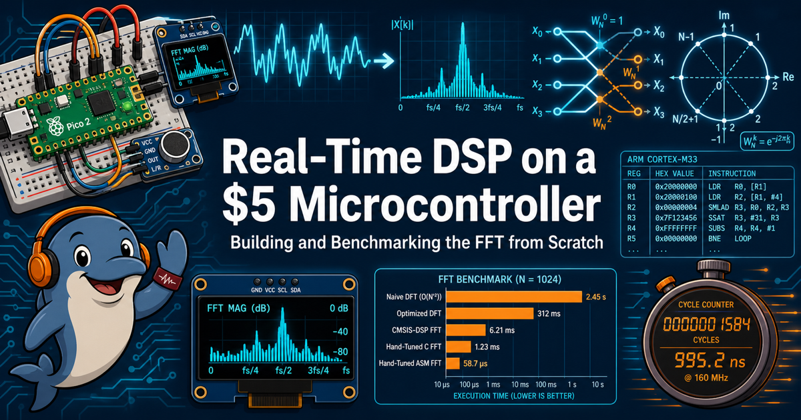

# Real-Time DSP on a $5 Microcontroller
*Building and Benchmarking the FFT from Scratch*

!!! mascot-welcome "Hi, I'm Echo — let's transform some signals!"
    { class="mascot-admonition-img" }
    Echolocation is real-time signal processing with flippers, so trust me on this one:
    what you're about to build is a genuine superpower. **Time to transform!**

Our goal is to squeeze the maximum performance out of the FFT on low-cost microcontrollers
— chips like the Raspberry Pi Pico 2, with its updated hardware floating point and DSP
instructions. Most FFT libraries still don't use that power. By the end of this book, yours
will.

## We hand-wrote our FFT in ARM assembly — and it shows

This isn't a course about calling a library. You build a Discrete Fourier Transform from
correlation, watch it choke at **21 seconds** for a single 512-point transform, then rebuild it
as a proper Fast Fourier Transform, and finally rewrite the butterfly by hand in ARM Cortex-M33
assembly — talking directly to the chip's floating-point unit and DSP instructions.

The payoff is a real number you measure yourself, on your own board:

| Implementation | Time per 512-point FFT | vs. 40 ms real-time budget |
|---|---|---|
| Brute-force DFT | ~21,000 ms | 530x over budget |
| Pure-Python FFT | 140 ms | 3.5x over budget |
| Hand-written assembly FFT | 0.85 ms | 2.1% of budget |
| Best optimized variant | **0.59 ms** | 1.5% of budget |

That's a **35,000x** speedup from first working code to final assembly, and the assembly
version alone runs **165x faster** than its pure-Python counterpart — while agreeing with it
bit for bit. Every millisecond above was clocked with the chip's own cycle counter, not taken
from a spec sheet.

## Fun labs on a $20 kit

Everything here runs on hardware you can buy for about **$19** and solder-free wire onto a
breadboard in an afternoon:

| Component | Approx. cost | Purpose |
|---|---|---|
| Raspberry Pi Pico 2 (RP2350) | $5 | Cortex-M33 core, 150 MHz, hardware FPU |
| SSD1306 OLED, 128x64, SPI | $5 | Live spectrum display |
| Two momentary push buttons | $1 | Mode switching |
| INMP441 I2S MEMS microphone | $3 | Real audio capture |
| Breadboard and jumper wires | $5 | Connections |

That kit carries you through **35 hands-on labs**, and they're built to be genuinely fun, not
just correct:

- **Whistle at your own spectrum analyzer** and watch the peak follow your pitch in real time.
- **Build a chromatic tuner** accurate to 1.3 Hz — then tune an actual instrument with it.
- **Break things on purpose.** Two labs are engineered "productive failures": you'll play a
  tone above the Nyquist limit and watch your instrument confidently report the wrong
  frequency, then clip audio and watch harmonics appear that were never in the room.
- **Hand-encode a raw ARM instruction** the assembler itself refuses to write.
- **Race eight competing FFT variants** against each other and explain, from your own
  measurements, exactly where every factor of speedup came from.

No compiler, no build system, no SDK — every lab runs on stock MicroPython through Thonny, and
you need **zero prior experience** with FFTs, DSP, or assembly language to start Lab 1.

## The book at a glance

| | |
|---|---|
| **27** chapters | **35** hands-on labs |
| **61** interactive MicroSims | **550** glossary terms |
| **91** FAQ answers | **10 weeks**, or self-paced |

## Who this book is for

College juniors and seniors curious about signal processing — no prior FFT, DSP, or assembly
background required. If you can write a loop and a function, and you're willing to plug a few
wires into a breadboard, you're ready.

## How to use this book

- **[Course Description](course-description.md)** — full syllabus, learning outcomes, and the
  hardware kit in detail
- **[Chapters](chapters/index.md)** — the concepts, explained from first principles
- **[Hands-On Labs](labs/index.md)** — all 35 labs, ready to run on your kit
- **[MicroSims](sims/index.md)** — interactive simulations for butterflies, twiddle factors,
  aliasing, and more
- **[Learning Graph](learning-graph/index.md)** — how every concept connects to the next
- **[Glossary](glossary.md)** and **[FAQ](faq.md)** — quick answers while you work
- **[Instructor's Guide](instructors-guide/index.md)** — for anyone teaching this course

## Getting started

Start with **[Lab 1: Hello World with Thonny](labs/01-hello-world/index.md)** — or read
**[Chapter 1](chapters/01-hello-world/index.md)** first if you'd rather understand before you
solder. Either way, in about ten weeks you'll have a hand-written assembly FFT running in real
time on a $5 chip, and the benchmarks to prove it.
