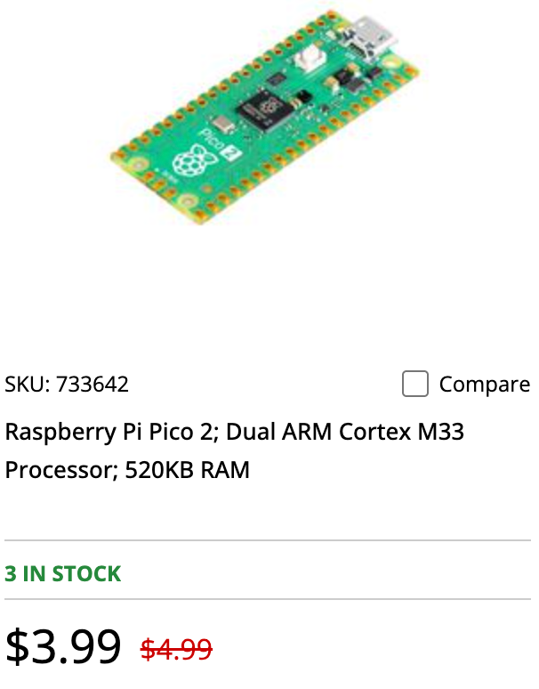
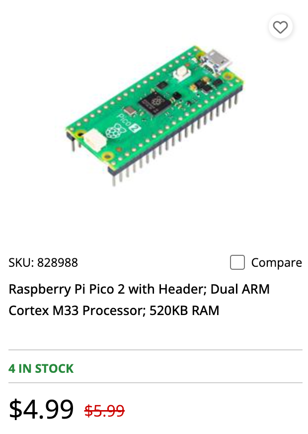

# Purchasing Your Own Parts

Every student needs one hardware kit to complete the 35 hands-on labs. The kit costs roughly **$19 per student** at retail single-unit prices (see [Course Description](../course-description.md) and the [Instructor's Guide](index.md#the-hardware-kit)), and considerably less per unit when ordered in bulk for a whole class.

!!! warning "Order the Pico 2, not the original Pico"
    A **Pico 2 (RP2350)** is required. The original Pico (RP2040) has no floating-point unit and cannot run Labs 30–34, the ARM assembly and FPU labs. Double-check the listing title and product page before buying — sellers frequently list both boards side by side.

The prices below are August 2026 street-price estimates for planning purposes only — always check current listings before ordering, and expect eBay/AliExpress prices to swing with shipping method and seller location. The **search links** are generic query URLs, not specific product picks; use them as a starting point and compare sellers on ratings, shipping time, and minimum order quantity.

## Raspberry Pi Pico 2

Prices on the MicroCenter web page:

{ width="200px"}
{ width="200px"}

**Description:** The official Raspberry Pi Pico 2, built around the RP2350 microcontroller — a dual-core ARM Cortex-M33 running at 150 MHz with a hardware floating-point unit (FPU) and 520 KB of RAM. This is the board every lab runs on.  The Pico 2 comes in two variations.  The Pico 2 does not have headers soldered in but the Pico 2 H comes with pre-soldered headers.  The Pico H costs $1 more.

**Used for:** The main computing platform for the entire course — every lab from Lab 1 onward runs MicroPython directly on this board. MicroCenter carries them in-store for **$4.99**.

| Quantity | Est. price (each) | Est. total |
|---|---|---|
| QTY 1 | $5.00 | $5.00 |
| QTY 10 | $5.00 | $50.00 |

Raspberry Pi keeps a fixed retail price on genuine boards, so bulk orders rarely see a per-unit discount — buying from an authorized reseller (Adafruit, SparkFun, PiShop.us, MicroCenter) is usually cheaper and safer than a marketplace listing, since counterfeit or relabeled RP2040 boards do turn up on general marketplaces.

- eBay: [ebay.com/sch/i.html?_nkw=raspberry+pi+pico+2+rp2350](https://www.ebay.com/sch/i.html?_nkw=raspberry+pi+pico+2+rp2350)
- AliExpress: [aliexpress.com/wholesale?SearchText=raspberry+pi+pico+2+rp2350](https://www.aliexpress.com/wholesale?SearchText=raspberry+pi+pico+2+rp2350)

## Momentary Push Buttons

**Description:** Standard 6mm tactile momentary pushbuttons (4-leg, through-hole, breadboard-friendly). Each button connects one GPIO pin to ground through the Pico's internal pull-up resistor — no external resistor needed.

**Used for:** [Lab 5 (Buttons and Interaction)](../labs/05-buttons/index.md) and every later lab that needs mode switching or user input (the tuner, the real-time spectrum analyzer, the capstone). Each kit needs **two** buttons.

| Quantity | Est. price | Est. total |
|---|---|---|
| QTY 1 (pack of 2) | $1.00 | $1.00 |
| QTY 10 kits (20 buttons) | $0.15–$0.25 each | $3–$5 |

These are sold almost exclusively in multi-packs (10, 20, 50, 100+), so a single 100-pack easily covers a 10-student class with spares for the inevitable dropped button.

- eBay: [ebay.com/sch/i.html?_nkw=6mm+tactile+push+button+momentary+switch](https://www.ebay.com/sch/i.html?_nkw=6mm+tactile+push+button+momentary+switch)
- AliExpress: [aliexpress.com/wholesale?SearchText=6mm+tactile+push+button+momentary+switch](https://www.aliexpress.com/wholesale?SearchText=6mm+tactile+push+button+momentary+switch)

## Microphone

**Description:** The **INMP441**, a MEMS (Micro-Electro-Mechanical System) digital microphone breakout board. Unlike an analog electret mic, it has its own amplifier, filter, and ADC built in, and outputs 24-bit audio samples over the I²S protocol — no external audio codec or op-amp wiring required.

**Used for:** [Lab 7 (Your First Sound Capture)](../labs/07-first-sound/index.md) and every lab downstream of it — this is the sole audio input for the whole course, from raw waveform capture through the real-time spectrum analyzer and tuner.

| Quantity | Est. price (each) | Est. total |
|---|---|---|
| QTY 1 | $3.00–$5.00 | ~$4.00 |
| QTY 10 | $1.80–$3.00 | $18–$30 |

INMP441 breakout boards are a commodity item manufactured in bulk in Shenzhen, so AliExpress pricing drops sharply at 10-unit quantities compared to a single Amazon/eBay-sourced board.

- eBay: [ebay.com/sch/i.html?_nkw=INMP441+I2S+MEMS+microphone+module](https://www.ebay.com/sch/i.html?_nkw=INMP441+I2S+MEMS+microphone+module)
- AliExpress: [aliexpress.com/wholesale?SearchText=INMP441+I2S+MEMS+microphone+module](https://www.aliexpress.com/wholesale?SearchText=INMP441+I2S+MEMS+microphone+module)

## OLED Displays

We like the **2.42" 128×64 OLED display**, driven by the **SSD1306** controller over SPI. It's a monochrome (single-color) display — every pixel is on or off — which keeps the framebuffer small (1,024 bytes) and the drawing code simple.

**Description:** A 2.42-inch diagonal, 128×64-pixel monochrome OLED module with an SSD1306 driver chip, communicating over a 7-wire SPI interface (VCC, GND, SCL, SDA, RES, DC, CS).

**Used for:** [Lab 4 (The OLED Display)](../labs/04-oled-display/index.md) onward — this is the only visual output in the kit, used for every spectrum plot, meter, and tuner readout in the second half of the course.

| Quantity | Est. price (each) | Est. total |
|---|---|---|
| QTY 1 | $7.00–$9.00 | ~$8.00 |
| QTY 10 | $4.00–$6.00 | $40–$55 |

!!! tip "Confirm SPI, not I2C"
    2.42" OLEDs with an SSD1306 controller are sold in both **SPI** (7-pin) and **I2C** (4-pin) variants. This course's `config.py` and wiring diagrams assume SPI. Check the pin count in listing photos before ordering — an I2C module will not match the labs without code changes.

- eBay: [ebay.com/sch/i.html?_nkw=2.42+inch+OLED+SSD1306+SPI+128x64](https://www.ebay.com/sch/i.html?_nkw=2.42+inch+OLED+SSD1306+SPI+128x64)
- AliExpress: [aliexpress.com/wholesale?SearchText=2.42+inch+OLED+SSD1306+SPI+128x64](https://www.aliexpress.com/wholesale?SearchText=2.42+inch+OLED+SSD1306+SPI+128x64)

## Solderless Breadboards

**Description:** A standard 830 tie-point solderless breadboard (the full-size "830 point" layout, roughly 3.3" × 6.5"). No soldering is required for any lab in this course — every connection is made through breadboard holes and jumper wires.

**Used for:** Mounting the Pico 2, OLED display, microphone, and buttons together starting in [Lab 4](../labs/04-oled-display/index.md). One breadboard per student is enough for the whole course.

| Quantity | Est. price (each) | Est. total |
|---|---|---|
| QTY 1 | $2.00–$4.00 | ~$3.00 |
| QTY 10 | $1.50–$2.50 | $15–$25 |

- eBay: [ebay.com/sch/i.html?_nkw=830+point+solderless+breadboard](https://www.ebay.com/sch/i.html?_nkw=830+point+solderless+breadboard)
- AliExpress: [aliexpress.com/wholesale?SearchText=830+point+solderless+breadboard](https://www.aliexpress.com/wholesale?SearchText=830+point+solderless+breadboard)

## Jumpers

**Description:** Male-to-male solid-core jumper wires, typically sold in a 40-piece pack of assorted lengths and colors, sized to plug directly into breadboard rows.

**Used for:** All the short breadboard-to-breadboard connections in every wiring lab — linking the Pico 2's GPIO pins to the buttons and to the display/microphone breakout headers seated on the breadboard.

| Quantity | Est. price | Est. total |
|---|---|---|
| QTY 1 (40-pack) | $3.00–$5.00 | ~$4.00 |
| QTY 10 (10 × 40-packs) | $2.00–$3.00 each | $20–$30 |

- eBay: [ebay.com/sch/i.html?_nkw=breadboard+jumper+wires+male+to+male+40pcs](https://www.ebay.com/sch/i.html?_nkw=breadboard+jumper+wires+male+to+male+40pcs)
- AliExpress: [aliexpress.com/wholesale?SearchText=breadboard+jumper+wires+male+to+male](https://www.aliexpress.com/wholesale?SearchText=breadboard+jumper+wires+male+to+male)

## Dupont Cables

We make our own display cables from either 10cm or 20cm M-F (male-to-female) ribbon cables.

**Description:** Dupont-style ribbon cables — a flat 10-wire ribbon terminated with individual 2.54mm Dupont connectors on each end, sold in male-to-female (M-F), male-to-male (M-M), and female-to-female (F-F) variants and in several lengths.

**Used for:** Building the 7-wire cable that connects the OLED display's SPI header to the breadboard, and the 6-wire cable for the INMP441 microphone's I²S header. The male-to-female variant plugs directly from a breakout board's female header pins onto the breadboard's male-compatible rows.

| Quantity | Est. price | Est. total |
|---|---|---|
| QTY 1 (10-wire 10cm ribbon, M-F) | $1.50–$3.00 | ~$2.50 |
| QTY 10 (10 × ribbons) | $1.50–$2.00 each | $15–$20 |

- eBay: [ebay.com/sch/i.html?_nkw=dupont+ribbon+cable+male+to+female+10cm+20cm](https://www.ebay.com/sch/i.html?_nkw=dupont+ribbon+cable+male+to+female+10cm+20cm)
- AliExpress: [aliexpress.com/wholesale?SearchText=dupont+ribbon+cable+male+to+female](https://www.aliexpress.com/wholesale?SearchText=dupont+ribbon+cable+male+to+female)

## 22-gauge Hookup Wire

**Description:** Solid-core, 22 AWG (American Wire Gauge) hookup wire, commonly sold as a multi-color kit of six 25-foot (or longer) spools. Solid-core wire holds its shape when pressed into a breadboard, unlike stranded wire.

**Used for:** Optional custom wiring — extending a connection, replacing a worn jumper, or building a permanent (soldered) version of a lab circuit outside of class. Not strictly required if the kit's jumpers and Dupont cables cover every lab's wiring, but useful to have on hand for troubleshooting and student projects.

| Quantity | Est. price | Est. total |
|---|---|---|
| QTY 1 (6-color 25ft spool set) | $10.00–$13.00 | ~$11.00 |
| QTY 10 (10 sets) | $8.00–$10.00 each | $80–$100 |

A single spool set easily supplies an entire classroom rather than one per student — most instructors buy one or two sets to share, not one per kit.

- eBay: [ebay.com/sch/i.html?_nkw=22+awg+solid+core+hookup+wire+kit](https://www.ebay.com/sch/i.html?_nkw=22+awg+solid+core+hookup+wire+kit)
- AliExpress: [aliexpress.com/wholesale?SearchText=22+awg+solid+core+hookup+wire+kit](https://www.aliexpress.com/wholesale?SearchText=22+awg+solid+core+hookup+wire+kit)

## Total Kit Cost Summary

| Component | QTY 1 | QTY 10 (per unit) |
|---|---|---|
| Raspberry Pi Pico 2 | $5.00 | $5.00 |
| Momentary push buttons (×2) | $1.00 | ~$0.40 |
| INMP441 microphone | $4.00 | $1.80–$3.00 |
| 2.42" OLED SPI display | $8.00 | $4.00–$6.00 |
| Solderless breadboard | $3.00 | $2.50–$3.50 |
| Jumper wire pack | $4.00 | $2.00–$3.00 |
| Dupont ribbon cable | $2.50 | $1.50–$2.00 |
| **Per-student total** | **~$25** | **~$18–$23** |

The QTY 1 total runs higher than the book's advertised $19 kit price because retail single-unit shipping and packaging (especially for the microphone and OLED) cost more per piece than bulk classroom ordering. At QTY 10, per-student cost lands close to the ~$19 estimate quoted in the [Instructor's Guide](index.md#the-hardware-kit); 22-gauge hookup wire is excluded from this table since it's normally shared, not purchased per student.

!!! info "Order at least two weeks ahead"
    The INMP441 microphone and SSD1306 OLED are common parts but not always in stock at every seller. A single bulk order placed two or more weeks before the term starts is far more reliable than asking students to source parts individually — see [Classroom Logistics Tips](index.md#classroom-logistics-tips) in the Instructor's Guide.
