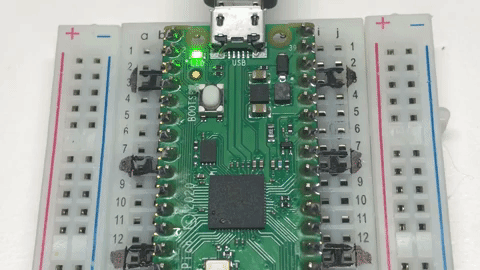

# Lab 2: Blink — Your First Hardware Program

**Time:** ~30 minutes  |  **Prerequisites:** [Lab 1](../01-hello-world/index.md)  |  **Hardware:** Pico 2, USB cable

!!! mascot-welcome "Let's make something happen in the real world"
    { class="mascot-admonition-img" }
    Last lab your chip talked to your screen. This lab it moves *electrons* — flipping a
    real voltage on a real wire, half a volt at a time. That's the door into everything
    else we do. Time to transform!

## What You'll Build



A blinking LED. Yes, really. But stay with me: the moment your code changes a voltage on a pin
is the moment a program stops being abstract. Every sensor, every display, every microphone in
this course is that same idea with more wires.

## Learning Objectives

- **Explain** what a GPIO pin is and what "output mode" means
- **Control** a physical LED from Python
- **Use** `time.sleep()` to control timing
- **Write** a loop that runs forever and stop it cleanly
- **Predict** what happens when you change the delay

## Concepts Introduced

| ID | Concept |
|---|---|
| 211 | General Purpose IO |
| 212 | GPIO Pin |
| 213 | Pin Object |
| 214 | Digital Output |
| 215 | Onboard LED |
| 216 | Logic High And Low |
| 217 | Pin Toggle |
| 218 | Sleep Delay |
| 219 | Infinite Loop |

## Background

Look at the edges of your Pico 2. Those metal contacts are **GPIO** pins — General Purpose
Input/Output. "General purpose" means the chip doesn't care what you plug in; *you* decide
whether each pin reads the world or drives it.

A pin in **output** mode has exactly two states:

| Value | Voltage | Nickname |
|---|---|---|
| `1` | 3.3 V | HIGH |
| `0` | 0 V | LOW |

That's the whole vocabulary. Everything else — displays, microphones, motors — is built by
flipping pins like these very fast in agreed-upon patterns.

Your board has an LED already wired to **GPIO 25**, so you can blink without touching a
breadboard.

!!! mascot-thinking "Digital means exactly two choices"
    { class="mascot-admonition-img" }
    A digital pin is on or off. Nothing in between. That sounds limiting until you realise
    the microphone in Lab 7 sends *audio* down a single digital wire — by flipping it
    millions of times a second. Speed turns two choices into infinite detail.

## Procedure

### Step 1 — Blink

Open `02-blink.py` from the **Raspberry Pi Pico** side of Thonny's Files panel:

```python
--8<-- "docs/labs/02-blink/code/02-blink.py"
```

Run it. The little green LED next to the USB connector starts flashing, once per second.

Press **Ctrl-C** to stop. Notice the LED ends up *off* — that's the `except KeyboardInterrupt`
block doing its job.

!!! mascot-warning "Pico 2 or Pico 2 W? The LED moved"
    { class="mascot-admonition-img" }
    On a plain **Pico 2** the onboard LED is GPIO 25. On a **Pico 2 W** it isn't a GPIO at
    all — the wireless chip drives it, and you reach it by the name `"LED"`. The sneaky part:
    `Pin(25)` is *accepted* on a W board and simply lights nothing. No error, no blink, no
    clue. The code above tries `"LED"` first and falls back, so it works on both.

### Step 2 — Predict, then measure

Before you change anything, write down your answer:

> **Prediction:** if you change both `time.sleep(0.5)` calls to `time.sleep(0.05)`,
> what will you see?

Now do it. Were you right?

Try `0.005` as well. At some point your eye stops seeing a blink and starts seeing a dim,
steady glow. That's not the LED changing — it's *you*. Human vision blurs together anything
faster than roughly 50 flashes per second.

!!! mascot-tip "You just discovered PWM"
    { class="mascot-admonition-img" }
    Blinking faster than the eye can follow, to make something *look* dimmer, is called
    Pulse Width Modulation. It's how screen brightness and motor speed control work.
    You found it by accident, which is the best way.

### Step 3 — Toggle instead

There's a shorter way to flip a pin. Replace the two `value()` calls with one:

```python
while True:
    led.toggle()
    time.sleep(0.5)
```

Same blink, half the code. `toggle()` just means "whatever you are, be the other thing."

### Step 4 — Make a pattern

Try a heartbeat: two quick flashes, then a pause.

```python
while True:
    led.value(1); time.sleep(0.1)
    led.value(0); time.sleep(0.1)
    led.value(1); time.sleep(0.1)
    led.value(0); time.sleep(0.7)
```

## Expected Output

The onboard LED blinks steadily at one flash per second, and the Shell shows:

```
Blinking! Press Ctrl-C to stop.
```

After Ctrl-C:

```
Stopped. LED off.
```

## Troubleshooting

| Symptom | Likely cause | Fix |
|---|---|---|
| Nothing blinks, no error | You have a **Pico 2 W** and used `Pin(25)` | On W boards the LED belongs to the wireless chip: use `Pin("LED", Pin.OUT)`. The lab code tries this automatically |
| Nothing blinks | Wrong pin number | On a plain Pico 2 the onboard LED is GPIO **25** |
| `NameError: name 'Pin' is not defined` | Missing import | Add `from machine import Pin` at the top |
| LED stays on after Ctrl-C | No cleanup handler | Add the `except KeyboardInterrupt` block |
| Can't stop it | Focus isn't in the Shell | Click the Shell panel first, then Ctrl-C |
| LED looks dim, not blinking | Delay too short | Increase `sleep()` back to 0.5 |

## Challenges

1. **SOS.** Blink `... --- ...` in Morse code, then pause and repeat.
2. **Speed ramp.** Start slow and get gradually faster, then reset. Hint: use a variable for the
   delay and shrink it each pass.
3. **Count it.** Print a running count of blinks alongside the flashing. How does adding the
   `print` affect the timing? (Keep that question in mind — it comes back with a vengeance in
   Lab 26.)

## Check Your Understanding

1. What two voltages can a digital output pin produce on the Pico 2?
2. Why does the program need `try` / `except KeyboardInterrupt`?
3. If you deleted both `time.sleep()` calls, what would the LED look like — and why?
4. What's the difference between `led.value(1)` and `led.toggle()`?

!!! mascot-celebration "That's a real superpower, small as it looks"
    { class="mascot-admonition-img" }
    You just made software change the physical world on command. Next lab we interrogate
    the chip about itself — and find the numbers that will shape every optimization
    decision you make later.

---

**Next:** [Lab 3: Know Your Board](../03-know-your-board/index.md)  |  **Previous:** [Lab 1](../01-hello-world/index.md)
