# MicroSims

This book includes **60 interactive MicroSims** — self-contained, browser-based visualizations you can explore directly. Click any thumbnail to open the MicroSim.

<!-- This gallery is generated by generate-sims-index.py — edits here will be overwritten. -->

  <a href="abstraction-ladder-diagram/" title="Abstraction Ladder Diagram" style="display:block;border:1px solid #e3e7ec;border-radius:8px;overflow:hidden;text-decoration:none;color:inherit;box-shadow:0 1px 3px rgba(0,0,0,0.08);">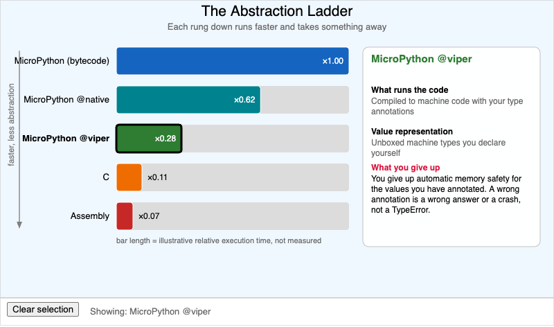Abstraction Ladder Diagram</a>
  <a href="address-byte-offset-explorer/" title="Address and Byte Offset Explorer" style="display:block;border:1px solid #e3e7ec;border-radius:8px;overflow:hidden;text-decoration:none;color:inherit;box-shadow:0 1px 3px rgba(0,0,0,0.08);">no previewAddress and Byte Offset Explorer</a>
  <a href="aliasing-demonstrator/" title="Aliasing Demonstrator" style="display:block;border:1px solid #e3e7ec;border-radius:8px;overflow:hidden;text-decoration:none;color:inherit;box-shadow:0 1px 3px rgba(0,0,0,0.08);">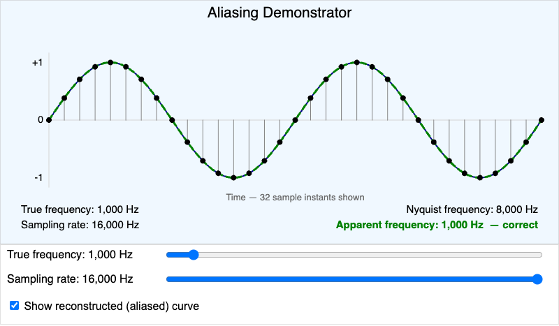Aliasing Demonstrator</a>
  <a href="fft-applications-map/" title="Applications of Real-Time FFT" style="display:block;border:1px solid #e3e7ec;border-radius:8px;overflow:hidden;text-decoration:none;color:inherit;box-shadow:0 1px 3px rgba(0,0,0,0.08);">no previewApplications of Real-Time FFT</a>
  <a href="benchmark-results-chart/" title="Benchmark Results Chart" style="display:block;border:1px solid #e3e7ec;border-radius:8px;overflow:hidden;text-decoration:none;color:inherit;box-shadow:0 1px 3px rgba(0,0,0,0.08);">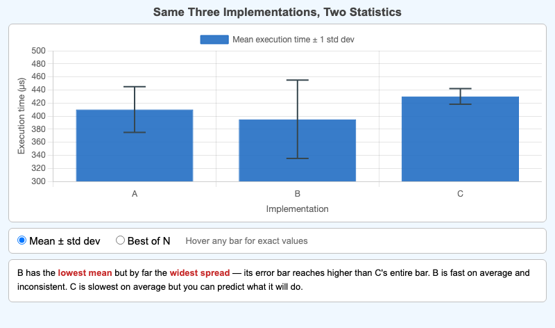Benchmark Results Chart</a>
  <a href="blink-timing-explorer/" title="Blink Timing Explorer" style="display:block;border:1px solid #e3e7ec;border-radius:8px;overflow:hidden;text-decoration:none;color:inherit;box-shadow:0 1px 3px rgba(0,0,0,0.08);">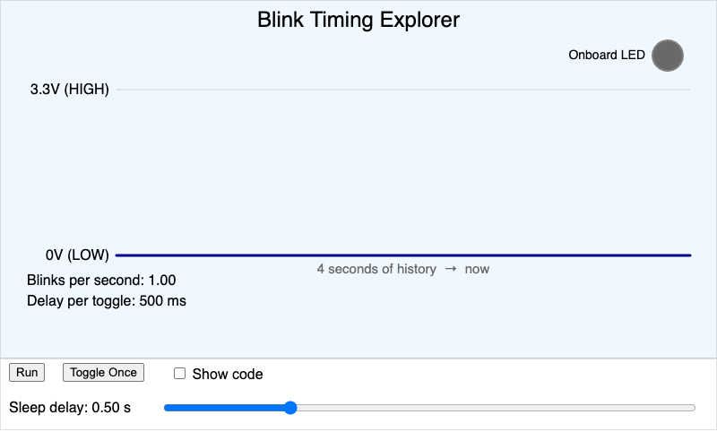Blink Timing Explorer</a>
  <a href="boxed-unboxed-memory-explorer/" title="Boxed vs Unboxed Memory Explorer" style="display:block;border:1px solid #e3e7ec;border-radius:8px;overflow:hidden;text-decoration:none;color:inherit;box-shadow:0 1px 3px rgba(0,0,0,0.08);">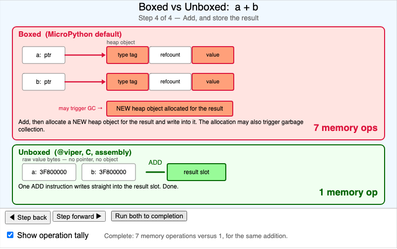Boxed vs Unboxed Memory Explorer</a>
  <a href="branch-misprediction-visualizer/" title="Branch Misprediction Visualizer" style="display:block;border:1px solid #e3e7ec;border-radius:8px;overflow:hidden;text-decoration:none;color:inherit;box-shadow:0 1px 3px rgba(0,0,0,0.08);">no previewBranch Misprediction Visualizer</a>
  <a href="butterfly-operation-visualizer/" title="Butterfly Operation Visualizer" style="display:block;border:1px solid #e3e7ec;border-radius:8px;overflow:hidden;text-decoration:none;color:inherit;box-shadow:0 1px 3px rgba(0,0,0,0.08);">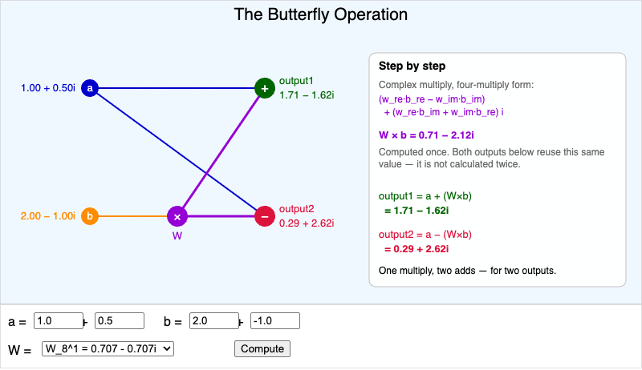Butterfly Operation Visualizer</a>
  <a href="complete-8-point-fft-flow-graph/" title="Complete 8-Point FFT Flow Graph" style="display:block;border:1px solid #e3e7ec;border-radius:8px;overflow:hidden;text-decoration:none;color:inherit;box-shadow:0 1px 3px rgba(0,0,0,0.08);">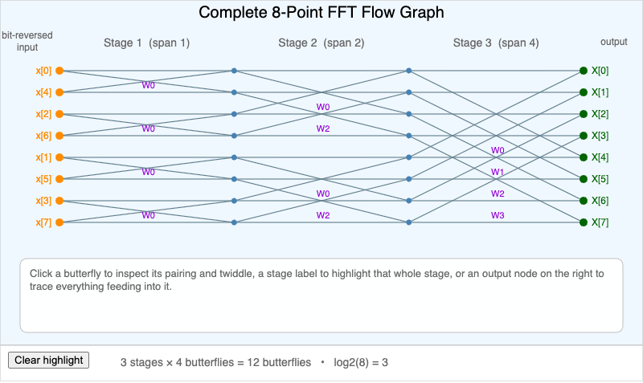Complete 8-Point FFT Flow Graph</a>
  <a href="complex-plane-euler-visualizer/" title="Complex Plane Euler Visualizer" style="display:block;border:1px solid #e3e7ec;border-radius:8px;overflow:hidden;text-decoration:none;color:inherit;box-shadow:0 1px 3px rgba(0,0,0,0.08);">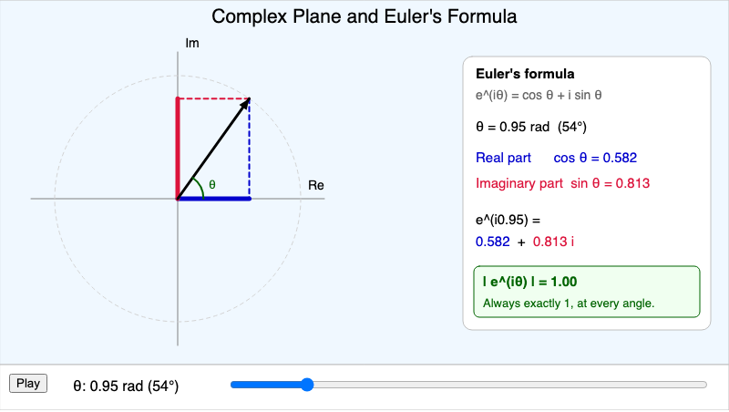Complex Plane Euler Visualizer</a>
  <a href="correlation-vs-test-frequency-sweep/" title="Correlation vs Test Frequency Sweep" style="display:block;border:1px solid #e3e7ec;border-radius:8px;overflow:hidden;text-decoration:none;color:inherit;box-shadow:0 1px 3px rgba(0,0,0,0.08);">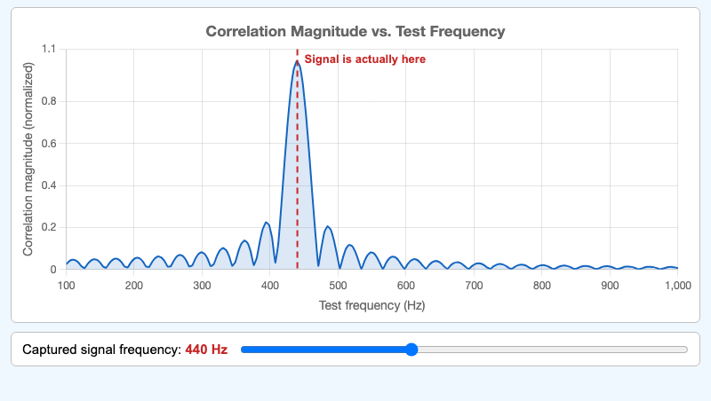Correlation vs Test Frequency Sweep</a>
  <a href="counter-wraparound-visualizer/" title="Counter Wraparound Visualizer" style="display:block;border:1px solid #e3e7ec;border-radius:8px;overflow:hidden;text-decoration:none;color:inherit;box-shadow:0 1px 3px rgba(0,0,0,0.08);">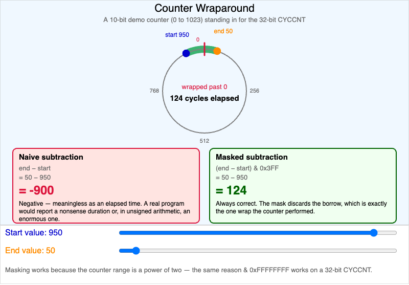Counter Wraparound Visualizer</a>
  <a href="cycle-budget-calculator/" title="Cycle Budget Calculator" style="display:block;border:1px solid #e3e7ec;border-radius:8px;overflow:hidden;text-decoration:none;color:inherit;box-shadow:0 1px 3px rgba(0,0,0,0.08);">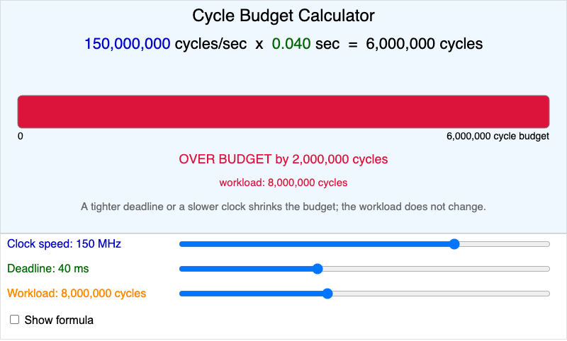Cycle Budget Calculator</a>
  <a href="dft-frequency-bin-explorer/" title="DFT Frequency Bin Explorer" style="display:block;border:1px solid #e3e7ec;border-radius:8px;overflow:hidden;text-decoration:none;color:inherit;box-shadow:0 1px 3px rgba(0,0,0,0.08);">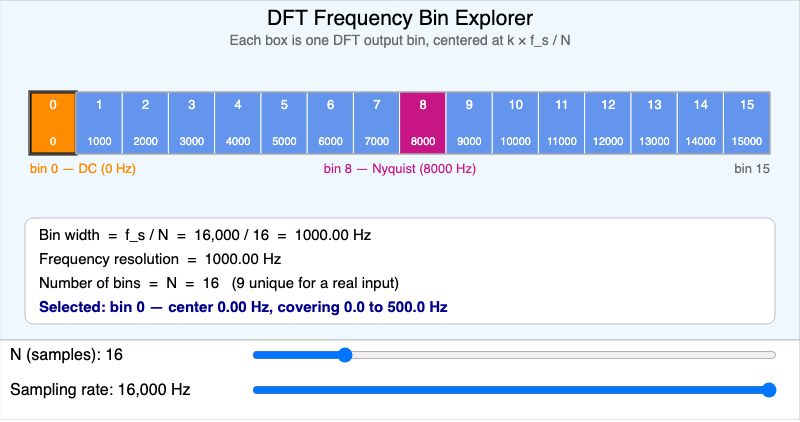DFT Frequency Bin Explorer</a>
  <a href="dft-scaling-behavior-chart/" title="DFT Scaling Behavior Chart" style="display:block;border:1px solid #e3e7ec;border-radius:8px;overflow:hidden;text-decoration:none;color:inherit;box-shadow:0 1px 3px rgba(0,0,0,0.08);">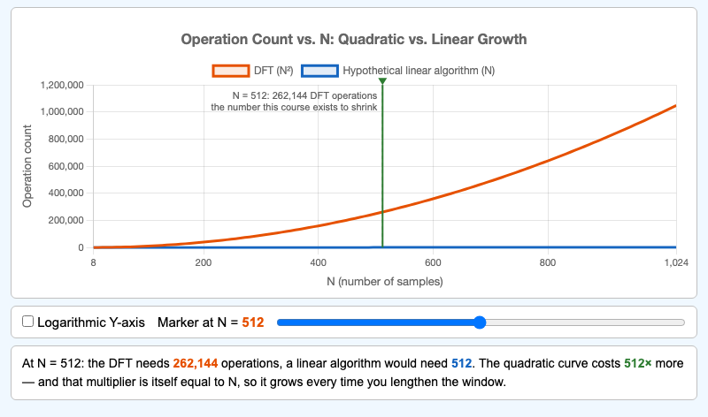DFT Scaling Behavior Chart</a>
  <a href="dft-validation-dashboard/" title="DFT Validation Dashboard" style="display:block;border:1px solid #e3e7ec;border-radius:8px;overflow:hidden;text-decoration:none;color:inherit;box-shadow:0 1px 3px rgba(0,0,0,0.08);">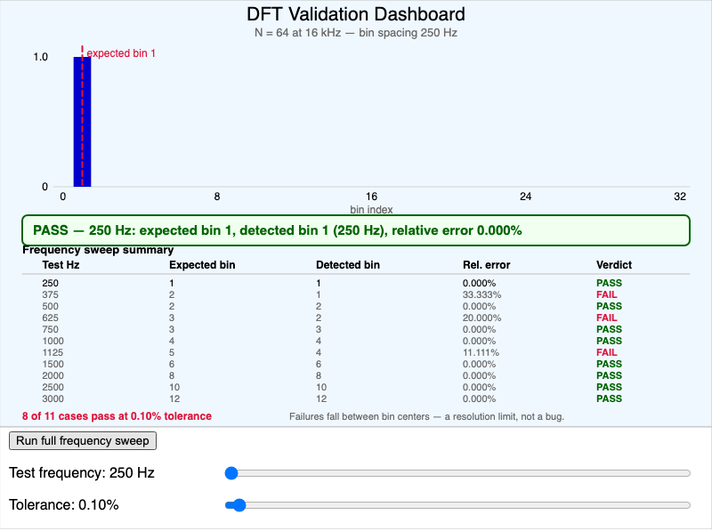DFT Validation Dashboard</a>
  <a href="divide-and-conquer-recursion-tree/" title="Divide and Conquer Recursion Tree" style="display:block;border:1px solid #e3e7ec;border-radius:8px;overflow:hidden;text-decoration:none;color:inherit;box-shadow:0 1px 3px rgba(0,0,0,0.08);">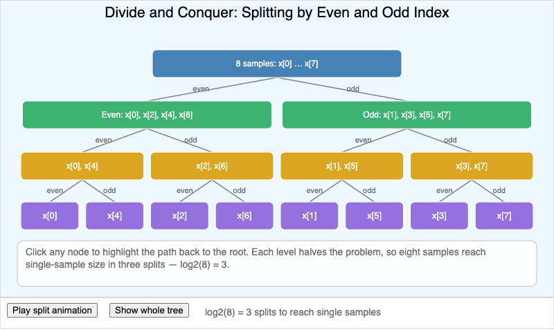Divide and Conquer Recursion Tree</a>
  <a href="double-buffering-pipeline/" title="Double Buffering Pipeline" style="display:block;border:1px solid #e3e7ec;border-radius:8px;overflow:hidden;text-decoration:none;color:inherit;box-shadow:0 1px 3px rgba(0,0,0,0.08);">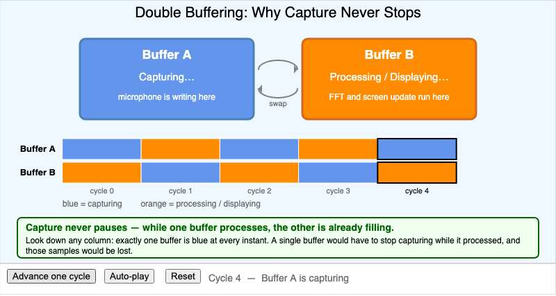Double Buffering Pipeline</a>
  <a href="dwt-register-explorer/" title="DWT Register Explorer" style="display:block;border:1px solid #e3e7ec;border-radius:8px;overflow:hidden;text-decoration:none;color:inherit;box-shadow:0 1px 3px rgba(0,0,0,0.08);">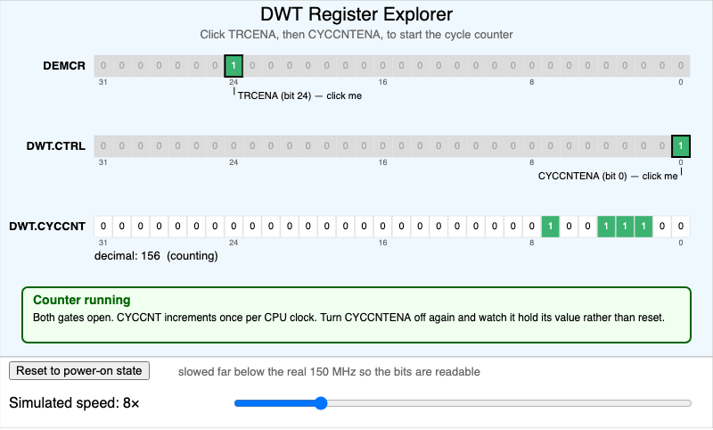DWT Register Explorer</a>
  <a href="dynamic-range-ladder/" title="Dynamic Range Ladder" style="display:block;border:1px solid #e3e7ec;border-radius:8px;overflow:hidden;text-decoration:none;color:inherit;box-shadow:0 1px 3px rgba(0,0,0,0.08);">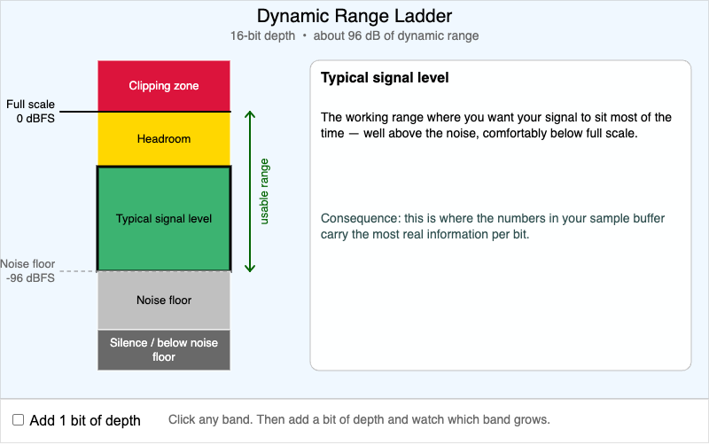Dynamic Range Ladder</a>
  <a href="eight-point-dft-by-hand-calculator/" title="Eight Point DFT By Hand Calculator" style="display:block;border:1px solid #e3e7ec;border-radius:8px;overflow:hidden;text-decoration:none;color:inherit;box-shadow:0 1px 3px rgba(0,0,0,0.08);">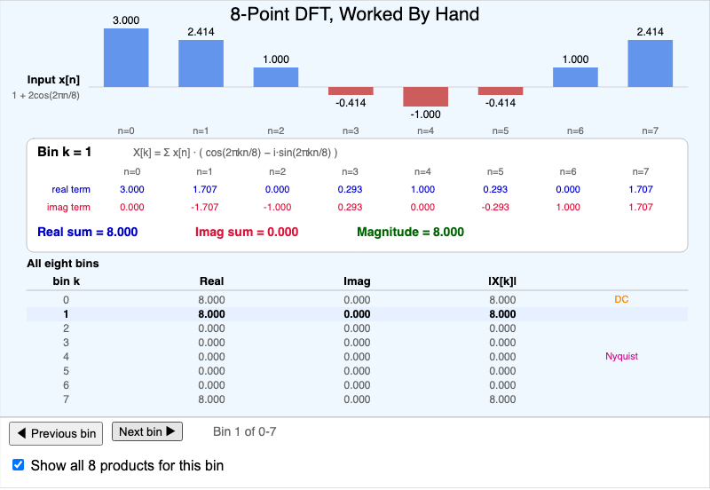Eight Point DFT By Hand Calculator</a>
  <a href="experimental-design-anatomy/" title="Experimental Design Anatomy" style="display:block;border:1px solid #e3e7ec;border-radius:8px;overflow:hidden;text-decoration:none;color:inherit;box-shadow:0 1px 3px rgba(0,0,0,0.08);">no previewExperimental Design Anatomy</a>
  <a href="timeline/" title="FFT History Timeline" style="display:block;border:1px solid #e3e7ec;border-radius:8px;overflow:hidden;text-decoration:none;color:inherit;box-shadow:0 1px 3px rgba(0,0,0,0.08);">no previewFFT History Timeline</a>
  <a href="fft-stage-architecture/" title="FFT Stage Architecture — Python and Assembly Boundary" style="display:block;border:1px solid #e3e7ec;border-radius:8px;overflow:hidden;text-decoration:none;color:inherit;box-shadow:0 1px 3px rgba(0,0,0,0.08);">no previewFFT Stage Architecture — Python and Assembly Boundary</a>
  <a href="fpu-capability-probe/" title="FPU Capability Probe Simulator" style="display:block;border:1px solid #e3e7ec;border-radius:8px;overflow:hidden;text-decoration:none;color:inherit;box-shadow:0 1px 3px rgba(0,0,0,0.08);">no previewFPU Capability Probe Simulator</a>
  <a href="framebuffer-draw-refresh-pipeline/" title="Framebuffer Draw Refresh Pipeline" style="display:block;border:1px solid #e3e7ec;border-radius:8px;overflow:hidden;text-decoration:none;color:inherit;box-shadow:0 1px 3px rgba(0,0,0,0.08);">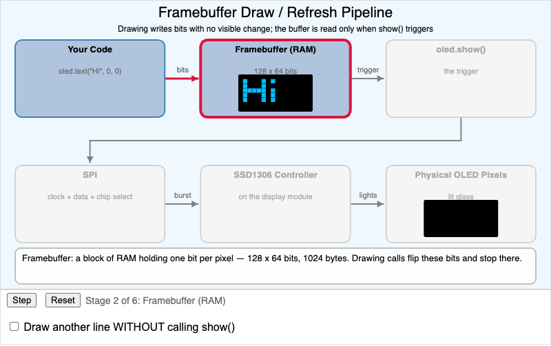Framebuffer Draw Refresh Pipeline</a>
  <a href="frequency-to-musical-note-calculator/" title="Frequency To Musical Note Calculator" style="display:block;border:1px solid #e3e7ec;border-radius:8px;overflow:hidden;text-decoration:none;color:inherit;box-shadow:0 1px 3px rgba(0,0,0,0.08);">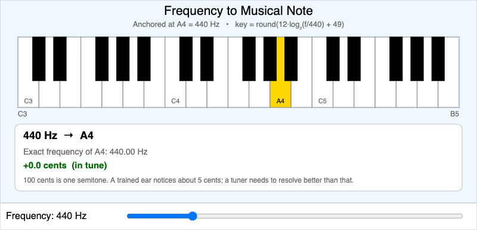Frequency To Musical Note Calculator</a>
  <a href="harmonic-stack-synthesizer/" title="Harmonic Stack Synthesizer" style="display:block;border:1px solid #e3e7ec;border-radius:8px;overflow:hidden;text-decoration:none;color:inherit;box-shadow:0 1px 3px rgba(0,0,0,0.08);">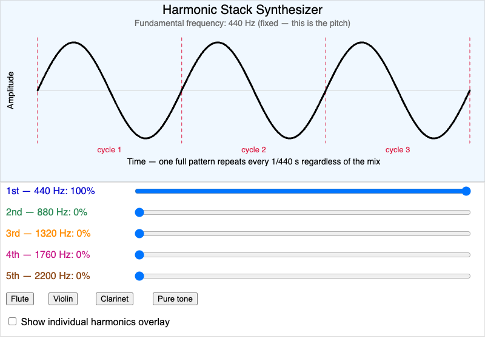Harmonic Stack Synthesizer</a>
  <a href="hop-size-overlap-visualizer/" title="Hop Size Overlap Visualizer" style="display:block;border:1px solid #e3e7ec;border-radius:8px;overflow:hidden;text-decoration:none;color:inherit;box-shadow:0 1px 3px rgba(0,0,0,0.08);">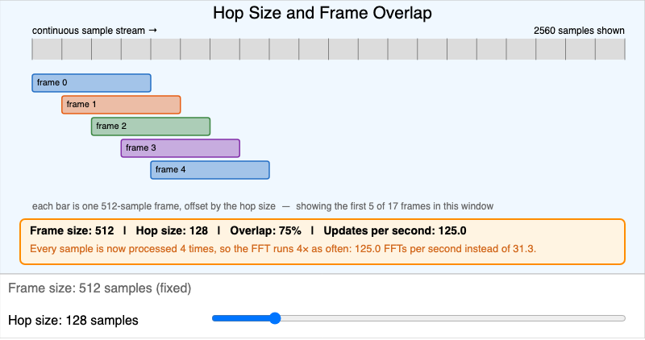Hop Size Overlap Visualizer</a>
  <a href="i2s-protocol-timing-explorer/" title="I2S Protocol Timing Explorer" style="display:block;border:1px solid #e3e7ec;border-radius:8px;overflow:hidden;text-decoration:none;color:inherit;box-shadow:0 1px 3px rgba(0,0,0,0.08);">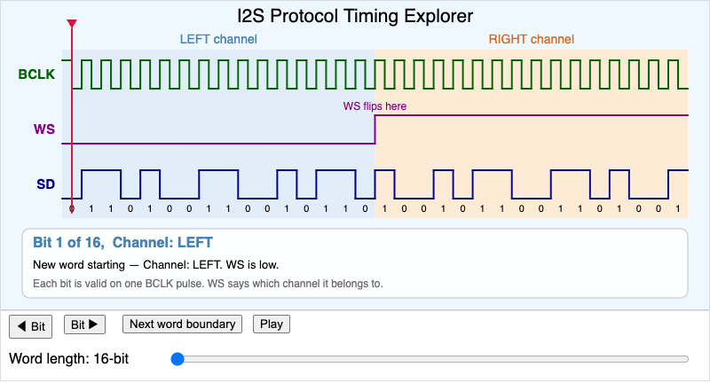I2S Protocol Timing Explorer</a>
  <a href="in-phase-quadrature-explorer/" title="In-Phase Quadrature Explorer" style="display:block;border:1px solid #e3e7ec;border-radius:8px;overflow:hidden;text-decoration:none;color:inherit;box-shadow:0 1px 3px rgba(0,0,0,0.08);">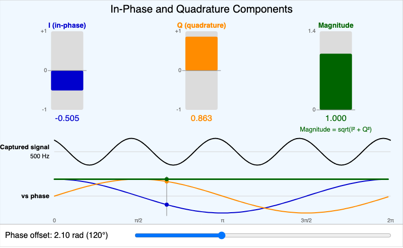In-Phase Quadrature Explorer</a>
  <a href="instruction-encoding-bit-builder/" title="Instruction Encoding Bit Field Builder" style="display:block;border:1px solid #e3e7ec;border-radius:8px;overflow:hidden;text-decoration:none;color:inherit;box-shadow:0 1px 3px rgba(0,0,0,0.08);">no previewInstruction Encoding Bit Field Builder</a>
  <a href="iterative-fft-stage-loop-visualizer/" title="Iterative FFT Stage Loop Visualizer" style="display:block;border:1px solid #e3e7ec;border-radius:8px;overflow:hidden;text-decoration:none;color:inherit;box-shadow:0 1px 3px rgba(0,0,0,0.08);">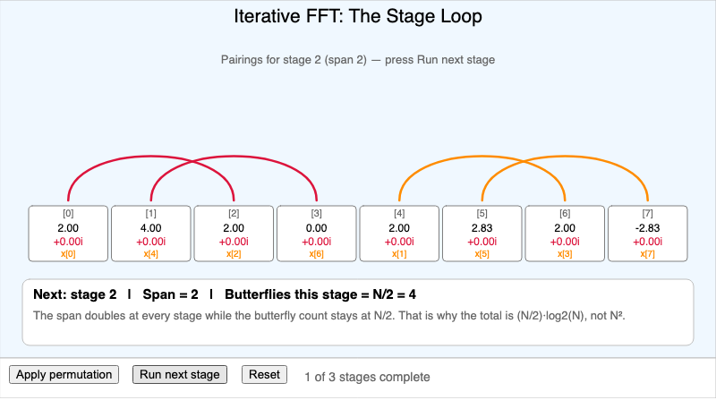Iterative FFT Stage Loop Visualizer</a>
  <a href="graph-viewer/" title="Learning Graph Viewer" style="display:block;border:1px solid #e3e7ec;border-radius:8px;overflow:hidden;text-decoration:none;color:inherit;box-shadow:0 1px 3px rgba(0,0,0,0.08);">no previewLearning Graph Viewer</a>
  <a href="linear-sqrt-decibel-scaling-chart/" title="Linear Sqrt Decibel Scaling Chart" style="display:block;border:1px solid #e3e7ec;border-radius:8px;overflow:hidden;text-decoration:none;color:inherit;box-shadow:0 1px 3px rgba(0,0,0,0.08);">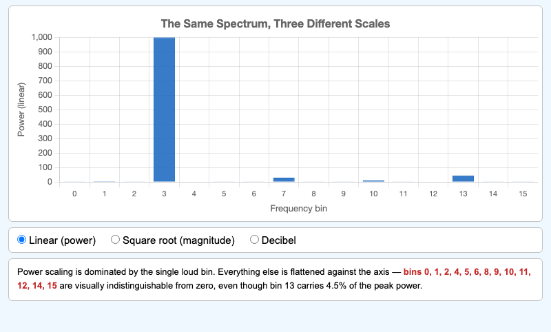Linear Sqrt Decibel Scaling Chart</a>
  <a href="live-spectrum-display-bin-averaging/" title="Live Spectrum Display Bin Averaging" style="display:block;border:1px solid #e3e7ec;border-radius:8px;overflow:hidden;text-decoration:none;color:inherit;box-shadow:0 1px 3px rgba(0,0,0,0.08);">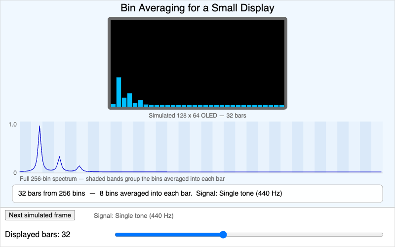Live Spectrum Display Bin Averaging</a>
  <a href="magnitude-phase-from-complex-bin/" title="Magnitude Phase From Complex Bin" style="display:block;border:1px solid #e3e7ec;border-radius:8px;overflow:hidden;text-decoration:none;color:inherit;box-shadow:0 1px 3px rgba(0,0,0,0.08);">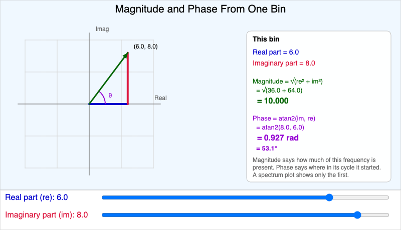Magnitude Phase From Complex Bin</a>
  <a href="mems-microphone-cross-section/" title="MEMS Microphone Cross Section" style="display:block;border:1px solid #e3e7ec;border-radius:8px;overflow:hidden;text-decoration:none;color:inherit;box-shadow:0 1px 3px rgba(0,0,0,0.08);">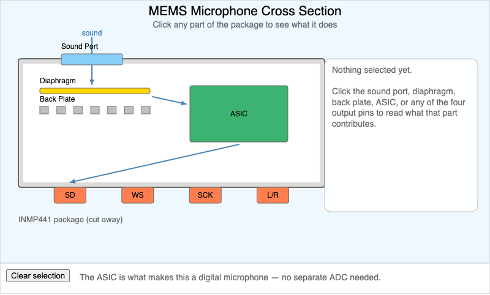MEMS Microphone Cross Section</a>
  <a href="multiply-and-sum-correlator/" title="Multiply and Sum Correlator" style="display:block;border:1px solid #e3e7ec;border-radius:8px;overflow:hidden;text-decoration:none;color:inherit;box-shadow:0 1px 3px rgba(0,0,0,0.08);">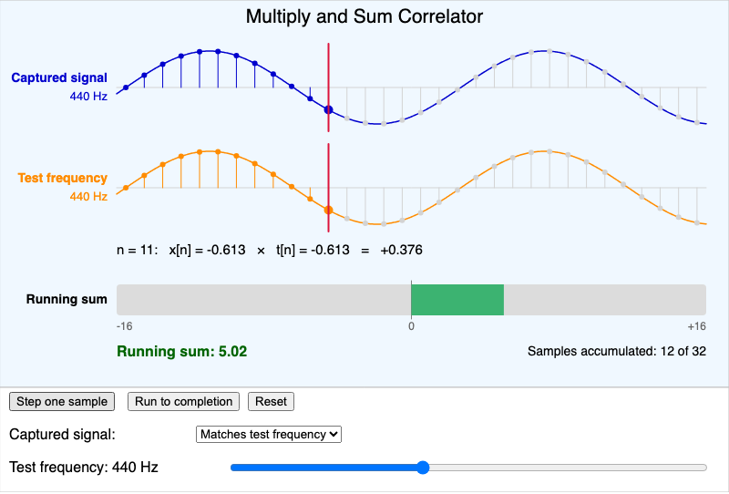Multiply and Sum Correlator</a>
  <a href="normalization-factor-explorer/" title="Normalization Factor Explorer" style="display:block;border:1px solid #e3e7ec;border-radius:8px;overflow:hidden;text-decoration:none;color:inherit;box-shadow:0 1px 3px rgba(0,0,0,0.08);">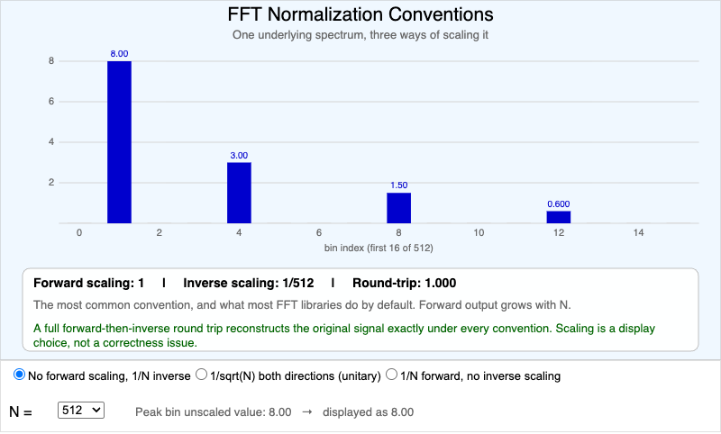Normalization Factor Explorer</a>
  <a href="optimization-attribution-waterfall/" title="Optimization Attribution Waterfall" style="display:block;border:1px solid #e3e7ec;border-radius:8px;overflow:hidden;text-decoration:none;color:inherit;box-shadow:0 1px 3px rgba(0,0,0,0.08);">no previewOptimization Attribution Waterfall</a>
  <a href="parabolic-interpolation-peak-finder/" title="Parabolic Interpolation Peak Finder" style="display:block;border:1px solid #e3e7ec;border-radius:8px;overflow:hidden;text-decoration:none;color:inherit;box-shadow:0 1px 3px rgba(0,0,0,0.08);">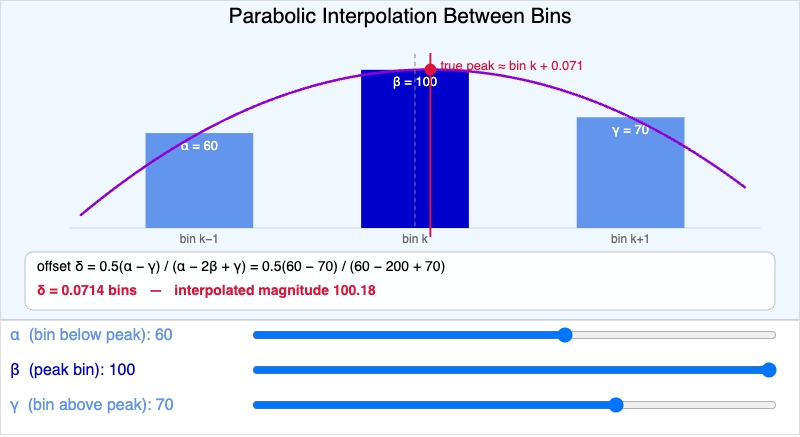Parabolic Interpolation Peak Finder</a>
  <a href="performance-metrics-calculator/" title="Performance Metrics Calculator" style="display:block;border:1px solid #e3e7ec;border-radius:8px;overflow:hidden;text-decoration:none;color:inherit;box-shadow:0 1px 3px rgba(0,0,0,0.08);">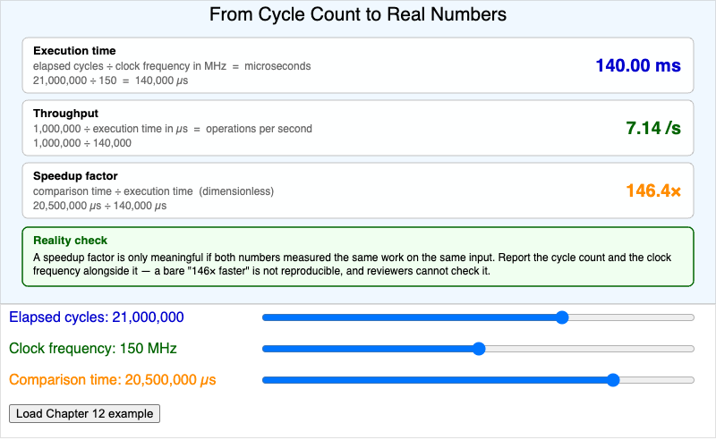Performance Metrics Calculator</a>
  <a href="periodic-assumption-edge-discontinuity/" title="Periodic Assumption Edge Discontinuity" style="display:block;border:1px solid #e3e7ec;border-radius:8px;overflow:hidden;text-decoration:none;color:inherit;box-shadow:0 1px 3px rgba(0,0,0,0.08);">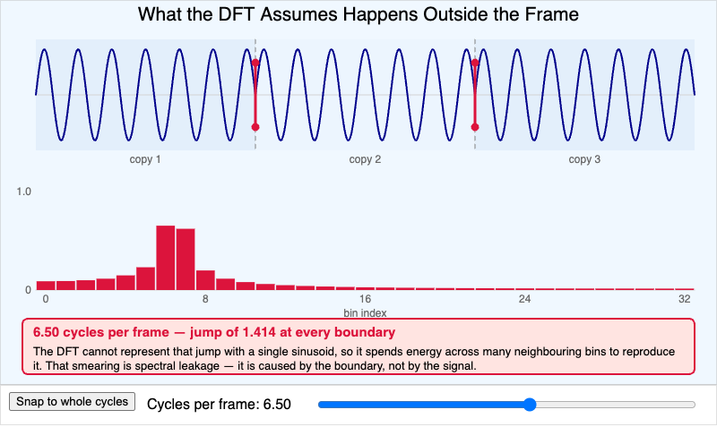Periodic Assumption Edge Discontinuity</a>
  <a href="pico2-memory-map-explorer/" title="Pico 2 Memory Map Explorer" style="display:block;border:1px solid #e3e7ec;border-radius:8px;overflow:hidden;text-decoration:none;color:inherit;box-shadow:0 1px 3px rgba(0,0,0,0.08);">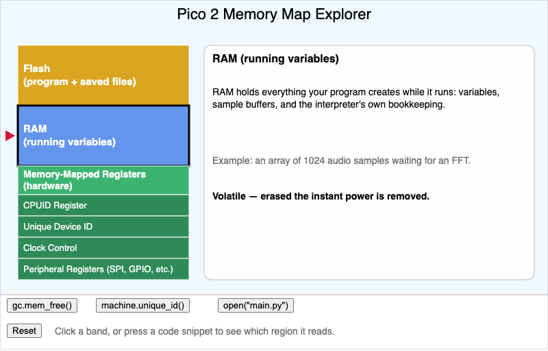Pico 2 Memory Map Explorer</a>
  <a href="register-tracer/" title="Register Tracer" style="display:block;border:1px solid #e3e7ec;border-radius:8px;overflow:hidden;text-decoration:none;color:inherit;box-shadow:0 1px 3px rgba(0,0,0,0.08);">no previewRegister Tracer</a>
  <a href="roots-of-unity-unit-circle/" title="Roots of Unity Unit Circle" style="display:block;border:1px solid #e3e7ec;border-radius:8px;overflow:hidden;text-decoration:none;color:inherit;box-shadow:0 1px 3px rgba(0,0,0,0.08);">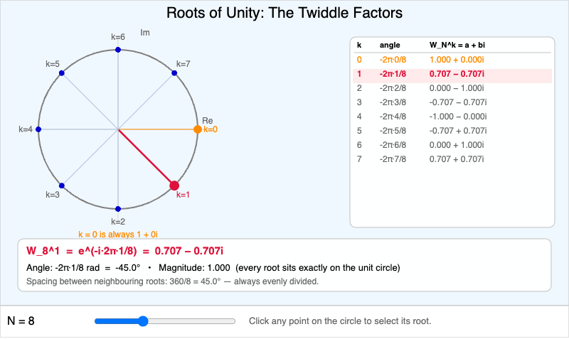Roots of Unity Unit Circle</a>
  <a href="sine-wave-parameter-explorer/" title="Sine Wave Parameter Explorer" style="display:block;border:1px solid #e3e7ec;border-radius:8px;overflow:hidden;text-decoration:none;color:inherit;box-shadow:0 1px 3px rgba(0,0,0,0.08);">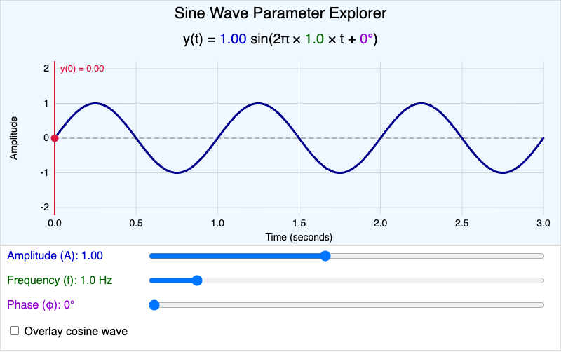Sine Wave Parameter Explorer</a>
  <a href="spectrogram-waterfall-display/" title="Spectrogram Waterfall Display" style="display:block;border:1px solid #e3e7ec;border-radius:8px;overflow:hidden;text-decoration:none;color:inherit;box-shadow:0 1px 3px rgba(0,0,0,0.08);">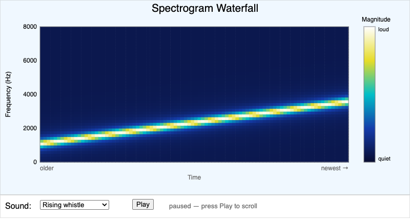Spectrogram Waterfall Display</a>
  <a href="spectrum-symmetry-mirror/" title="Spectrum Symmetry Mirror" style="display:block;border:1px solid #e3e7ec;border-radius:8px;overflow:hidden;text-decoration:none;color:inherit;box-shadow:0 1px 3px rgba(0,0,0,0.08);">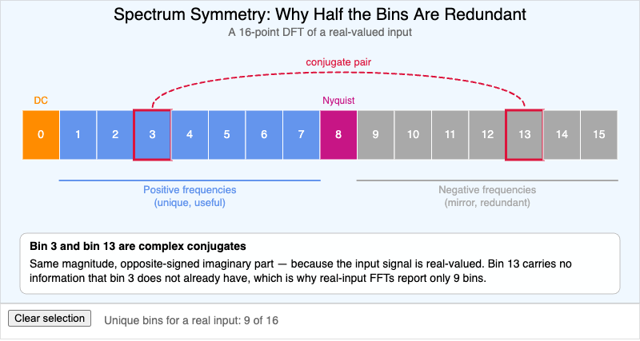Spectrum Symmetry Mirror</a>
  <a href="stage-profiling-breakdown-chart/" title="Stage Profiling Breakdown Chart" style="display:block;border:1px solid #e3e7ec;border-radius:8px;overflow:hidden;text-decoration:none;color:inherit;box-shadow:0 1px 3px rgba(0,0,0,0.08);">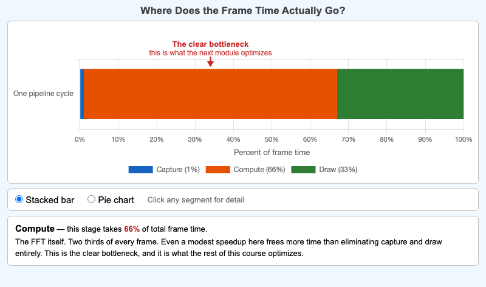Stage Profiling Breakdown Chart</a>
  <a href="standalone-deployment-workflow/" title="Standalone Deployment Workflow" style="display:block;border:1px solid #e3e7ec;border-radius:8px;overflow:hidden;text-decoration:none;color:inherit;box-shadow:0 1px 3px rgba(0,0,0,0.08);">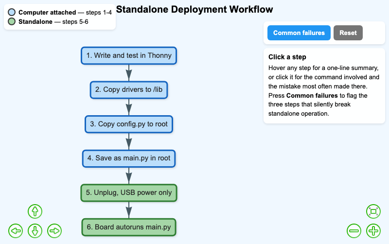Standalone Deployment Workflow</a>
  <a href="switch-bounce-debounce-visualizer/" title="Switch Bounce Debounce Visualizer" style="display:block;border:1px solid #e3e7ec;border-radius:8px;overflow:hidden;text-decoration:none;color:inherit;box-shadow:0 1px 3px rgba(0,0,0,0.08);">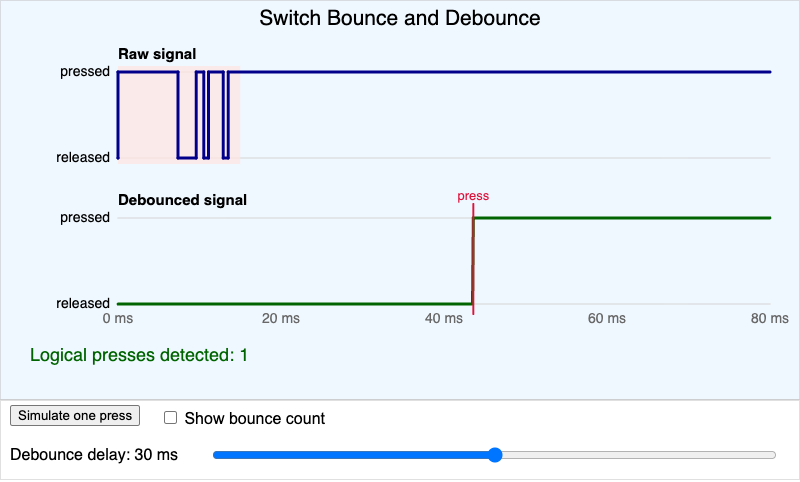Switch Bounce Debounce Visualizer</a>
  <a href="thonny-repl-workflow/" title="Thonny REPL Workflow" style="display:block;border:1px solid #e3e7ec;border-radius:8px;overflow:hidden;text-decoration:none;color:inherit;box-shadow:0 1px 3px rgba(0,0,0,0.08);">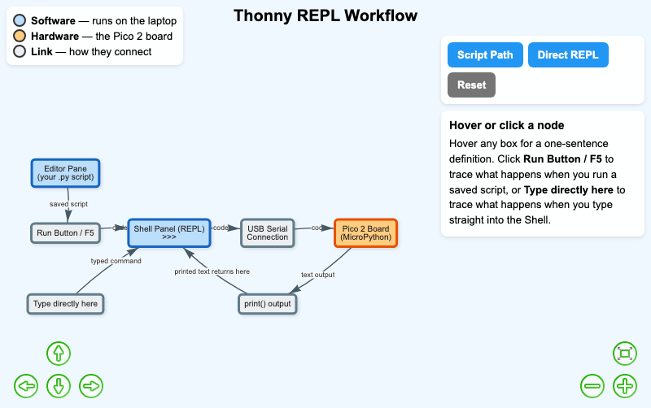Thonny REPL Workflow</a>
  <a href="unit-circle-radians-explorer/" title="Unit Circle Radians Explorer" style="display:block;border:1px solid #e3e7ec;border-radius:8px;overflow:hidden;text-decoration:none;color:inherit;box-shadow:0 1px 3px rgba(0,0,0,0.08);">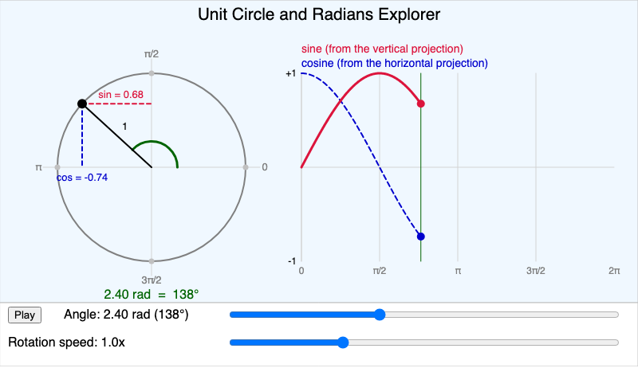Unit Circle Radians Explorer</a>
  <a href="variance-source-explorer/" title="Variance Source Explorer" style="display:block;border:1px solid #e3e7ec;border-radius:8px;overflow:hidden;text-decoration:none;color:inherit;box-shadow:0 1px 3px rgba(0,0,0,0.08);">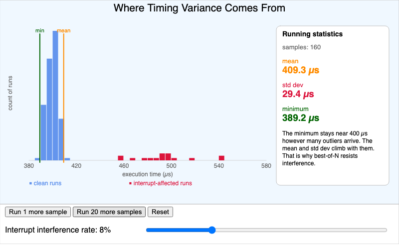Variance Source Explorer</a>
  <a href="variant-performance-dashboard/" title="Variant Performance Dashboard" style="display:block;border:1px solid #e3e7ec;border-radius:8px;overflow:hidden;text-decoration:none;color:inherit;box-shadow:0 1px 3px rgba(0,0,0,0.08);">no previewVariant Performance Dashboard</a>
  <a href="wave-superposition-beats-simulator/" title="Wave Superposition Beats Simulator" style="display:block;border:1px solid #e3e7ec;border-radius:8px;overflow:hidden;text-decoration:none;color:inherit;box-shadow:0 1px 3px rgba(0,0,0,0.08);">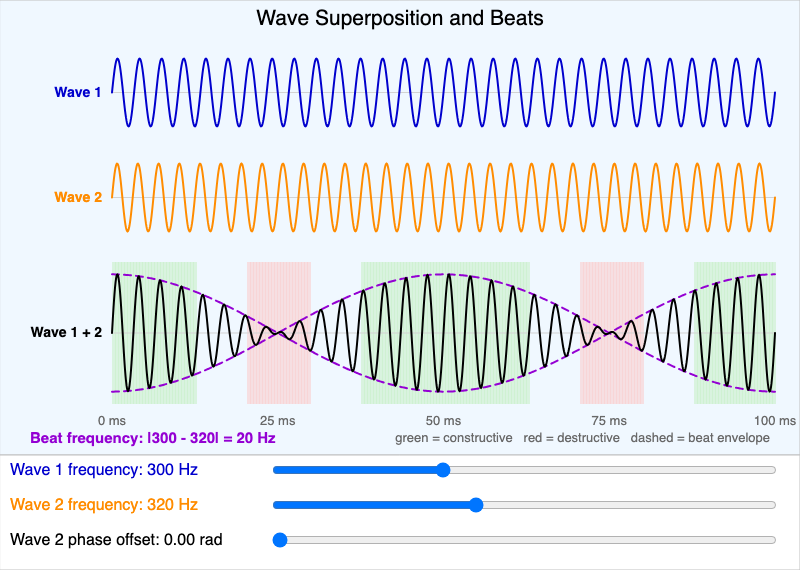Wave Superposition Beats Simulator</a>
  <a href="window-function-comparison/" title="Window Function Comparison" style="display:block;border:1px solid #e3e7ec;border-radius:8px;overflow:hidden;text-decoration:none;color:inherit;box-shadow:0 1px 3px rgba(0,0,0,0.08);">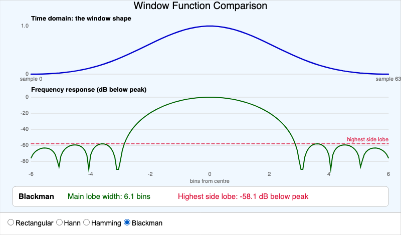Window Function Comparison</a>

