# 0.59 Milliseconds: One Student's Capstone Journey

<!--  -->

Cover Image Prompt

(This is the Cover Image. Do not include this label in the image.)
Generate a wide-landscape 16:9 cover image in a contemporary
photorealistic illustrated style. A young woman engineering student —
early twenties, brown skin, dark brown hair pulled back in a loose
braid, wire-frame glasses, wearing a faded gray university hoodie with
the sleeves pushed up — sits at a cluttered desk at night, caught in a
moment of quiet triumph, one fist half-raised. In front of her, a small
breadboard holds a compact green circuit board wired to a tiny
microphone module and a small monochrome display showing a glowing
spectrum graph. Beside the breadboard, a laptop screen displays a
terminal with a stack of scrolling numbers counting down dramatically:
"21000 ms," then "140 ms," then "0.85 ms," then finally "0.59 ms"
glowing in bright green, as if the numbers themselves form a visual
timeline racing toward the viewer. A faint motion-blur streak of light
trails behind the falling numbers, suggesting speed and time compressed
into a single instant. The desk lamp light is warm gold on her side of
the frame, cooling to a crisp cyan-white glow near the laptop screen,
symbolizing the journey from slow and warm to fast and bright. Render
the title "0.59 Milliseconds" across the upper third in a clean, bold,
modern technical sans-serif typeface, with smaller lettering beneath it
reading "One Student's Capstone Journey." Color palette: warm amber
desk light, deep charcoal shadow, and bright cyan-green screen glow.
Emotional tone: exhausted, disbelieving, joyful triumph after a long
night. Generate the image immediately without asking clarifying
questions.

Narrative Prompt

This is a fictional synthesis-capstone story, not a biography of a real
person. It follows Maya Ortiz, a composite fictional undergraduate
engineering-junior character invented to dramatize this course's own
real, documented 35-lab result: taking a 512-point Fourier transform
from roughly 21 seconds down to 0.59 milliseconds on the same five-
dollar microcontroller board — a factor of roughly 35,000. Every number
referenced in this story (21 seconds, 530 times too slow, 146 times
faster, 140 milliseconds, 1,097 CPU cycles for one software floating-
point multiply versus 1 cycle in hardware, 165 times faster, 0.85
milliseconds, 0.59 milliseconds, the 40-millisecond real-time budget,
and the 6,000,000-cycle-per-frame budget) is drawn directly from this
course's own published course description, not invented for the story.
Setting: present day, a university maker space and Maya's own dorm-room
desk, across roughly ten weeks. Style guide: contemporary photorealistic
illustrated style throughout — a consistent breadboard-and-microcontroller
maker aesthetic, a small green circuit board, a tiny monochrome display,
a laptop showing code and terminal output, an oscilloscope or logic
analyzer appearing in later panels. Lighting arcs from warm, tired,
late-night desk-lamp gold in the early panels to cool, bright, confident
white-and-cyan lighting by the final panels, mirroring the emotional arc
from frustration to mastery. Character consistency note: Maya Ortiz must
be drawn identically across all fourteen panels — early twenties, brown
skin, dark brown hair in a loose braid, wire-frame glasses, a faded gray
university hoodie (no logos or brand names) with sleeves pushed up, dark
jeans, a plain silicone wristband on her left wrist, and a small
soldering-iron-shaped charm clipped to her backpack strap. No real
company names, product names, logos, or trademarks should appear as
visible text in any generated image; describe the hardware generically
(a small green microcontroller board, a tiny monochrome display, a
compact single-board computer) rather than naming real products.

### Prologue – A Number Written on an Index Card

On the first day of the lab, Maya Ortiz taped an index card above her desk with two numbers on it: forty milliseconds, and six million cycles. That was the whole assignment, stripped to its bones — take a sound, find the frequencies hiding inside it, and do it before the next chunk of audio arrives, on a board that costs about the same as a sandwich. She had no idea, that first week, that the number on the card would take her ten weeks, five programming languages' worth of abstraction, and one very long night with an oscilloscope to actually earn. This is the story of how one transform went from twenty-one seconds to just over half a millisecond — and how Maya learned that every one of those factors of improvement had a name.

## Panel 1: The Index Card

<!-- 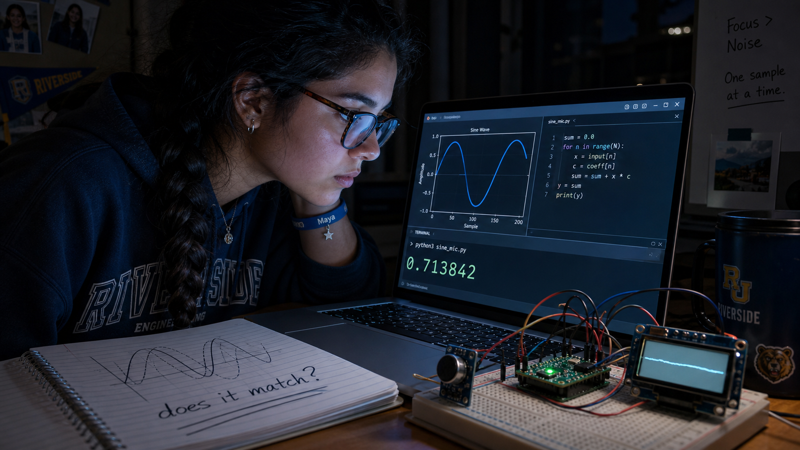 -->

Image Prompt

(This is Panel 01. Do not include the panel number in the image.)
I am about to ask you to generate a series of images for a graphic
novel. Please make the images have a consistent style and consistent
characters. Do not ask any clarifying questions. Just generate the
image immediately when asked. Generate a 16:9 image in a contemporary
photorealistic illustrated style depicting panel 1 of 14. Maya Ortiz —
early twenties, brown skin, dark brown hair in a loose braid, wire-
frame glasses, faded gray hoodie with sleeves pushed up, dark jeans,
silicone wristband — sits at a nearly empty dorm-room desk on the first
day of a lab course, staring at a completely bare breadboard with no
components on it yet. Above the desk, taped to the wall, a handwritten
index card reads "40 ms / 6,000,000 cycles" in blue marker. A small
unopened plastic bag holding a tiny green circuit board, a coiled
ribbon of jumper wires, and a small dark microphone module sits
unopened on the desk. A laptop screen shows a blank code editor with a
blinking cursor. Warm early-evening desk-lamp light, a half-finished
cup of coffee, a stack of unopened lab handouts. The color palette is
warm amber and soft neutral gray. The emotional tone is nervous
anticipation at the start of something large. Generate the image
immediately without asking clarifying questions.

Maya's kit arrived in a small static bag: a green thumbnail-sized board, a handful of wires, a microphone no bigger than a fingernail. Nothing about it looked capable of the sixty-decibel dynamic range and real-time frequency analysis the syllabus promised. The index card above her desk set the real target — a 40-millisecond window per audio frame, which at the board's clock speed worked out to exactly 6,000,000 CPU cycles and not one more. She did not yet know how to read a single one of those cycles. She only knew the number was the finish line, however she got there.

## Panel 2: A Signal Answers a Question

<!-- 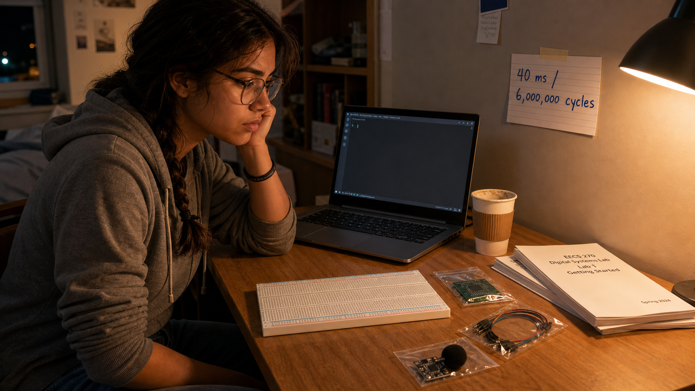 -->

Image Prompt

(This is Panel 02. Do not include the panel number in the image.)
Generate a 16:9 image in a contemporary photorealistic illustrated
style depicting panel 2 of 14. Make Maya Ortiz consistent with the
prior panel: same braid, glasses, hoodie, wristband, charm. She leans
close to a laptop screen in a dim dorm room, now weeks into the course,
lit mostly by the screen's glow. The screen shows a simple plotted sine
wave beside a short block of code performing a multiply-and-sum
loop, with a single large printed result value highlighted in the
terminal below. On the breadboard beside the laptop, the small green
board is now wired to the tiny microphone module and a small monochrome
display showing a flat, faint waveform trace. A spiral notebook is open
with a hand-drawn diagram of two overlapping wave shapes and the words
"does it match?" underlined twice. The color palette is cool blue
screen-glow against dark room shadow. The emotional tone is quiet,
focused discovery — a first real result appearing. Generate the image
immediately without asking clarifying questions.

The breakthrough was almost embarrassingly simple. To find out whether a signal contained a given note, Maya multiplied it point by point against a reference wave of that frequency and added up the result — matching frequencies reinforced each other, and everything else canceled toward zero. Loop that single question across every frequency she cared about, and she had, without quite meaning to, written a Discrete Fourier Transform from nothing but the definition of correlation. It worked. She validated it against a signal she had built by hand and knew the answer to, and the numbers matched. It also took nearly 21 seconds to transform a single 512-point chunk of audio.

## Panel 3: Five Hundred Thirty Times Too Slow

<!-- 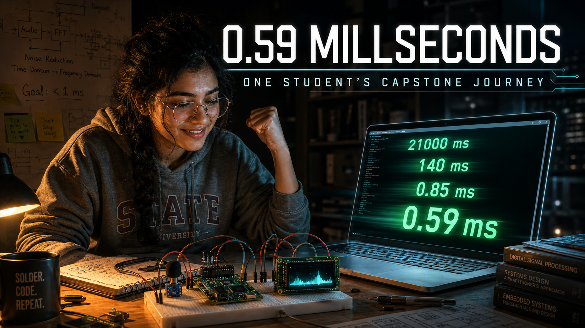 -->

Image Prompt

(This is Panel 03. Do not include the panel number in the image.)
Generate a 16:9 image in a contemporary photorealistic illustrated
style depicting panel 3 of 14. Make Maya Ortiz consistent with prior
panels. She sits back in her desk chair with her hands pressed over her
face in visible frustration, wire-frame glasses pushed up onto her
forehead. The laptop screen behind her, still glowing, shows a stark
terminal output in red-tinted text: "elapsed: 20.97 s" beside a smaller
line reading "budget: 0.040 s" and, below both, "530x over budget." A
crumpled printout of the same numbers sits on the floor near her chair.
The small green board and its display sit dark and idle on the desk
beside the laptop, the microphone unplugged and set aside. Outside a
small dorm window, city lights glow against a dark late-evening sky.
The color palette is desaturated blue-gray with the harsh red
highlight of the error text. The emotional tone is deflating realism —
the gap between "it works" and "it works fast enough" made brutally
visible. Generate the image immediately without asking clarifying
questions.

The number on the screen was almost funny, if it hadn't been her own code: 21 seconds against a 40-millisecond budget, 530 times too slow for anything resembling real time. Correctness had never been the hard part — building a version of the transform that actually agreed with the math had taken her days, but proving it was fast enough would take weeks longer. Every one of the DFT's 512 frequency bins required a full pass through every one of the 512 samples, an amount of repeated multiplication that scaled brutally as the transform grew. That gap — not a bug, just an algorithm doing exactly what it was built to do — was what she now had to close.

## Panel 4: Cutting the Problem in Half, Again and Again

<!-- 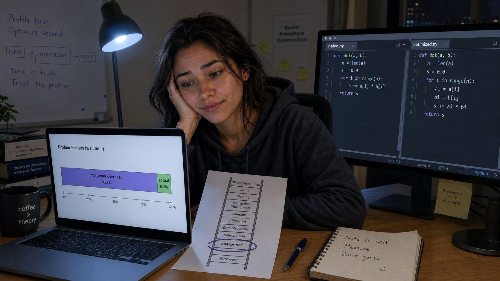 -->

Image Prompt

(This is Panel 04. Do not include the panel number in the image.)
Generate a 16:9 image in a contemporary photorealistic illustrated
style depicting panel 4 of 14. Make Maya Ortiz consistent with prior
panels, now looking more energized and alert, sitting up straight. A
large whiteboard behind her desk is covered in a hand-drawn recursive
tree diagram: a wide row of dots at the top branching down through
successive halvings into pairs, with small X-shaped "butterfly" symbols
connecting pairs of dots at the bottom rows, and a scribbled table
labeled "twiddle factors" beside it. She holds a marker mid-stroke,
having just drawn a bracket labeling the whole tree "N log N" beside a
crossed-out "N squared." Her laptop screen in the foreground shows a new
block of code with nested nested nested loops replaced by a much
shorter recursive function. The color palette shifts to a brighter,
more energetic blue-white. The emotional tone is the electric feeling
of a real insight landing. Generate the image immediately without
asking clarifying questions.

The fix, once she saw it, felt like cheating: a transform split cleanly in half is two smaller transforms, and each of those splits again, all the way down to trivial pairs recombined through a simple operation the course called the butterfly. Divide and conquer replaced the DFT's brute-force sweep with a structure that grew as N log N instead of N squared — a change in shape, not just in speed. Bit-reversal permutation reordered the samples, a table of precomputed twiddle factors handled the recombination, and suddenly the mountain of repeated multiplication had a staircase cut into it. Maya assembled the pieces into a working Fast Fourier Transform before she let herself believe it would actually be faster.

## Panel 5: Fast Isn't Enough Until It's Also Right

<!-- 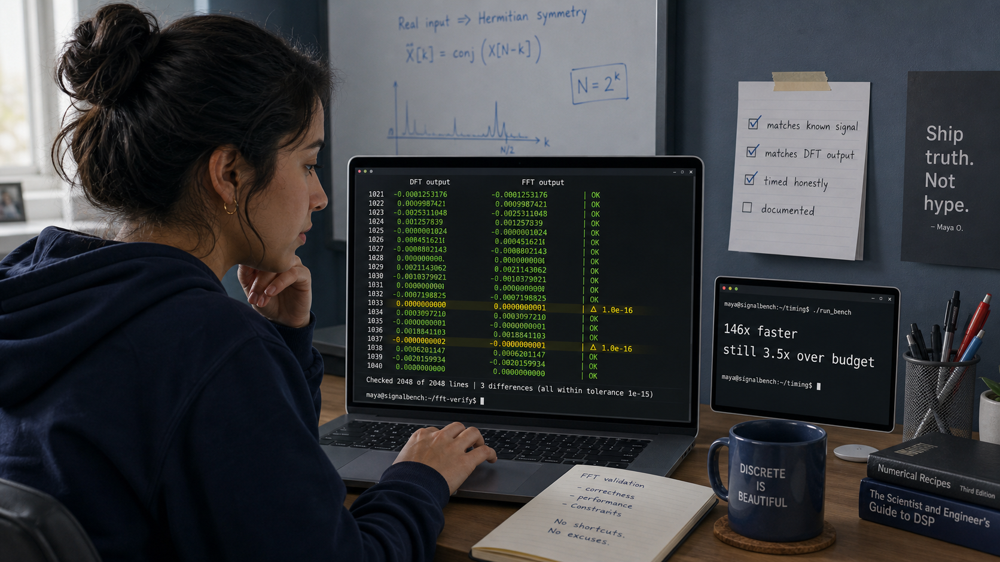 -->

Image Prompt

(This is Panel 05. Do not include the panel number in the image.)
Generate a 16:9 image in a contemporary photorealistic illustrated
style depicting panel 5 of 14. Make Maya Ortiz consistent with prior
panels. She sits at her desk comparing two side-by-side columns of
numbers on her laptop screen — one labeled "DFT output" and one labeled
"FFT output" — with a small script visibly diffing them line by line,
most rows highlighted green and a few flagged yellow for tiny rounding
differences. A second, smaller terminal window shows two timing lines:
"146x faster" and, just below it, "still 3.5x over budget," in neutral
white text rather than alarming red this time. A checklist taped beside
the monitor has several boxes already checked: "matches known signal,"
"matches DFT output," "timed honestly." The color palette is calm,
neutral blue-white, less frantic than the previous panel. The emotional
tone is careful, disciplined satisfaction rather than celebration.
Generate the image immediately without asking clarifying questions.

A faster answer that is also a wrong answer is not an improvement, so before Maya trusted a single millisecond of the new speed, she ran the FFT and the DFT on the same captured audio and compared their output value by value. They agreed, within the expected rounding of floating-point math, and only then did she look at the clock: 146 times faster than the brute-force version, the 21-second transform collapsed to roughly 140 milliseconds. It was real progress and still not enough — 140 milliseconds against a 40-millisecond budget left her 3.5 times over, close enough to see the finish line and nowhere near close enough to cross it.

## Panel 6: The Language Itself Is the Bottleneck

<!-- 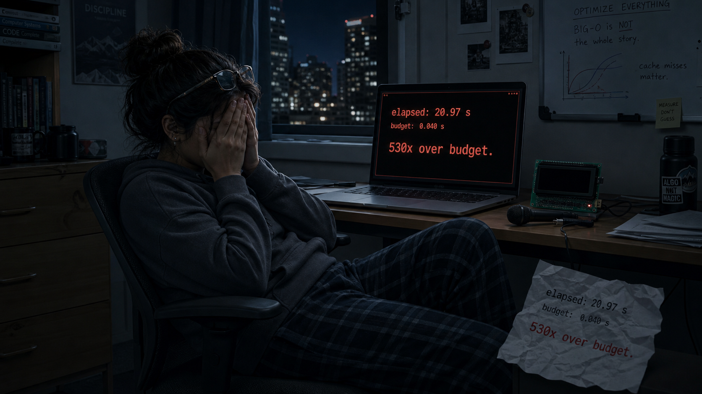 -->

Image Prompt

(This is Panel 06. Do not include the panel number in the image.)
Generate a 16:9 image in a contemporary photorealistic illustrated
style depicting panel 6 of 14. Make Maya Ortiz consistent with prior
panels, now wearing a slightly more tired expression, hair looser from
the braid. Her laptop screen shows a simple horizontal profiling bar
chart with several labeled segments — most of the bar shaded in one
solid color and captioned "interpreter overhead," a much smaller
segment captioned "actual math." Beside the laptop, a printed diagram
on paper shows a vertical ladder with rungs labeled from bottom to top
in a plain, generic font, one rung circled in pen. A second monitor
displays a code editor split into two panes comparing two versions of
the same short function. The desk lamp casts a slightly cooler light
than earlier panels. The emotional tone is a dawning, slightly wry
realization — the algorithm was never the only problem. Generate the
image immediately without asking clarifying questions.

The FFT's remaining slowness turned out not to be the algorithm's fault at all. When Maya finally profiled her code stage by stage instead of just timing the whole thing, most of the 140 milliseconds wasn't spent multiplying and adding — it was spent in the overhead of an interpreted language checking types, boxing numbers, and re-parsing the same loop body thousands of times a second. The math itself, stripped of that overhead, was fast. The language running it was not. That distinction — an algorithmic cost versus a language-level cost — was the one her instructor had warned would trip up half the class, and it reframed the whole remaining problem: she didn't need a better algorithm anymore, she needed a way to get the same algorithm out of the interpreter's way.

## Panel 7: Climbing the Abstraction Ladder

<!-- 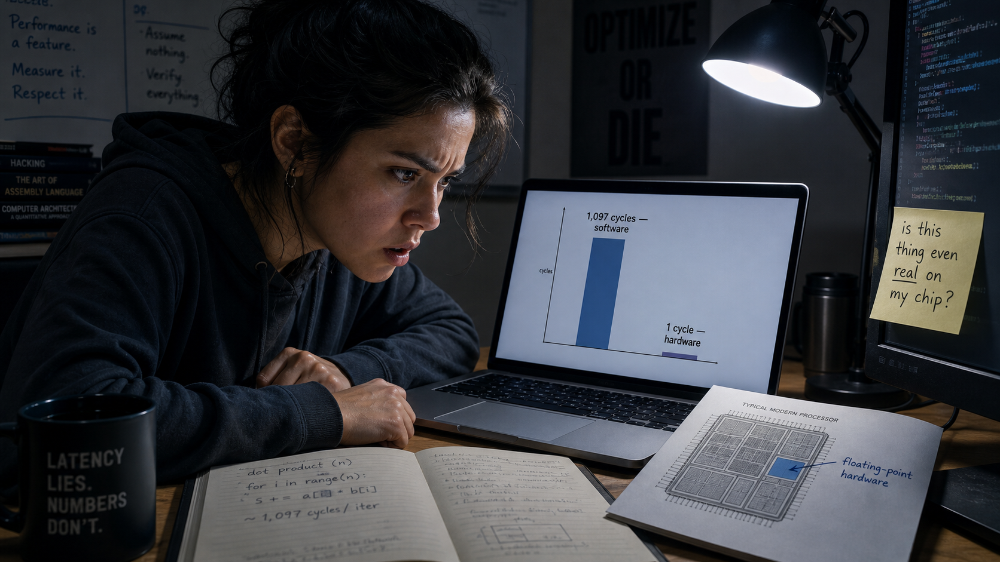 -->

Image Prompt

(This is Panel 07. Do not include the panel number in the image.)
Generate a 16:9 image in a contemporary photorealistic illustrated
style depicting panel 7 of 14. Make Maya Ortiz consistent with prior
panels, expression more alert again. She sits at her desk with three
overlapping terminal windows visible on her laptop screen, each showing
the identical short function decorated with a different small marker
above it, and each with its own timing result printed below in
descending order, the fastest highlighted in green. A tall, simple
hand-labeled ladder diagram is taped to the wall beside the whiteboard,
with several rungs already crossed off in marker climbing upward. A
second small monitor shows a bar chart of five shrinking bars side by
side. The color palette brightens slightly toward cool white. The
emotional tone is methodical, energized progress — each rung a small,
earned victory. Generate the image immediately without asking
clarifying questions.

The course called it the abstraction ladder, and Maya started climbing it one rung at a time without changing a single line of her algorithm. Two special code-emitting modes built into her development environment let her ask the same interpreter to skip its usual type-checking and produce much leaner machine code underneath — first a mode that trimmed the obvious overhead, then a second, stricter mode that stripped nearly everything but raw numeric operations. Each rung bought a real, measurable speedup, and each one still ran the identical butterfly math she had already proven correct against the DFT. It was the first time she understood that "faster" and "different algorithm" were not the same question at all.

## Panel 8: The Tax Hiding Inside Every Multiply

<!-- 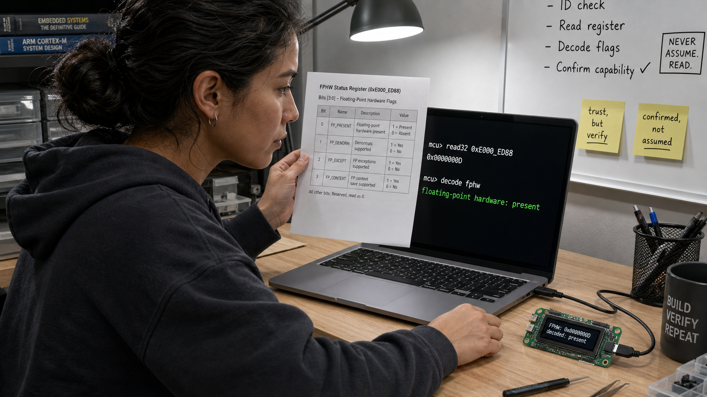 -->

Image Prompt

(This is Panel 08. Do not include the panel number in the image.)
Generate a 16:9 image in a contemporary photorealistic illustrated
style depicting panel 8 of 14. Make Maya Ortiz consistent with prior
panels, leaning forward intently, brow furrowed. Her laptop screen
displays a stark comparison chart with two bars of dramatically
different height: a very tall bar labeled "1,097 cycles — software"
beside a nearly invisible sliver labeled "1 cycle — hardware." Beside
the laptop, a small reference sheet lies open showing a simplified
diagram of a processor chip with one region highlighted and labeled
generically "floating-point hardware." A sticky note on the monitor
bezel reads "is this thing even real on my chip?" in her handwriting.
The desk lamp light is cool and focused, almost interrogation-style.
The emotional tone is startled discovery of a hidden, expensive
problem. Generate the image immediately without asking clarifying
questions.

Buried inside every single multiply in Maya's FFT was a cost she hadn't known to look for: her decimal-point audio samples were being processed as floating-point numbers, and unless the underlying hardware actually had a floating-point unit switched on and reachable, that arithmetic was being faked in software, one instruction at a time. The measured difference was staggering — roughly 1,097 CPU cycles for a single software-emulated float multiply, against a single cycle when real floating-point hardware did the same job. Every one of the millions of multiplies her FFT performed per second might be paying that tax without her knowledge. She had never actually confirmed her own board had a floating-point unit at all — only assumed it.

## Panel 9: Reading the Chip's Own Signature

<!-- 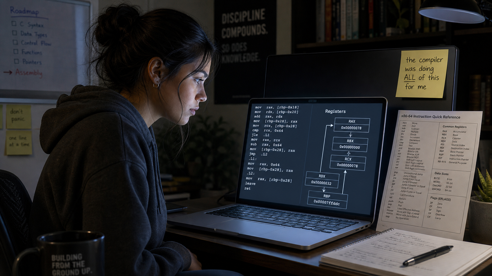 -->

Image Prompt

(This is Panel 09. Do not include the panel number in the image.)
Generate a 16:9 image in a contemporary photorealistic illustrated
style depicting panel 9 of 14. Make Maya Ortiz consistent with prior
panels, expression focused and methodical. She holds up a small
printed datasheet page beside her laptop screen, comparing a table of
binary flag values to a terminal output showing a raw hexadecimal
number and, below it, a decoded line reading "floating-point hardware:
present." The small green board sits connected to the laptop by a thin
cable, its tiny monochrome display now showing a short line of
diagnostic text instead of a waveform. A second sticky note now reads
"confirmed, not assumed" beside the first. The desk lamp light is
crisp and neutral white. The emotional tone is quiet, confident
verification — replacing a guess with proof. Generate the image
immediately without asking clarifying questions.

Rather than trust the datasheet or her own assumption, Maya wrote a short probe that asked the chip to identify itself, reading a set of built-in feature registers that reported, in raw binary, exactly which hardware capabilities were actually wired into this particular processor. Decoded bit by bit, the answer came back unambiguous: real floating-point hardware, present and reachable, not emulated. It was a small, almost anticlimactic result compared to the DFT-to-FFT leap, but it mattered more than it looked — the entire back half of her course's speedup depended on a hardware feature she had, until that moment, only ever taken on faith.

## Panel 10: Learning the Machine's Own Words

<!-- 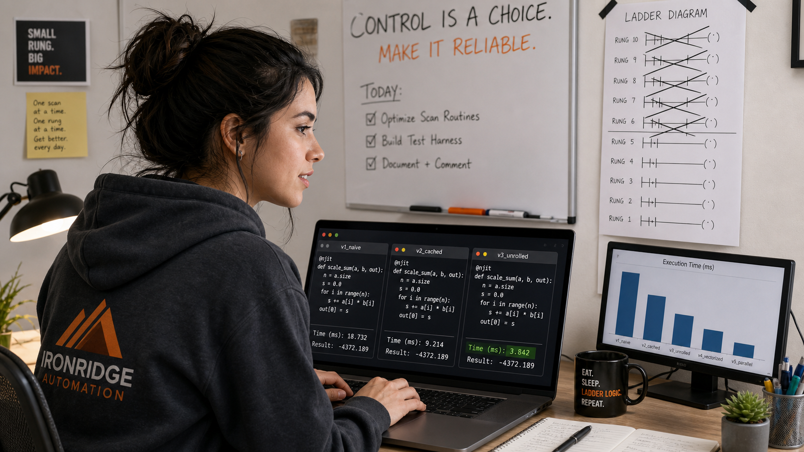 -->

Image Prompt

(This is Panel 10. Do not include the panel number in the image.)
Generate a 16:9 image in a contemporary photorealistic illustrated
style depicting panel 10 of 14. Make Maya Ortiz consistent with prior
panels, sitting a little stiffly, concentrating hard. Her laptop screen
shows a short block of dense, unfamiliar low-level assembly-style
instructions in a monospace font, each line labeled with short cryptic
mnemonics, alongside a simple diagram of labeled boxes representing
processor registers with arrows showing values moving between them. A
printed reference card covered in instruction names sits propped
against her monitor. A small sticky note reads "the compiler was doing
ALL of this for me" with "ALL" underlined three times. The color
palette is cool and slightly clinical, laptop-glow dominant. The
emotional tone is humbled respect mixed with cautious progress.
Generate the image immediately without asking clarifying questions.

Writing her first loop directly in the processor's own instruction set felt like relearning arithmetic with her hands tied — every value had to be explicitly loaded into a register, moved, compared, and stored, with none of the conveniences a higher-level language had always handled invisibly. The gains at this stage were modest, a simple loop running a little faster than its higher-level equivalent, nothing like the leaps still to come. What surprised Maya more than the speed was the respect it earned her for the compiler she'd spent ten weeks trying to get out from under — it had been doing, correctly and instantly, work that took her an evening to get right by hand for a single small loop.

## Panel 11: Speaking Directly to the Hardware

<!-- 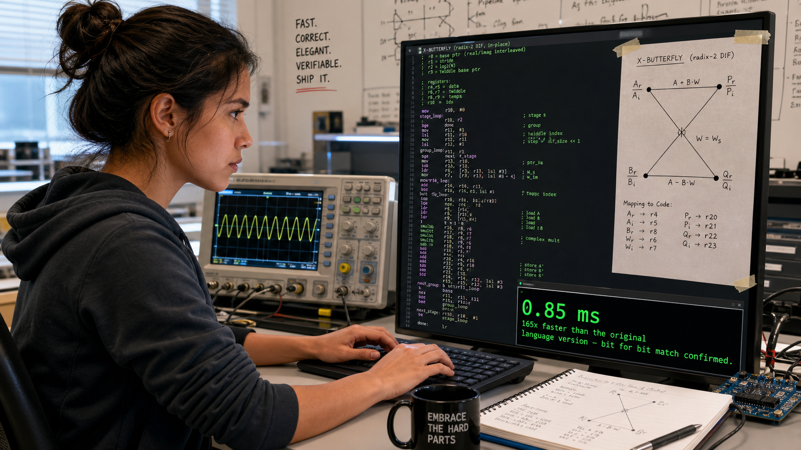 -->

Image Prompt

(This is Panel 11. Do not include the panel number in the image.)
Generate a 16:9 image in a contemporary photorealistic illustrated
style depicting panel 11 of 14. Make Maya Ortiz consistent with prior
panels, now with a small, spreading grin. Her laptop screen shows
assembly-style instructions referencing a distinct second set of
labeled registers separate from the earlier ones, annotated in her own
handwriting-style comments as "float registers — talking straight to
the hardware now." A timing comparison chart beside it shows the
earlier tall "1,097 cycles" bar from a previous panel now collapsed to
a bar barely taller than the "1 cycle" hardware bar next to it. An
oscilloscope has appeared on the desk for the first time, its screen
showing a clean, tight waveform. The lighting is noticeably brighter
and cooler than earlier panels. The emotional tone is a genuine jolt of
excitement — a real breakthrough landing. Generate the image
immediately without asking clarifying questions.

The real jump came when Maya's hand-written instructions stopped asking the processor to fake floating-point math and started talking directly to the floating-point hardware itself — loading values straight into its dedicated registers and letting it multiply and add in a single cycle apiece. The 1,097-cycle tax she had measured weeks earlier, the one hiding inside every software-emulated multiply, simply stopped existing in this code path. It was the single largest jump of the entire project, and it came not from a cleverer algorithm but from finally letting real silicon do the one job it had been sitting idle for, unused, the whole time.

## Panel 12: The Butterfly, Written by Hand

<!-- 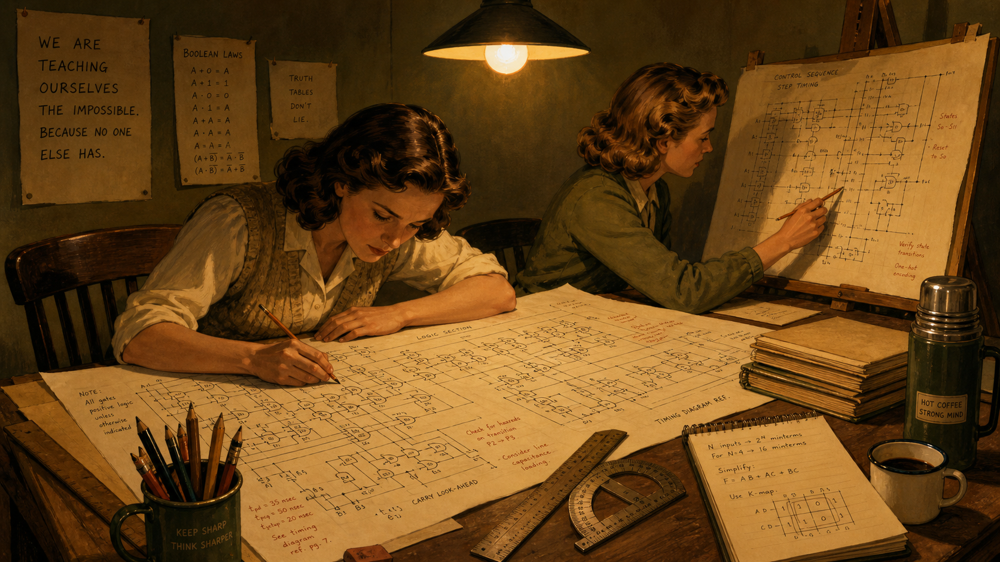 -->

Image Prompt

(This is Panel 12. Do not include the panel number in the image.)
Generate a 16:9 image in a contemporary photorealistic illustrated
style depicting panel 12 of 14. Make Maya Ortiz consistent with prior
panels, sitting very upright, intensely focused, sleeves fully pushed
up. Her laptop screen shows a longer, denser block of hand-written
assembly-style code implementing a small X-shaped butterfly diagram
that is also sketched on paper taped right next to the monitor for
reference, with matching variable labels connecting the diagram to the
code. A terminal beneath it reads "0.85 ms" in large bright green text,
with a smaller line below reading "165x faster than the original
language version — bit for bit match confirmed." The oscilloscope
beside her shows a clean, fast repeating waveform pattern. Lighting is
bright, crisp, and confident. The emotional tone is hard-won mastery —
the single most technically demanding step of the whole project,
completed. Generate the image immediately without asking clarifying
questions.

The butterfly operation at the heart of the FFT — the small, repeated combine-and-recombine step that made divide and conquer possible in the first place — was the last major piece Maya had to write entirely by hand, using both the processor's core instructions and its floating-point and digital-signal-processing instructions together in one dense, carefully sequenced routine. When she finally ran the complete hand-assembled transform, the terminal reported 0.85 milliseconds — 165 times faster than her original higher-level FFT, and, when she diffed the output against that same trusted version, correct to the bit. It used only 2.1 percent of her 40-millisecond budget. For the first time since the index card went up on her wall, she was no longer over budget. She was nowhere close to it.

## Panel 13: Earning the Number Honestly

<!-- 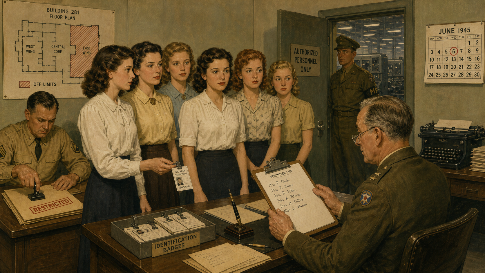 -->

Image Prompt

(This is Panel 13. Do not include the panel number in the image.)
Generate a 16:9 image in a contemporary photorealistic illustrated
style depicting panel 13 of 14. Make Maya Ortiz consistent with prior
panels, calm and methodical rather than excited, double-checking her
own work. Her laptop screen shows a script running many repeated timing
trials, a small histogram of measured run times clustered tightly
together, and a checklist with items like "discard first run," "use
median, not best case," "verify against reference output" all checked.
A second terminal shows a final result: "0.59 ms — 1.5% of budget" in
steady green text, without exclamation or flourish. The oscilloscope
beside her shows a stable, repeating trace. The lighting is bright,
even, and clinical rather than dramatic. The emotional tone is quiet,
disciplined rigor — the final number treated with suspicion until
proven. Generate the image immediately without asking clarifying
questions.

Getting a fast number was no longer the hard part; trusting it was. Maya had learned, the hard way, the ways a benchmark can lie — a cold cache padding the first run, a best-of-N figure hiding ordinary variance, the very act of timing a piece of code changing how fast it ran. So she warmed up the hardware before measuring, ran enough trials to see the real spread rather than a lucky outlier, and diffed the final optimized output against her original trusted reference one more time before she let herself believe it. The honestly measured, statistically defensible result was 0.59 milliseconds — just 1.5 percent of her 40-millisecond budget, and this time she had the discipline, not just the stopwatch, to back it up.

## Panel 14: Every Order of Magnitude, Named

<!-- 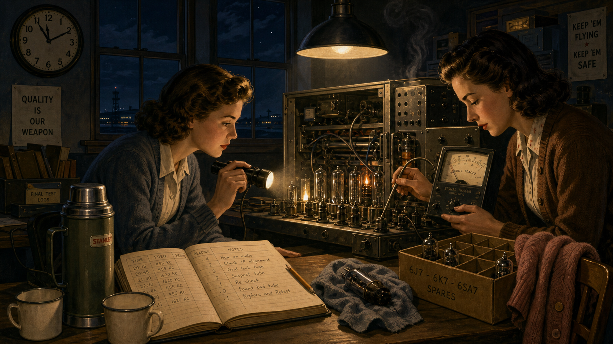 -->

Image Prompt

(This is Panel 14. Do not include the panel number in the image.)
Generate a 16:9 image in a contemporary photorealistic illustrated
style depicting panel 14 of 14. Make Maya Ortiz consistent with prior
panels, standing now instead of sitting, arms loosely crossed, a
relaxed and satisfied smile, morning light suggesting an all-nighter
just ended. She faces a large whiteboard covered edge to edge with a
single horizontal timeline she has drawn herself: a descending staircase
of numbers from "21,000 ms" on the far left down to "0.59 ms" on the far
right, each step labeled in her own handwriting with a short cause —
"FFT," "native/viper," "hardware floats," "hand assembly," "honest
benchmarking" — connected by arrows. Morning light streams through the
dorm window behind her, warm and bright rather than the earlier cool
late-night tones. The small green board sits closed and quiet on the
desk beside a finished, steaming mug of coffee. The color palette is
bright, warm, golden morning light replacing every earlier nighttime
scene. The emotional tone is settled, earned satisfaction — not
exhausted relief, but clear-eyed understanding of exactly what was
accomplished and why. Generate the image immediately without asking
clarifying questions.

By morning, Maya had drawn the entire ten-week journey on one whiteboard as a single staircase: 21 seconds down to 0.59 milliseconds, a improvement on the order of 35,000-fold, and not one step of it a mystery. Each drop on the staircase had a name — divide and conquer, native and viper code emitters, hardware floating point, hand-written assembly, honest measurement — and she could explain, out loud, exactly why each one worked and how much it had bought her. That was the actual capstone, more than the final number itself: a straight, fully traceable line from a brute-force definition to a production-grade result, with nothing left as an unexamined black box.

### Epilogue – What the Whole Journey Adds Up To

Maya's project is fiction, but every number on her whiteboard is real — this is the same 512-point transform, on the same five-dollar board, that this course's own students measure themselves, lab by lab, across ten weeks. No single technique she used produced the whole 35,000-fold gap on its own; the DFT-to-FFT rewrite, the climb up the abstraction ladder, the discovery of hardware floating point, and the hand-written assembly each closed a different kind of gap, and none of them would have meant anything without the final discipline of measuring the result honestly. That layering — algorithm, language, hardware, and honesty, stacked in that order — is the actual shape of the course this story compresses into fourteen panels.

| Optimization Step | What Changed | Lesson for Today |
|---|---|---|
| Brute-force DFT to FFT | Divide-and-conquer restructuring cut the operation count, turning 21 seconds into roughly 140 milliseconds — 146× faster | Algorithmic complexity sets a hard ceiling no amount of code polish can beat |
| Pure Python to native/viper code emitters | Same algorithm, same language family, far less interpreter overhead per instruction | A language-level cost is a separate bill from an algorithmic one — pay them down separately |
| Software-emulated floats to hardware FPU | Confirmed via the chip's own identification registers, then used directly — roughly 1,097 cycles collapsed to 1 | Hidden costs live inside abstractions you haven't actually inspected yet |
| Hand-written ARM assembly butterfly | The complete transform reached 0.85 milliseconds, 165× faster than the original Python version, bit for bit correct | Understanding what the compiler was doing multiplies the moves available to you |
| Rigorous benchmarking discipline | Warm-up runs, repeated trials, and bit-for-bit validation turned a number into a trustworthy 0.59-millisecond result | An honestly earned number is worth more than an impressive one nobody can verify |

### Call to Action

The index card above Maya's desk could be taped above yours. Lab 1 asks nothing more than that you own a computer, and the same staircase — DFT to FFT, Python to native code, software floats to hardware floats, hand-written assembly, and honest measurement — is waiting to be climbed one lab at a time. Start at Lab 1, keep every number you measure, and find out for yourself exactly how far a five-dollar board can go.

---

*"The first time I saw '21 seconds' on my own screen, I thought I'd built something broken. I hadn't — I'd just built the slow, honest, correct version every fast version has to be checked against."*
—Maya Ortiz, fictional

*"The fastest number I ever measured meant nothing until I could also explain, out loud, exactly why it was that fast. That explanation is the actual grade."*
—Maya Ortiz, fictional

---

## References

1. [Course Description](../../course-description.md) - the full syllabus and the documented 21-second-to-0.59-millisecond headline result this story dramatizes
2. [Chapter 11: From DFT to FFT](../../chapters/11-from-dft-to-fft/index.md) - the divide-and-conquer insight behind Panel 4
3. [Chapter 18: Benchmarking Methodology](../../chapters/18-benchmarking-methodology/index.md) - the honest-measurement discipline behind Panel 13
4. [Chapter 23: The Butterfly in Assembly](../../chapters/23-the-butterfly-in-assembly/index.md) - the hand-written ARM assembly FFT behind Panel 12
5. [Lab 35: Capstone](../../labs/35-capstone/index.md) - the final capstone lab this story dramatizes
