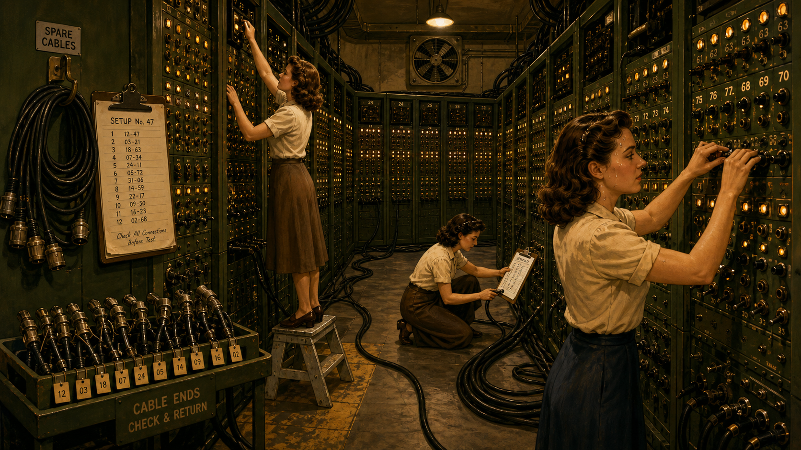
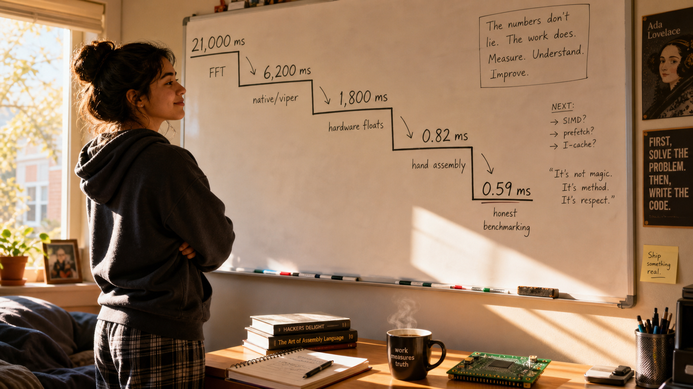
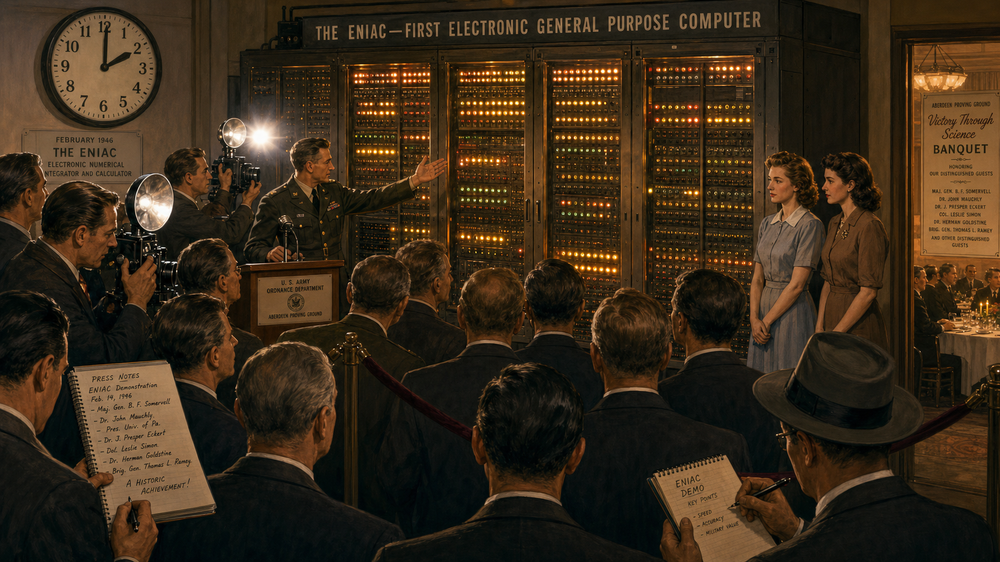
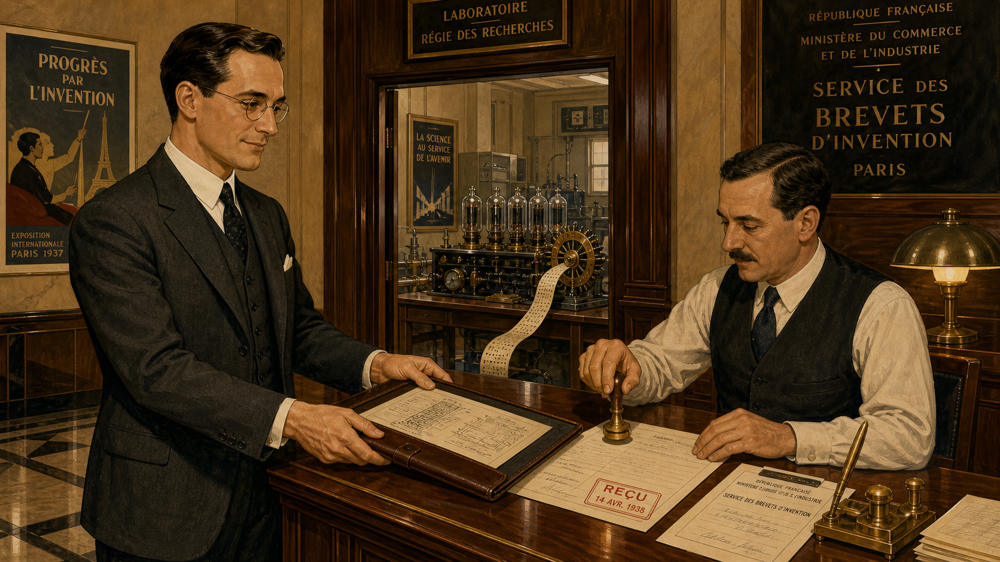

# Alec Reeves and the Signal That Waited Fifty Years

<!--  -->

Cover Image Prompt

(This is the Cover Image. Do not include this label in the image.)
Please generate a wide-landscape 16:9 cover image in a 1930s Art Deco
illustrated style, like a period technical poster crossed with a graphic
novel cover. A composed English engineer in his mid-thirties, dark hair
combed back, wire-rimmed round glasses, wearing a charcoal three-piece suit
with a narrow tie, stands at a brass-fitted drafting table in a Paris
telecommunications laboratory. Behind him, tall glass vacuum tubes glow
faintly amber inside a brass and dark-wood equipment rack, and a
round-faced oscilloscope displays a jagged, noisy analog waveform on one
side of the table that transforms into a clean row of evenly spaced pulses
on a hand-drawn diagram in front of him. Art Deco geometric border
ornamentation frames the image in brass and deep green. Color palette:
deep browns, brass gold, muted teal, and warm amber tube-glow against a
dim slate-blue laboratory background. Emotional tone: quiet, confident
foresight, a man seeing decades into the future. Render the title text
"ALEC REEVES AND THE SIGNAL THAT WAITED FIFTY YEARS" in a bold period
Art Deco sans-serif typeface across the top or bottom third of the image.
Generate the image immediately without asking clarifying questions.

Narrative Prompt

This story is set in France and England between 1927 and the 1960s,
centered on English telecommunications engineer Alec Reeves. The visual
language throughout is Early Modern / Art Deco (1900-1950): 1930s Paris
industrial-research interiors, brass telephone equipment, glass vacuum
tubes glowing amber, round analog oscilloscope faces, drafting tables with
hand-inked circuit diagrams, wool three-piece suits, and geometric Art
Deco linework. The central theme is a man being technically correct
decades before the hardware of his era can prove it: he invents a noise-
proof way of sending sound as digital pulses, watches the electronics of
his day fail to keep up with the idea, and lives just long enough to see
the first signs of the transistor era that will eventually make his
invention the foundation of digital audio. Character consistency note:
Reeves is depicted consistently across all six panels as a lean,
bespectacled man who ages from his mid-thirties (dark hair, round wire
glasses, three-piece suit) in Panels 1-3 to his early sixties (grayer,
slightly heavier, still wearing round glasses but in a more modern 1960s
suit) in Panel 6. The color palette shifts from warm brass/amber/teal in
the 1930s Paris panels to cooler blues and grays as the story moves into
the wartime and postwar decades, then warms again in the final panel to
signal the payoff.

### Prologue – A Voice Lost in the Wire

In the 1930s, a long-distance telephone call was a fragile thing. Every
mile of copper wire bled a little signal into heat and static, so
engineers built repeater stations every so often to catch the fading
voice and amplify it back to strength. The trouble was that an amplifier
cannot tell the difference between a voice and the hiss riding along with
it — it boosts both together. Send a call through enough repeaters and
the noise piles up faster than the words survive it. In a research
laboratory in Paris, a young English engineer named Alec Reeves was about
to decide that the whole approach was the wrong idea entirely.

## Panel 1: The Noise That Would Not Stop Climbing

<!--  -->

Image Prompt

(This is Panel 01. Do not include the panel number in the image.)
I am about to ask you to generate a series of images for a graphic novel.
Please make the images have a consistent style and consistent characters.
Do not ask any clarifying questions. Just generate the image immediately
when asked.

Please generate a 16:9 image in 1930s Art Deco illustrated style depicting
panel 1 of 6. The scene is a telecommunications research laboratory in
Paris, France, in 1936. A lean English engineer in his mid-thirties, dark
hair combed back, round wire-rimmed glasses, charcoal three-piece suit
with sleeves rolled, leans over a large brass-cased test telephone set
wired to a wall of humming vacuum-tube repeater equipment. Beside him, two
French laboratory technicians in white lab coats watch a round-faced
oscilloscope screen showing a badly distorted, jagged waveform with visible
noise spikes. A hand-cranked long-distance switchboard with cloth-covered
cords sits in the background. Brass gauges, glass vacuum tubes glowing
amber, and a large wall map of European telephone routes with red string
lines add period detail. Color palette: warm brass, deep mahogany wood,
amber tube-glow, muted teal accents. The emotional tone is frustrated
concentration — a technical problem that keeps getting worse the harder
they try to fix it with brute amplification. Generate the image immediately
without asking clarifying questions.

Reeves listens through a pair of heavy Bakelite headphones as a test call
crackles in from London, each repeater along the line adding its own
grain of hiss to the signal. His technicians have tried every trick the
company's engineers know: better tubes, tighter filters, more careful
spacing between amplifiers. None of it changes the fundamental problem.
An amplifier that strengthens a voice will just as faithfully strengthen
the noise riding beside it, and over enough repeaters the accumulated
static eventually drowns the words it was built to carry.

## Panel 2: A Different Question

<!--  -->

Image Prompt

(This is Panel 02. Do not include the panel number in the image.)
Please generate a 16:9 image in 1930s Art Deco illustrated style depicting
panel 2 of 6. Keep the same English engineer from panel 1 — mid-thirties,
dark hair, round wire glasses, charcoal three-piece suit, now with his
jacket off and shirtsleeves rolled — seated alone at a wide wooden
drafting table late at night in the same Paris laboratory, a single brass
desk lamp casting a warm pool of light. He is sketching by hand on
drafting paper: on the left side of the page a smooth, continuous wavy
line labeled with small tick marks; on the right side, the same wave
redrawn as a neat staircase of discrete evenly spaced vertical bars of
varying height. Scattered around him are crumpled paper balls, a slide
rule, a cup of cooling coffee, and an ashtray with one cigarette burning
down. Tall dark laboratory windows behind him show the silhouette of
Parisian rooftops at night. Color palette: warm amber lamplight against
deep blue-black night shadows, brass and dark wood tones. Emotional tone:
quiet, electric realization — the moment an idea clicks into place.
Generate the image immediately without asking clarifying questions.

Alone after the technicians have gone home, Reeves keeps returning to the
same sketch. If a repeater could regenerate a clean new pulse instead of
amplifying whatever arrived at its door, accumulated noise would stop
being the enemy. Instead of pushing a continuous, infinitely delicate
wave down the line, he could sample the sound at regular instants,
round each sample to the nearest of a fixed set of quantized levels, and
send that as a sequence of on-off pulses. A repeater would not need to
preserve a fragile shape at all — it would only need to recognize a pulse
was there and stamp out a fresh one, indifferent to whatever static had
piled onto the original.

## Panel 3: Filing the Idea

<!--  -->

Image Prompt

(This is Panel 03. Do not include the panel number in the image.)
Please generate a 16:9 image in 1930s Art Deco illustrated style depicting
panel 3 of 6. Same English engineer, mid-thirties, dark hair, round wire
glasses, now back in his full charcoal three-piece suit, standing at a
polished wooden counter inside a formal French patent office in Paris in
1938, sliding a leather document folder of technical drawings across to a
mustached clerk in a dark waistcoat who is stamping paperwork with a brass
seal. Through a doorway behind them, a glimpse of the laboratory shows a
prototype apparatus: a row of glass vacuum tubes, a sampling switch made
of rotating brass contacts, and a paper tape punched with a repeating
pattern of dots representing quantized pulses. Art Deco ceiling light
fixtures and marble floor tiles complete the setting. Color palette: brass
gold, dark wood, cream document paper, muted red official stamps. The
emotional tone is formal satisfaction, a private triumph made official.
Generate the image immediately without asking clarifying questions.

By 1938, Reeves has turned the sketch into a working method and a formal
filing: sample the signal at a steady rate, quantize each sample against
a fixed ladder of amplitude levels, and encode the result as a pulse
sequence a receiver can decode back into sound. He calls it pulse-code
modulation. The French patent office stamps his application that October;
a corresponding United States patent follows the next year. On paper, he
has just solved the noise problem that has plagued long-distance telephony
for a generation.

## Panel 4: The Machine the Idea Needs Does Not Exist

<!--  -->

Image Prompt

(This is Panel 04. Do not include the panel number in the image.)
Please generate a 16:9 image in 1930s Art Deco illustrated style depicting
panel 4 of 6. Same English engineer, mid-thirties, dark hair, round wire
glasses, now in shirtsleeves and waistcoat, standing with arms crossed in
a cavernous Paris laboratory workshop in 1939, surveying an enormous room-
filling rack of hundreds of glowing glass vacuum tubes, tangled cable
looms, and hand-wired relay panels that only manages to encode a single
telephone channel. Two engineers in lab coats struggle to replace an
overheated tube with heavy asbestos gloves; a wisp of smoke rises from
one unit. A crumpled cost estimate ledger lies open on a nearby table
showing a very large sum circled in red pencil. Dim, cooler lighting than
prior panels, dust motes visible in a shaft of window light. Color
palette: cooling grays and dull brass, a single small patch of amber tube-
glow, muted red ledger ink. Emotional tone: sober disappointment, the
weight of an idea too large for its era's technology. Generate the image
immediately without asking clarifying questions.

The gap between the idea and the machine is enormous. Sampling, quantizing,
and encoding a single voice channel in real time demands hundreds of
vacuum tubes, acres of relay wiring, and a budget no telephone company of
1939 will approve for one experimental circuit. Tubes run hot, fail
often, and take up a room where a single simple amplifier once sufficed.
Reeves has proven pulse-code modulation works on a laboratory bench; he
cannot come close to proving it is affordable. The patents sit filed and
correct, waiting for electronics that do not yet exist.

## Panel 5: Years Pass, Quietly

<!--  -->

Image Prompt

(This is Panel 05. Do not include the panel number in the image.)
Please generate a 16:9 image in a 1940s-1950s transitional illustrated
style depicting panel 5 of 6, blending Art Deco linework with a cooler,
more austere postwar palette. Show a triptych-style single composition
split across the frame by faint vertical seams: on the left, the same
engineer, now in his mid-forties with a hint of gray at the temples, in a
wartime RAF-adjacent research office with blackout curtains and a radar
navigation display; in the center, a dusty shelved laboratory cabinet
holding the same brass pulse-sampling apparatus from panel 4, cobwebbed
and unused, a calendar on the wall showing years flipping past; on the
right, a small glass-and-metal transistor, brand new and gleaming, held
up in a technician's tweezers under a bright inspection lamp, dwarfing
the room-sized vacuum tube rack faintly visible behind it for scale.
Color palette: cool wartime blues and grays fading into a brighter, cleaner
1950s laboratory white and silver on the right side. Emotional tone:
patient dormancy giving way to quiet renewal. Generate the image
immediately without asking clarifying questions.

The idea does not die; it simply waits. War pulls Reeves back to England,
where he turns his energy to radio navigation for RAF bombers, and the
pulse-code notion he patented in Paris goes largely untouched for years,
though wartime researchers experimenting with secure voice transmission
take some early interest in pulse techniques. Not until the transistor
arrives in the postwar years does the arithmetic finally begin to change:
a device the size of a pea can do the job that once needed a tube the
size of a fist, and suddenly a circuit with hundreds of switching elements
starts to look like something a company could actually build.

## Panel 6: The Idea Finally Fits Its Century

<!--  -->

Image Prompt

(This is Panel 06. Do not include the panel number in the image.)
Please generate a 16:9 image in a clean early-1960s illustrated style with
Art Deco linework details preserved in the architecture. Depict panel 6 of
6. The same engineer, now in his early sixties, gray hair, round wire
glasses, wearing a more modern dark 1960s suit, stands in a bright modern
telecommunications laboratory holding a small circuit board dense with
transistors, a satisfied half-smile on his face, dwarfed by a wall-sized
bank of neatly stacked digital pulse-code equipment far smaller than the
vacuum-tube rack from panel 4. Beside him, on a lit display pedestal, a
compact reel-to-reel digital recording device hums quietly. Through a
window, a modern city skyline suggests the wider world about to adopt
digital telephone networks. Color palette: bright clean whites, silver,
and a return of warm brass and amber accent lighting to echo panel 1.
Emotional tone: vindication and quiet pride, decades of patience finally
paid off. Generate the image immediately without asking clarifying
questions.

By the mid-1960s, the transistor and the integrated circuits following it
finally give pulse-code modulation a hardware budget it can live within,
and telephone companies begin converting their trunk lines to digital
pulses just as Reeves once sketched them. He lives to see the recognition
that comes with vindication, honored for a method the industry spent
almost thirty years catching up to. The idea he filed as a young man in
Paris outlives the vacuum tube entirely, going on to become the sampling-
and-quantizing backbone of the compact disc, the digital telephone
network, and every microphone that turns sound into numbers.

### Epilogue – What Made Reeves Different?

Reeves's story is not one of instant triumph; it is one of correct
patience. He identified the actual flaw in analog telephony — that noise
accumulates because amplifiers cannot distinguish signal from static —
and designed a solution so structurally sound that no advance in
electronics ever had to correct his original 1938 patents, only catch up
to them. He kept the idea alive through a world war, a change of country,
and decades of commercial indifference, trusting that the underlying
logic of sampling and quantizing was right even when the vacuum tube
could not yet afford to prove it. That is the harder kind of engineering
courage: not the flash of invention, but the discipline to be correct
years before anyone can act on it.

| Challenge | How Reeves Responded | Lesson for Today |
|---|---|---|
| Noise accumulates faster than repeaters can fight it | Reframed the problem: stop transmitting a fragile continuous wave, transmit discrete regenerable pulses instead | Sometimes the fix is not a better version of the current approach, but a different representation of the signal entirely |
| 1930s vacuum-tube electronics were too slow, bulky, and costly to build PCM at scale | Patented the method anyway and let the idea wait for hardware that did not yet exist | A correct design does not need to be immediately buildable to be worth recording precisely |
| Decades of commercial indifference while transistors slowly matured | Continued working in adjacent fields (radar, radio navigation, optical fiber research) without abandoning the original insight | Great ideas often need an unrelated hardware revolution before they become practical — patience is part of the engineering |
| Almost no one outside specialist circles remembers his name today | His invention became invisible infrastructure — CDs, digital phone networks, every sampled microphone | The most successful engineering disappears into the background of everyday life instead of staying famous |

### Call to Action

Every time you sample a waveform in this course's labs, you are running
Reeves's 1938 idea on hardware he could only have dreamed of: a
microcontroller that samples, quantizes, and encodes sound thousands of
times a second, on a board smaller than the vacuum tubes that once
defeated him. When you write the sampling code in Chapter 6 and capture
your first waveform with an I2S microphone in Lab 7, you are not just
learning a technique — you are finally giving Alec Reeves's patent the
hardware it waited fifty years to receive.

---

*"[PCM] could be the most powerful tool so far against the effects of
interference on speech — especially on long routes with many regenerative
repeaters, since these devices could easily be designed and spaced so as
to make the noise nearly noncumulative."*
—Alec Reeves

---

## References

1. [Wikipedia: Alec Reeves](https://en.wikipedia.org/wiki/Alec_Reeves) - Biography covering his education, career at International Telephone and Telegraph's Paris laboratories, wartime radar work, and postwar research managing the team that developed optical fiber.
2. [Wikipedia: Pulse-code modulation](https://en.wikipedia.org/wiki/Pulse-code_modulation) - Technical explanation of the sampling, quantizing, and encoding method Reeves patented in 1938, and its role as the foundation of modern digital audio.
3. [Wikipedia: Sampling (signal processing)](https://en.wikipedia.org/wiki/Sampling_(signal_processing)) - The related concept of converting a continuous-time signal into discrete samples, the same operation this course's students perform when digitizing microphone input.
4. [IEEE-USA InSight: Pulse Code Modulation — It All Started 75 Years Ago with Alec Reeves](https://insight.ieeeusa.org/articles/your-engineering-heritage-pulse-code-modulation-it-all-started-75-years-ago-with-alec-reeves/) - IEEE-USA engineering-heritage article on Reeves's invention, its vacuum-tube-era limitations, and its eventual adoption once transistors matured.
5. [Encyclopaedia Britannica: pulse-coded modulation](https://www.britannica.com/technology/pulse-coded-modulation) - Overview of pulse-code modulation as an electronics technique and its central role in digital audio formats such as the compact disc.
