# Self-Taught at NASA: Annie Easley's Path to Programming

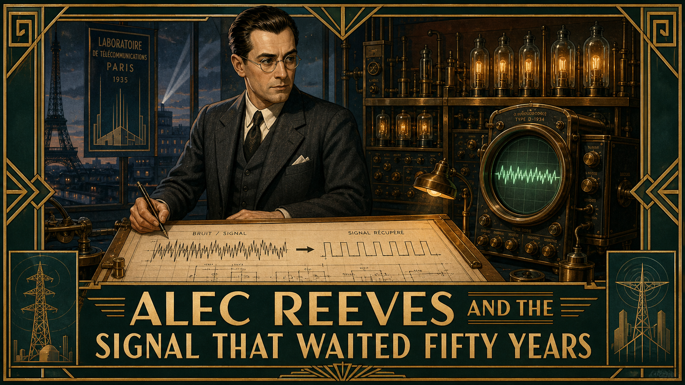

Cover Image Prompt

(This is the Cover Image. Do not include this label in the image.)
Generate a wide-landscape 16:9 cover image blending Space Age (1957-1975) technical
illustration with mid-century American workplace realism. A composed Black woman in her
mid-twenties stands at the center, warm brown complexion, dark hair set in neat short curls,
wearing a tailored powder-blue blouse and knee-length pencil skirt typical of 1955. In one hand
she holds a deck of punch cards; behind her, faintly overlaid like a technical blueprint, is the
outline of an upper-stage rocket with fins and an engine bell, alongside ghosted rows of
handwritten calculation tables and a slide rule. She stands in front of a large multi-pane
research-building window, a hint of hangars and a wind tunnel silhouette visible outside in soft
dawn light. Her expression is calm, focused, forward-looking. Render the title text "SELF-TAUGHT
AT NASA" across the upper third in a bold period-appropriate mid-century sans-serif typeface,
and beneath it in smaller matching type "Annie Easley's Path to Programming."
Color palette: cosmic blues, warm sepia and brass for the earlier "human computer" elements,
clean white and silver technical-illustration linework for the rocket overlay. Emotional tone:
quiet determination and forward momentum. Do not render any real government agency insignia,
seals, or logos anywhere in the image. Generate the image immediately without asking clarifying
questions.

Narrative Prompt

This story follows Annie Easley (1933-2011), an American mathematician and computer scientist,
across her life from segregated Birmingham, Alabama in the late 1940s through a thirty-four-year
career (1955-1989) at a federal aeronautics and space research laboratory in Cleveland, Ohio,
to her posthumous recognition in the 2010s and 2020s. The central theme is self-taught technical
mastery at mid-career: when the hand-calculation work she was hired to do began to be replaced
by electronic computers, she chose to teach herself to program those machines rather than be
displaced by them, and spent the following decades writing code for energy-research and rocket
guidance software. A secondary theme is quiet, persistent resistance to institutional bias —
she describes her own approach as "if I can't work with you, I will work around you." Render
Panels 1-3 (Birmingham and New Orleans, late 1940s-1954) in a warm, muted mid-century American
realist style: worn brick, wood-frame houses, analog period clothing. Render Panels 4-9
(1955-1980s, the research laboratory years) in a blend of Space Age (1957-1975) NASA-style
technical illustration — clean instrumentation, punch cards, control-room dials, rocket
schematics rendered like engineering blueprints — with mid-century workplace realism for the
human figures and offices. Panel 10 (1989 retirement through posthumous honors in 2015 and
2021) should shift to a slightly cooler, more contemporary palette while keeping the same
technical-illustration linework. Character consistency note: Annie Easley should be drawn
consistently across all panels as a Black woman of average height and slender build, warm brown
complexion, and an expressive, composed face. In the earliest panels (teens,~1948) she has
neatly braided or short natural hair; from her hiring in 1955 through the 1960s she wears her
hair in short, neat curls with tailored blouses, cardigans, and knee-length skirts; by the 1970s
she wears round or cat-eye eyeglasses and, reflecting her own account of adopting pantsuits once
they became acceptable office wear, tailored pantsuits; by the 1980s-final panel she appears
visibly older, hair graying at the temples, still wearing eyeglasses and professional attire.
Do not render any real government agency insignia, seals, patches, or logos as visible text or
graphics in any panel; describe the research laboratory generically (a federal aeronautics and
space research campus with hangars, wind tunnels, and office buildings) rather than depicting
official markings. Depict the era's segregation only through setting details (separate building
entrances, a marked streetcar section) rendered factually and without graphic or inflammatory
content.

### Prologue – The Computer Who Was Not a Machine

In 1955, "computer" was still a job title, not a machine — and the young woman who drove out to a
research laboratory on the edge of Cleveland to apply for one of those jobs had no way of knowing
she would spend the next thirty-four years watching that word change meaning entirely underneath
her. Annie Easley was hired to calculate by hand, one of only four Black employees among roughly
twenty-five hundred people at the lab. Within a few years, the machines she had been hired to
outpace began arriving in the building. Most of the people who did her kind of work assumed their
jobs were ending. Easley decided, on her own initiative and largely on her own time, to learn how
to run the machines instead. What she taught herself would end up guiding rockets.

## Panel 1: A Mother's Instruction

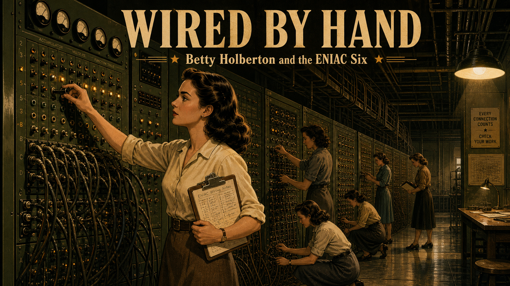

Image Prompt

(This is Panel 01. Do not include the panel number in the image.)
I am about to ask you to generate a series of images for a graphic novel. Please make the
images have a consistent style and consistent characters. Do not ask any clarifying questions.
Just generate the image immediately when asked.

Please generate a 16:9 image in a warm, muted mid-century American realist style depicting
panel 1 of 10. The scene shows a serious, bright-eyed Black girl of about fifteen, hair neatly
braided, wearing a simple hand-sewn cotton dress with a small collar, sitting at a worn wooden
kitchen table doing homework by lamplight in a modest wood-frame house in Birmingham, Alabama,
around 1948. Her mother, a slim Black woman in her late thirties wearing a plain patterned
housedress and apron, stands beside her, one hand resting on the girl's shoulder, speaking to
her with a warm but firm expression. On the table: a stack of schoolbooks, a rosary or small
prayer card suggesting the parochial school she attends, a chipped teacup, and a single bare
lightbulb overhead. Through the window behind them, a segregated streetcar with a marked rear
section passes on the street outside, rendered factually and without emphasis. The color
palette is warm amber lamplight against deep indigo evening shadows outside. The emotional tone
is tender, determined encouragement. Include at least six specific visual details: a chalk
slate propped against the wall, a worn family Bible on a side shelf, a patched curtain, the
girl's ink-stained fingers, a calendar showing 1948, and a pair of well-worn work shoes by the
door. Generate the image immediately without asking clarifying questions.

Annie Easley grew up in Birmingham, Alabama, in a Jim Crow city that offered Black children
separate and deliberately unequal schools, libraries, and opportunities. Raised largely by her
mother alone, she heard one instruction repeated so often she could recite it for the rest of
her life: *you can be anything you want to be, but you have to work at it.* Her mother enrolled
her in a parochial school starting in the fifth grade, believing it offered a better education
than the segregated public schools nearby, and Easley rewarded that faith by graduating
valedictorian of her high school class. She did not yet know what career she wanted. She only
knew, with total conviction, that she intended to have one.

## Panel 2: The Pharmacy That Wasn't

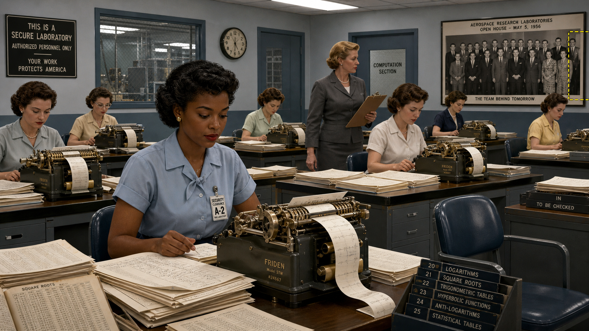

Image Prompt

(This is Panel 02. Do not include the panel number in the image.)
Please generate a 16:9 image in the same warm, muted mid-century American realist style
depicting panel 2 of 10. Make the character consistent with the prior panel, aged forward. Show
a composed young Black woman of about twenty, hair in short neat curls, wearing a fitted
1950s-style dress with a narrow belt, standing on a quiet residential sidewalk in Cleveland,
Ohio, in 1954, looking up at a shuttered storefront building with a faded, unreadable sign and
a hand-lettered "CLOSED" placard in the window where a pharmacy school once operated. She holds
a folded letter and a small leather satchel of textbooks. A moving truck partially unloaded
sits at the curb behind her, suggesting a recent move. Bare trees and a gray overcast Midwestern
sky frame the scene. The color palette is cooler and grayer than the Birmingham panel, muted
blues and browns. The emotional tone is quiet disappointment giving way to resolve. Include at
least six specific visual details: a "FOR LEASE" sign in a neighboring window, cracked pavement,
a lamppost with a torn flyer, her wedding ring visible on her hand, a distant church steeple,
and dead leaves gathered against the curb. Generate the image immediately without asking
clarifying questions.

After two years studying pharmacy at a university in New Orleans, Easley married and relocated
with her husband to Cleveland, fully intending to finish her degree there. She arrived to find
that the city's pharmacy school had shut down, and the nearest alternative, in Columbus, was far
enough away that a young married woman of her era was not expected to move for it alone. It was
a real setback, but not, as she would later insist, a defeat. She simply had to figure out, from
scratch, what came next — and a few months later, an ordinary local newspaper handed her the
answer.

## Panel 3: Two Weeks Later, She Was Working

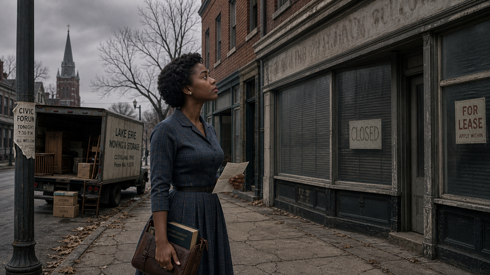

Image Prompt

(This is Panel 03. Do not include the panel number in the image.)
Please generate a 16:9 image in a style now beginning to blend Space Age technical illustration
with mid-century realism, depicting panel 3 of 10. Make the character consistent with prior
panels. Split the composition into two connected moments: on the left, the same young woman
sits at a kitchen table in 1955, pointing excitedly at a small newspaper article (text
illegible/generic) describing twin sisters who work as human "computers"; on the right, she
stands just inside the lobby of a federal aeronautics research laboratory, being greeted by a
poised older white woman supervisor in a tailored suit, government identification badges
visible on both without any legible insignia. Beyond the lobby's glass doors, hangars and a
wind-tunnel structure are visible under a bright Cleveland sky. The color palette shifts toward
cooler cosmic blues and clean whites on the right side, warm domestic tones on the left. The
emotional tone is sudden opportunity and quiet pride. Include at least six specific visual
details: a rotary telephone on the kitchen table, a percolator on the stove, a lobby reception
desk with a visitor sign-in book, a wall clock reading mid-morning, a framed aerial photograph
of the research campus on the lobby wall, and her modest single strand of pearls. Generate the
image immediately without asking clarifying questions.

The article was about twin sisters who worked as "human computers" at a federal aeronautics
laboratory on the edge of the city, and it described exactly the kind of exacting, mathematical
work Easley wanted. She drove out the next day, applied, and within two weeks was hired — one of
only four Black employees among roughly twenty-five hundred people at the laboratory in 1955.
She was promised the pay grade of a more experienced hire and given a lower one instead, an early
lesson in exactly the kind of quiet unfairness she would spend the next three decades refusing to
let stop her. She did not come, she would say later, to be a pioneer. She came to work.

## Panel 4: Clonk, Clonk, Clonk

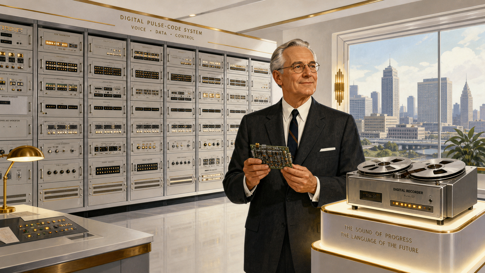

Image Prompt

(This is Panel 04. Do not include the panel number in the image.)
Please generate a 16:9 image in a blended Space Age technical-illustration and mid-century
workplace realist style depicting panel 4 of 10. Make the character consistent with prior
panels. Show a room full of desks inside a secure laboratory building in 1956, six or seven
women in period office attire operating large electromechanical desk calculators that print
tape as they run, each surrounded by stacks of handwritten calculation sheets, logarithm and
square-root reference tables open beside them. The familiar young Black woman sits at one desk
among mostly white coworkers, focused and composed, her own stack of papers neatly organized.
On a nearby wall, a group photograph from a laboratory open house is displayed, and — a subtle
detail — she is visibly missing from the edge of the frame where she once stood, cropped out.
The color palette is clean institutional blue-gray with warm brass accents from the calculator
machinery. The emotional tone is focused diligence undercut by a quiet, unspoken slight.
Include at least six specific visual details: a security-clearance badge clipped to her blouse,
a rack of numbered reference tables, a wall-mounted clock, a mechanical calculator mid-clatter
with paper tape spilling out, a supervisor walking past with a clipboard, and a single empty
chair suggesting turnover. Generate the image immediately without asking clarifying questions.

The job Easley had signed up for was arithmetic, performed entirely by hand and by machine-aided
calculator, for engineers who needed numbers they could not get any faster way. She and the other
"computers" cranked answers out of desk-sized mechanical calculators, looked up logarithms and
square roots in printed tables, and recorded results by hand for the scientists testing reactors,
wings, and engines down the hall. She felt no need to announce herself as a trailblazer; she simply
did the work and did it well. But she noticed things — like being quietly cropped out of a group
photograph displayed at a company open house — and filed them away without letting them slow her
down. If she couldn't work with somebody's prejudice, she decided, she would work around it.

## Panel 5: Teaching Herself the Machine

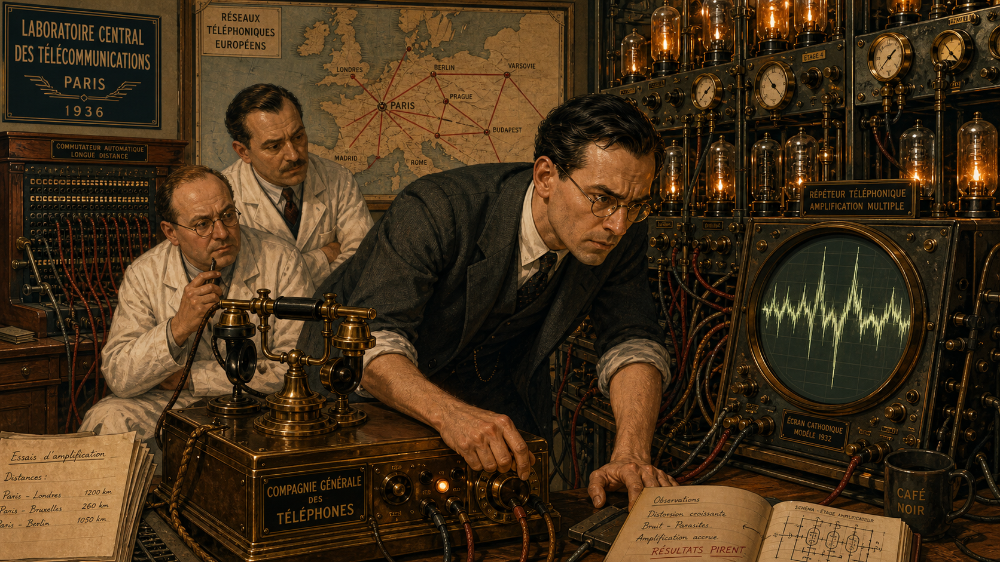

Image Prompt

(This is Panel 05. Do not include the panel number in the image.)
Please generate a 16:9 image in a Space Age technical-illustration style depicting panel 5 of 10.
Make the character consistent with prior panels, now in her mid-twenties. Show her alone at
her desk after hours in 1959, lab lights dimmed except for her desk lamp, feeding a deck of
punched cards into a room-filling early electronic computer studded with blinking indicator
lights and reel-to-reel tape drives visible through an open access panel. An open technical
manual with hand-underlined passages sits beside her, along with a hand-labeled deck of cards
tied with string. Through a window behind the machine, a satellite trail streaks across a night
sky, a subtle nod to the era's space race. The color palette is deep cosmic blue and silver,
punctuated by warm amber indicator lights. The emotional tone is quiet, self-directed
determination — a person choosing to master a machine rather than fear it. Include at least six
specific visual details: a coffee cup gone cold, a pencil tucked behind her ear, loose punch
cards fanned across the desk, a wall-mounted card sorter, her cardigan draped over the chair
back, and a small desk clock reading past nine at night. Generate the image immediately without
asking clarifying questions.

When the first electronic computers arrived at the laboratory in the late 1950s, most of the
human "computers" around Easley assumed the machines had come to replace them. Many did lose
their footing in the transition. Easley chose a different response: she taught herself to run
the new machines, learning the programming languages SOAP and FORTRAN largely on her own
initiative, staying late with manuals when no formal training existed to hand it to her. The
technology that seemed built to make her obsolete became, instead, the thing she mastered before
almost anyone told her to.

## Panel 6: From Computer to Coder

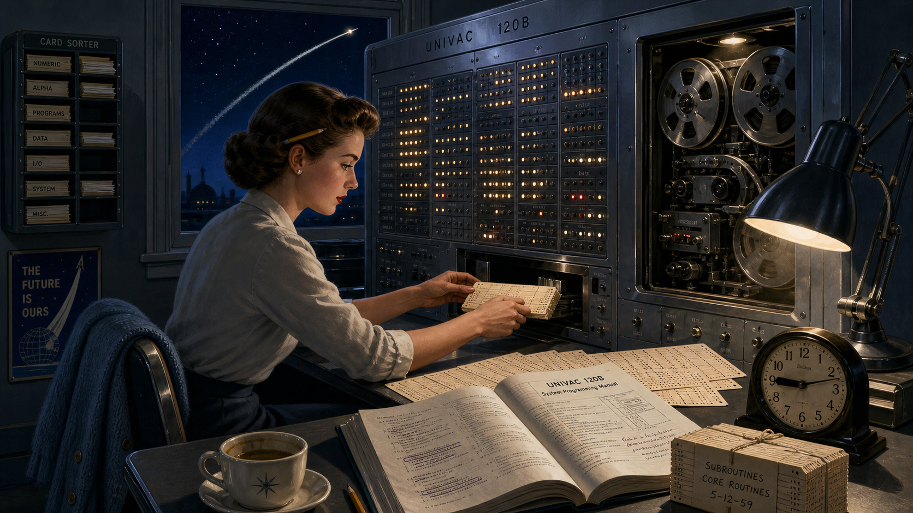

Image Prompt

(This is Panel 06. Do not include the panel number in the image.)
Please generate a 16:9 image in a Space Age technical-illustration style depicting panel 6 of 10.
Make the character consistent with prior panels, now a confident professional in her early
thirties. Show her standing at a keypunch machine in a mid-1960s laboratory computing room,
handing a completed deck of punched cards to a machine operator, while behind her a large wall
chart shows a stylized cutaway diagram of a rocket's upper stage alongside handwritten
energy-conversion formulas on a rolling chalkboard. Two engineers in shirtsleeves confer over a
printout nearby. Her identification badge and a slide rule clipped to her blouse pocket are
visible. The color palette is bright, clean institutional white and steel-blue with warm brass
machine accents. The emotional tone is quiet professional confidence, someone fully in command
of her craft. Include at least six specific visual details: reels of magnetic tape on a rack,
a card-sorting machine humming in the background, a stack of green-and-white striped printout
paper, her cat-eye reading glasses pushed up into her hair, a coffee percolator on a side table,
and a wall calendar marking a launch date. Generate the image immediately without asking
clarifying questions.

Fluency in the new machines reshaped Easley's entire career. She moved from calculating by hand
to writing the code herself, developing programs used in energy-conversion research and, before
long, joining the team supporting the Centaur upper-stage rocket — a high-energy stage whose
software would eventually help launch decades of national and commercial missions. The transition
that had ended other careers at the laboratory became the foundation of hers.

## Panel 7: Paying Her Own Way

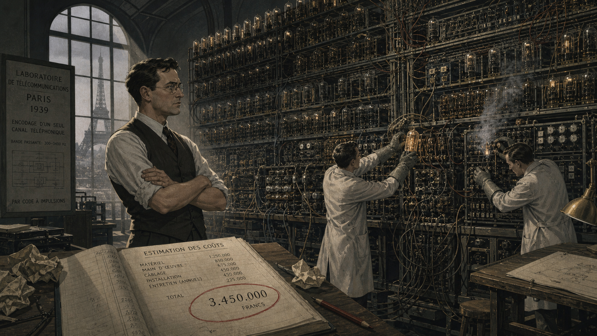

Image Prompt

(This is Panel 07. Do not include the panel number in the image.)
Please generate a 16:9 image in a blended Space Age and mid-century realist style depicting
panel 7 of 10. Make the character consistent with prior panels, now in her late thirties,
wearing round wireframe glasses and a tailored 1970s pantsuit. Split the composition: in the
foreground, she sits in a university night-class lecture hall in Cleveland, notebook open,
listening intently among a handful of other tired-looking working adults under fluorescent
light, a wall clock reading eight in the evening; faintly visible through a doorway behind her,
a small office scene shows a seated male supervisor at a laboratory desk shaking his head over a
tuition-aid form. The color palette is cooler fluorescent white and gray-blue in the classroom,
warmer institutional tones in the background office. The emotional tone is tired but unbroken
resolve. Include at least six specific visual details: a thermos and a paper-bagged sandwich on
her desk, a stack of math textbooks, a chalkboard behind the lecturer with calculus notation, a
handbag with a bus pass visible, other adult students in work clothes, and a wall clock. Generate
the image immediately without asking clarifying questions.

In the 1970s, still working full time, Easley enrolled at Cleveland State University to finish
the mathematics degree her pharmacy plans had never let her start. She took classes in the
evenings and then, later, during the day, sometimes carrying a full course load on top of a
forty-hour work week. When she asked her supervisor about the tuition assistance the laboratory
had extended to other employees taking job-related courses, he told her flatly that it wasn't
available to her level of employee — an answer that turned out to be untrue, and one he never
corrected. She paid for her own courses, eventually took unpaid leave to finish faster, and
earned her degree anyway. Nobody was going to teach her this either, so she taught it to herself
the same way she had taught herself FORTRAN: on her own time, at her own expense, on her own
terms.

## Panel 8: The Rocket That Wouldn't Fail

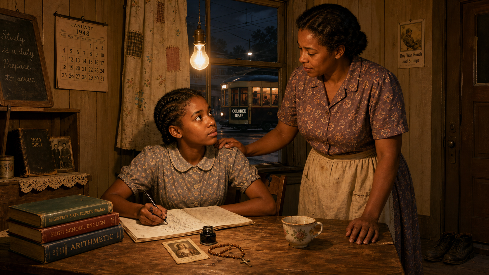

Image Prompt

(This is Panel 08. Do not include the panel number in the image.)
Please generate a 16:9 image in a Space Age technical-illustration style depicting panel 8 of 10.
Make the character consistent with prior panels, now in her forties, composed and
authoritative. Show her inside a launch-support control room in the late 1970s, seated at a
console covered in dials, toggle switches, and a small monochrome monitor displaying scrolling
trajectory data, headset around her neck, a rolled printout in hand. Through a large window
behind the console, a distant rocket stands illuminated on a launch pad against a pre-dawn sky,
rendered as a generic uncrewed upper-stage rocket without any visible agency markings. Other
console operators work at neighboring stations. The color palette is deep pre-dawn indigo
outside the window against warm amber console lighting inside. The emotional tone is tense,
focused readiness. Include at least six specific visual details: a countdown clock on the wall,
a coiled telephone handset, coffee cups lined up along the console edge, a laminated procedures
checklist, her identification lanyard, and condensation on the window from the cool night air.
Generate the image immediately without asking clarifying questions.

Across the 1970s and 1980s, the code Easley and her colleagues wrote for the Centaur program
helped carry payloads beyond Earth orbit on mission after mission, a track record of reliability
that made the upper stage the workhorse behind decades of scientific and commercial launches.
She would later say she felt real pride in that work, describing the mood at the laboratory
during the space program's biggest years with a phrase she used often: *together we can do it.*
It was never a solo achievement, in her telling — but her programming was part of what made it
possible.

## Panel 9: Opening the Next Door

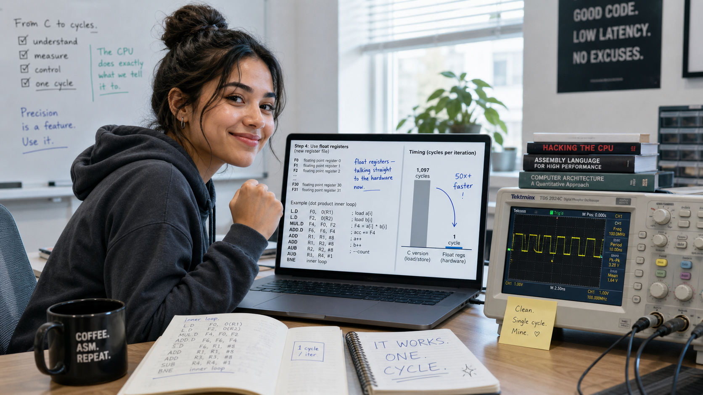

Image Prompt

(This is Panel 09. Do not include the panel number in the image.)
Please generate a 16:9 image in a Space Age technical-illustration style depicting panel 9 of 10.
Make the character consistent with prior panels, now in her early fifties, hair beginning to
show gray at the temples, wearing round glasses and a professional blazer. Show her in a
laboratory battery-testing bay in the early 1980s, standing beside a small experimental
battery-powered test vehicle connected to diagnostic equipment and a bank of large industrial
batteries, clipboard in hand, reviewing data with a younger colleague. Through a doorway behind
her, a second, smaller scene shows her seated across a desk from a distressed coworker in a
plain office, a box of tissues and an open folder between them, suggesting her role listening to
workplace grievances. The color palette is cool industrial gray and steel blue in the battery
bay, warmer and softer tones in the office vignette. The emotional tone is capable, empathetic
authority. Include at least six specific visual details: exposed battery cells with visible
terminals, a voltage-and-current readout gauge, safety goggles hanging from her clipboard, a
hand-lettered "TEST IN PROGRESS" sign, a filing cabinet labeled by year in the office scene, and
a box of programs from the laboratory's community outreach efforts on a side shelf. Generate the
image immediately without asking clarifying questions.

Easley's later projects turned toward energy storage, running the computations behind studies of
battery life and performance for early battery-powered vehicles — research that anticipated the
hybrid and electric cars that would not reach ordinary driveways for another generation. In these
same years she also became an Equal Employment Opportunity counselor, sitting with coworkers,
women, older employees, and fellow Black staff among them, who came to her with the kinds of
complaints she herself had once quietly filed away and worked around. She could not undo what had
happened to her. She could make sure the next person did not have to solve it alone.

## Panel 10: The Crater and the Hall of Fame

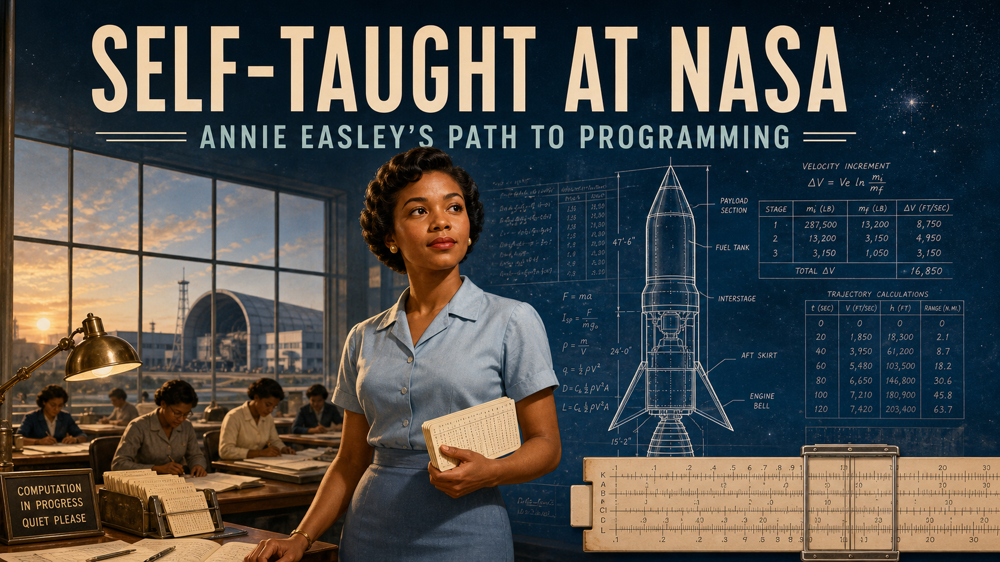

Image Prompt

(This is Panel 10. Do not include the panel number in the image.)
Please generate a 16:9 image in a style that shifts to cooler, contemporary technical
illustration while keeping the same clean linework as prior panels, depicting panel 10 of 10.
Make the character recognizable and consistent with prior panels' likeness. Compose the image in
two blended halves connected by a soft gradient: on the left, render her as she appeared near
retirement in 1989 — gray-haired, glasses, warm smile, being applauded by a small group of
diverse coworkers at a modest office retirement gathering with a hand-lettered congratulations
banner and a small cake. On the right, render a commemorative museum-style display case
containing a formal portrait photograph of her alongside a small engraved plaque, and above it,
seamlessly blending into a dark starfield, a detailed grayscale telescopic view of the Moon's
cratered surface with one labeled crater subtly highlighted, unlabeled with any real agency
insignia. The color palette transitions from warm retirement-party amber on the left to cool
silver and deep space-navy on the right. The emotional tone is warm closure blending into quiet,
enduring honor. Include at least six specific visual details: a hand-lettered "CONGRATULATIONS"
banner, a modest sheet cake, a framed photograph in the display case, the plaque's engraved
text rendered as generic elegant lettering, individual crater rims visible on the lunar surface,
and soft starlight reflected on the display case glass. Generate the image immediately without
asking clarifying questions.

Easley retired in 1989 after thirty-four years, having gone from calculating rocket trajectories
by hand to writing the software that helped fly them. She died in 2011, but her laboratory did
not let her story end there: in 2015 she was inducted into its inaugural hall of fame, honoring
the employees who had shaped its first century, and in 2021 the International Astronomical Union
approved the name Easley for a crater on the Moon — a small, permanent marker, fittingly out among
the hardware her own code had once helped send there.

### Epilogue – What Made Easley Different?

Annie Easley was not hired to be a programmer, an equal employment counselor, or a symbol of
anything. She was hired to add, subtract, multiply, and divide by hand, at a moment when almost
no one thought to ask what she might do once the machines arrived. What made her different was
not that she saw the machines coming — everyone at the laboratory saw them coming — but that she
treated their arrival as an assignment rather than a threat, and taught herself to meet it without
waiting for anyone's permission or curriculum. That same instinct carried her through a math
degree earned at night, through supervisors who quietly withheld support she was owed, and into a
role helping the next generation of employees get treated more fairly than she had been. Nothing
about her path was handed to her. All of it was worked for, exactly as her mother had told her it
would have to be.

| Challenge | How Easley Responded | Lesson for Today |
|---|---|---|
| Segregated schools and a Jim Crow city offering Black children unequal resources | Excelled anyway, graduating valedictorian, carrying her mother's insistence that ability was not limited by circumstance | Circumstances can limit opportunity, but they do not limit how seriously you take your own preparation |
| Electronic computers arrived and threatened to make her hand-calculation job obsolete | Taught herself SOAP and FORTRAN largely on her own initiative, with no formal training program provided | When a new tool threatens to replace your skill, the fastest path forward is usually to master the tool yourself |
| A supervisor wrongly denied her tuition support for job-related coursework | Paid her own way, kept taking classes, and eventually took unpaid leave to finish her degree regardless | Institutional gatekeeping is a real obstacle, not a verdict — route around it and keep going |
| Quiet, persistent bias throughout a 34-year career, including being excluded from a workplace photograph | Refused to let it stop her, later became an EEO counselor to help others navigate exactly that kind of treatment | Turn your own hard-won experience into infrastructure that makes the path easier for whoever comes next |

### Call to Action

This course opens with a promise: you need no prior experience with FFTs, digital signal
processing, or assembly language, and Lab 1 assumes only that you own a computer. That promise
exists because someone has to be the first person in the room who does not already know the
material — and Annie Easley proved, at a moment when the machines themselves were brand new, that
teaching yourself the hardware from zero is not a barrier to a career in this field. It is the
job itself.

---

*"My head is not in the sand. But my thing is, if I can't work with you, I will work around you."*
—Annie Easley

*"I'm out here to do a job and I knew I had the ability to do it, and that's where my focus was."*
—Annie Easley

---

## References

1. [Wikipedia: Annie Easley](https://en.wikipedia.org/wiki/Annie_Easley) - Biography covering her education, NACA/NASA career, Centaur rocket work, and posthumous honors.
2. [Wikipedia: National Advisory Committee for Aeronautics](https://en.wikipedia.org/wiki/National_Advisory_Committee_for_Aeronautics) - Background on the NACA, the agency that hired Easley in 1955 and became NASA in 1958.
3. [Wikipedia: Centaur (rocket stage)](https://en.wikipedia.org/wiki/Centaur_(rocket_stage)) - Technical background on the Centaur upper-stage rocket whose flight software Easley helped develop.
4. [NASA: Annie Easley, Computer Scientist](https://www.nasa.gov/history/annie-easley-computer-scientist/) - NASA's own biography of Easley, including her career timeline and quotes.
5. [Encyclopaedia Britannica: Annie Easley](https://www.britannica.com/biography/Annie-Easley) - Overview of Easley's life, career, and contributions to NASA's rocket and energy research programs.
