# Wired by Hand: Betty Holberton and the ENIAC Six

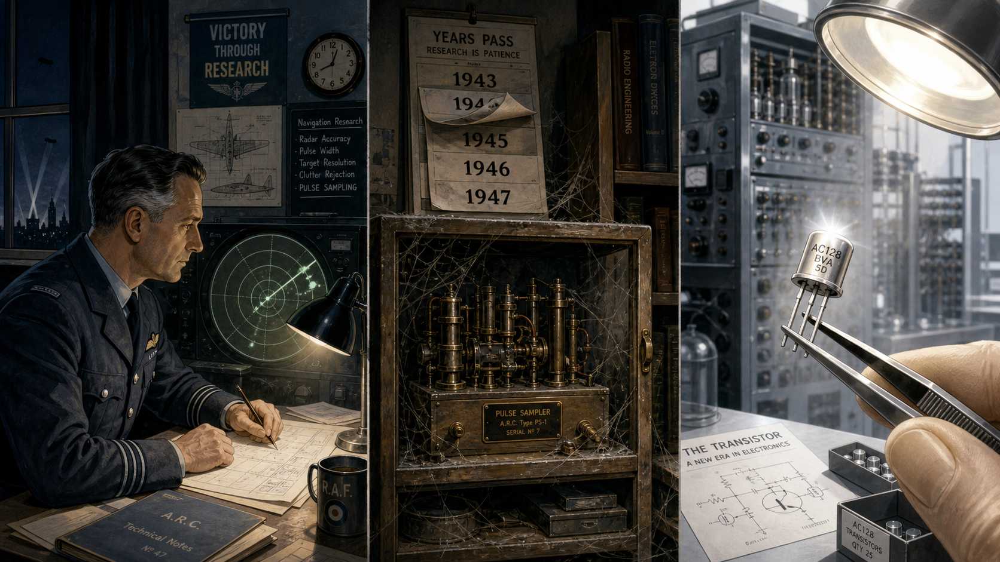

Cover Image Prompt

(This is the Cover Image. Do not include this label in the image.)
Please generate a wide-landscape 16:9 cover image for this story in a warm, restrained
1940s American illustrated style, like a period graphic-novel poster rather than a photo.
Show a focused young woman in her late twenties with dark wavy hair pinned back, wearing a
belted 1940s blouse and skirt with sleeves rolled to the elbow, standing at a towering wall
of room-height cabinets covered in dials, toggle switches, and thick bundles of cable, one
hand mid-motion setting a switch, a clipboard of handwritten wiring notes tucked under her
other arm. Behind her, partly in shadow, four or five other young women in similar period
dress work along the same wall of cabinets, some kneeling to adjust plug-in cables near the
floor. The room is vast, dim, and industrial, with exposed overhead cable trays and a single
bright work lamp illuminating the foreground. Render the title text "WIRED BY HAND" at the
top in a bold period-appropriate serif typeface, like 1940s magazine lettering, and beneath
it in smaller type "Betty Holberton and the ENIAC Six." Color palette: warm amber cabinet
glow, deep olive-green machine housings, and muted cream tones against dark shadow. Emotional
tone: quiet concentration and competence, a team absorbed in exacting, demanding work.
Generate the image immediately without asking clarifying questions.

Narrative Prompt

This story is set in the United States between 1942 and 1997, centered on Philadelphia in
1945-1946 and later on the East Coast computing industry. The central figures are six young
women with mathematics degrees — recruited during World War II as human "computers" to
calculate artillery ballistics by hand, then selected in 1945 to become the first programmers
of a room-filling electronic calculating machine, with Frances "Betty" Holberton (born Betty
Snyder) as the throughline. The themes are programming with zero abstraction between the
programmer and the physical hardware, exacting and undervalued technical labor, and the long
delayed correction of a historical record that initially erased the women who did the work.
Render the story in a warm, restrained 1940s American illustrated style transitioning to a
cleaner mid-century modern style for panels set after 1950: period professional women's
attire (blouses, belted skirts, cardigans, low pumps, hair pinned or waved), heavy
industrial-scale electronic equipment with vacuum tubes, dials, toggle switches, and thick
cable bundles rather than anything anachronistically sleek or digital. Character consistency
note: Betty Holberton should be drawn consistently across panels as a woman with dark wavy
hair, pinned back or in a period style, aging naturally from her late twenties in early panels
to her fifties by the final panels, always in tasteful period-appropriate professional dress.
Her five colleagues should appear as a consistent ensemble of young women in similar period
dress with varied hair color and styles so they read as distinct individuals across panels.
Do not depict any real named individuals' faces from photographs; render all characters as
original illustrated interpretations. Do not depict military combat, weapons fire, or graphic
violence in any panel — the wartime setting should be conveyed through uniforms, offices, and
mood rather than battle imagery.

### Prologue – The Machine With No Instructions

In the fall of 1945, a room-sized electronic machine sat inside a university engineering
building in Philadelphia, built to solve a problem that no longer existed — the war it was
designed for had just ended. It had no operating manual, because no one had ever operated
anything like it. It had no programming language, because the concept did not exist yet. What
it had were six young women with mathematics degrees, a stack of logical wiring diagrams, and
a general's order to make the thing calculate. What they figured out in that room over the
following months — how to reason directly about a machine's hardware with nothing standing
between them and it — would not be recognized as the birth of computer programming for nearly
forty years.

## Panel 1: The Computers Before the Machine

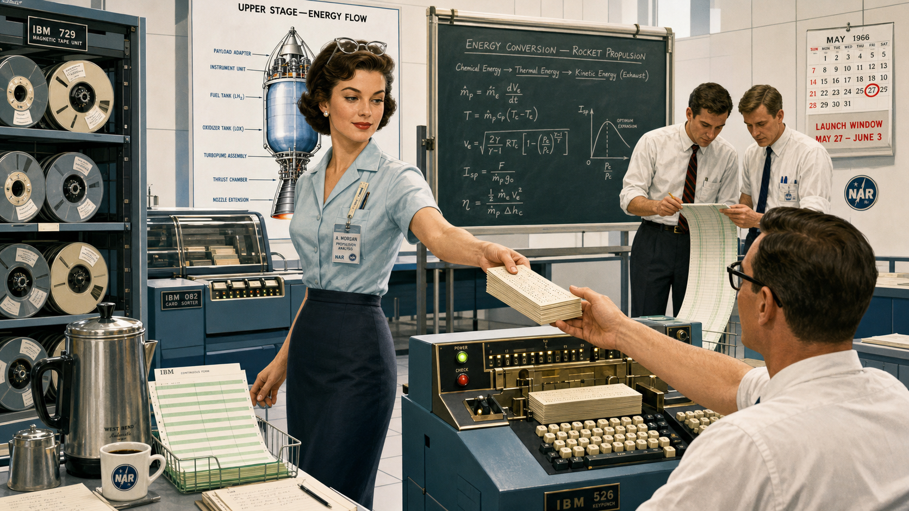

Image Prompt

(This is Panel 01. Do not include the panel number in the image.)
I am about to ask you to generate a series of images for a graphic novel. Please make the
images have a consistent style and consistent characters. Do not ask any clarifying questions.
Just generate the image immediately when asked.

Please generate a 16:9 image in a warm 1940s American illustrated style depicting panel 1 of
10. The scene shows a large office room in a university engineering building in 1943
Philadelphia, filled with rows of desks where a dozen young women in modest period blouses and
skirts sit hunched over mechanical desk calculators, each surrounded by stacks of paper
covered in dense columns of handwritten numbers representing artillery trajectory tables. One
woman in the foreground, dark-haired and focused, cranks the handle of her calculator while
comparing figures against a printed firing table propped against a book. Late-afternoon light
slants through tall factory-style windows. The color palette is warm sepia, cream, and muted
olive against pale plaster walls. The emotional tone is quiet, grinding diligence — essential
work that is also exhausting and repetitive. Include at least six specific visual details: a
wall clock reading past five o'clock, a supervisor's clipboard hanging by the door, a
half-finished cup of tea gone cold, pencils worn down to stubs, a stack of completed trajectory
tables tied with string, and a service pin or ribbon on one woman's blouse. Generate the image
immediately without asking clarifying questions.

Long before anyone called it computer programming, it was called "computing," and it was done
by hand. During the Second World War, the U.S. Army needed thousands of ballistics tables
telling gunners exactly how a shell would fly under a given set of conditions, and calculating
even one trajectory by hand took a trained mathematician the better part of a day. The Army
hired roughly two hundred women with mathematics degrees to do this work at a Philadelphia
engineering school, paying them as clerical "subprofessionals" even though men with identical
qualifications were classified as professional staff. It was exacting, essential labor, and it
was also punishingly slow — which was precisely the problem an ambitious new machine down the
hall was being built to solve.

## Panel 2: Six Names, No Explanation

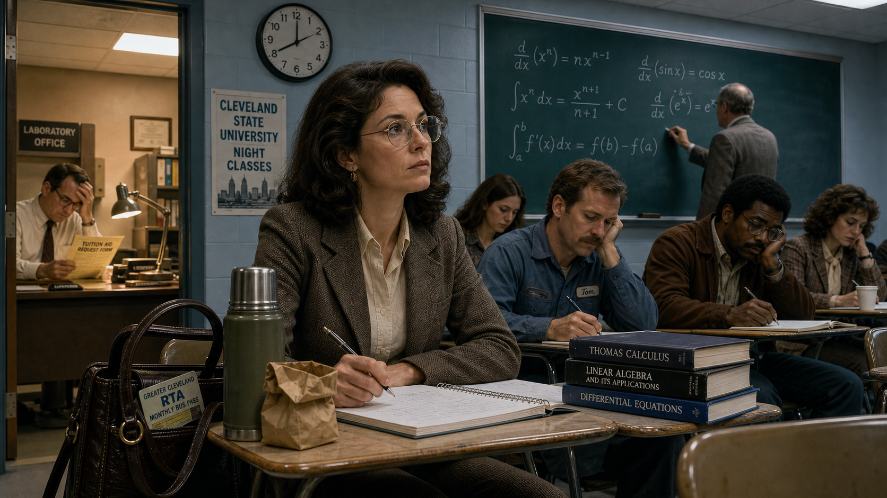

Image Prompt

(This is Panel 02. Do not include the panel number in the image.)
Please generate a 16:9 image in the same warm 1940s American illustrated style depicting panel
2 of 10. Make the characters and style consistent with the prior panel. The scene shows six
young women in period blouses and skirts standing in a loose line in a plain administrative
office in 1945, being addressed by an older uniformed Army officer at a desk who holds a
clipboard of names, while a stern-looking security clerk stamps a folder to one side. Through
a half-open door behind them, a fragment of a large machine room is visible, but a soldier
stands blocking most of the doorway. The color palette is muted khaki, cream, and gray-green.
The emotional tone is guarded curiosity and quiet apprehension, six people being asked to
volunteer for something undefined. Include at least six specific visual details: identification
badges being handed out, a "RESTRICTED" stamp on a folder, a wall map of the building with one
wing shaded off-limits, the officer's reading glasses, a typewriter on a side desk, and a
calendar showing June 1945. Generate the image immediately without asking clarifying
questions.

In the spring of 1945, six of these women were pulled from the calculating pool and told almost
nothing except that they had been selected for a new assignment. They were not told what the
machine down the hall actually was, what it was ultimately for, or even given full clearance to
see all of it at once — wartime secrecy still applied to a project that had outlived the war
that justified it. Kathleen McNulty, Frances Bilas, Betty Jean Jennings, Ruth Lichterman, Marlyn
Wescoff, and Betty Snyder — the woman who would later marry and take the name Holberton — simply
understood that they were expected to make an enormous, temperamental machine do something no
machine had done before. No one, including the engineers who built it, could tell them exactly
how.

## Panel 3: Reading the Machine Like a Book

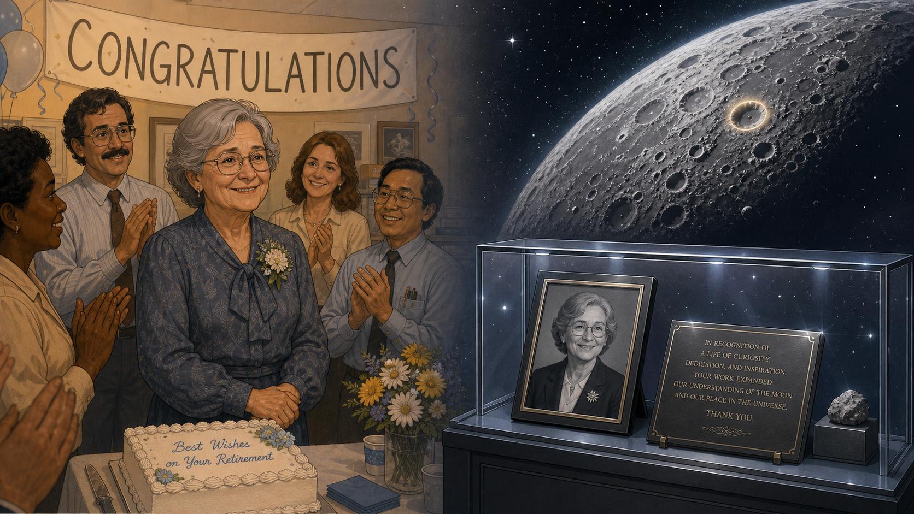

Image Prompt

(This is Panel 03. Do not include the panel number in the image.)
Please generate a 16:9 image in the same warm 1940s American illustrated style depicting panel
3 of 10. Make the characters and style consistent with prior panels. The scene shows two of the
six young women seated at a plain table in a small side room, poring over enormous unrolled
sheets of logical circuit diagrams covered in dense symbols and connecting lines, one woman
tracing a line across the page with a pencil while the other cross-references a second diagram
propped on a nearby easel. No machine is visible in this room — only diagrams, notebooks, and a
single overhead bulb. The color palette is warm cream paper against dim olive-brown walls. The
emotional tone is intense, patient concentration, two people teaching themselves something that
has never been taught before. Include at least six specific visual details: a ruler and
protractor on the table, a cup of pencils in different states of sharpness, handwritten
marginal notes in the diagrams, a small stack of blank notebooks, a thermos of coffee, and
window blinds drawn against evening light. Generate the image immediately without asking
clarifying questions.

With no manual and no precedent, the six women taught themselves the machine from its own
logical wiring diagrams — page after page of circuit-level schematics showing how thousands of
vacuum tubes, switches, and cables were connected. There was no programming language to write
in, because the idea of a programming language did not exist yet. To make the machine compute a
trajectory, they first had to reconstruct, purely by studying the diagrams, what each panel of
switches was actually capable of doing electrically. It was less like learning to use a tool
and more like reverse-engineering the tool's entire nervous system before anyone could use it
at all.

## Panel 4: Wiring the Trajectory

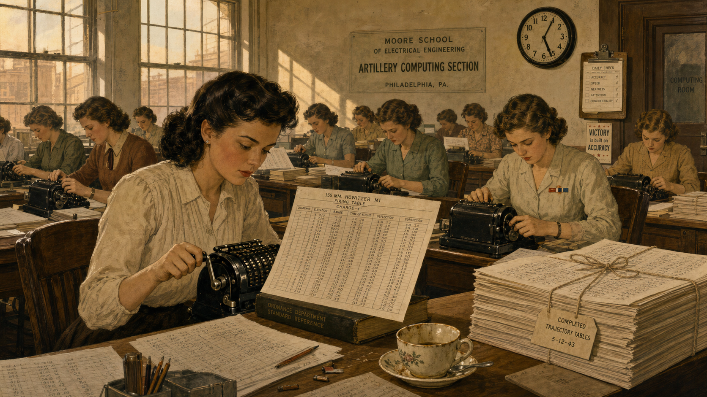

Image Prompt

(This is Panel 04. Do not include the panel number in the image.)
Please generate a 16:9 image in the same warm 1940s American illustrated style depicting panel
4 of 10. Make the characters and style consistent with prior panels. The scene shows a vast
room lined on both sides with towering, human-height cabinets studded with dials, toggle
switches, and rows of numbered sockets, forming a U-shape around the space. Three of the six
women, in period blouses and skirts, work at different points along the cabinets — one standing
on a small step-stool reaching a high panel, one kneeling to plug a thick cable into a low
socket while checking a handwritten setup sheet clipped to a board, one adjusting a row of
dial switches with both hands. Thick bundles of cable snake along the floor and up into
overhead trays. The color palette is warm amber panel-lighting against deep olive-green
cabinet housings and gray concrete floor. The emotional tone is focused physical effort — this
is manual labor as much as intellectual work. Include at least six specific visual details: a
numbered setup sheet on a clipboard, spare cables coiled on a wall hook, a small cart of
labeled cable ends, worn floor tiles beneath the step-stool, a ventilation fan on the ceiling,
and sweat visible at one woman's temple under the panel lights. Generate the image immediately
without asking clarifying questions.

Programming this machine meant something almost nobody today would recognize as programming.
There was no keyboard and no code — only thousands of switches to set by hand and dozens of
thick cables to route between numbered sockets on room-filling panels, each configuration
representing one specific sequence of operations. Setting up a single new calculation could
take the team the better part of a week, climbing stepstools to reach high panels, tracing
setup sheets against physical sockets, and rewiring by feel as much as by diagram. It was
programming with absolutely nothing between the programmer and the hardware — no operating
system, no assembler, no abstraction of any kind to hide behind.

## Panel 5: Chasing the Bad Tube

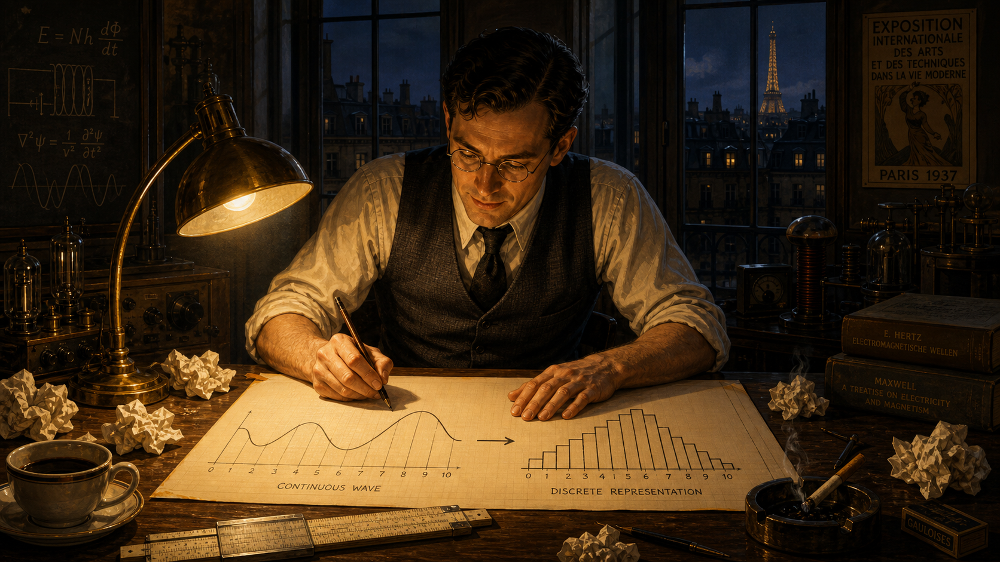

Image Prompt

(This is Panel 05. Do not include the panel number in the image.)
Please generate a 16:9 image in the same warm 1940s American illustrated style depicting panel
5 of 10. Make the characters and style consistent with prior panels. The scene shows two of the
women late at night, working under a single hanging work lamp beside an open panel of the
cabinet with several vacuum tubes exposed, one woman holding a flashlight close to a row of
tubes while the other checks a signal-tracing meter with a probe, both wearing cardigans over
their blouses against the evening chill. A discarded burned-out tube sits on a cloth beside a
box of spares. Tall dark windows show a night sky beyond. The color palette is dim blue-gray
night tones cut by warm lamp and panel light. The emotional tone is tired, methodical
persistence — a small setback treated as routine rather than crisis. Include at least six
specific visual details: a thermos and two empty cups, a logbook open with columns of times
and notes, a wall clock reading past eleven, a spare-tube box with several empty slots, a
cardigan draped over a chair, and a faint wisp of smoke or heat haze near the open panel.
Generate the image immediately without asking clarifying questions.

Machine failures were not the exception in this work; they were the daily condition of it. With
thousands of vacuum tubes running continuously, several burned out on an average day, and a
single bad tube could silently corrupt a calculation without any obvious symptom. The women
learned to trace signals physically through the hardware, probing panel by panel until they
isolated the fault, then adjusting timing and logic by hand and running the calculation again.
Debugging, in this era, was not a software concept at all — it was closer to detective work
conducted with a flashlight and a soldering iron, refined through sheer repetition until the
machine gave a trustworthy answer.

## Panel 6: The Demonstration

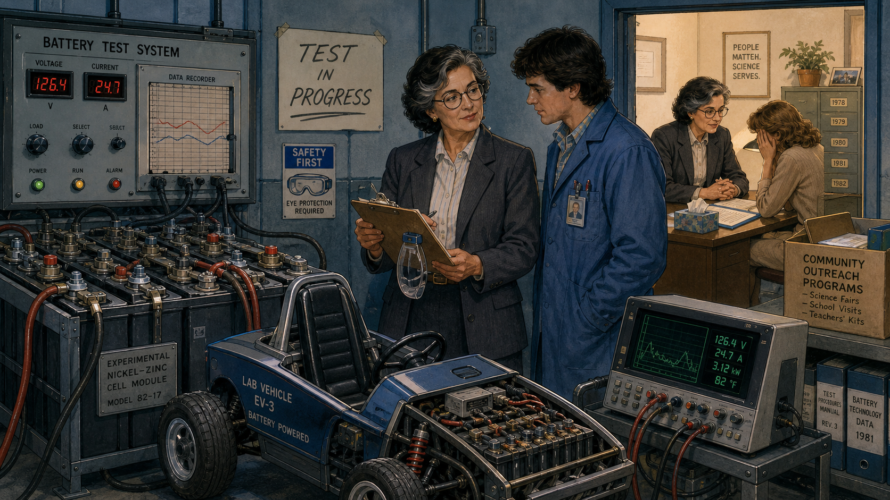

Image Prompt

(This is Panel 06. Do not include the panel number in the image.)
Please generate a 16:9 image in the same warm 1940s American illustrated style depicting panel
6 of 10. Make the characters and style consistent with prior panels. The scene shows a crowded
formal demonstration in February 1946: a semicircle of men in suits and military dress uniforms
watching a wall of blinking panel lights, a uniformed officer at a lectern gesturing toward the
machine, and press photographers with large flash cameras aimed at the equipment. Two of the
six women stand just to the side of the main cabinet, having just finished setting the final
switches, watching the demonstration unfold without being acknowledged by the officer or
photographed by the press, their expressions composed but clearly overlooked. A large clock on
the wall shows the exact moment. The color palette is formal charcoal-gray suits and brass
panel light against the same warm amber cabinet glow as earlier panels. The emotional tone is
triumphant on the surface, but quietly unjust underneath — a public celebration of work whose
authors are standing unnamed at the edge of the room. Include at least six specific visual
details: a bank of blinking indicator lights mid-calculation, flashbulb glare on the cabinet
surfaces, a printed program listing dignitaries' names without the programmers, reporters'
notebooks open and ready, a velvet rope holding back the crowd, and a formal banquet placard
visible through a side doorway that the two women are not walking toward. Generate the image
immediately without asking clarifying questions.

On February 14, 1946, the machine was unveiled to the press and a roomful of dignitaries, and it
performed spectacularly: a trajectory calculation that took a skilled human "computer" about
twenty seconds now finished in well under the time it took the actual shell to reach its target.
Reporters marveled at the machine. What almost none of them mentioned was who had made the
demonstration work. The women who had spent months mastering, wiring, and debugging the machine
were not formally introduced at the dedication, and when the dignitaries adjourned to a
celebratory dinner afterward, the programmers were not invited. Decades later, some who saw the
photographs from that day assumed the women pictured beside the machine were simply models
posing for the cameras — an assumption so persistent it earned its own bitter nickname, the
"refrigerator ladies," as if they had been placed next to the machine the way a model might pose
beside a new kitchen appliance in an advertisement.

## Panel 7: Building the Next Machine

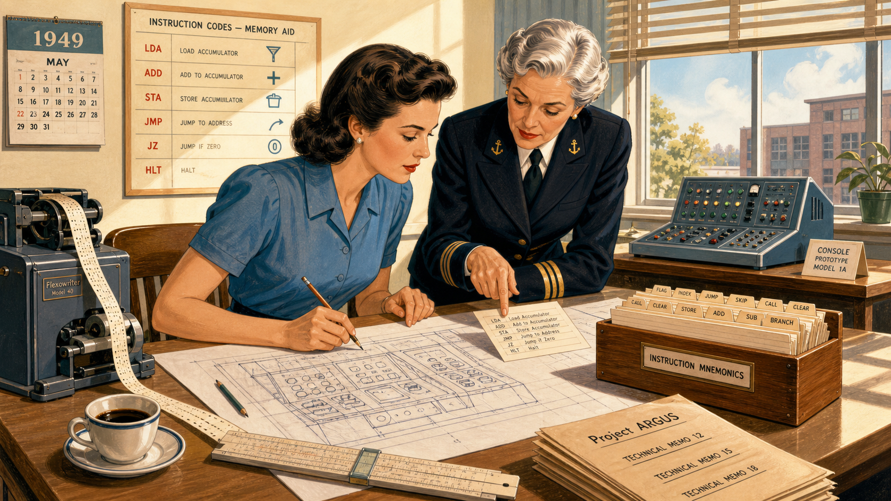

Image Prompt

(This is Panel 07. Do not include the panel number in the image.)
Please generate a 16:9 image in a cleaner mid-century-modern American illustrated style,
slightly brighter and less industrial than earlier panels, depicting panel 7 of 10. The scene
shows a woman now in her early thirties, still dark-haired but styled in a late-1940s fashion,
standing at a drafting table in a modern engineering office, sketching a control-console layout
on a large sheet of paper, with a punched paper tape spooling from a nearby machine and a second
woman, silver-haired and sharp-eyed in a naval-adjacent professional suit, leaning over the same
table pointing at a line of coded instructions on an index card. Sunlight comes through large
office windows onto a wall chart of mnemonic instruction codes. The color palette is brighter
cream, soft blue, and warm wood tones, a visible shift from the dim wartime interiors of earlier
panels. The emotional tone is confident, collaborative momentum. Include at least six specific
visual details: a card index box of instruction mnemonics, a slide rule beside the drafting
paper, a cup of coffee with a saucer, a wall calendar reading 1949, a prototype control console
model on a side table, and a small stack of technical memos labeled with a project name.
Generate the image immediately without asking clarifying questions.

After the war, Betty Holberton did not step away from computing — she went deeper into it. At
the company that grew out of the original machine's inventors, she designed control consoles
and helped write one of the first mnemonic instruction codes, letting programmers type short
memorable commands instead of manually setting switches. She wrote the sort/merge generator, a
program that could write other programs, and she worked closely with a Navy mathematician named
Grace Hopper on tools that would later feed into the first widely used business programming
languages. The woman who once had no programming language at all had, within a few years,
helped invent several of the ones that came next.

## Panel 8: Written Out of the Story

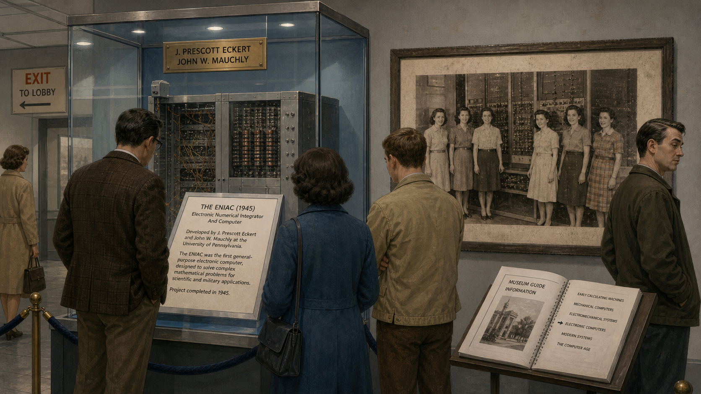

Image Prompt

(This is Panel 08. Do not include the panel number in the image.)
Please generate a 16:9 image in a muted mid-century-modern American illustrated style depicting
panel 8 of 10. The scene shows a museum exhibit hall in the 1970s: a glass case displaying a
preserved section of an early electronic computer cabinet with a printed placard describing its
two male inventors in detail, while a faded black-and-white photograph on the wall behind it
shows six young women standing beside the original machine, unlabeled and uncaptioned. A
handful of museum visitors read the placard without glancing at the photograph. The color
palette is cool museum gray and glass-case blue with a faded sepia tone in the old photograph.
The emotional tone is quiet historical erasure, an absence made visible rather than dramatic.
Include at least six specific visual details: velvet display-case rope, a small brass plaque
with only the inventors' names, dust on the photograph's frame, a museum guidebook open on a
nearby stand, exit signage in period lettering, and a visitor's expression of mild indifference
to the unlabeled photo. Generate the image immediately without asking clarifying questions.

For more than three decades, the standard histories of computing credited the machine's
hardware inventors and almost no one else. Museum placards, textbooks, and retrospective
articles told the story of vacuum tubes and circuit design in exhaustive detail while the six
women who had figured out how to actually operate the thing — who had, in every meaningful
sense, been among the first computer programmers in history — disappeared from the account
almost entirely. Photographs of them survived. Their names, for the most part, did not.

## Panel 9: The Question That Would Not Let Go

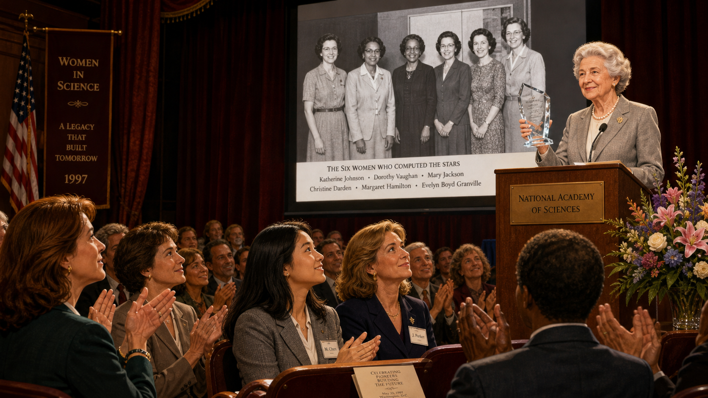

Image Prompt

(This is Panel 09. Do not include the panel number in the image.)
Please generate a 16:9 image in a warmer 1980s American illustrated style depicting panel 9 of
10. The scene shows a young woman researcher in her twenties, wearing 1980s professional
clothing with slightly permed hair, sitting at a small desk in an archive room surrounded by
open file boxes and photographs spread across the table, holding up an old black-and-white
photo of six young women beside a large machine and studying it intently with a magnifying
glass, a rotary telephone and a notepad full of names and phone numbers beside her. Late
afternoon light falls across scattered index cards labeled with partial names. The color
palette is warm archival brown and cream with soft 1980s pastel accents. The emotional tone is
determined, detective-like curiosity finally getting traction after being dismissed. Include at
least six specific visual details: a "restricted access" archive box lid propped open, a
magnifying glass, a coiled telephone cord, handwritten notes with question marks next to
unidentified names, a cassette tape recorder for interviews, and a corkboard pinned with more
photographs in the background. Generate the image immediately without asking clarifying
questions.

In the 1980s, a young researcher named Kathy Kleiman came across that same photograph while
working on a college project and asked who the women in it were. She was told they were
"refrigerator ladies" — models posed next to the machine for publicity, nothing more. She did
not accept that answer. Over the following years, Kleiman tracked down the surviving members of
the original six, recorded their oral histories, and painstakingly reconstructed what they had
actually done, eventually founding a project dedicated to restoring their names and their
technical contributions to the historical record that had left them out.

## Panel 10: Recognition, Decades Late

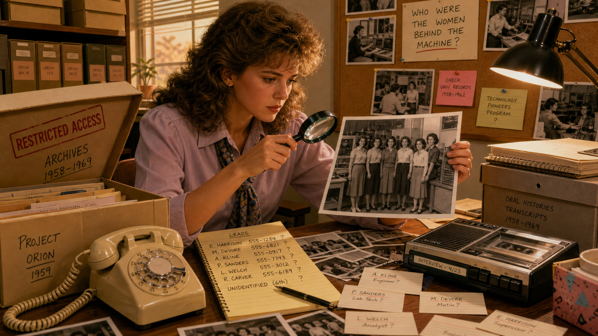

Image Prompt

(This is Panel 10. Do not include the panel number in the image.)
Please generate a 16:9 image in a bright, dignified 1990s American illustrated style depicting
panel 10 of 10. The scene shows an elegant formal auditorium in 1997: an elderly woman with
silver hair, dressed in a tasteful formal suit, standing at a podium holding an engraved glass
award while an audience of mixed ages applauds, several younger women in business attire
visible near the front row watching with visible admiration. A large screen behind the podium
displays the same historic black-and-white photograph of the six original women, now shown with
a printed caption listing all six names. The color palette is warm gold stage light against
deep burgundy curtains and soft audience lighting. The emotional tone is dignified, overdue
triumph — quiet pride rather than spectacle. Include at least six specific visual details: an
engraved glass award catching the stage light, a lapel microphone, a printed event program on
a nearby seat, the captioned photograph filling the screen, a bouquet of flowers near the
podium, and warm applause visible in the raised hands of the audience. Generate the image
immediately without asking clarifying questions.

By the late 1990s, Betty Holberton and her five colleagues were finally receiving the
recognition that had eluded them for half a century — inducted into technology halls of fame,
honored by professional societies, their names printed alongside the machine's inventors instead
of erased from its story. Today, historians of computing recognize the ENIAC Six as among the
very first programmers of any kind, full stop — not "women who helped with computing," but
people who invented, largely from scratch, the discipline of reasoning directly about a
machine's hardware with no language and no abstraction standing between them and the answer.

### Epilogue – What Made the ENIAC Programmers Different?

Betty Holberton and her colleagues did not have a programming language, a debugger, an operating
system, or even a settled vocabulary for what they were doing. What they had was the discipline
to read a machine's own logic directly off its wiring diagrams, the patience to trace failures
signal by signal through physical hardware, and the persistence to keep doing exacting, invisible
work long after it was clear that credit for it might never come. That combination — technical
rigor sustained without the promise of recognition — is a rarer skill than it sounds, and it is
exactly the skill this course's assembly-language labs ask students to rebuild for themselves,
one register and one instruction at a time.

| Challenge | How They Responded | Lesson for Today |
|---|---|---|
| No manual, no programming language, and no precedent to learn from | Reconstructed the machine's behavior directly from its logical wiring diagrams | When there is no abstraction layer to trust, go read the hardware's own description of itself |
| Programming required physically setting thousands of switches and cables, with real, frequent hardware failures | Traced signals through the machine by hand, treating failure as routine data rather than crisis | Build a debugging habit that assumes the hardware will misbehave, and stay methodical when it does |
| Doing the essential, difficult work of the public demonstration while being denied introduction or credit | Continued the work anyway, then kept building further contributions for decades afterward | Do rigorous work because it is correct and worth doing, not only because someone is watching |
| Decades of erasure from standard computing histories | Cooperated with researcher Kathy Kleiman's effort to document and restore their story | A record only survives if someone preserves it — document your own work as if history depends on it, because eventually it might |

### Call to Action

When you sit down in this course's assembly-language module with nothing but a register map, an
instruction set, and a Cortex-M processor that will not forgive a careless timing assumption, you
are standing closer to Betty Holberton's actual working conditions than to most of modern
software engineering. She had no compiler to trust and no forum post to consult — only the
hardware, a diagram, and her own reasoning. Carry that same discipline into your own benchmarking
labs: read the hardware's behavior directly, trust your measurements over your assumptions, and
document what you find carefully enough that it survives to be useful to whoever reads it next.

---

*"None of us were introduced; we were just the programmers."*
—Betty Holberton, recalling the 1946 public dedication where she and her five colleagues went unacknowledged

*"We could diagnose troubles almost down to the individual vacuum tube."*
—Jean Bartik, a fellow member of the ENIAC Six, on what the team learned from studying the machine's logic diagrams

---

## References

1. [Wikipedia: Betty Holberton](https://en.wikipedia.org/wiki/Betty_Holberton) - Biography covering her recruitment as a wartime "computer," her role programming the machine, and her postwar career on the sort/merge generator and the C-10 instruction code.
2. [Wikipedia: ENIAC](https://en.wikipedia.org/wiki/ENIAC) - History of the machine itself, its 1943-1946 construction at the University of Pennsylvania's Moore School, and its February 1946 public demonstration.
3. [Wikipedia: Jean Bartik](https://en.wikipedia.org/wiki/Jean_Bartik) - Biography of a fellow member of the ENIAC Six, documenting the group's shared recruitment, self-taught programming methods, and decades-later recognition.
4. [Penn Engineering: ENIAC](https://www.engineering.upenn.edu/about/history-heritage/eniac/) - The University of Pennsylvania's own history page on ENIAC and its six original women programmers.
5. [Encyclopaedia Britannica: ENIAC](https://www.britannica.com/technology/ENIAC) - Overview of the machine's design, construction under Army contract, and technical significance.
