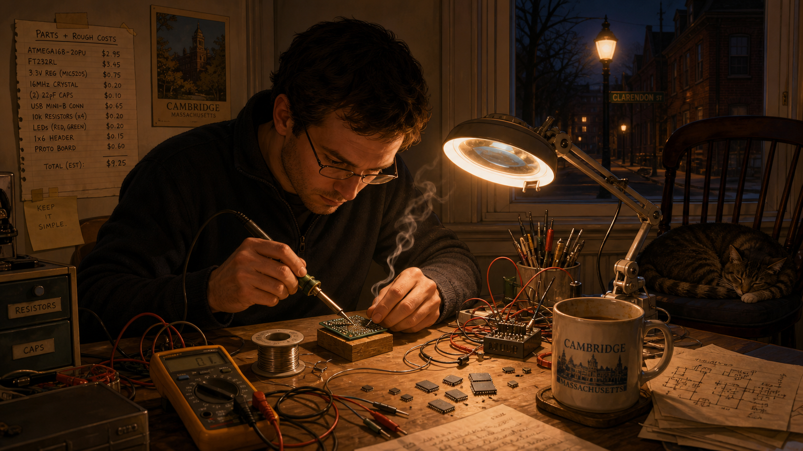
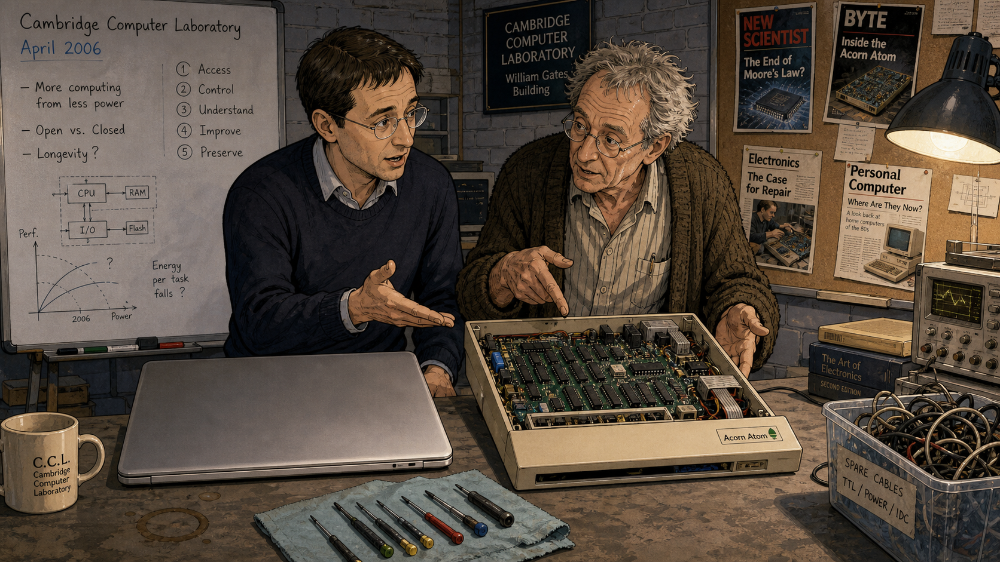
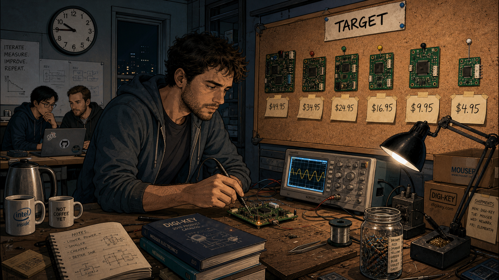
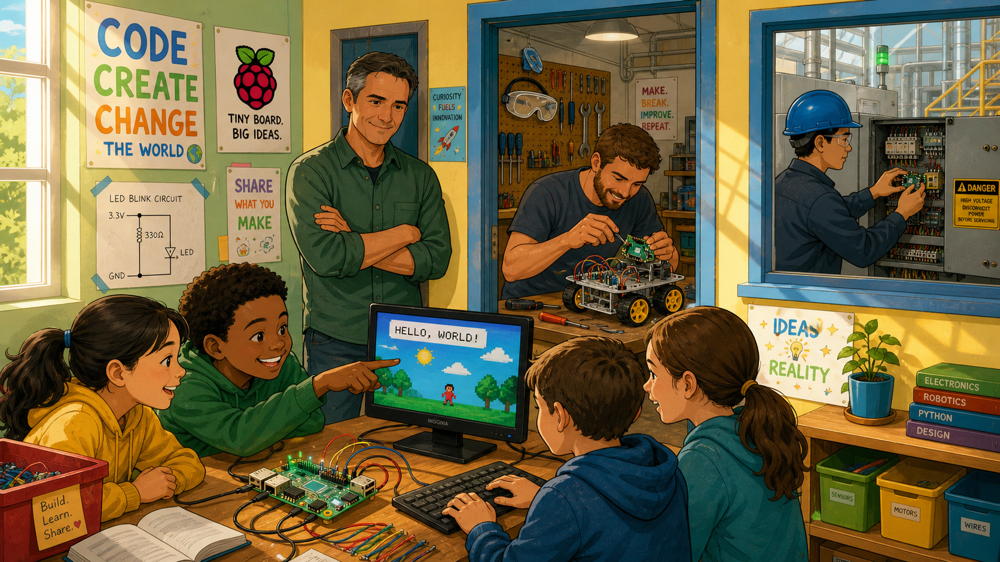
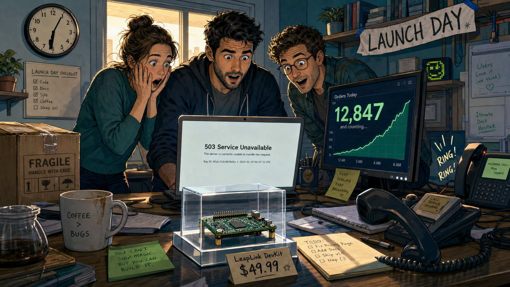
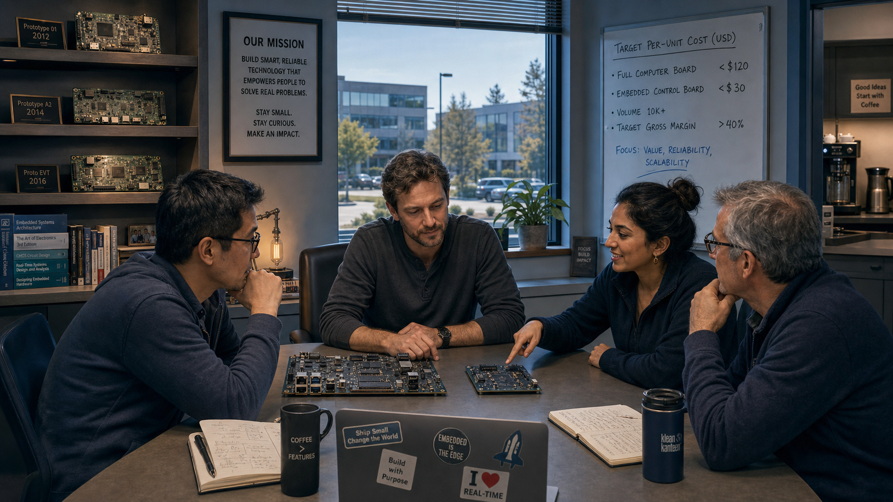
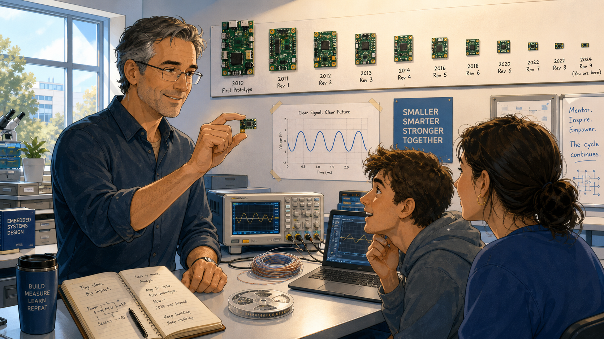

# Five Dollars of Computer: Eben Upton and the Raspberry Pi

<!--  -->

Cover Image Prompt

(This is the Cover Image. Do not include this label in the image.)
Please generate a wide-landscape 16:9 cover image for this story in a warm, contemporary
graphic-novel illustration style set in mid-2000s Cambridge, England. Show a man in his
late twenties with short dark hair and rectangular wire-frame glasses, wearing a plain
crew-neck sweater over a collared shirt, seated at a cluttered desk in a university office,
holding up a small credit-card-sized circuit board between two fingers so it catches the
window light. The board has a rectangular gray processor chip, a grid of exposed pin headers
along one edge, and a small memory-card slot — no readable logos or text on it. Behind him,
tall leaded-glass university windows show a stone college courtyard, and stacks of paper
student applications lean precariously on the desk beside an old beige box-shaped computer
and a soldering iron resting in its stand. Render the title text "FIVE DOLLARS OF COMPUTER"
at the top in a clean, confident contemporary sans-serif typeface, and beneath it in smaller
type "Eben Upton and the Five-Dollar Computer." Color palette: warm amber window light, muted college
stone gray, and circuit-board green against a soft blue overcast sky outside. Emotional tone:
quiet, optimistic determination — an idea about to outgrow the room it was born in. Generate
the image immediately without asking clarifying questions.

Narrative Prompt

This story is set in Cambridge, England, from the mid-2000s through 2024, following a
computer science lecturer and admissions tutor who becomes an electronics designer and
charity founder. The themes are democratizing access to real, hands-on computing power;
refusing to accept that capability must be expensive; and building patiently, over years,
toward a launch that ultimately outran every expectation. Render the story in a warm,
contemporary (2000s-2020s) illustrated graphic-novel style — not photorealistic, but
grounded and specific: university offices, cluttered engineering workbenches, soldering
irons, oscilloscopes, whiteboards, and modest laptops rather than anything futuristic or
glossy. Color palette: warm ambers and browns in the early panels, shifting toward cooler
blues and energetic greens as the project succeeds and scales globally. Character
consistency note: the central figure should be drawn consistently across all panels as a
man with short dark hair and rectangular wire-frame glasses, dressed in simple, unpretentious
contemporary clothing (sweaters, collared shirts, no ties), visibly aging from his late
twenties in early panels to his mid-forties by the final panel, with a few flecks of gray
appearing in later panels. Do not render any real company names, logos, trademarks, or
readable text on any screen, chip, or circuit board in any panel — depict all electronic
hardware generically (plain gray chips, unlabeled green or blue circuit boards, blank
laptop and monitor screens) so no specific real product or brand is depicted.

### Prologue – The Applications That Kept Getting Thinner

Every autumn, the admissions tutors at a Cambridge college read through a fresh stack of
computer science applications, looking for the students who did more than pass their exams —
the ones who had actually taken a machine apart, broken it, and put it back together smarter
than before. In the mid-2000s, a young lecturer named Eben Upton started noticing that stack
get thinner in a very specific way. The students were still bright, still capable, but fewer
and fewer of them had ever really touched the hardware underneath the software they used every
day. Upton had grown up prying open a cheap, exposed 1980s home computer and learning to
program it line by line; the students arriving now had grown up with sealed, polished
machines that gave them no way in. He decided, almost as a side project, to see whether that
could be fixed with a small enough price tag. It would take him and a handful of colleagues
most of a decade to find out.

## Panel 1: The Thinning Stack

<!--  -->

Image Prompt

(This is Panel 01. Do not include the panel number in the image.)
I am about to ask you to generate a series of images for a graphic novel. Please make the
images have a consistent style and consistent characters. Do not ask any clarifying
questions. Just generate the image immediately when asked.

Please generate a 16:9 image in a warm contemporary graphic-novel illustration style
depicting panel 1 of 8. The scene shows a man in his late twenties with short dark hair and
rectangular wire-frame glasses, wearing a gray crew-neck sweater over a collared shirt,
seated alone at a wide wooden desk in a small university admissions office in Cambridge,
England, in 2006. He is paging through a tall stack of paper application folders, one hand
resting thoughtfully on his chin, an expression of mild concern on his face. A dusty framed
photograph on a shelf behind him shows a much smaller boy at an old beige home-computer
keyboard. The color palette is warm amber desk-lamp light against muted stone-gray office
walls. The emotional tone is quiet, reflective concern. Include at least six specific visual
details: a leaded-glass window showing a stone college courtyard outside, a chipped ceramic
mug of cold tea, a rotary desk lamp with a brass arm, a wall calendar turned to October, a
half-eaten biscuit on a saucer, and stacks of folders organized into two uneven piles.
Generate the image immediately without asking clarifying questions.

Eben Upton had spent his own childhood taking a cheap home computer apart down to its circuit
traces, and by the mid-2000s he was on the other side of the desk, helping decide who got into
Cambridge to study computer science. Application after application showed the same pattern:
strong exam results, confident talk about web pages and software, but almost no experience of
programming close to the hardware itself. The students were not less capable — the machines
around them had simply stopped inviting that kind of exploration. Upton began to wonder whether
the problem was fixable, and whether fixing it might start with something as unglamorous as
price.

## Panel 2: Sealed Boxes

<!--  -->

Image Prompt

(This is Panel 02. Do not include the panel number in the image.)
Please generate a 16:9 image in the same warm contemporary graphic-novel illustration style
depicting panel 2 of 8. Make the characters and style consistent with the prior panel. Show
the same man and a colleague — an older man with graying hair and a rumpled cardigan —
standing at a cluttered Cambridge Computer Laboratory workbench in 2006, examining two
objects side by side: a sleek, smooth, unopenable modern laptop with no visible screws, and
an old, boxy home computer with its plastic case removed, exposing a green circuit board and
rows of chips inside. Both men gesture toward the open machine as if making a point. The
color palette is cool laboratory gray and blue with warm highlights from an overhead lamp.
The emotional tone is animated, thoughtful debate between colleagues who share a concern.
Include at least six specific visual details: a whiteboard in the background with rough
diagrams and circled numbers, a tangle of spare cables in a plastic bin, a small
screwdriver set laid out on a cloth, a coffee cup ring-stain on the bench, exposed brick
laboratory walls, and a corkboard pinned with old computing magazine clippings. Generate
the image immediately without asking clarifying questions.

Talking it through with colleagues at the Computer Laboratory, Upton sharpened the diagnosis.
Modern computers and game consoles had become polished, sealed appliances — remarkably
capable, but built to be used, not opened. The generation that had learned to program by
poking at an exposed, forgiving home computer had grown up; the machines that replaced those
computers gave today's students nothing comparable to poke at. If a student could not risk
breaking a family's only expensive laptop, that student would never learn what was actually
happening inside it. The fix, they began to suspect, was not a better piece of software. It
was a machine cheap enough that breaking it did not matter.

## Panel 3: A Board on a Cluttered Desk

<!--  -->

Image Prompt

(This is Panel 03. Do not include the panel number in the image.)
Please generate a 16:9 image in the same warm contemporary graphic-novel illustration style
depicting panel 3 of 8. Make the characters and style consistent with prior panels. Show the
same man, now working alone at home in the evening in 2008, hunched over a small workbench
crowded with tools, soldering a small bare circuit board roughly the size of a deck of
playing cards under a bright desk lamp. Loose wires, a roll of solder, a multimeter, and a
handful of loose gray chips are scattered around him. A window behind him shows a dark
Cambridge street with a single lit streetlamp. The color palette is warm lamplight orange
against deep evening blue shadows. The emotional tone is focused, solitary determination
late at night. Include at least six specific visual details: a curling wisp of solder smoke,
a magnifying lamp clipped to the desk edge, a handwritten list of parts and rough costs
taped to the wall, a half-drunk mug gone cold, a cat curled asleep on a nearby chair, and a
small stack of hand-drawn circuit sketches. Generate the image immediately without asking
clarifying questions.

Around 2006, Upton and a small circle of colleagues — university engineers and one
games-industry veteran among them — began sketching an answer: a genuinely capable computer,
stripped down to only what mattered, built to cost so little that a school or a single student
could afford to own one outright. There was no institutional budget behind the early work, no
product team, no deadline but the one they set themselves. Just evenings and weekends spent
soldering prototype boards by hand, chasing a number that mattered more than any technical
specification: how far the price could fall before the computer stopped being a real computer.

## Panel 4: Chasing the Number

<!--  -->

Image Prompt

(This is Panel 04. Do not include the panel number in the image.)
Please generate a 16:9 image in the same warm contemporary graphic-novel illustration style
depicting panel 4 of 8. Make the characters and style consistent with prior panels. Show the
same man, a little more tired-looking, standing in a small shared workshop in 2010 in front
of a corkboard covered with five or six successive small circuit-board prototypes pinned up
in a row, each visibly different in size and layout, with a handwritten price figure taped
under each one showing a downward trend. He holds a small oscilloscope probe against the
newest board on the workbench in front of him, studying its screen intently. Two colleagues
confer quietly in the background over a laptop. The color palette is cool workshop gray-blue
with warm pools of desk-lamp light. The emotional tone is patient, methodical persistence —
the grind of iteration rather than a single flash of inspiration. Include at least six
specific visual details: a small stack of component catalogs, a jar of loose resistors sorted
by color band, a hand-lettered sign reading "TARGET" pinned above the corkboard, a kettle and
mismatched mugs on a side table, cardboard shipping boxes from parts suppliers, and a wall
clock reading well past nine at night. Generate the image immediately without asking
clarifying questions.

The team spent years narrowing the gap between what they wanted and what they could afford:
enough real computing power to run a full operating system and teach genuine programming, at
a price that would not make a school administrator or a parent hesitate. Prototype followed
prototype, each one a little smaller, a little cheaper, a little closer to a number worth
publishing. There was no guarantee any of it would matter to anyone outside their small group.
They kept iterating anyway, treating every failed cost estimate as information rather than
defeat.

## Panel 5: The Websites Go Down

<!--  -->

Image Prompt

(This is Panel 05. Do not include the panel number in the image.)
Please generate a 16:9 image in the same warm contemporary graphic-novel illustration style
depicting panel 5 of 8. Make the characters and style consistent with prior panels. Show the
same man, now in his early thirties, standing in a small office on the morning of the 29th of
February, surrounded by two colleagues, all three staring with a mixture of shock and delight
at a laptop screen displaying a plain error page, while a second monitor beside it shows a
rapidly climbing counter of numbers. A landline phone is off the hook on the desk. A single
small circuit board sits proudly displayed in a clear plastic case in the foreground, in
sharp focus, with a small hand-lettered price tag beside it. The color palette shifts to a
brighter, energized blue-green against warm morning window light. The emotional tone is
startled elation — the moment quiet, careful work meets sudden, overwhelming public demand.
Include at least six specific visual details: a wall clock reading just past six in the
morning, a half-poured cup of coffee going cold and forgotten, a paper banner reading
"LAUNCH DAY" taped crookedly to a shelf, a cardboard box of packing materials still sealed,
a second phone ringing in the background, and one colleague with both hands pressed to her
face in disbelief. Generate the image immediately without asking clarifying questions.

On the 29th of February 2012, the team's small, carefully priced computer finally went on
sale. Within minutes, the distributors' ordering websites buckled under more traffic than
anyone on the team had dared to plan for, and the modest first batch sold out almost
instantly. Upton and his colleagues had hoped a few thousand students and hobbyists might
want one. Instead, orders poured in from around the world faster than anyone could process
them — proof that the appetite for cheap, genuinely capable hardware had never gone away. It
had simply been waiting for someone to build it.

## Panel 6: A Movement, Not a Product

<!--  -->

Image Prompt

(This is Panel 06. Do not include the panel number in the image.)
Please generate a 16:9 image in the same warm contemporary graphic-novel illustration style
depicting panel 6 of 8. Make the characters and style consistent with prior panels. Show a
wide montage-style scene set around 2014: in the foreground, a classroom of school-age
children clustered around a small circuit board connected to a keyboard and television,
one child pointing excitedly at the screen; in the middle distance through a workshop
doorway, a hobbyist adult in a garage attaching a small board to a simple wheeled robot
chassis; and in the background through another window, an engineer in a factory setting
mounting an identical small board into an industrial control panel. The man from the earlier
panels stands just inside the classroom doorway, arms crossed, watching with a quiet smile,
slightly older with the first faint gray at his temples. The color palette is bright,
optimistic green, yellow, and sky blue, noticeably more vibrant than earlier panels. The
emotional tone is joyful, expansive energy — a small idea outgrowing its original purpose.
Include at least six specific visual details: colorful classroom posters on the wall, a
tangle of jumper wires on the robot chassis, safety goggles hanging on a workshop hook, a
child's hand-drawn circuit diagram taped up, an industrial warning label on the factory
panel, and sunlight streaming through the classroom windows. Generate the image immediately
without asking clarifying questions.

What began as a modest teaching tool for Cambridge applicants quickly outgrew every original
plan. Within a couple of years, the same small, inexpensive board was turning up in school
classrooms, hobbyist garages, robotics clubs, and industrial control panels on factory floors
— anywhere someone needed a small, cheap, genuinely programmable computer and had previously
been priced out of trying. The team had set out to fix one narrow problem in one country's
university admissions. They had, almost by accident, helped ignite a global movement of
people building things themselves again.

## Panel 7: Keeping the Mission Small

<!--  -->

Image Prompt

(This is Panel 07. Do not include the panel number in the image.)
Please generate a 16:9 image in the same warm contemporary graphic-novel illustration style
depicting panel 7 of 8. Make the characters and style consistent with prior panels. Show the
same man, now in his late thirties, seated at the head of a small conference table in a
modest, unglamorous office around 2019, reviewing two circuit boards laid side by side on the
table: one a familiar-sized full computer board, the other a noticeably smaller, simpler
board meant for embedded control. Three colleagues of varying ages sit around the table,
one gesturing toward the smaller board with visible enthusiasm. A large window shows a
modern but modest office park outside. The color palette is cool, confident blue and
slate-gray with warm accents from desk lamps. The emotional tone is settled, mission-driven
focus — a team that has grown but has not lost its original purpose. Include at least six
specific visual details: a bookshelf of technical manuals and old prototype boards displayed
like trophies, a potted plant on the windowsill, a printed mission statement framed on the
wall, a coffee machine visible through an open door, several laptop stickers on the table
edge, and a whiteboard listing rough per-unit cost targets. Generate the image immediately
without asking clarifying questions.

Success did not change the underlying instinct. Through the rest of the decade, the small
educational charity Upton and his colleagues had built kept returning to the same founding
question: how much real computing capability could be delivered for how little money, without
sacrificing the openness that made the original board worth tinkering with in the first place.
The product line grew to include not just full desktop-replacement computers but tiny,
inexpensive microcontroller boards built for embedding directly into other people's projects
— smaller, cheaper, and just as determined to invite exploration rather than discourage it.

## Panel 8: The Same Question, Twenty Years Later

<!--  -->

Image Prompt

(This is Panel 08. Do not include the panel number in the image.)
Please generate a 16:9 image in the same warm contemporary graphic-novel illustration style
depicting panel 8 of 8. Make the characters and style consistent with prior panels. Show the
same man, now in his mid-forties with visibly graying hair at the temples but the same
rectangular wire-frame glasses, standing in a bright modern engineering lab in 2024, holding
up a tiny circuit board no bigger than a stick of chewing gum between two fingers, angled
toward two young university-age students seated at a nearby bench with an oscilloscope and
a laptop showing a simple waveform. One student leans forward, visibly fascinated. The color
palette is bright, clean, optimistic blue and white with warm accent lighting, echoing the
cover image's warmth. The emotional tone is quiet pride and full-circle satisfaction.
Include at least six specific visual details: a row of small labeled circuit boards pinned
along the wall showing a visual timeline from large to small, a coil of thin wire beside the
oscilloscope, a small reel of surface-mount components, a printed waveform chart taped above
the bench, natural daylight through a large lab window, and a well-worn notebook open beside
the man's hand. Generate the image immediately without asking clarifying questions.

In 2024, the same charity released its newest microcontroller board — smaller than ever,
built around a chip with a genuine hardware floating-point unit and dedicated signal-
processing instructions, and still priced at about five dollars. It is, quite literally, the
board sitting on your desk in this course. Every FFT you hand-optimize in ARM assembly over
the next ten weeks runs on a direct descendant of the machine Upton started sketching in
2006, chasing the same stubborn question: why should the hardware capable of real learning
cost more than a few coins in a student's pocket?

### Epilogue – What Made Upton's Approach Different?

Eben Upton did not set out to build a company; he set out to fix a specific, observable
problem he saw year after year from an admissions desk. He treated price not as a marketing
constraint but as the actual engineering problem to be solved, and he was willing to spend
years iterating quietly before anything worked well enough to ship. When the launch finally
came, the scale of the response surprised even the people who had built the thing — but the
mission never drifted, even as the product line grew far beyond what any of them had first
imagined. That same discipline — define the real constraint precisely, iterate honestly
against it, and never confuse a launch's size with the value of the idea behind it — is
exactly the mindset this course asks of you when you benchmark your own code.

| Challenge | How Upton Responded | Lesson for Today |
|---|---|---|
| Declining hands-on hardware skills among incoming students | Diagnosed the root cause precisely — sealed appliances, not lack of student talent — before proposing a fix | Solve the constraint you actually measured, not the one that is easiest to talk about |
| No budget, no company, no guarantee the idea mattered | Iterated on prototypes for years using personal time and a small volunteer circle | Patient, unglamorous iteration can outperform a rushed, well-funded launch |
| Demand on launch day far beyond any planning estimate | Treated overwhelming success as a scaling problem to solve, not a crisis to panic over | Plan for your benchmark or design to be stress-tested by real conditions, not just your assumptions |
| Risk of mission drift as the product line grew | Kept returning to the founding price-and-openness constraint with every new board, including the microcontroller line | Let your original design constraint discipline every later decision, even after early success |

### Call to Action

The Raspberry Pi Pico 2 on your breadboard did not appear from nowhere — it is a direct
descendant of the same charity, the same founding mission, and the same "why should this be
expensive" instinct that Eben Upton and his colleagues started chasing in a Cambridge office
in the mid-2000s. As you write and benchmark your FFT on that five-dollar board over the next
ten weeks, you are not just learning ARM assembly; you are continuing a twenty-year argument
that real computing capability should be cheap enough for anyone to risk breaking.

---

*"There was a massive decline in the number of people applying to study computer science, which was sort of heart-breaking in a place like Cambridge."*
—Eben Upton

*"If we could get a program or a piece of hardware into the hands of young people at the right point in their lives, we might be able to do something to reverse that decline."*
—Eben Upton

---

## References

1. [Wikipedia: Eben Upton](https://en.wikipedia.org/wiki/Eben_Upton) - Biography covering Upton's education, Cambridge career, and role founding the Raspberry Pi Foundation.
2. [Wikipedia: Raspberry Pi](https://en.wikipedia.org/wiki/Raspberry_Pi) - History and technical overview of the single-board computer series, including its 29 February 2012 launch at $35.
3. [Wikipedia: Raspberry Pi Foundation](https://en.wikipedia.org/wiki/Raspberry_Pi_Foundation) - History of the UK educational charity founded in 2008 to reverse the decline in computer science applicants.
4. [University of Cambridge: The life of Pi - Ten years of Raspberry Pi](https://www.cam.ac.uk/stories/raspberrypi) - Institutional retrospective with first-person quotes from Upton on the Foundation's founding and mission.
5. [IEEE Spectrum: Eben Upton, the Raspberry Pi Pioneer](https://spectrum.ieee.org/eben-upton-the-raspberry-pi-pioneer) - Engineering-society profile of Upton's career path from Cambridge admissions tutor and chip architect to Raspberry Pi founder.
