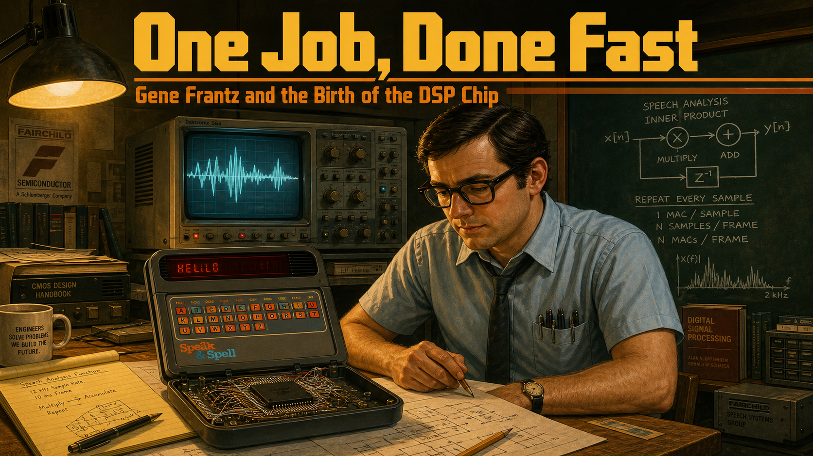
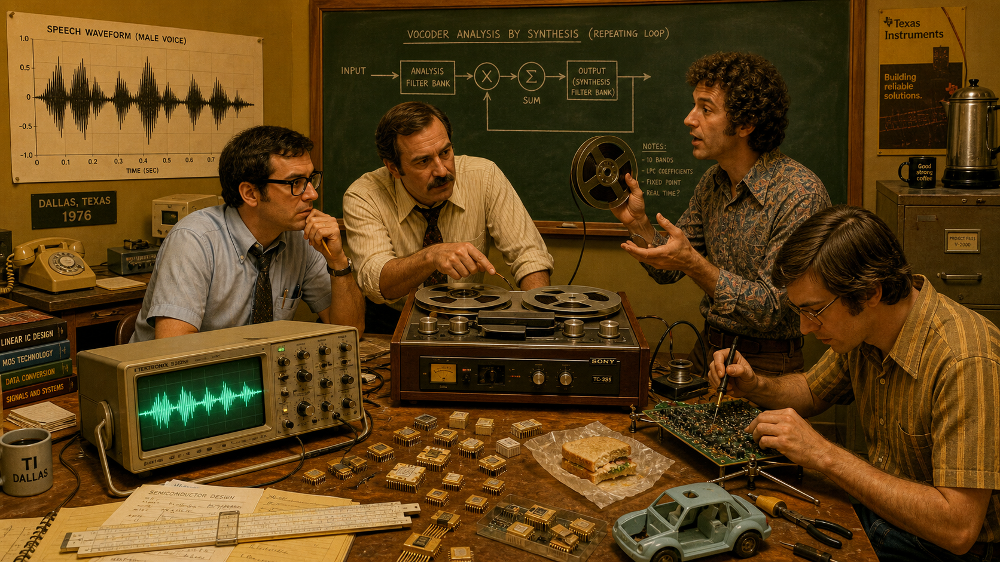
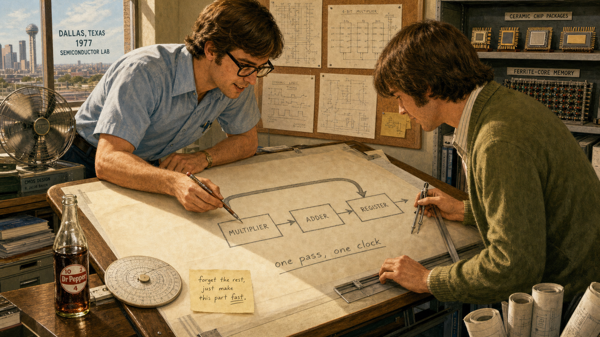
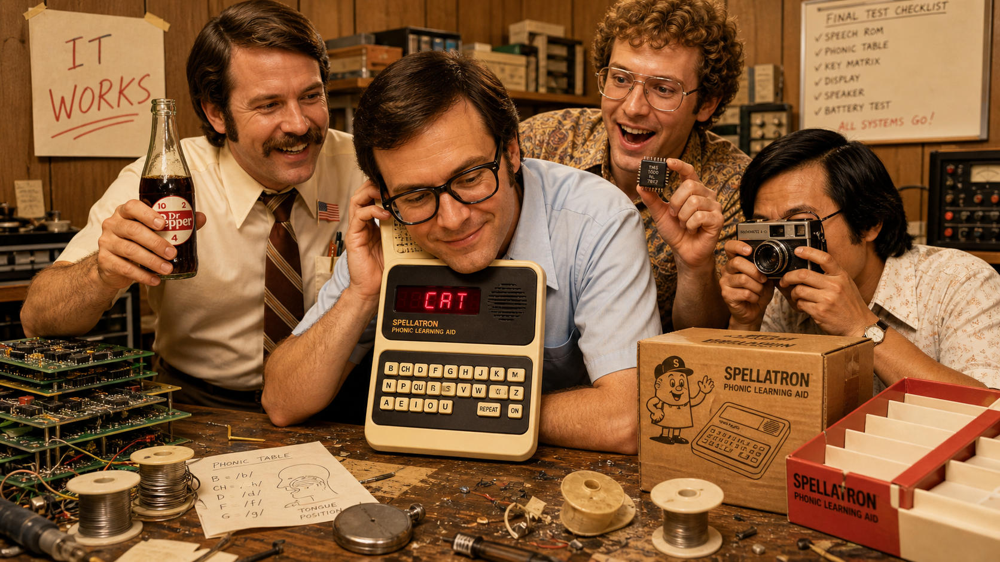
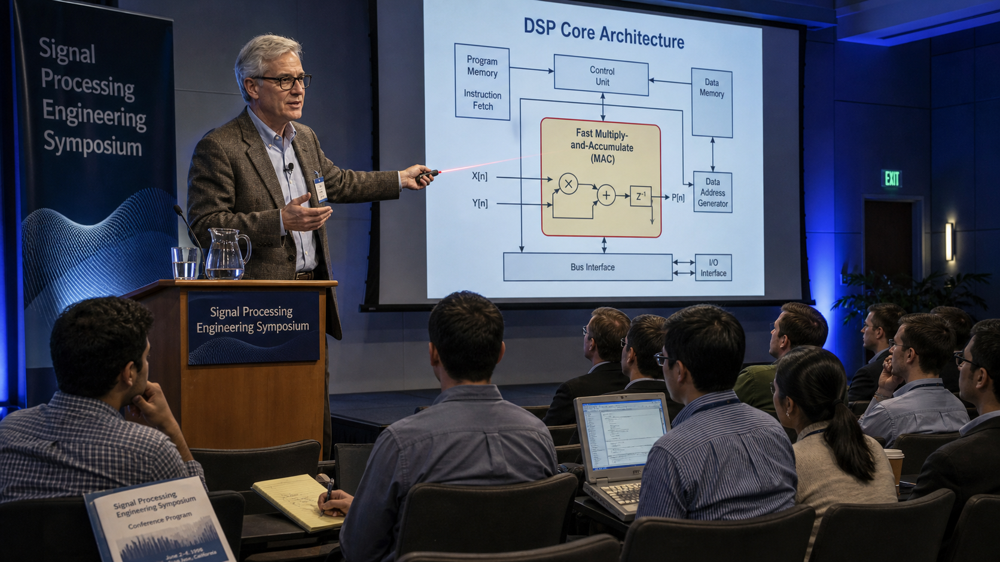
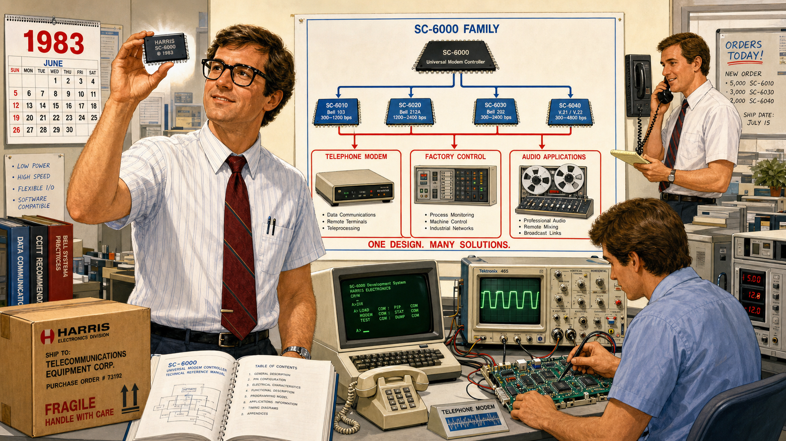
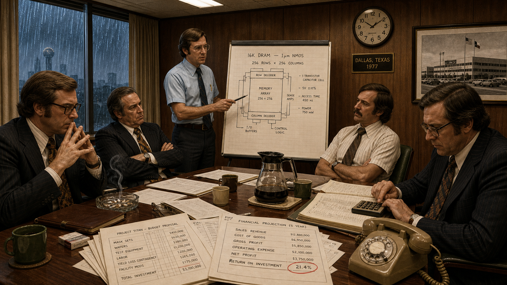

# One Job, Done Fast: Gene Frantz and the Birth of the DSP Chip

Cover Image Prompt

(This is the Cover Image. Do not include this label in the image.)
Please generate a wide-landscape 16:9 cover image in a warm, mid-century-transitioning-to-late-1970s technical-illustration style, like an engineering brochure crossed with a graphic novel. The scene: a young electronics engineer in his mid-30s, short dark hair, black plastic-frame glasses, wearing a short-sleeve light-blue collared shirt with a narrow dark tie loosened at the collar and a pocket protector full of pens, stands at a wooden drafting table in a semiconductor engineering lab. On the table sits a small dark-gray plastic learning-toy console with a phonetic keyboard and a narrow red LED display, its case open to reveal a single black chip cradled in a wire-wrapped prototype board. Behind him, a large oscilloscope glows with a jagged speech waveform, and a chalkboard is covered with hand-drawn circuit diagrams and a repeating loop labeled with multiply and add symbols. Warm incandescent overhead light pools on the table while the rest of the lab falls into cool shadow. Render the title text "One Job, Done Fast" in a bold, geometric 1970s technical-brochure typeface across the top third of the image, with "Gene Frantz and the Birth of the DSP Chip" in smaller matching type beneath it. Color palette: mustard yellow, burnt orange, olive green, warm brown wood tones, and cool oscilloscope blue-green. Emotional tone: quiet determination and the thrill of a breakthrough. Generate the image immediately without asking clarifying questions.

Narrative Prompt

This story is set in Dallas, Texas, United States, beginning in 1976 and extending across the following four decades. It follows a young semiconductor engineer and his small team as they discover that the general-purpose microprocessors of the era cannot perform the repeated multiply-and-accumulate math needed to filter and reconstruct human speech in real time — and respond by designing custom silicon built around exactly that one operation, done as close to a single clock cycle as possible. The visual style throughout is a mid-century-to-late-1970s technical-illustration aesthetic: engineers in short-sleeve collared shirts and narrow ties or modest blouses, thick-framed glasses, wood-paneled offices, oscilloscopes with glowing green traces, wire-wrapped prototype boards, ceramic and plastic chip packages, hand-drawn circuit diagrams on chalkboards and vellum, and warm tungsten lighting against cool blue-green instrument glow. Character consistency: the lead engineer is a man in his mid-30s with short dark hair and black plastic-frame glasses, aging visibly across later panels into a silver-haired, tweed-jacketed figure in his 60s while keeping the same glasses style and calm, attentive expression. His three teammates recur with consistent looks: an older mustached project leader with rolled shirtsleeves, a wiry curly-haired speech scientist who is often mid-gesture explaining an idea, and a quieter engineer who is usually sketching or soldering. The final panel transitions into a bright, contemporary university lab to visually bridge the era of room-sized lab benches and large chip packages with a present-day student holding a tiny modern circuit board.

### Prologue – The Toy That Had to Learn to Talk

In 1976, a small group of engineers at a Dallas semiconductor company set out to build something that had never existed as a mass-market consumer product: a device that could speak. Not a recording, not a tape loop, but a machine voice reconstructed instantly, sample by sample, from math running inside a chip small enough to fit in a child's hand. The idea sounded almost whimsical — a spelling toy for schoolchildren. The engineering problem underneath it was not whimsical at all. Every chip available to the team in 1976 was too slow to do the one calculation speech reconstruction depended on, over and over, thousands of times a second, without falling behind. What happened next would outlast the toy by decades and quietly reshape how the world builds machines that listen, filter, and respond in real time.

## Panel 1: A Voice With No Chip to Live In

Image Prompt

(This is Panel 01. Do not include the panel number in the image.)
I am about to ask you to generate a series of images for a graphic novel. Please make the images have a consistent style and consistent characters. Do not ask any clarifying questions. Just generate the image immediately when asked.

Please generate a 16:9 image in a warm 1970s technical-illustration style depicting panel 1 of 8. The scene is a cluttered semiconductor engineering lab in Dallas, Texas, in 1976. Four engineers cluster around a wooden workbench: the lead figure is a man in his mid-30s with short dark hair, black plastic-frame glasses, and a light-blue short-sleeve shirt with a loosened narrow tie; beside him an older mustached project leader in rolled shirtsleeves gestures at a reel-to-reel tape recorder; a wiry, curly-haired speech scientist holds up a spool of magnetic tape while speaking animatedly; a fourth quieter engineer sits at the bench soldering a circuit board. On the workbench sits an oscilloscope displaying a jagged analog speech waveform in glowing green, next to a bulky wooden-cased tape recorder and scattered loose ceramic chip packages. A chalkboard in the background shows a hand-drawn block diagram labeled with a repeating loop of multiply and sum symbols. The color palette is mustard yellow, olive green, warm wood brown, and oscilloscope blue-green under warm overhead tungsten light. The emotional tone is curious excitement mixed with the first hint of a technical puzzle. Include at least these specific visual details: a rotary telephone on a side desk, a coffee percolator on a filing cabinet, a poster-sized graph of a speech waveform pinned to the wall, a slide rule resting on loose papers, a half-eaten sandwich on wax paper near the bench, and a small prototype toy shell with no internal electronics sitting empty on the table. Generate the image immediately without asking clarifying questions.

The team's assignment sounds almost simple on paper: take a human voice, compress it down to a set of mathematical parameters, and rebuild that voice on demand from a machine cheap enough to sell in a toy store. Richard's tape recordings of raw speech waveforms already show the technique will work in theory. Compressing and reconstructing a waveform in real time means executing the same handful of operations, multiply a sample by a coefficient and add it to a running total, tens of thousands of times every second. On a wooden bench crowded with tape reels and hand-drawn diagrams, four engineers realize they are chasing a chip that does not yet exist.

## Panel 2: The Math That Outran the Machine

Image Prompt

(This is Panel 02. Do not include the panel number in the image.)
Please generate a 16:9 image in a warm 1970s technical-illustration style depicting panel 2 of 8. Keep the characters and style consistent with the prior panel. The lead engineer, mid-30s with short dark hair and black plastic-frame glasses in a light-blue short-sleeve shirt, sits alone at a lab bench late at night in the same Dallas, Texas semiconductor lab, 1976. He stares at an oscilloscope screen where a reconstructed speech waveform lags visibly behind a reference trace, breaking into a stuttering, distorted shape. Stacks of green-and-white striped printout paper covered in assembly-language code spill across the desk. A small evaluation board for a general-purpose microprocessor sits open beside a hand-held stopwatch showing an unfavorable elapsed time. The color palette is deep midnight blue-black for the room with warm amber desk-lamp light pooling on the bench and cool green oscilloscope glow on his face. The emotional tone is quiet frustration tipping toward realization. Include at least these specific visual details: a desk lamp with a metal shade throwing a tight cone of light, a wall clock reading well past midnight, an ashtray with a spent cigarette, a coffee cup with a ring stain on the printout paper, a small chalkboard equation reading "sum of a times x" circled twice, and a discarded crumpled printout in a wastebasket. Generate the image immediately without asking clarifying questions.

Late one night, the lead engineer runs the numbers again, certain he has made an error. He has not. The general-purpose processors available on the market spend so many clock cycles fetching an instruction, multiplying two numbers, and storing the result that the speech simply cannot be rebuilt fast enough to sound continuous; the output stutters and breaks apart on the oscilloscope screen. The bottleneck is not clever programming or a smarter algorithm. It is raw arithmetic throughput: the chip cannot multiply and add fast enough, full stop. He circles the same equation on his scratch pad for the third time that night, because the math is not lying to him — the hardware is what has to change.

## Panel 3: Sketching a Chip That Does One Thing

Image Prompt

(This is Panel 03. Do not include the panel number in the image.)
Please generate a 16:9 image in a warm 1970s technical-illustration style depicting panel 3 of 8. Keep the characters and style consistent with prior panels. The lead engineer and the quieter sketching engineer lean over a large sheet of vellum on a drafting table in the Dallas, Texas semiconductor lab, 1977. The lead engineer, still in his light-blue short-sleeve shirt and black plastic-frame glasses, points with a mechanical pencil at a hand-drawn block diagram showing a single wide arrow looping from a multiplier block into an adder block into a register, labeled "one pass, one clock." The quieter engineer, in a muted olive cardigan, holds a set of drafting compasses and a T-square. Rolls of blueprint paper lean against the drafting table's legs, and a shelf behind them holds labeled ceramic chip packages and ferrite-core memory samples. The color palette is warm vellum cream, graphite gray, olive green, and brass drafting-tool tones under bright afternoon window light. The emotional tone is focused, almost giddy invention. Include at least these specific visual details: a mechanical pencil with a worn eraser, a circular slide rule beside the vellum sheet, a cork board pinned with smaller circuit sketches, a desk fan mid-spin in the corner, a half-full glass bottle of soda on the drafting table, and a small hand-lettered note reading "forget the rest, just make this part fast." Generate the image immediately without asking clarifying questions.

If no existing chip can multiply and accumulate fast enough, the team decides, then the answer is not to wait for faster general-purpose chips to arrive. The answer is to stop building a general-purpose chip at all. On a sheet of vellum, the lead engineer sketches a radically narrow idea: a processor with almost no ambition beyond doing one operation, multiply and add, in as close to a single clock cycle as the era's manufacturing process will allow. Every transistor on the die will exist to serve that one loop faster than any general-purpose competitor ever could. It is a strange kind of confidence, betting an entire chip design on doing less, not more.

## Panel 4: A Room Full of Reasons to Say No

Image Prompt

(This is Panel 04. Do not include the panel number in the image.)
Please generate a 16:9 image in a warm 1970s technical-illustration style depicting panel 4 of 8. Keep the characters and style consistent with prior panels. Inside a wood-paneled corporate conference room in Dallas, Texas, 1977, the lead engineer, in his light-blue short-sleeve shirt and dark narrow tie, stands at the head of a table presenting a hand-drawn chip diagram on an easel pad. Around the table, three skeptical company managers in dark suits and wide 1970s ties sit with arms crossed or hands steepled; one taps a mechanical calculator, another studies a budget ledger full of columns of numbers. The mustached project leader from earlier panels sits near the engineer, arms folded but supportive. A large wall clock and a framed photograph of a factory building hang behind the table. The color palette is muted brown, gray, and dark green with cool fluorescent overhead lighting replacing the warm lab lighting of earlier scenes. The emotional tone is tense, quietly adversarial. Include at least these specific visual details: a glass ashtray with a curl of cigarette smoke, a stack of budget printouts fanned across the table, a rotary desk phone at the manager's elbow, a half-empty carafe of coffee with mismatched cups, a "return on investment" figure circled in red pencil on a chart, and rain streaking the conference-room window. Generate the image immediately without asking clarifying questions.

Not everyone in the building shares the team's enthusiasm. Designing and fabricating custom silicon is slow and expensive, and to the managers reviewing the budget, it looks like an enormous investment to chase a single toy that might not sell. Skeptical executives ask the obvious, uncomfortable question: why build a whole new chip family for one children's product when a cheaper, slower, off-the-shelf solution might be good enough? The lead engineer has no sales chart to answer with, only a working bench prototype and a conviction that the underlying idea, a chip built around one fast operation, will matter far beyond the toy that first justifies its cost.

## Panel 5: The Toy That Finally Spoke

Image Prompt

(This is Panel 05. Do not include the panel number in the image.)
Please generate a 16:9 image in a warm 1970s technical-illustration style depicting panel 5 of 8. Keep the characters and style consistent with prior panels. In the Dallas, Texas semiconductor lab, 1978, all four engineers crowd around a finished hand-held learning toy on the workbench, its plastic case now fully assembled with a phonetic keyboard and a narrow red LED display glowing with letters. The lead engineer, light-blue short-sleeve shirt and black plastic-frame glasses, leans in close with a proud half-smile as the toy's small speaker grille sits inches from his ear. Beside him, the mustached project leader claps a hand on his shoulder, the curly-haired speech scientist holds up a small black ceramic chip package triumphantly, and the quieter engineer snaps a photograph with a boxy 1970s camera. Discarded prototype circuit boards and empty solder-reel spools clutter the bench around the finished toy. The color palette shifts warmer and brighter than earlier panels: gold, cream, and cheerful red LED glow against the same wood-paneled lab. The emotional tone is triumphant, warm relief. Include at least these specific visual details: a small United States flag pin on the project leader's shirt pocket, a hand-drawn "IT WORKS" sign taped to the wall, a box of blank product packaging waiting to be filled, a stopwatch now discarded face-down on the bench, a half-drunk celebratory bottle of soda being raised in a toast, and the toy's cardboard shipping box printed with a simple line-drawing mascot. Generate the image immediately without asking clarifying questions.

Months later, the finished chip sits inside a plastic learning toy on the same workbench where it began as a sketch on vellum, and for the first time, the machine speaks back clearly instead of stuttering apart. The team built the whole system on the cheapest, oldest manufacturing process the company had available, betting everything on architecture rather than raw fabrication speed, and it worked anyway. What ships that year as a children's spelling toy is, underneath its bright plastic shell, one of the first commercially successful single-chip digital signal processors ever sold — a fact none of the four engineers in the room fully register yet, too busy celebrating that the toy simply, finally, talks.

## Panel 6: One Chip Becomes a Family

Image Prompt

(This is Panel 06. Do not include the panel number in the image.)
Please generate a 16:9 image in a warm early-1980s technical-illustration style depicting panel 6 of 8. Keep the lead engineer's appearance consistent: now in his late 30s, still with black plastic-frame glasses, wearing a slightly more modern short-sleeve shirt with a wider tie, standing in a brighter, more modern engineering lab in 1983. He holds a new rectangular black chip package up to the light while a large technical poster behind him shows a family tree branching from one chip design into several labeled variants feeding into diagrams of a telephone modem, a factory control panel, and a reel-to-reel audio mixing console. A younger colleague at a nearby desk tests a modem circuit board wired to an oscilloscope showing a clean, fast waveform, a visible contrast to the stuttering trace from panel 2. The color palette brightens further: crisp white lab surfaces, silver chip packaging, and confident primary-color accents on the technical poster. The emotional tone is expansive pride and momentum. Include at least these specific visual details: a wall calendar showing the year prominently, a cardboard box labeled for shipment to a telecommunications customer, a technical reference manual open on the desk, a desktop terminal with a green-phosphor screen, a second engineer on a wall-mounted telephone taking an order, and a small model telephone handset sitting on the desk beside the modem board. Generate the image immediately without asking clarifying questions.

The architecture proven inside a children's toy does not stay a novelty for long. Within a few years, the team generalizes the same one-thing-done-fast design into a standalone, programmable processor family, and this time it launches not as a hidden component but as a product other engineers can buy and design around directly. Modem makers adopt it to filter noisy telephone-line signals in real time. Telecommunications equipment makers build it into switching gear, and audio engineers reach for it to process sound with a precision earlier hardware never allowed. The chip built to make a toy talk becomes, in barely half a decade, the architecture an entire industry standardizes on for real-time signal math.

## Panel 7: The Engineer Who Kept Arguing for Speed

Image Prompt

(This is Panel 07. Do not include the panel number in the image.)
Please generate a 16:9 image in a warm late-1990s technical-illustration style depicting panel 7 of 8. The lead engineer, now a distinguished figure in his 50s with silver hair but the same black plastic-frame glasses, wears a tweed jacket over a collared shirt and stands at a lectern in a conference hall, gesturing toward a large projection screen showing a diagram of a signal-processing chip architecture with a highlighted fast multiply-and-accumulate block at its center. Rows of younger engineers in business-casual clothing sit taking notes, some with laptops, in a modern auditorium with soft blue ambient lighting. A banner behind the lectern reads "Signal Processing Engineering Symposium" in generic conference typography. The color palette shifts to cool blues and grays with warm spotlight on the speaker, signaling the passage of decades from the earlier warm 1970s lab scenes. The emotional tone is authoritative, mentoring warmth. Include at least these specific visual details: a water pitcher and glass on the lectern, a laser pointer in the speaker's hand, a conference name badge clipped to his jacket lapel, a row of audience members with an early laptop computer open, a small potted plant at the edge of the stage, and a printed conference program visible on a front-row seat. Generate the image immediately without asking clarifying questions.

Decades pass, and the engineer who once sketched a one-trick chip on vellum becomes one of the field's most persistent advocates, rising through his company's technical ranks to its most senior engineering title while writing papers, holding patents, and mentoring a generation of engineers who never touched a wire-wrapped prototype board. He argues the same point at conference after conference: the fastest way to solve a real-time signal-processing problem is rarely a faster general-purpose chip, and almost always a chip, or an instruction, built around the one operation that actually matters. By the time his peers recognize him as one of the founding figures of an entire chip category, the argument has stopped sounding radical. It has become the industry's common sense.

## Panel 8: The Same Idea, Now the Size of a Fingernail

Image Prompt

(This is Panel 08. Do not include the panel number in the image.)
Please generate a 16:9 image in a bright, clean contemporary illustration style depicting panel 8 of 8, transitioning visually from the warm 1970s palette of earlier panels into crisp present-day lighting. A present-day engineering student, casually dressed in a plain hoodie, sits at a modern desk holding a tiny credit-card-sized circuit board between two fingers, small enough that a single fingertip nearly covers it. On the laptop screen in front of the student, a chip datasheet diagram is open showing a small highlighted block inside a modern processor core labeled with a fast multiply-and-accumulate icon, echoing the same block diagram from panel 3's vellum sketch, which appears faintly as a ghosted overlay in the corner of the screen for visual continuity. A framed black-and-white photograph on the shelf behind the student shows four engineers from decades earlier standing proudly around a workbench, a quiet nod to the lab scenes earlier in the story. The color palette is bright white desk surface, cool laptop-screen blue, and a single warm accent light on the tiny circuit board itself. The emotional tone is quiet continuity and inspiration, small hardware carrying forward a big idea. Include at least these specific visual details: a coiled USB cable next to the small board, a steaming mug of coffee on the desk, a notebook with hand-drawn signal-processing equations, a desk lamp with warm light aimed at the board, a sticky note reading "one operation, one cycle," and sunlight coming through a window in the background. Generate the image immediately without asking clarifying questions.

The specialized chip that once needed its own factory line, its own budget fight, and its own die space eventually stops being a separate chip at all. Decades after a toy first proved the idea, the fast multiply-and-accumulate hardware at its heart gets folded directly into the general-purpose processor cores students use every day, including the low-power microcontroller core inside the very board sitting on a desk in an engineering classroom now. The philosophy survives even after the standalone chip it was born in becomes a museum piece: do the one thing exceptionally well, in hardware, and let everything else be software. It just lives somewhere smaller now.

### Epilogue – What Made Frantz's Team Different?

The team's real innovation was not speech synthesis itself; other, better-funded labs were chasing that same problem with bigger budgets and more time. Their innovation was refusing to treat "the chip is too slow" as a fixed constraint to be programmed around, and instead asking whether the chip itself was the wrong tool for one specific, repeated job. That reframing, from "how do we make this algorithm run on hardware we already have" to "what hardware would make this algorithm essentially free," is the same reframing this course asks students to practice every time they profile a slow function and ask whether the fix belongs in better code or in different silicon. Gene Frantz spent the rest of a long career making that same argument, in different forms, to different audiences, until "build hardware for the one operation that matters" stopped sounding radical and started sounding obvious.

| Challenge | How the Team Responded | Lesson for Today |
|---|---|---|
| General-purpose chips of 1976 could not perform the repeated multiply-and-accumulate math needed for real-time speech fast enough, no matter how the code was tuned. | The team designed custom silicon around a single fast operation, trading general-purpose flexibility for near single-cycle speed at the one thing that mattered. | When "just optimize the code more" stops working, check whether the real bottleneck is a repeated operation that deserves its own hardware path. |
| Company leadership doubted a specialized, costly chip was worth building for what looked like one small consumer product. | The team pushed the design through anyway, betting that the architecture would outlive the toy that first funded it. | A working prototype and a measured benchmark persuade skeptics faster than an argument on a whiteboard ever will. |
| The chosen manufacturing process was cheap and, by the era's standards, already considered outdated. | The team optimized the architecture so aggressively around one operation that a slower process could still hit the speed target. | Clever architecture can outrun a faster clock; do not assume speed only comes from newer, more expensive hardware. |
| A single successful chip risked staying a one-off curiosity, tied to one product's fate. | The team generalized the design into a standalone, programmable chip family other engineers could apply to their own filtering problems. | A good specialized design is worth generalizing; the same "one operation, done fast" idea can grow from one product into an entire platform. |

### Call to Action

This course spends ten weeks asking you to hand-optimize an FFT until it runs in real time on a microcontroller that costs less than lunch, and the hardware multiply-accumulate instruction you will lean on to do it exists because engineers like Gene Frantz spent a career arguing that some math deserves its own silicon. When you benchmark your own FFT against a naive version later this term, you are re-running the same experiment his team ran in 1976: measuring exactly how much a chip built around one operation can outrun a chip built to do everything adequately.

---

*"Think about the impossible, and make it probable."*
—Gene Frantz

*"...impossible to do in an integrated circuit."*
—Gene Frantz, recalling the skepticism engineers voiced before the team's speech chip proved otherwise

---

## References

1. [Wikipedia: Digital signal processor](https://en.wikipedia.org/wiki/Digital_signal_processor) - Overview of DSP chip architecture, history, and the role of dedicated multiply-accumulate hardware.
2. [Wikipedia: TMS320](https://en.wikipedia.org/wiki/TMS320) - History of the commercial DSP chip family that grew out of Texas Instruments' speech and telecommunications work, launched in 1983.
3. [Wikipedia: Linear predictive coding](https://en.wikipedia.org/wiki/Linear_predictive_coding) - The compression and speech-reconstruction technique at the core of the 1978 speech-synthesis chip this story centers on.
4. [IEEE Spectrum: 25 Microchips That Shook the World](https://spectrum.ieee.org/25-microchips-that-shook-the-world) - IEEE retrospective on landmark chips, including the 1978 speech-synthesizer chip, with a direct quote from Gene Frantz about the engineering skepticism his team faced.
5. [Encyclopaedia Britannica: Signal processing](https://www.britannica.com/technology/signal-processing) - General overview of signal processing concepts underlying digital signal processor design.
