# Amazing Grace: From Naval Officer to the First Compiler

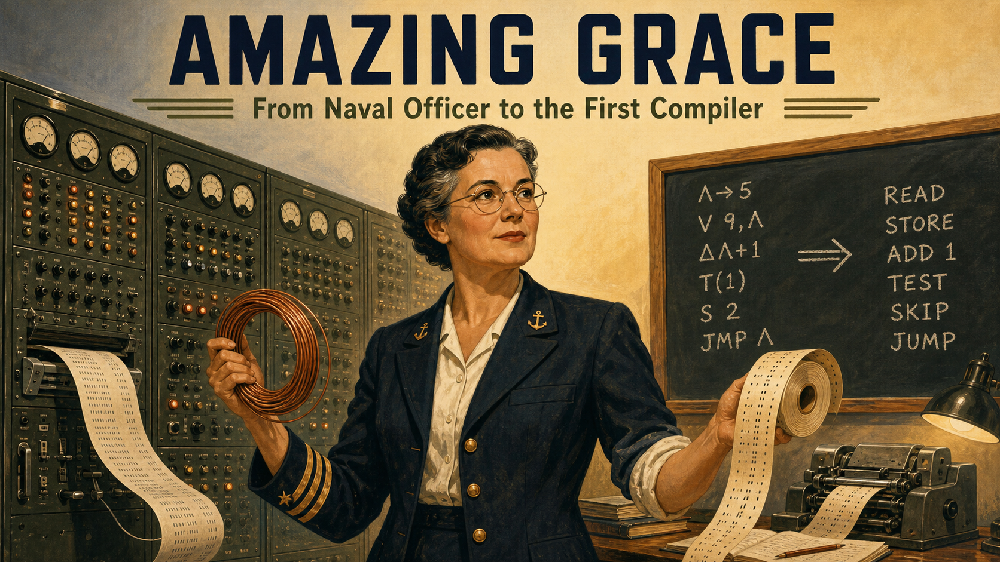

Cover Image Prompt

(This is the Cover Image. Do not include this label in the image.)
Please generate a wide-landscape 16:9 cover image in a mid-century technical-manual
illustration style, the kind of confident, slightly optimistic realism used on 1950s
engineering textbook covers. A woman in her late forties stands at the center: short
dark hair going gray at the temples, round wire-frame glasses, a calm and alert
expression, wearing a US Navy officer's uniform jacket over a simple blouse with the
sleeve loosely rolled, as if she just stepped away from a workbench. She holds a coiled
length of copper wire in one hand and a spool of paper punch tape in the other. Behind
her looms a wall of large cabinet-style computing equipment — rows of dial gauges,
switches, and glowing indicator lights, with a printed paper readout curling out of a
slot. A chalkboard beside her carries a handwritten line of symbolic code being
translated into plain English words with an arrow between them. The color palette
blends dark olive-drab and navy blue on the left with warmer amber and cream tones on
the right, suggesting a journey across decades within a single frame. The title text
"AMAZING GRACE" appears at the top in a bold, slightly rounded mid-century sans-serif
typeface, stamped like a technical manual's title block, with "From Naval Officer to
the First Compiler" beneath it in a smaller weight. Emotional tone: quietly triumphant,
determined, forward-looking. Generate the image immediately without asking clarifying
questions.

Narrative Prompt

This story spans the United States from 1943 to 1986, following a mathematician who
became a naval officer and computing pioneer. The art style deliberately evolves across
three eras to mark the passage of time: Panels 1 through 4 use a 1940s wartime
documentary-noir look — high contrast, muted olive, khaki, and gunmetal tones, hard
shadows, newsreel framing. Panels 5 through 8 shift to a 1950s Mid-Century Modern
"Atomic Age" illustration style — warmer palette of cream, teal, mustard yellow, and
brushed aluminum, optimistic geometric composition, echoing period corporate technical
brochures. Panels 9 through 12 shift again to a warmer, slightly more naturalistic late-
20th-century documentary illustration style — soft lighting, fuller color range,
textured paper grain, evoking 1970s-80s photojournalism. Character consistency: the
central woman keeps the same likeness throughout every panel — round wire-frame
glasses, short dark hair (graying progressively across the decades), a medium build,
an alert and warm expression, and small, precise hand gestures when she is explaining
something. In early panels she wears a Navy WAVES uniform (dark jacket, tie, garrison
cap); in mid-career panels she wears tailored 1950s civilian skirt-suits appropriate to
a technical workplace; in later panels she wears a Navy officer's service uniform with
increasing rank insignia on the sleeve. No modern text overlays, no anachronistic
objects, and no real corporate logos or trademarked product markings should appear
anywhere in any panel — describe machines and software generically rather than by
brand name.

### Prologue – The Woman Who Built the Ladder

Every time a programmer types a word instead of a string of binary digits, they are
standing on ground Grace Hopper cleared by hand. Born in 1906, she spent her career
convinced that machines — not just people — could be taught to translate human intent
into the exact instructions a processor needed, a claim the smartest engineers of her
generation considered close to nonsense. She proved them wrong twice: once with a
working compiler in 1952, and once more with a language so plain that businesspeople
who had never touched a machine could read it. This course spends its second half
asking students to walk back down the ladder she spent forty years building upward —
which makes her origin story less a detour than a mirror held up to the whole class.

## Panel 1: A Professor Waiting for a War to Need Her

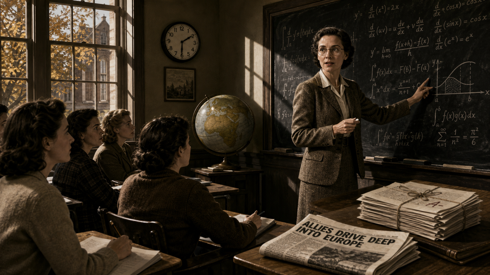

Image Prompt

(This is Panel 01. Do not include the panel number in the image.)
I am about to ask you to generate a series of images for a graphic novel. Please make
the images have a consistent style and consistent characters. Do not ask any
clarifying questions. Just generate the image immediately when asked.

Please generate a 16:9 image in 1940s wartime documentary-noir style depicting panel 1
of 12. The scene shows a woman in her late thirties with short dark hair, round wire-
frame glasses, and a tweed jacket over a blouse, standing at a chalkboard dense with
handwritten calculus notation in a small New York state college classroom, autumn
1943. A handful of young women students sit at wooden desks taking notes. Set the
scene with these specific visual details: a folded newspaper on the front desk with a
bold partial headline about the war in Europe; a wall clock reading mid-afternoon; tall
multi-pane windows with autumn light slanting across the floorboards; a globe on a side
table angled toward Europe; her hand mid-gesture holding a piece of chalk; a stack of
graded exams tied with string on the corner of the desk. Color palette: muted olive,
brown, and cream with hard directional light. Emotional tone: restless, purposeful,
waiting for permission to do more. Generate the image immediately without asking
clarifying questions.

By 1943, Grace Hopper had already earned a doctorate in mathematics from Yale and spent
over a decade teaching at a women's college, but the war overseas made her academic
post feel suddenly too small. She requested a leave of absence, determined to put her
mathematics to direct use rather than watch the effort from a lecture hall. The Navy
she wanted to join, however, was not eager to want her back. At thirty-six, and by the
Navy's own charts several pounds under its minimum enlistment weight, she did not fit
the profile the recruiters were looking for.

## Panel 2: Talking Her Way Past the Recruiting Chart

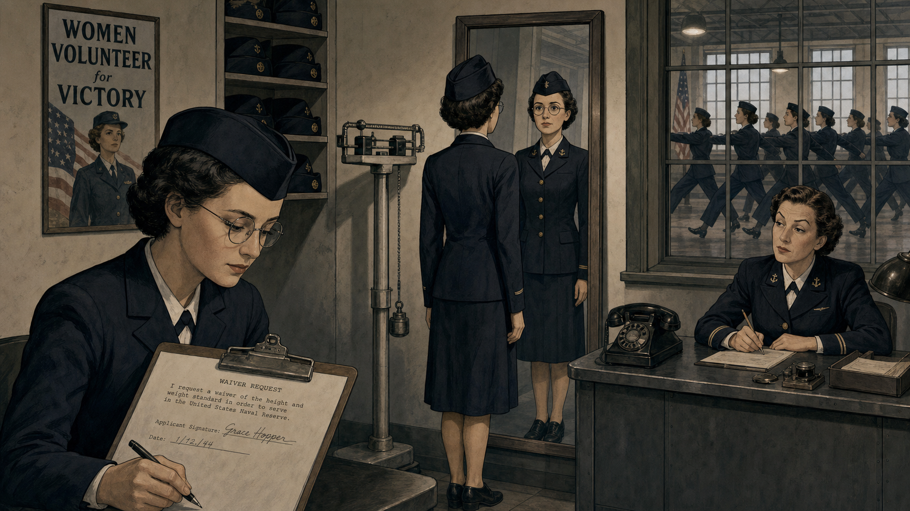

Image Prompt

(This is Panel 02. Do not include the panel number in the image.)
Please generate a 16:9 image in 1940s wartime documentary-noir style depicting panel 2
of 12. Keep the woman's likeness consistent with panel 1: same face, same round wire-
frame glasses, now with short hair tucked under a Navy garrison cap. The scene is a
Naval Reserve recruiting and training office at a New England women's college campus
converted for wartime use, winter 1943 to 1944. Include these specific visual details:
a physician's scale with a hanging weight balance and a clipboard showing a waiver
form being signed; a recruiting officer behind a metal desk reviewing paperwork with a
raised eyebrow; a row of women in matching dark Navy uniforms drilling in formation
visible through a window; a framed poster on the wall calling for women volunteers; her
own reflection in a narrow hallway mirror as she stands very straight; stacks of
identical uniform garrison caps on a shelf. Color palette: navy blue, khaki, and steel
gray under flat institutional light. Emotional tone: quiet determination overcoming
bureaucratic resistance. Generate the image immediately without asking clarifying
questions.

The Navy's own charts said no, but Hopper argued her case anyway, securing a special
exemption to enlist below the required weight. She reported to the Naval Reserve's
Midshipmen's School that December, one of the first women to train there, and pushed
through the same drills and coursework as everyone else. She graduated first in her
class in June 1944, commissioned a lieutenant, junior grade — proof, before her real
work had even begun, that the fastest way past a closed door was often simply to keep
pushing on it.

## Panel 3: Meeting the Machine That Filled a Room

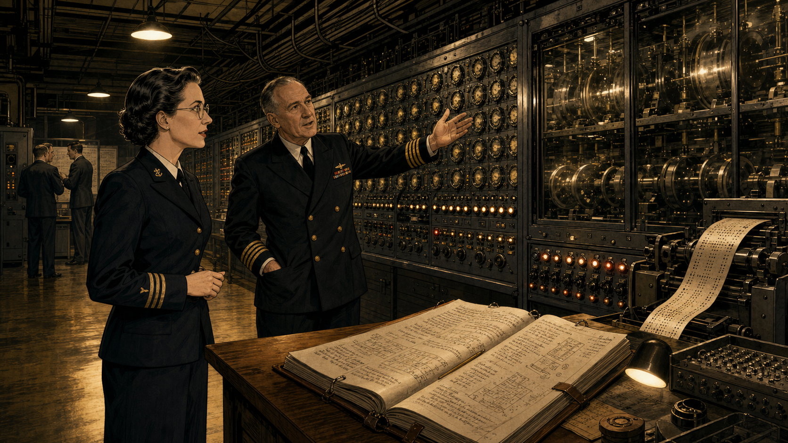

Image Prompt

(This is Panel 03. Do not include the panel number in the image.)
Please generate a 16:9 image in 1940s wartime documentary-noir style depicting panel 3
of 12. Keep the woman's likeness and Navy uniform consistent with the prior panels.
The setting is a long, high-ceilinged university laboratory in Cambridge, Massachusetts
in 1944, dominated by an enormous electromechanical calculating machine that stretches
down most of one wall — a wall of synchronized rotating dials, thousands of mechanical
switches, and spinning shafts behind glass panels, humming with motion. Include these
specific visual details: a senior officer in Navy uniform gesturing toward the machine
as if explaining its operation; loops of punched paper tape feeding into a reader; a
thick handwritten operations manual open on a wooden desk in the foreground with
diagrams in the margins; exposed cable bundles running along the ceiling; a bank of
indicator lights along the machine's face; sawdust-toned wooden floor reflecting the
overhead lamps. Color palette: brass, gunmetal gray, and warm lamp-yellow against
dark shadow. Emotional tone: awe mixed with instant, focused curiosity. Generate the
image immediately without asking clarifying questions.

Lieutenant Hopper arrived at the Bureau of Ships Computation Project at Harvard to find
a machine unlike anything she had trained on: fifty-one feet of synchronized shafts and
relays, capable of arithmetic no human team could match by hand. Assigned to the
programming staff under the machine's designer, she taught herself its operation from
its wiring diagrams alone and began writing the operating manual — a five-hundred-page
document that doubled as the first serious attempt to explain how to instruct a
computer at all. She was, in effect, becoming one of its first programmers before that
job title existed.

## Panel 4: The Moth in Relay Seventy

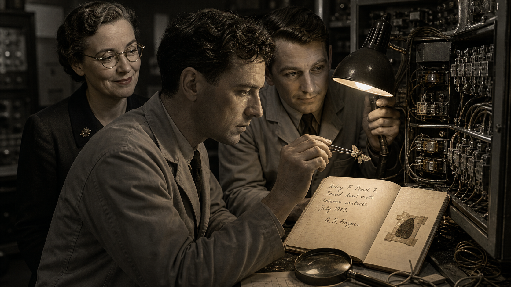

Image Prompt

(This is Panel 04. Do not include the panel number in the image.)
Please generate a 16:9 image in 1940s wartime documentary-noir style depicting panel 4
of 12. Keep the woman's likeness and uniform consistent with the prior panels; she
stands slightly behind two technicians who are doing the hands-on work. The setting is
the same Cambridge computing laboratory, now September 1947, focused tightly on an open
relay panel of a newer, larger electromechanical calculating machine. Include these
specific visual details: a technician holding a small pair of tweezers extracting a
dead moth from between two exposed relay contacts; a second technician holding a desk
lamp close to the panel for light; an open logbook on a nearby table with a page turned
to a handwritten entry and a small dark shape taped beside the writing; loose wires and
open panel doors around the relay bank; a magnifying glass resting on the desk; her own
expression amused and attentive as she watches over their shoulders. Color palette:
deep gunmetal and amber lamp-light with one small warm highlight on the logbook page.
Emotional tone: wry discovery, quiet humor breaking wartime seriousness. Generate the
image immediately without asking clarifying questions.

Three years later Hopper was still at Harvard, now working on the laboratory's second,
larger calculating machine, when her team traced a stubborn relay failure to something
no wiring diagram predicted: a dead moth wedged between the contacts. A technician
taped it into the operations log beside a note reading "first actual case of bug being
found," a page still preserved today in a Washington museum collection. Engineers had
called glitches "bugs" for decades before that moth ever flew into a relay, but Hopper
told the story so often and so well over the following forty-five years that the world
came to credit her with the word itself.

## Panel 5: A Room Full of Vacuum Tubes and Doubters

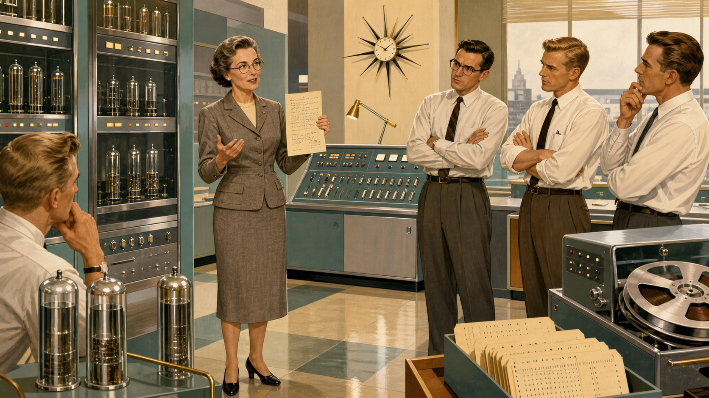

Image Prompt

(This is Panel 05. Do not include the panel number in the image.)
Please generate a 16:9 image in 1950s Mid-Century Modern "Atomic Age" illustration
style, a deliberate shift from the wartime noir look of the previous panels toward a
warmer, more optimistic period design aesthetic. This is panel 5 of 12. Keep the
woman's likeness consistent — same face and glasses, now a few years older with hair
in a neat period style, wearing a tailored 1950s civilian skirt-suit instead of a
uniform. The setting is a spacious commercial computing laboratory in Philadelphia in
1949, lined with tall cabinets of vacuum tubes and blinking indicator panels, mercury-
filled memory tanks in glass cylinders, and a control console with rows of toggle
switches. Include these specific visual details: a huddle of male engineers in narrow
ties and shirtsleeves gesturing skeptically at a handwritten note she holds up; a spool
of magnetic tape mounted on a large reel; a punch-card sorting tray full of cards; a
wall clock with atomic-age starburst hands; her calm, unbothered posture contrasted
with their crossed arms; warm overhead fluorescent lighting reflecting off polished
floor tile. Color palette: cream, teal, brushed aluminum, and mustard yellow. Emotional
tone: confident conviction facing polite, arms-crossed disbelief. Generate the image
immediately without asking clarifying questions.

After the war, Hopper joined a small Philadelphia firm building one of the first
commercially sold electronic computers, and she arrived with an idea her new colleagues
found close to absurd: that a machine itself could translate reusable blocks of
human-written instructions into the exact numeric codes the hardware required. Her
engineers had spent years hand-encoding every operation by hand and considered that
labor simply the price of admission to programming. Hopper disagreed, and set out to
build the thing they insisted could not be built.

## Panel 6: The Machine That Translates Itself

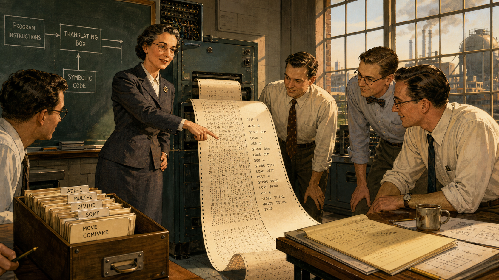

Image Prompt

(This is Panel 06. Do not include the panel number in the image.)
Please generate a 16:9 image in 1950s Mid-Century Modern "Atomic Age" illustration
style depicting panel 6 of 12. Keep the woman's likeness and 1950s skirt-suit
consistent with panel 5. The setting is the same Philadelphia computing laboratory in
1952, now focused on a moment of vindication. Include these specific visual details: a
long printed paper tape unrolling from a machine onto the floor, covered in dense
symbolic code on one half and a cleanly organized instruction listing on the other; a
handwritten index card catalog box labeled with subroutine names lined up on the desk;
her hand pointing confidently at the printout while two engineers lean in, no longer
crossing their arms; a small chalkboard behind her with a diagram of blocks feeding
into a single translating box; a cup of coffee gone cold beside a pile of technical
notes; warm afternoon light coming through a factory-style window. Color palette:
cream, warm brass, and teal with a brighter, more saturated highlight on the printout.
Emotional tone: quiet vindication, the specific satisfaction of being proven right.
Generate the image immediately without asking clarifying questions.

By 1952, Hopper had it working: a program that read a catalog of reusable subroutines
and automatically linked and translated them into working machine instructions,
something she called a compiler. The skeptics who had waved her off two years earlier
now stood over the same printout, watching code assemble itself. The demonstration did
not just save labor — it proved that instructing a machine did not have to mean
speaking only in the machine's own native numbers, an idea the rest of her career would
push considerably further.

## Panel 7: Teaching a Computer to Read English

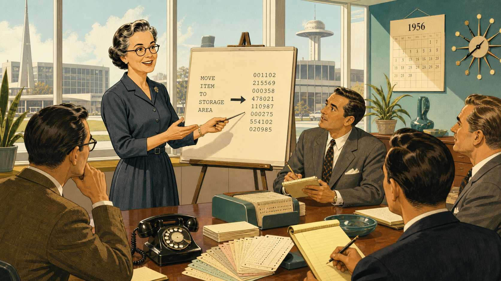

Image Prompt

(This is Panel 07. Do not include the panel number in the image.)
Please generate a 16:9 image in 1950s Mid-Century Modern "Atomic Age" illustration
style depicting panel 7 of 12. Keep the woman's likeness and period dress consistent
with prior panels, now around 1956, hair styled slightly differently to mark the passage
of a few years. The setting is a bright corporate research office with large windows,
mid-1950s. Include these specific visual details: a large drafting easel displaying a
handwritten instruction that reads like a plain English sentence with an arrow pointing
to a block of dense numeric code beside it; a small group of business-suited visitors
looking intrigued rather than skeptical this time, notepads in hand; a stack of
punch cards fanned out on a conference table like playing cards; a rotary telephone on
the corner of her desk; potted office plants typical of the era; a wall calendar with
the year visible. Color palette: mustard yellow, teal, and cream with soft daylight.
Emotional tone: growing momentum and persuasive enthusiasm. Generate the image
immediately without asking clarifying questions.

Hopper's next conviction went further than her first: if a compiler could translate
symbolic code, it could translate something closer to ordinary English. She and her
team built a business-oriented language that let a programmer write instructions
resembling plain sentences instead of cryptic operation codes, aimed squarely at
managers and clerks who had never been trained as engineers. The idea drew a new kind
of audience — business visitors who had ignored her machine-code demonstrations were
suddenly leaning forward, because for the first time, they could read what the program
actually said.

## Panel 8: The Committee That Didn't Trust Plain English

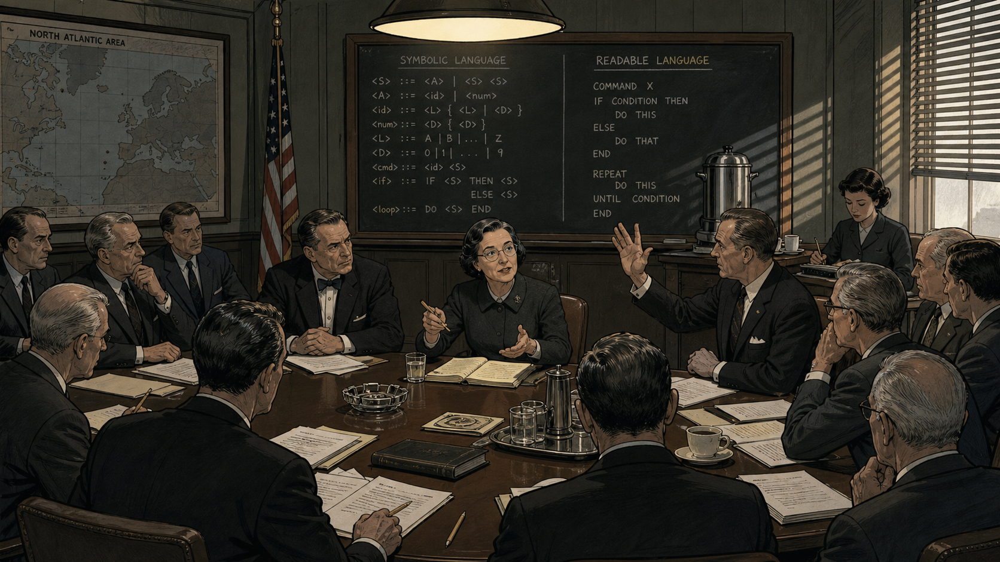

Image Prompt

(This is Panel 08. Do not include the panel number in the image.)
Please generate a 16:9 image in 1950s Mid-Century Modern "Atomic Age" illustration
style depicting panel 8 of 12. Keep the woman's likeness and period dress consistent,
now 1959, seated at a long committee conference table. The setting is a formal
government-adjacent conference room in Washington, D.C., with a large wall map and
institutional wood paneling. Include these specific visual details: roughly a dozen
committee members, mostly men in dark suits, seated around a long table strewn with
draft technical papers; a chalkboard at the front showing two competing syntax examples
side by side, one dense and symbolic, one written in readable words; one committee
member with an openly doubtful raised hand mid-objection; a stenographer taking notes
at a side table; a coffee urn on a side cart; window blinds casting long striped
shadows across the table. Color palette: cooler institutional gray-green mixed with
warm lamp light at the center of the table. Emotional tone: tense professional
disagreement, her calm insistence holding the room. Generate the image immediately
without asking clarifying questions.

When a national standards committee convened in 1959 to design a common business
programming language, Hopper served as its technical consultant, and her English-like
approach became its foundation. Not everyone at the table welcomed it: to engineers
raised on symbolic notation and raw machine code, a language built from readable words
looked more like a secretarial convenience than serious computer science. The committee
argued the point for months, but the language that emerged from those sessions —
extending the very sentence-like syntax Hopper had already built — spread within a
decade into more business computing installations than any language before it.

## Panel 9: Eleven and Three-Quarters Inches of Light

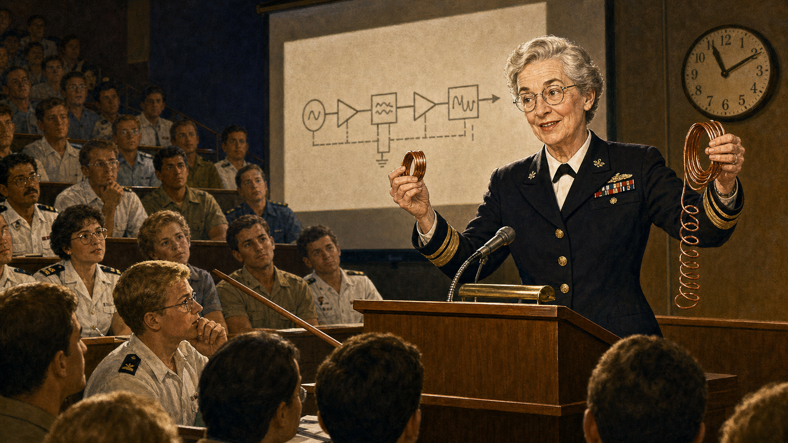

Image Prompt

(This is Panel 09. Do not include the panel number in the image.)
Please generate a 16:9 image in a warmer, more naturalistic late-20th-century
documentary illustration style, a deliberate shift from the Atomic Age look of the
previous panels to reflect the passage of another two decades. This is panel 9 of 12.
Keep the woman's likeness consistent but now visibly older, hair short and fully gray,
same round glasses, wearing a Navy officer's service uniform with visible rank
insignia on the sleeve. The setting is a packed university lecture hall or military
training auditorium in the mid-1970s. Include these specific visual details: she stands
at a lectern holding up a short coil of copper wire in one hand and a much longer coil
in the other for comparison; rows of attentive students and officers filling stadium
seating, some taking notes; an overhead projector casting a diagram of a signal path
onto a screen behind her; a small analog clock on the wall; a pointer resting on the
lectern; warm stage lighting against a dim auditorium. Color palette: warm amber and
navy blue with soft directional stage light. Emotional tone: magnetic, humorous,
commanding authority earned through decades of hands-on credibility. Generate the
image immediately without asking clarifying questions.

In her later career Hopper became one of computing's most sought-after public
teachers, famous for a single, unforgettable prop: a piece of wire just under a foot
long, the exact distance electricity travels in one billionth of a second. She would
hold it up beside a much longer coil representing a millionth of a second and let
audiences of engineers, officers, and executives feel the physical cost of distance
inside a machine, rather than merely hear it explained. It was showmanship in service
of a real point, and it made hardware limits legible to people who had never opened a
processor's case.

## Panel 10: Recalled, Again

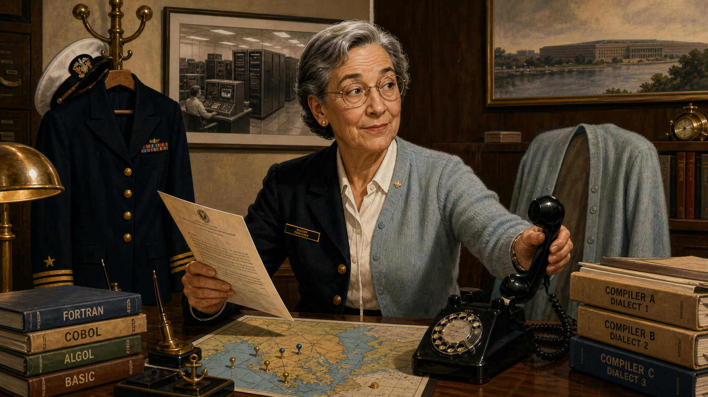

Image Prompt

(This is Panel 10. Do not include the panel number in the image.)
Please generate a 16:9 image in warmer late-20th-century documentary illustration
style depicting panel 10 of 12. Keep the woman's likeness consistent, gray-haired,
same glasses, now shown transitioning between two identities within one composition.
The setting is a modest Pentagon-area office in the late 1960s, split visually down the
middle. Include these specific visual details: on one side of the desk, a Navy dress
uniform jacket hangs freshly pressed on a coat rack; on the other side, a civilian
cardigan drapes over her chair; an official recall-to-active-duty letter lies open on
the blotter with a formal letterhead visible but unreadable; a rotary desk telephone
mid-ring with the receiver just being lifted; a wall map of naval computer
installations dotted with pins; a framed photograph of the room-sized calculating
machine from her earlier career on a shelf behind her; stacks of technical manuals
comparing incompatible programming dialects across different computers. Color palette:
warm wood tones, navy blue, and brass. Emotional tone: wry acceptance of being needed
yet again. Generate the image immediately without asking clarifying questions.

Hopper's Navy career refused to end on schedule. She first left active duty in the
mid-1960s, only to be called back within a year to help standardize incompatible
programming languages running across the Navy's scattered computer systems — a job
only someone with her exact hybrid credentials could do. That pattern repeated for
nearly two more decades: brief retirements followed by fresh recalls, each one arguing
that the woman who had spent thirty years fluent in both military discipline and
machine logic was too valuable to actually let go.

## Panel 11: The Oldest Officer in the Fleet

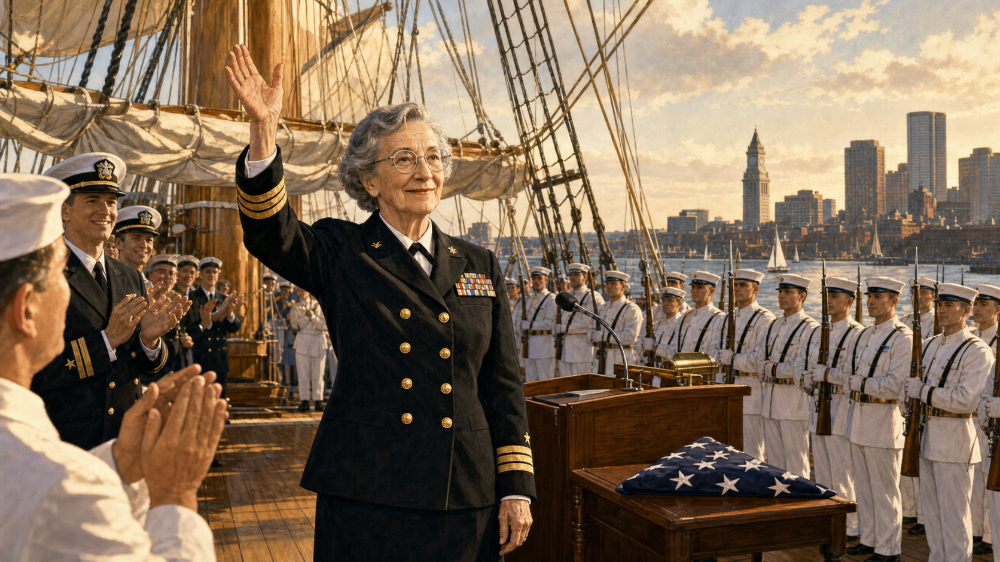

Image Prompt

(This is Panel 11. Do not include the panel number in the image.)
Please generate a 16:9 image in warmer late-20th-century documentary illustration
style depicting panel 11 of 12. Keep the woman's likeness consistent, now late
seventies, silver hair, same round glasses, wearing a formal Navy dress uniform with a
rear admiral's insignia and a chest of service ribbons. The setting is the deck of a
historic wooden-hulled naval sailing vessel in Boston Harbor, August 1986, dressed for
a formal retirement ceremony. Include these specific visual details: an honor guard in
white dress uniforms standing at attention along the deck rail; younger officers and
sailors applauding with visible warmth and admiration rather than mere formality; the
ship's tall rigging and furled sails framing the sky above; a small ceremonial podium
with a flag folded nearby; harbor water and distant city skyline visible past the
ship's rail; her expression composed but clearly moved. Color palette: warm gold late-
afternoon light, navy blue, and white. Emotional tone: dignified, emotional culmination
of a decades-long career. Generate the image immediately without asking clarifying
questions.

On August 14, 1986, Rear Admiral Grace Hopper retired from the Navy for good, seventy-
nine years and eight months old, the oldest commissioned officer then on active duty
in the United States armed forces. The retirement ceremony took place aboard the
nation's oldest commissioned warship still afloat, a fitting pairing of two long
service records finally standing side by side. She had entered as a reluctant
exception to the Navy's own rulebook forty-three years earlier; she left as one of its
most decorated and celebrated technical officers.

## Panel 12: The Ladder She Left Standing

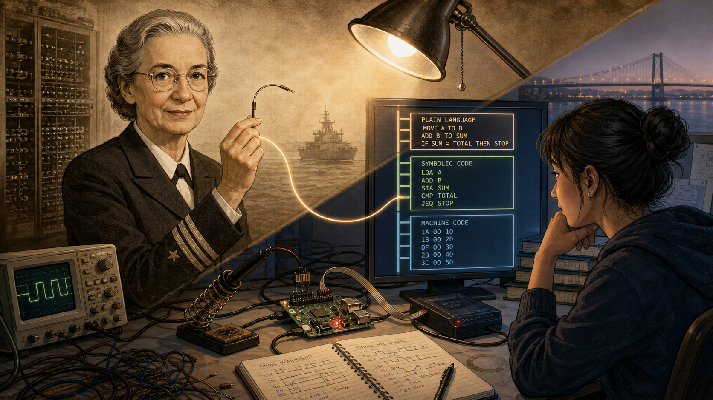

Image Prompt

(This is Panel 12. Do not include the panel number in the image.)
Please generate a 16:9 image in warmer late-20th-century documentary illustration
style with a subtle contemporary bridge element, depicting panel 12 of 12, the final
panel of the story. Compose the image as a diagonal split: in the upper left, a soft,
slightly faded illustration of the gray-haired woman in Navy uniform from the previous
panel, holding her short wire prop, rendered like a respectful historical portrait. In
the lower right, in cleaner and more contemporary linework, a present-day engineering
student sits at a cluttered desk working with a small single-board computer and a
debugger display, surrounded by three stacked layers of visible code — the top layer
in plain readable words, the middle layer denser and more symbolic, the bottom layer
raw hexadecimal digits — arranged like the rungs of a ladder connecting the two halves
of the image. Include these specific visual details: a soldering iron resting on a
stand near the student; a small oscilloscope screen showing a waveform; a coffee mug
with a cold ring stain; a notebook full of handwritten timing measurements; a desk lamp
casting warm light across both halves of the split composition; a faint ghostly line
connecting the woman's wire prop to the ladder of code layers, visually linking the two
eras. Color palette: the historical half in warm sepia and navy, the modern half in
cooler blue-white monitor glow, meeting at a soft gradient in the center. Emotional
tone: reflective, connective, quietly inspiring. Generate the image immediately without
asking clarifying questions.

Every high-level programming language written since traces some part of its lineage
back to Hopper's stubborn conviction that a machine could translate for itself. The
layers she spent a career building — compiler above assembler, readable language above
raw numeric code — are the same layers a computer science curriculum now teaches
students to take for granted. This course asks something almost inverse of her legacy:
having inherited the ladder she built, it asks each student to climb back down it, rung
by rung, until raw machine instructions are no longer abstract at all.

### Epilogue – What Made Hopper Different?

Hopper's career reads less like a single breakthrough than a long argument, repeated in
different forms for four decades: that human effort spent translating ideas into
machine code by hand was effort a machine itself could be taught to do instead. She won
that argument against enlistment officers, skeptical engineers, and a standards
committee that doubted plain English belonged anywhere near a computer, and she kept
winning it well into her seventies from a Navy lecture podium. What made her different
was not any single invention but a refusal to accept "that's just how it's done" as a
final answer — a habit this course's own emphasis on measuring rather than assuming
would have suited her perfectly.

| Challenge | How Hopper Responded | Lesson for Today |
|---|---|---|
| Told she was too old and underweight to enlist | Secured a formal exemption and graduated first in her Midshipmen's class | Formal requirements are a starting point for negotiation, not always the final word |
| Colleagues insisted only humans could safely translate code into machine instructions | Built a working compiler in 1952 and demonstrated it running | Skepticism is not evidence — a working prototype settles arguments words cannot |
| A standards committee doubted English-like syntax belonged in serious computing | Stayed on the committee and let the language's adoption make the case for her | Durable ideas often win by spreading in practice, not by winning the room first |
| Repeatedly retired, then recalled to solve problems no one else could | Accepted each recall and kept working across a forty-year span | Deep, unusual expertise built over decades rarely goes unneeded for long |

### Call to Action

Chapter 19 of this course, "The Abstraction Ladder," lays out the same layers Hopper
spent her career building: assembly beneath C, C beneath a compiler, a compiler beneath
a language a human can actually read comfortably. As you write your own hand-tuned
Cortex-M assembly in the labs ahead, you are not rejecting Hopper's work — you are
briefly stepping below it, on purpose, to understand exactly what her compilers have
been quietly doing for you all along.

---

*"It's easier to ask forgiveness than it is to get permission."*
—Grace Hopper

*"The most dangerous phrase in the language is, 'We've always done it this way.'"*
—Grace Hopper

---

## References

1. [Wikipedia: Grace Hopper](https://en.wikipedia.org/wiki/Grace_Hopper) - Biography covering her education, Navy service, and computing career
2. [Wikipedia: A-0 System](https://en.wikipedia.org/wiki/A-0_System) - The compiler Hopper completed in 1952, generally regarded as the first of its kind
3. [Wikipedia: Harvard Mark I](https://en.wikipedia.org/wiki/Harvard_Mark_I) - The Harvard electromechanical computer Hopper was assigned to program in 1944
4. [Naval History and Heritage Command: Grace Murray Hopper](https://www.history.navy.mil/research/histories/biographies-list/bios-h/hopper-grace.html) - Official U.S. Navy biography of her career and service record
5. [Encyclopaedia Britannica: Grace Hopper](https://www.britannica.com/biography/Grace-Hopper) - Overview of her life, computing contributions, and Navy career
