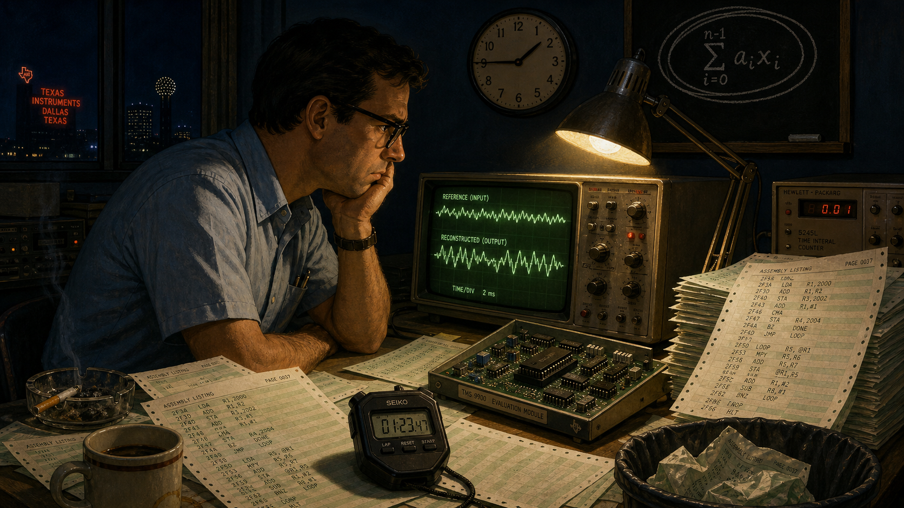
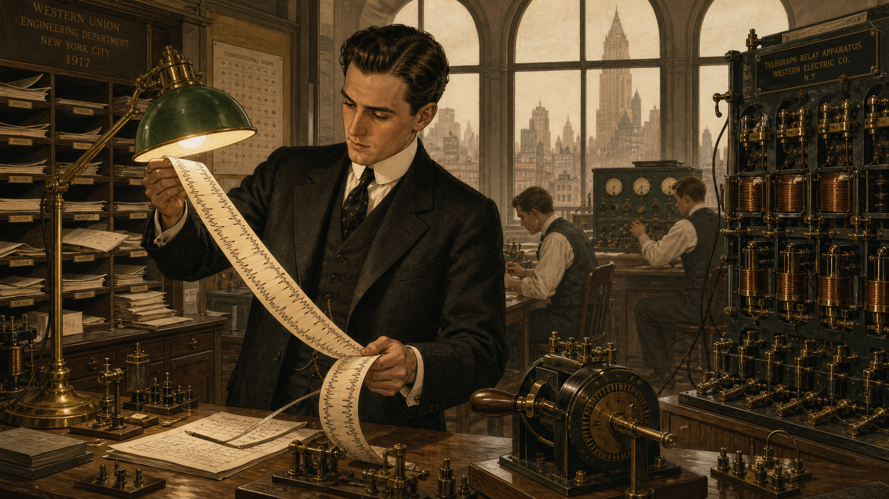
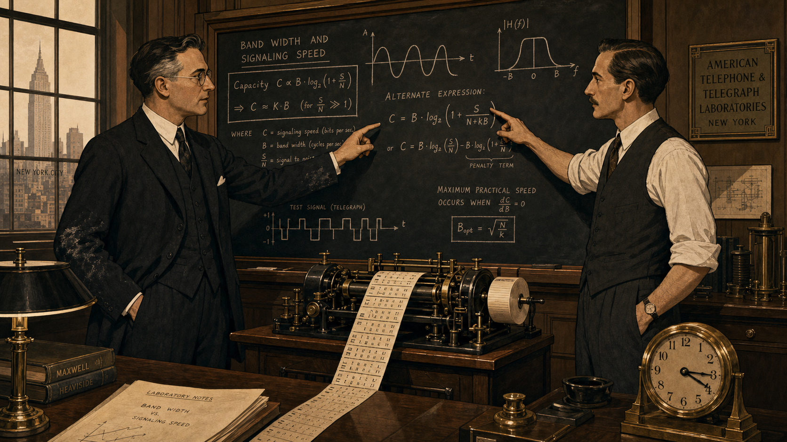
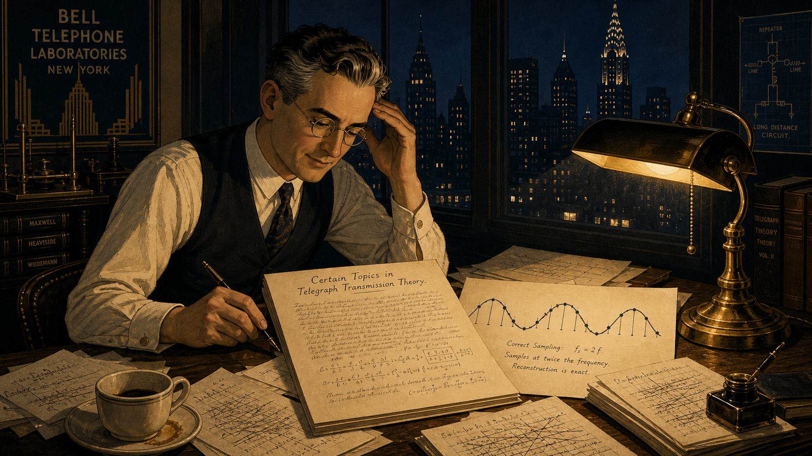
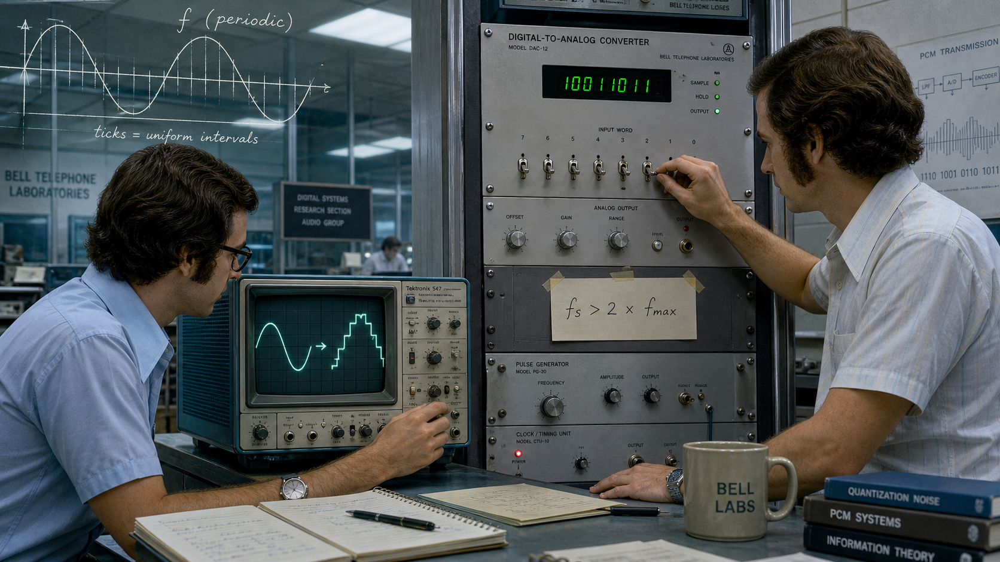
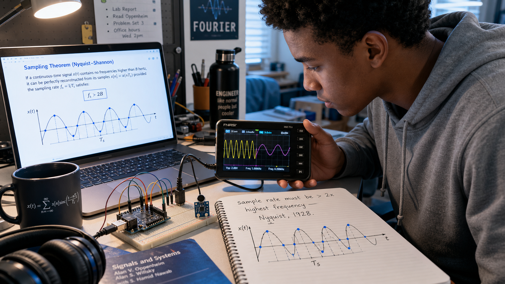

# The Theorem Nobody Needed Yet: Harry Nyquist and the Sampling Limit

Cover Image Prompt

(This is the Cover Image. Do not include this label in the image.)
Generate a wide-landscape 16:9 cover image in a 1920s Art Deco / Modernist
illustrated style. A composed man in his late thirties stands at a
drafting desk in a corner research office: neatly parted dark hair,
round wire-rim glasses, a high forehead, a three-piece charcoal wool
suit with a pocket watch chain, sleeves rolled slightly at the cuff. He
leans over a sheet of graph paper on which a smooth sine wave is drawn
above a second, jagged and broken version of the same wave — a visual
contrast between a clean signal and a distorted one. Behind him, a tall
factory-style window of steel-framed glass looks out on a dense 1920s
Manhattan skyline in soft amber late-afternoon light. Brass telegraph
relay equipment, a wall clock, and a shelf of bound technical journals
frame the scene. The color palette is warm sepia, brass, and deep
navy, with geometric Art Deco linework in the composition. Render the
title "THE THEOREM NOBODY NEEDED YET" across the top third in bold,
stepped, geometric Art Deco sans-serif lettering, and beneath it in
smaller matching lettering "Harry Nyquist and the Sampling Limit." The
emotional tone is quiet, exacting confidence — a man certain of a
result the world has no immediate use for yet. Generate the image
immediately without asking clarifying questions.

Narrative Prompt

This story follows Harry Nyquist (1889-1976), a Swedish-born engineer
who emigrated to the United States in 1907 and spent his career at a
major American telecommunications research organization, where in 1928
he derived the exact mathematical limit on how fast a signal must be
sampled to be reconstructed without loss. The story spans Sweden in
1907, a Midwestern American university around 1912-1917, and a New
York City telecommunications research department from 1917 through the
1950s, before bridging forward to digital audio's arrival decades later
and finally to a present-day student's microcontroller lab bench.
Panels 1 through 5 should use a consistent 1900s-1950s Art Deco /
Modernist illustrated style: warm sepia, brass, and navy tones,
geometric linework, formal early-20th-century clothing, and analog
brass-and-bakelite laboratory equipment (oscillographs, telegraph
relays, hand-cranked recorders — no digital displays anywhere in this
range). Panel 6 should visually bridge that palette toward a cooler,
more photographic late-20th-century look. Panel 7 should render in a
fully contemporary photorealistic illustrated style with natural
lighting. Character consistency note: Nyquist should be drawn
consistently across panels 1-6 as a stocky, composed man who ages from
a lean 18-year-old in work clothes (panel 1) to a distinguished
researcher in a three-piece suit with round wire-rim glasses and neatly
parted dark hair, gradually graying by panel 5. No real company names,
product names, or trademarks should appear as visible text or logos in
any generated image; describe settings generically (a telecommunications
research laboratory, a university lab bench) rather than naming real
brands.

### Prologue – A Rule With No Use Yet

In 1928, a Swedish-born engineer in a New York research laboratory published a dense, equation-heavy paper about telegraph lines — and, buried inside it, a limit so exact it would eventually govern every microphone, every compact disc, and every microcontroller that ever touched a sound wave. Nobody who read it that year owned a device that could act on it. The vacuum tubes of the era could amplify a signal, filter it, even transmit it wirelessly across an ocean, but none of them could do the one thing the limit was about: turn a continuous wave into a stream of discrete numbers. Harry Nyquist proved his rule half a century before the hardware existed to need it. This is the story of a theorem that had to wait for the future to catch up — and of why, in Chapter 6 of this course, it is still the first thing that decides whether your sampled signal tells the truth or lies to you.

## Panel 1: A Passage Earned in Four Years of Labor

Image Prompt

(This is Panel 01. Do not include the panel number in the image.)
I am about to ask you to generate a series of images for a graphic
novel. Please make the images have a consistent style and consistent
characters. Do not ask any clarifying questions. Just generate the
image immediately when asked. Generate a 16:9 image in a 1900s-1910s
Art Deco / Modernist illustrated style depicting panel 1 of 7. The
scene shows a lean eighteen-year-old man with weathered hands, short
dark hair under a flat wool cap, and a patched wool coat, standing on
a wooden dock in a small Swedish harbor town in 1907. He carries a
small worn suitcase tied shut with rope and a folded work permit. A
large steamship with a black hull and a single tall funnel looms
behind him, gangplank lowered, gray smoke rising into an overcast sky.
Stacks of construction timber and masonry tools sit at the dock's edge,
referencing the four years he spent building a factory to earn his
fare. Gulls circle overhead; other emigrant families with bundled
belongings wait nearby. The color palette is muted gray-blue and worn
brown, evoking cold Baltic light. The emotional tone is quiet
determination mixed with uncertainty. Generate the image immediately
without asking clarifying questions.

Harry Nyquist was fourteen when he decided his family could never afford the schooling a teaching career required, so he set himself a different plan: build the passage himself. For four years he worked construction at a chemical factory site near his home parish of Nilsby, banking wages toward a ticket to America. In 1907, at eighteen, he sailed for the United States with almost no English and no money to spare, and spent the next five years doing manual labor before he had saved and studied his way into the University of North Dakota. By 1917 that same stubbornness had carried him through a bachelor's and master's degree in electrical engineering and into a Ph.D. in physics at Yale — earned, like everything before it, one shift and one semester at a time.

## Panel 2: The Problem on the Wire

Image Prompt

(This is Panel 02. Do not include the panel number in the image.)
Generate a 16:9 image in a 1910s-1920s Art Deco / Modernist illustrated
style depicting panel 2 of 7. Make the characters and style consistent
with the prior panel, aged forward: the same man, now twenty-eight, in
a fitted dark three-piece suit with a high starched collar, hair
combed neatly back, standing at a wooden workbench inside a
telecommunications engineering research floor in New York City in
1917. He examines a long unspooling ribbon of photographic oscillograph
film covered in jagged squiggling traces of telegraph signal pulses,
holding it up to a brass desk lamp. Around him: a wall of pigeonhole
message slots stuffed with paper, a large brass-and-bakelite telegraph
relay rack humming with visible wound coils, a rotary hand-crank signal
generator, and tall arched windows with a hazy Manhattan skyline
beyond. Two other engineers in shirtsleeves and vests work at desks in
the background, one adjusting a set of dials. The color palette is
warm sepia, brass, and deep green desk-lamp glass. The emotional tone
is focused, methodical curiosity at the start of a career. Generate
the image immediately without asking clarifying questions.

Fresh out of Yale, Nyquist went to work for the American Telephone and Telegraph Company in New York, joining its transmission research department in 1917. The problem waiting for him was stubbornly physical: a telegraph wire has a fixed bandwidth, and every engineer in the building knew, by rule of thumb and hard experience, that cramming signals faster than a line could carry them turned clean dots and dashes into unreadable mush. Nobody had yet worked out exactly how fast was too fast, only that some invisible ceiling existed and that whoever found its precise value would own the mathematics of every wire the company owned. Nyquist spent his first decade at the company chasing that ceiling with an oscillograph, a slide rule, and a physicist's insistence on proof rather than folklore.

## Panel 3: Bandwidth and Speed, Worked Out on a Blackboard

Image Prompt

(This is Panel 03. Do not include the panel number in the image.)
Generate a 16:9 image in a 1920s Art Deco / Modernist illustrated style
depicting panel 3 of 7. Make the characters and style consistent with
the prior panels. The scene is set inside a wood-paneled research
office at a telecommunications laboratory in New York City around
1924. Two men in dark three-piece suits stand before a large slate
blackboard covered in sine-wave sketches, frequency-axis diagrams, and
handwritten algebraic notation relating "band width" to "signaling
speed." The taller, familiar man from earlier panels — now with
faint gray at his temples, round wire-rim glasses, chalk dust on his
sleeve — gestures at one equation while a second engineer, a lean man
with a thin mustache and rolled shirtsleeves, points to a competing
term on the board. Between them on a side table sits a hand-wound
paper-tape recorder spooling out a repeating telegraph test pattern. A
brass desk clock reads mid-afternoon. The color palette is warm sepia
and slate gray with brass accents. The emotional tone is collegial,
intense concentration — two minds converging on the same hard problem
from different angles. Generate the image immediately without asking
clarifying questions.

Nyquist was not working the bandwidth problem alone. Down the same research corridor, engineer Ralph Hartley was independently attacking the relationship between how much information a channel could carry and how quickly it could be pushed through, work that would soon produce his own influential paper on transmission and information. The two men's questions overlapped constantly through the mid-1920s: how does frequency range trade against signaling speed, and is there a hard mathematical floor beneath which no clever engineering trick can go? Nyquist's early answer, published in 1924 as "Certain Factors Affecting Telegraph Speed," showed the frequency band required was directly proportional to signaling speed — a first foothold, but not yet the full cliff face he was climbing toward.

## Panel 4: The Number That Would Not Change

Image Prompt

(This is Panel 04. Do not include the panel number in the image.)
Generate a 16:9 image in a 1920s Art Deco / Modernist illustrated style
depicting panel 4 of 7. Make the characters and style consistent with
the prior panels. The familiar bespectacled man, now in his late
thirties with visibly graying temples, sits alone at a wide oak desk
late at night in a telecommunications research office in New York
City, 1928. A single brass banker's lamp casts warm light across a
manuscript titled at the top of the page (legible, hand-lettered)
"Certain Topics in Telegraph Transmission Theory." Beside the
manuscript, a hand-drawn diagram shows a smooth continuous wave with
evenly spaced small vertical tick marks along it at twice the wave's
own frequency, each tick marked with a small dot exactly on the curve —
a visual proof sketch of correct sampling. Papers with crossed-out
equations litter the desk; a cold cup of coffee sits forgotten. Outside
the tall window behind him, the New York skyline is dark except for
scattered lit windows. The color palette is deep navy night tones cut
by warm lamp-gold. The emotional tone is quiet, solitary triumph — the
instant a result finally closes. Generate the image immediately
without asking clarifying questions.

The full result arrived in Nyquist's 1928 paper "Certain Topics in Telegraph Transmission Theory," and it was sharper than anything he had proven before: a signal band-limited to a highest frequency could be completely and unambiguously reconstructed only if it was sampled at a rate greater than twice that frequency — sample any slower and information is lost forever, no matter how clever the receiving equipment. It would take Bell Labs mathematician Claude Shannon another twenty-one years, in 1949, to prove the theorem with full mathematical rigor, which is why the result carries both their names today as the Nyquist–Shannon sampling theorem. But the number itself — twice the highest frequency present — was Nyquist's, worked out with pencil, paper, and Fourier analysis on telegraph signals that never once needed to be digitally sampled.

## Panel 5: A Result Waiting in the Journal Stacks

Image Prompt

(This is Panel 05. Do not include the panel number in the image.)
Generate a 16:9 image in a 1930s-1940s Art Deco / Modernist illustrated
style depicting panel 5 of 7. Make the characters and style consistent
with the prior panels. A quiet technical library reading room inside a
telecommunications research building, sometime in the early 1940s.
Tall wooden shelves hold rows of identical bound journal volumes; one
volume, its spine labeled "TRANSACTIONS 1928," sits slightly pulled
out and dusty, undisturbed, on a low shelf. In the middle distance, a
telephone switchboard operator in a headset works a wall of analog
patch cords, and a technician tunes a large vacuum-tube radio receiver
studded with glowing tube filaments — both machines entirely analog,
neither one able to "sample" anything. The familiar bespectacled man,
now visibly older with fully gray hair, walks past the shelf in the
background without stopping, absorbed in another problem, briefcase in
hand. Warm afternoon light slants through a tall window, catching dust
motes near the untouched journal. The color palette is faded sepia and
soft amber. The emotional tone is patient dormancy — a proven result
with nowhere yet to be used. Generate the image immediately without
asking clarifying questions.

For more than two decades, Nyquist's sampling limit sat exactly where he had left it: a correct, elegant, thoroughly proven piece of communications theory with no urgent job to do. The vacuum-tube electronics of the 1930s and 1940s could filter a signal, amplify it, and route it across a switchboard, but nothing in that era's toolkit converted a continuous wave into discrete digital numbers, so nothing needed to obey a sampling-rate limit. Telephone engineers cited Nyquist's 1928 paper respectfully in their own bandwidth calculations, but the theorem's real audience — engineers building machines that would digitize sound — would not exist for another generation. Nyquist himself moved on to other problems, including the 1932 feedback-stability work that would earn him a second, equally lasting legacy, while his sampling result waited quietly on the shelf.

## Panel 6: The Theorem Finds Its Machine

Image Prompt

(This is Panel 06. Do not include the panel number in the image.)
Generate a 16:9 image in a style that bridges 1970s technical
illustration with a slightly more photorealistic contemporary rendering,
depicting panel 6 of 7. A compact digital-audio research bench inside a
telecommunications laboratory, circa 1979. Two engineers in short-sleeve
button shirts and wide collars, one at an oscilloscope displaying a
smooth sine wave transforming into a staircase of discrete digital
values, the other adjusting an early rack-mounted digital-to-analog
converter studded with toggle switches and a small green LED readout.
A faded, ghostly translucent overlay in the upper corner of the frame
echoes the hand-drawn sine-and-tick-marks diagram from panel 4, as if
the 1928 sketch is printed transparently across the modern equipment,
visually connecting the two eras. A handwritten note taped to the rack
reads "fs > 2 x fmax." The color palette shifts from the earlier
panels' warm sepia toward cooler blues and grays, signaling the passage
of decades. The emotional tone is quiet vindication — an old proof
finally meeting the machine built for it. Generate the image
immediately without asking clarifying questions.

By the 1970s and 1980s, digital audio had finally arrived — pulse-code modulation, analog-to-digital converters, and eventually the compact disc — and every one of those systems ran headfirst into the exact ceiling Nyquist had proven in 1928. Engineers designing digital telephone systems and digital recording equipment discovered they could not simply pick a convenient sampling rate; they had to sample faster than twice the highest frequency they wanted to preserve, or the signal would fold back on itself and lie about what frequency it actually contained. What had been a dusty telegraph-theory citation for fifty years became, almost overnight, the first constraint every digital-audio engineer had to design around. The compact disc's now-familiar 44.1-kilohertz sampling rate exists because it comfortably clears twice the roughly 20-kilohertz limit of human hearing — Nyquist's rule, applied to a problem he never lived to see solved this way.

## Panel 7: The Same Rule, on a Five-Dollar Board

Image Prompt

(This is Panel 07. Do not include the panel number in the image.)
Generate a 16:9 image in a fully contemporary photorealistic
illustrated style with natural daylight, depicting panel 7 of 7. A
present-day university student — early twenties, short natural curly
hair, wearing a plain gray hoodie — leans over a cluttered dorm-room
desk lit by a laptop screen and a small desk lamp. On a breadboard in
front of them sits a small credit-card-sized microcontroller
development board connected by jumper wires to a tiny microphone
module. A handheld USB oscilloscope displays two overlapping traces: a
clean sine wave and, beside it, a distorted, lower-frequency "aliased"
wave folding back on itself. A spiral notebook lies open with a
hand-drawn diagram nearly identical to the sine-and-tick-marks sketch
from panel 4, annotated in the student's own handwriting: "sample rate
must be > 2x highest frequency — Nyquist, 1928." Coffee mug, headphones,
and textbook clutter the desk edges. The color palette is bright,
cool-toned, and modern — blues, whites, and screen-glow. The emotional
tone is the small private thrill of connecting a hundred-year-old proof
to a problem happening right now on the desk. Generate the image
immediately without asking clarifying questions.

Nearly a century after Nyquist worked it out on telegraph theory, the rule shows up unchanged on a modern student's breadboard: sample a signal slower than twice its highest frequency, and a microphone the size of a fingernail will hand back a lie — a low, false tone that was never actually present in the air. Chapter 6 of this course and Lab 9 exist entirely to make that failure mode visible on purpose, so students recognize aliasing the instant it appears in their own captured data rather than mistaking it for real content. The processor doing the sampling costs about five dollars and would have been unimaginable science fiction in 1928. The rule governing it has not changed by so much as a decimal point.

### Epilogue – What Made Nyquist Different?

Nyquist's career is a quiet argument against the idea that discovery has to be urgent to be worthwhile. He proved his sampling limit not because a customer demanded it or a product needed it, but because the mathematics of the problem in front of him — a telegraph wire's bandwidth — had an exact answer, and he was the kind of engineer who could not leave an inexact answer standing. That same patience showed up throughout his career: in the manual labor that funded his education, in the rigor he brought to a field still full of rules of thumb, and in his willingness to publish a result decades before any machine existed that needed it. What made Nyquist different was not genius alone — it was trust that a correctly proven limit stays true no matter how long it waits to matter.

| Challenge | How Nyquist Responded | Lesson for Today |
|---|---|---|
| Arrived in the U.S. at eighteen with no money, little English, and no completed schooling | Spent years in manual labor to fund his education, then worked through a state university before earning a Yale physics Ph.D. | Rigor is available to anyone patient enough to earn it one shift, one semester, at a time |
| Telegraph engineers relied on rules of thumb, not proofs, for how fast a line could safely carry signal | Replaced folklore with a closed-form mathematical bound relating bandwidth to signaling speed, and published the full proof in 1928 | A number without a proof behind it is a guess dressed up as an engineering spec |
| His 1928 sampling result had no application — 1920s electronics could not digitally sample anything | Published the theorem anyway, trusting the mathematics over any near-term market for it | Foundational limits are worth deriving before the hardware exists that will need them |
| Decades later, digital audio and DSP exploded, and engineers suddenly needed the exact rule Nyquist had proven | His 1928 bound — later formalized rigorously by Claude Shannon in 1949 — became unavoidable, load-bearing law for an entire field | When you set a sample rate in this course's labs, you are not approximating Nyquist's rule, you are obeying it exactly |

### Call to Action

Every time you set a sampling rate in Chapter 6 or run Lab 9's aliasing experiments, you are standing on ground Nyquist surveyed in 1928 with nothing but pencil, paper, and a telegraph line. Before you write a single line of sampling code, ask what he asked: what is the highest frequency actually present, and am I sampling faster than twice it? Get that one number wrong, and no amount of clever DSP code downstream will save you — the lie is already baked into your data.

---

*"The required frequency band is directly proportional to the signaling speed."*
—Harry Nyquist, "Certain Topics in Telegraph Transmission Theory" (1928)

*"The minimum band width required for unambiguous interpretation is substantially equal, numerically, to the speed of signaling and is substantially independent of the number of current values employed."*
—Harry Nyquist, "Certain Topics in Telegraph Transmission Theory" (1928)

---

## References

1. [Wikipedia: Harry Nyquist](https://en.wikipedia.org/wiki/Harry_Nyquist) - Biography of the Swedish-American engineer who derived the sampling-rate limit
2. [Wikipedia: Nyquist–Shannon sampling theorem](https://en.wikipedia.org/wiki/Nyquist%E2%80%93Shannon_sampling_theorem) - The formal theorem built on Nyquist's 1928 result and Claude Shannon's 1949 proof
3. [Wikipedia: Aliasing](https://en.wikipedia.org/wiki/Aliasing) - The exact failure mode this course's Chapter 6 and Lab 9 are designed to make visible
4. [Engineering and Technology History Wiki: Harry Nyquist](https://ethw.org/Harry_Nyquist) - IEEE History Center biography and technical-contributions archive
5. [Encyclopaedia Britannica: Harry Nyquist](https://www.britannica.com/biography/Harry-Nyquist) - Overview of Nyquist's life and contributions to information theory
