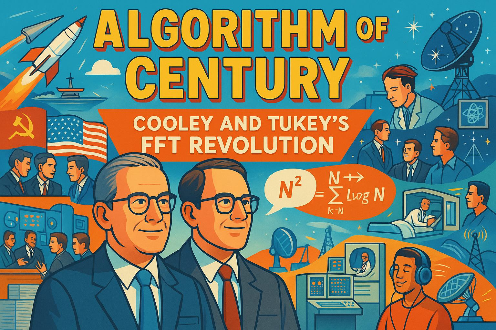

# Stories

These illustrated graphic-novel stories connect the algorithms and hardware in this course to
the people who built them — the mathematicians who found a faster transform, the engineers who
squeezed a real processor onto a $5 board, and the researchers who insisted that "fast" claims
be proven honestly.

See [Story Ideas](story-ideas.md) for the full backlog of proposed stories not yet generated.

*Clicking the card below will take you to the Signal Processing site, where the full story and
all panel images are hosted. Use your browser's back button to return here. We link rather than
duplicate because each story includes over a dozen generated images — copying them across
textbooks would add unnecessary bulk without adding value.*

- **[Algorithm of the Century: Cooley and Tukey's FFT Revolution](https://dmccreary.github.io/signal-processing/stories/fft/)**

    
    How two researchers at Princeton and IBM rediscovered a forgotten trick, cut the cost of the
    Fourier transform from N² to N log N operations, and set off the DSP revolution that
    everything in this course builds on.

