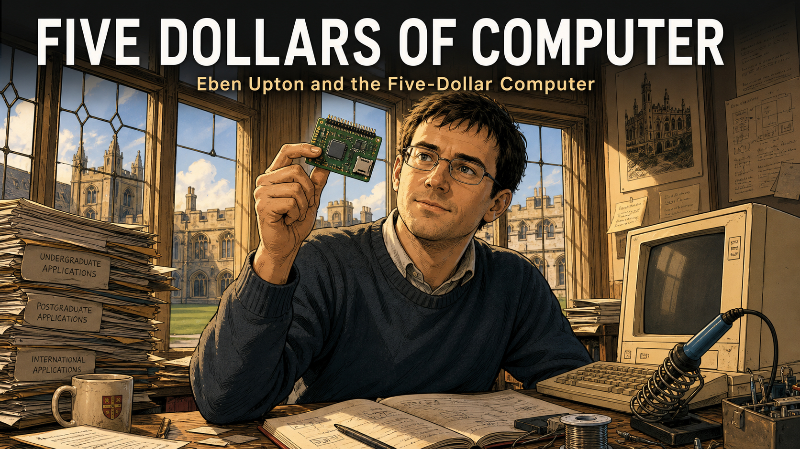

# Stories

These illustrated graphic-novel stories connect the algorithms and hardware in this course to
the people who built them — the mathematicians who found a faster transform, the engineers who
squeezed a real processor onto a $5 board, and the researchers who insisted that "fast" claims
be proven honestly.

See [Story Ideas](story-ideas.md) for the origin backlog these stories were generated from.

- **[The Theorem Nobody Needed Yet: Harry Nyquist and the Sampling Limit](harry-nyquist/index.md)**

    
    A 1920s Bell Labs researcher derives the exact sampling-rate limit decades before digital audio exists to need it — the rule every DSP engineer, including you, still lives by.

- **[Alec Reeves and the Signal That Waited Fifty Years](alec-reeves/index.md)**

    
    In 1930s Paris, an engineer invents pulse-code modulation to defeat telephone noise — an idea so far ahead of vacuum-tube technology it waited decades to reshape digital audio forever.

- **[Amazing Grace: From Naval Officer to the First Compiler](grace-hopper/index.md)**

    
    Grace Hopper talks the Navy into taking her, helps run a room-sized calculator, and builds the first compiler — the abstraction layer this course asks students to climb back down.

- **[The Machine in the Living Room: Konrad Zuse's Lonely Invention](konrad-zuse/index.md)**

    
    A Berlin engineer, tired of hand calculations, builds the world's first programmable binary floating-point computer almost entirely alone — and watches bombs destroy it twice.

- **[Wired by Hand: Betty Holberton and the ENIAC Six](betty-holberton/index.md)**

    
    Six women recruited as wartime "computers" teach themselves to program the first general-purpose electronic computer from wiring diagrams alone — then are written out of the story for decades.

- **[Cooling the Fire: Seymour Cray's Obsession with Honest Speed](seymour-cray/index.md)**

    
    Seymour Cray builds the world's fastest computers by refusing to trust any performance claim he has not personally measured and reproduced on real hardware.

- **[William Kahan and the Fight for Honest Floating-Point Math](william-kahan/index.md)**

    
    A Berkeley mathematician spends a decade resisting industry pressure to cut corners, winning the rigorous IEEE 754 standard now built into every FPU — including the one on this course's board.

- **[Self-Taught at NASA: Annie Easley's Path to Programming](annie-easley/index.md)**

    
    When electronic computers threaten to replace NASA's human computers, Annie Easley teaches herself FORTRAN and becomes a lead programmer on the Centaur rocket program.

- **[1201 Alarm: Margaret Hamilton and the Software That Landed on the Moon](margaret-hamilton/index.md)**

    
    Minutes before Apollo 11 touches down, an unexpected computer alarm nearly ends the mission. Margaret Hamilton's real-time error-recovery software is the reason it doesn't.

- **[One Job, Done Fast: Gene Frantz and the Birth of the DSP Chip](gene-frantz/index.md)**

    
    A Texas Instruments team hits a wall no general-purpose chip can clear, so they build one around a single fast operation — and start the dedicated-DSP-chip era this course's Cortex-M33 later folds back in.

- **[The Case for Simplicity: Patterson, Hennessy, and the Rise of RISC](patterson-hennessy/index.md)**

    
    Two university teams, working independently at Berkeley and Stanford, bet that a radically simpler chip could out-benchmark decades of industry complexity — and prove it with real, measured data.

- **[The Number Nobody Could Fake: Jack Dongarra's Honest Benchmark](jack-dongarra/index.md)**

    
    A young Argonne mathematician grows tired of vendors' inflated "peak" performance claims, so he builds a benchmark everyone can run the same way, then a public list nobody can rig.

- **[Sophie Wilson, Steve Furber, and the Chip Built on Almost Nothing](sophie-wilson-steve-furber/index.md)**

    
    Two Cambridge engineers can't afford to license a 32-bit processor, so they design their own from scratch — and unknowingly create the low-power chip family running inside this course's own board.

- **[Five Dollars of Computer: Eben Upton and the Raspberry Pi](eben-upton/index.md)**

    
    A Cambridge admissions tutor watches hands-on programming skill vanish from incoming students, then spends years building a computer cheap enough for a student to risk breaking.

- **[The Benchmark That Lied](the-benchmark-that-lied/index.md)**

    
    *Fictional case study.* A student's honestly measured FFT looks 40 times slower than a vendor's published number — until she finds exactly what that number left out.

- **[0.59 Milliseconds: One Student's Capstone Journey](059-milliseconds/index.md)**

    
    *Fictional capstone montage.* One composite student's 512-point transform, dramatized from this course's own real, documented result: 21 seconds down to 0.59 milliseconds.

## Reused from Other Textbooks

*Clicking the card below will take you to the Signal Processing site, where the full story and
all panel images are hosted. Use your browser's back button to return here. We link rather than
duplicate because each story includes over a dozen generated images — copying them across
textbooks would add unnecessary bulk without adding value.*

- **[Algorithm of the Century: Cooley and Tukey's FFT Revolution](https://dmccreary.github.io/signal-processing/stories/fft/)**

    
    How two researchers at Princeton and IBM rediscovered a forgotten trick, cut the cost of the
    Fourier transform from N² to N log N operations, and set off the DSP revolution that
    everything in this course builds on.

