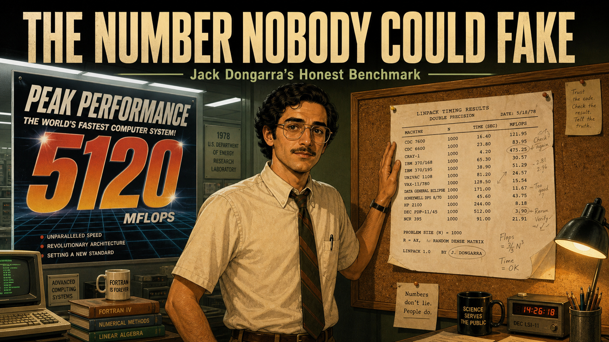
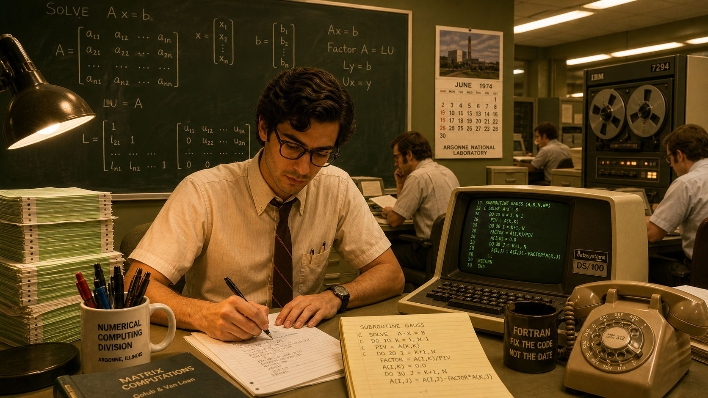
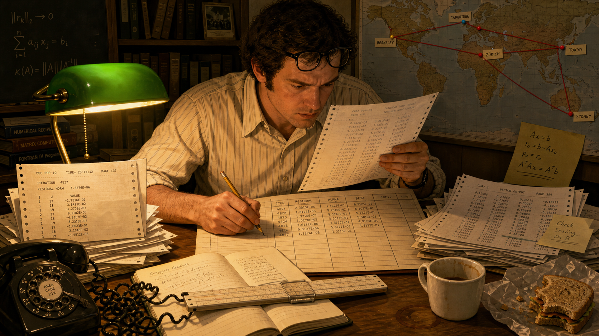
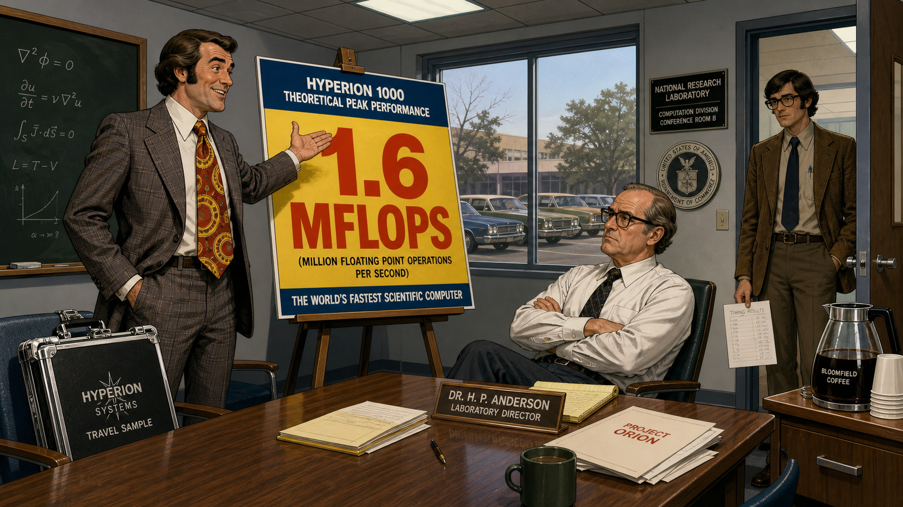
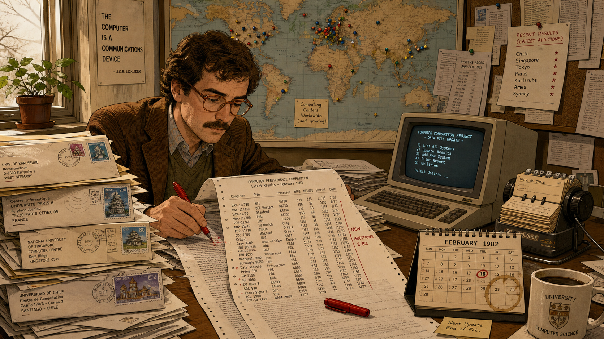
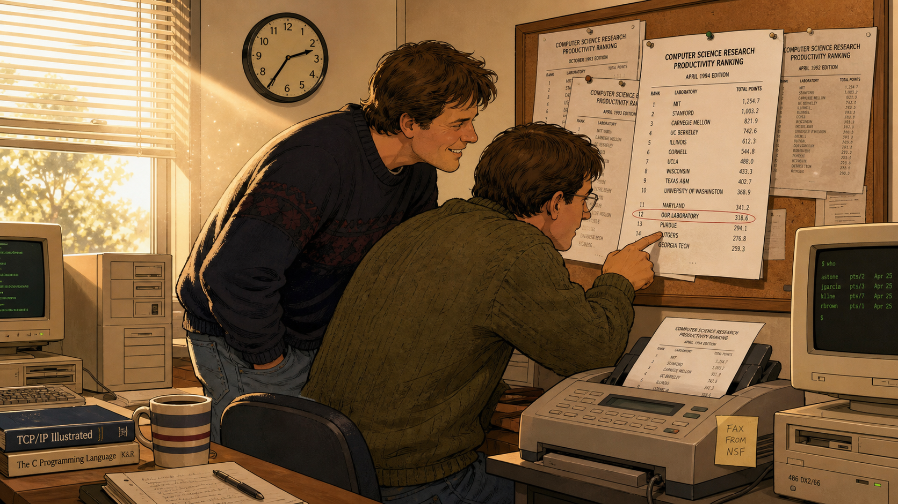
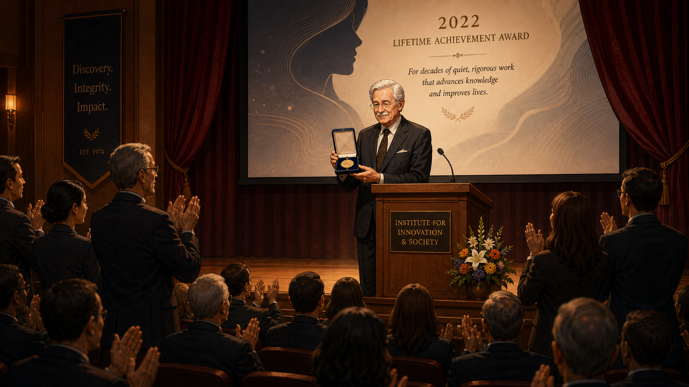

# The Number Nobody Could Fake: Jack Dongarra's Honest Benchmark

<!--  -->

Cover Image Prompt

(This is the Cover Image. Do not include this label in the image.)
Please generate a wide-landscape 16:9 cover image for this story in a warm, contemporary
editorial-illustration graphic-novel style, semi-realistic rather than photographic, with
muted late-20th-century color grading. Show a lean, olive-complexioned man in his late twenties
with dark wavy hair, a trimmed mustache just coming in, and plastic-framed glasses, wearing a
short-sleeved button-front shirt with a narrow tie, standing at the center of a split composition
in a 1978 government research laboratory. On the left side of the frame behind him looms a
glossy vendor poster with a huge, boldly lettered "PEAK PERFORMANCE" number on it, slightly
tilted and slick. On the right side, tacked to a corkboard, hangs a modest, hand-typed table of
timing results from many different machines, dog-eared and covered in penciled corrections. He
stands with one hand resting on the corkboard table, looking directly out at the viewer with
quiet, confident skepticism. Render the title text "THE NUMBER NOBODY COULD FAKE" at the top in
a bold, contemporary condensed sans-serif typeface, and beneath it in smaller type "Jack
Dongarra's Honest Benchmark." Color palette: warm amber lamplight, olive-green lab walls, and
cool fluorescent white on the glossy poster side. Emotional tone: quiet, principled defiance —
one honest number squaring off against an exaggerated claim. Generate the image immediately
without asking clarifying questions.

Narrative Prompt

This story is set in the United States between 1974 and 2022, moving from Argonne National
Laboratory in Illinois through the University of Tennessee and Oak Ridge National Laboratory, with
one pivotal scene at a computing conference in Germany in 1993. The central figure is Jack
Dongarra, a mathematician and computer scientist who helps build LINPACK, a package of software
for solving systems of linear equations, and then notices that running the very same LINPACK
problem on different machines gives an honest, apples-to-apples way to compare their real-world
performance — in an era when computer vendors routinely advertised theoretical "peak" performance
numbers that no actual program ever reached. The themes are quantitative honesty, the discipline
of a common yardstick, and turning a private habit of careful measurement into a public
institution (the TOP500 list) that an entire industry comes to trust. Render the story in a warm,
contemporary editorial-illustration graphic-novel style, semi-realistic rather than photographic,
with color grading that shifts gradually from warm 1970s amber and olive tones toward cooler,
brighter modern tones by the final panels, reflecting the decades passing. Character consistency
note: Dongarra should be drawn consistently across all panels as a man of Sicilian-American
heritage with an olive complexion and dark wavy hair that grays over time, always wearing
glasses (style updating with the decade) and, from his late twenties onward, a neatly trimmed
mustache; his clothing should shift from 1970s short-sleeved shirts and narrow ties, to 1980s-90s
casual academic sweaters and polos, to a formal suit in the final panel. Do not depict any real
company logos, brand names, or trademarked product names anywhere in the artwork — render
computers, terminals, and machine cabinets as generic, unbranded equipment appropriate to each
decade.

### Prologue – The Number Everyone Argued About

In the 1970s, if you wanted to know how fast a computer really was, you had exactly one reliable
source: the company that built it. Sales brochures promised dazzling theoretical speeds that
existed only on paper, numbers calculated from a machine's fastest possible instruction running
in a loop that solved nothing anyone actually needed solved. Scientists and government buyers had
no independent way to check the claim, no common test they could run themselves, and no way to
compare one vendor's number against another's. Jack Dongarra, a young mathematician at a
government research laboratory outside Chicago, was about to change that — not by writing a
better sales pitch, but by building a test simple enough, and public enough, that no one could
argue with the result.

## Panel 1: A Mathematician Among the Machines

<!--  -->

Image Prompt

(This is Panel 01. Do not include the panel number in the image.)
I am about to ask you to generate a series of images for a graphic novel. Please make the images
have a consistent style and consistent characters. Do not ask any clarifying questions. Just
generate the image immediately when asked.

Please generate a 16:9 image in a warm, contemporary editorial-illustration graphic-novel style
depicting panel 1 of 8. The scene shows a lean, olive-complexioned man in his mid-twenties with
dark wavy hair and plastic-framed glasses, wearing a short-sleeved button-front shirt and narrow
tie, seated at a cluttered desk in a government numerical-computing research lab outside Chicago
in 1974. He is writing subroutine code by hand on ruled paper, a large chalkboard behind him
covered in matrix notation and equations for solving systems of linear equations. Colleagues in
similar period dress work at other desks in the background beneath humming fluorescent lights.
The color palette is warm amber lamplight against olive-green walls and beige metal furniture.
The emotional tone is quiet, focused purpose — a young researcher absorbed in foundational work.
Include at least six specific visual details: a boxy glowing terminal screen with green text, a
reel-to-reel tape drive humming in the corner, tall stacks of green-and-white striped printout
paper, a coffee mug crowded with felt-tip pens, a wall calendar clearly showing the year 1974, and
a rotary telephone on the corner of the desk. Generate the image immediately without asking
clarifying questions.

At Argonne National Laboratory, Jack Dongarra joined a small team of numerical analysts writing
subroutines to solve systems of linear equations — the unglamorous arithmetic buried inside
nearly every serious scientific calculation, from weather models to structural engineering. The
software they were building would eventually be called LINPACK, and it would end up installed on
computers around the world. Dongarra's job was narrower than that grand future suggested: make
the arithmetic fast, make it reliable, and make sure it worked the same way no matter which
machine ran it.

## Panel 2: One Fair Test for Every Machine

<!--  -->

Image Prompt

(This is Panel 02. Do not include the panel number in the image.)
Please generate a 16:9 image in the same warm, contemporary editorial-illustration graphic-novel
style depicting panel 2 of 8. Make the characters and style consistent with the prior panel. Show
the same young mathematician, now in the late 1970s, alone at his desk late in the evening,
comparing several stacks of differently formatted computer printouts spread across the surface,
penciling numbers into a growing handwritten ledger page divided into columns. A small world map
is pinned to the wall behind him with colored pins marking distant research labs. His reading
glasses are pushed up onto his forehead as he squints at a printout held close. The color palette
is warm desk-lamp amber against a darkened office. The emotional tone is quiet analytical
absorption, the private satisfaction of noticing a pattern no one else has spotted yet. Include at
least six specific visual details: a slide rule resting across an open notebook, a rotary
telephone with a tangled cord, a half-eaten sandwich on waxed paper, a pinned world map with
red string connecting several cities, an empty coffee cup with a brown ring stain, and a desk
lamp with a green glass shade. Generate the image immediately without asking clarifying
questions.

Dongarra noticed something useful almost by accident: solving the same system of linear
equations was a fair stand-in for how a computer handled real scientific work, and if he ran that
exact problem on machine after machine, the timing results were directly comparable — no
guesswork, no marketing, just a stopwatch applied equally to everyone. He began collecting those
timing numbers in the back pages of the software's own user manual, a modest appendix meant only
to help scientists estimate how long their own calculations might take. It would not stay modest
for long.

## Panel 3: The Peak That No Program Ever Reached

<!--  -->

Image Prompt

(This is Panel 03. Do not include the panel number in the image.)
Please generate a 16:9 image in the same warm, contemporary editorial-illustration graphic-novel
style depicting panel 3 of 8. Make the characters and style consistent with prior panels. Show a
conference room inside a government research laboratory in the late 1970s. A confident traveling
sales representative in a wide-lapel suit gestures toward a large easel chart displaying an
oversized, boldly lettered theoretical performance number, while a laboratory director sits with
arms crossed and a skeptical expression. In the background, the same young mathematician stands
near the doorway, quietly holding a single modest sheet of his own handwritten timing results
at his side, watching the presentation with a faint, knowing skepticism. The color palette is
cool fluorescent office light against the sales chart's glossy primary colors. The emotional tone
is showmanship versus quiet skepticism. Include at least six specific visual details: a shiny
travel sample case propped against a chair leg, a window showing a parking lot with period cars,
a ceiling of drop-panel fluorescent lighting, a carafe of coffee on a side table, a wide,
brightly patterned necktie on the sales representative, and a small chalkboard in the corner
still bearing leftover equations from an earlier meeting. Generate the image immediately without
asking clarifying questions.

Computer vendors of the era were selling something harder to pin down than hardware: a number.
Sales teams routinely quoted a machine's theoretical "peak" speed, the fastest rate its circuitry
could conceivably run under ideal, contrived conditions that no real program ever produced. Buyers
had almost no way to know what a machine would actually deliver on their own work, and every
vendor's peak number was, conveniently, impossible to verify without buying the machine first.
Dongarra's quiet stack of measured timings, gathered the same way on every machine, was a small
but pointed rebuttal to that entire way of doing business.

## Panel 4: Twenty Machines and Growing

<!--  -->

Image Prompt

(This is Panel 04. Do not include the panel number in the image.)
Please generate a 16:9 image in the same warm, contemporary editorial-illustration graphic-novel
style depicting panel 4 of 8. Make the characters and style consistent with prior panels. Show
the same man, now in his early thirties in the early 1980s, at a cluttered university office desk
stacked high with envelopes bearing international postmarks and mailed printouts from many
different computing centers. A steadily lengthening typed report lies open before him, dense
columns of machine names and timing numbers, red pen marks noting recent additions. A large wall
map studded with colored pins fills the wall behind him, and an early boxy personal computer sits
at the edge of the desk beside a rotary card file. The color palette is warm office ochre and
brown against the cooler gray-blue glow of the computer screen. The emotional tone is dogged,
meticulous stewardship — the quiet pride of tending something that keeps growing. Include at
least six specific visual details: stacked envelopes with foreign postage stamps, a red
felt-tip pen resting on the open report, a coffee-ring-stained desk calendar, a rotary rolodex
card file, a small potted plant on the windowsill, and a corkboard with more printouts pinned
in overlapping layers. Generate the image immediately without asking clarifying questions.

Word spread through the small world of scientific computing, and Dongarra's appendix of timing
results grew into something people actively sought out: a running, honest report on how dozens of
different machines actually performed the same linear-algebra problem. Whenever a new machine
appeared, someone would run the test and mail him the numbers, and he would fold the result into
the next edition. What had started as a courtesy footnote in a software manual was becoming the
closest thing the field had to an independent referee.

## Panel 5: Merging Two Lists Into One

<!--  -->

Image Prompt

(This is Panel 05. Do not include the panel number in the image.)
Please generate a 16:9 image in the same warm, contemporary editorial-illustration graphic-novel
style depicting panel 5 of 8. Make the characters and style consistent with prior panels. Show a
sunlit conference room in Germany in 1993, tall windows with lace curtains, where the same man,
now in his early forties with a few gray streaks appearing at his temples, stands at a flip-chart
easel alongside three other men in period business-casual attire. Two separate typed ranked lists
are pinned to the wall side by side, and one of the men is drawing a bracket to merge them into a
single combined list on the flip chart. Conference lanyards hang around each man's neck, and
paper coffee cups and a stack of nametags sit on the table. The color palette is bright, airy
European daylight — soft cream walls and pale wood furniture. The emotional tone is
collaborative resolve, four people quietly agreeing on something that will outlast the meeting.
Include at least six specific visual details: lace curtains filtering sunlight, a stack of
printed conference nametags on the table, a flip-chart marker uncapped and mid-stroke, a laptop
computer with a thick boxy hinge, a hotel-conference-room water pitcher and glasses, and a
paper agenda with a printed conference logo left deliberately blank of any readable text.
Generate the image immediately without asking clarifying questions.

In 1993, Dongarra joined three colleagues — Hans Meuer, Erich Strohmaier, and Horst Simon — who
had each been keeping their own scattered tallies of the world's fastest computers. Rather than
compete, they merged their lists into one twice-yearly ranking, using Dongarra's linear-algebra
benchmark as the single, agreed-upon measuring stick. It was a small decision made around a
conference-room table that quietly ended years of fragmented, incompatible comparisons. From that
meeting came the TOP500, a list that would rank the world's fastest computers by one honestly
measured number instead of a dozen conflicting claims.

## Panel 6: A List Anyone Could Check

<!--  -->

Image Prompt

(This is Panel 06. Do not include the panel number in the image.)
Please generate a 16:9 image in the same warm, contemporary editorial-illustration graphic-novel
style depicting panel 6 of 8. Make the characters and style consistent with prior panels. Show a
university computing lab in the mid-1990s where two researchers in casual sweaters crowd around a
freshly printed ranked list pulled from a fax machine, one of them tracing a finger down the
column of numbers to find their own laboratory's entry while the other watches with a grin. A
corkboard nearby is layered with several previous editions of the same list. Beige computer
towers with small monitors sit at nearby desks, and sunlight streams through half-open blinds.
The color palette is warmer and brighter than earlier panels, pale yellow sunlight against
neutral beige office tones. The emotional tone is public accountability turning into quiet
vindication — the pleasure of a number you can actually go check. Include at least six specific
visual details: a fax machine mid-print with curling paper, a corkboard layered with several
past printed lists, a beige computer tower with a small square monitor, a coffee mug reading
nothing but a plain stripe pattern, dust motes visible in the sunbeam, and a wall clock showing
mid-afternoon. Generate the image immediately without asking clarifying questions.

The list changed the incentives overnight. A machine's ranking was no longer whatever number its
own maker chose to print in a brochure; it was a figure tied to a published, reproducible test
that any laboratory could, in principle, run for itself and check. Engineers now had a public
number to chase, and vendors had a public number to defend, twice a year, in front of the entire
field. For the first time, bragging about performance meant showing your work.

## Panel 7: Two Decades of Honest Competition

<!--  -->

Image Prompt

(This is Panel 07. Do not include the panel number in the image.)
Please generate a 16:9 image in the same warm, contemporary editorial-illustration graphic-novel
style depicting panel 7 of 8. Make the characters and style consistent with prior panels. Show a
large supercomputing center in the 2000s, rows of tall unbranded server racks with blinking
status lights receding into the distance under a raised floor, overhead cable trays, and cool
white lighting. A group of younger engineers in modern casual clothing and lanyard ID badges
study a large wall-mounted screen displaying a ranked bar chart. Off to one side, the same man,
now with fully gray hair and a gray mustache, watches with quiet satisfaction, hands in his
pockets. The color palette shifts to cooler blues and whites, reflecting a more modern era. The
emotional tone is quiet pride at watching a small idea become permanent institutional practice.
Include at least six specific visual details: raised floor access tiles, overhead cable trays,
rows of blinking status lights on server racks, a wall-mounted screen showing a bar-chart
ranking, ID badges on lanyards, and a rolling cart holding diagnostic equipment. Generate the
image immediately without asking clarifying questions.

Over the following two decades, the twice-yearly ranking became a fixture of the
high-performance-computing world, driving nations and companies to compete on genuine, measured
speed rather than paper specifications. Watching that shift from the sidelines of the very
supercomputing centers he had helped set standards for, Dongarra could see plainly what his
small appendix had become: not a footnote anymore, but the yardstick the entire field measured
itself against.

## Panel 8: Recognition, Finally

<!--  -->

Image Prompt

(This is Panel 08. Do not include the panel number in the image.)
Please generate a 16:9 image in the same warm, contemporary editorial-illustration graphic-novel
style depicting panel 8 of 8. Make the characters and style consistent with prior panels. Show a
formal awards ceremony stage in 2022, where the same man, now elderly with fully silver hair and
a silver mustache, wears a dark formal suit and stands at a lectern accepting a presentation case
holding a medal, a large screen behind him displaying an abstract honor-citation graphic. An
audience in business attire fills rows of seats before the stage, several rising to applaud, warm
spotlight illuminating the stage against a darker auditorium. The color palette is warm golden
stage light against deep navy audience shadows. The emotional tone is quiet, well-earned
culmination after decades of unglamorous, careful work. Include at least six specific visual
details: a formal wooden lectern with a small microphone, a presentation case open to show a
medal, rows of applauding audience members in business attire, a soft-focus screen behind the
stage, a modest bouquet of flowers resting near the lectern, and stage curtains framing the
scene in deep burgundy. Generate the image immediately without asking clarifying questions.

In 2022, Jack Dongarra received the 2021 ACM A.M. Turing Award, computing's highest honor, for
decades of pioneering work on the numerical algorithms and software libraries — including
LINPACK and the benchmark it spawned — that let computational science keep pace with hardware for
over forty years. The citation praised the algorithms; the deeper lesson was about honesty. A
claimed number, Dongarra's whole career argued, is worth nothing until someone else can measure
it too and get the same answer.

### Epilogue – What Made Dongarra's Approach Different?

Dongarra never tried to out-argue the vendors who inflated their performance claims — he simply
built a test rigorous enough that arguing became pointless. By insisting that every machine run
the identical problem, publish the identical kind of number, and submit to a public, repeatable
ranking, he replaced marketing with measurement. That same discipline is what separates a
trustworthy benchmark from a misleading one: not cleverness, but a refusal to let anyone,
including yourself, grade your own homework.

| Challenge | How Dongarra Responded | Lesson for Today |
|---|---|---|
| Vendors advertised unreachable theoretical "peak" performance numbers | Built a benchmark that measured actual delivered performance on a realistic linear-algebra problem | A peak specification is a ceiling, not a measurement — always report what your code actually achieves |
| No common yardstick existed to compare wildly different machines | Ran the identical problem on every machine he could get access to and published the results side by side | A benchmark is only fair when every competitor runs the exact same workload under the same rules |
| Competing, informally maintained performance lists caused confusion | Merged efforts with Hans Meuer, Erich Strohmaier, and Horst Simon into one public ranking in 1993 | One agreed-upon benchmark settles arguments that a dozen incompatible ones never will |
| Results could be quietly cherry-picked or exaggerated by a machine's own maker | Made the list public and refreshed it twice a year, so any claimed ranking could be checked by outsiders | Publish your methodology and raw numbers, not just your conclusion, so others can verify it |

### Call to Action

This course spends real time teaching you the four ways a benchmark can lie, and why a benchmark's
exclusions can quietly reverse its conclusion. That is not an abstract warning — it is exactly the
industry-wide problem Dongarra spent his career solving. When you report your own FFT's cycle
counts and throughput in the weeks ahead, hold yourself to his standard: run the same test the
same way every time, and publish the number so someone else could check it.

---

*"The whole benchmarking thing came about almost as an accident."*
—Jack Dongarra

*"The idea was to give users a handle on how much time it would take to solve their problem if they used our software."*
—Jack Dongarra

---

## References

1. [Wikipedia: Jack Dongarra](https://en.wikipedia.org/wiki/Jack_Dongarra) - Biography covering his education, career at Argonne National Laboratory and the University of Tennessee, and the 2021 ACM Turing Award.
2. [Wikipedia: LINPACK benchmarks](https://en.wikipedia.org/wiki/LINPACK_benchmarks) - History of the LINPACK benchmark, its origin as an appendix to the LINPACK software package's user guide, and its role in the TOP500 list.
3. [Wikipedia: TOP500](https://en.wikipedia.org/wiki/TOP500) - History and methodology of the TOP500 list, founded in 1993 by Hans Meuer, Jack Dongarra, Erich Strohmaier, and Horst Simon.
4. [ACM: Dr. Jack Dongarra - A.M. Turing Award Laureate](https://amturing.acm.org/award_winners/dongarra_3406337.cfm) - Official ACM citation and biography for Dongarra's 2021 Turing Award.
5. [Computer History Museum: Dongarra, Jack J. — oral history catalog record](https://www.computerhistory.org/collections/catalog/102746788) - Museum archive record for an oral history interview covering Dongarra's career in mathematical software.
