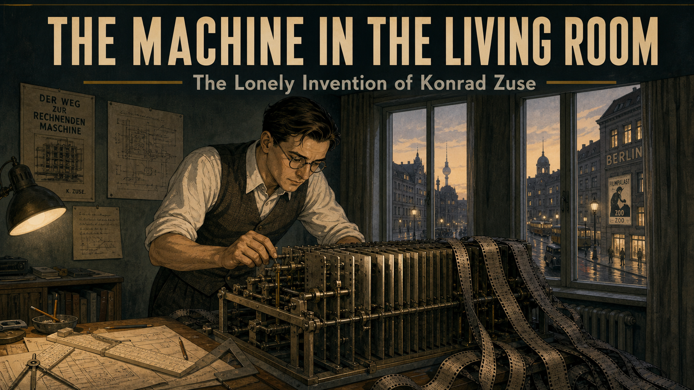
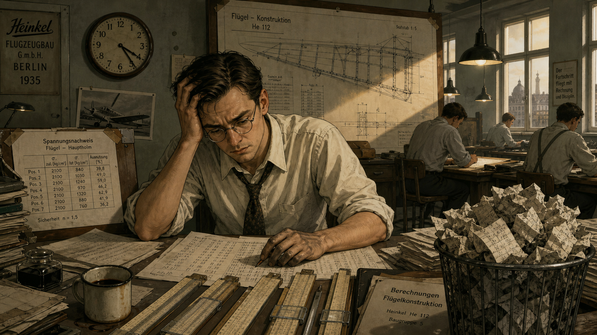
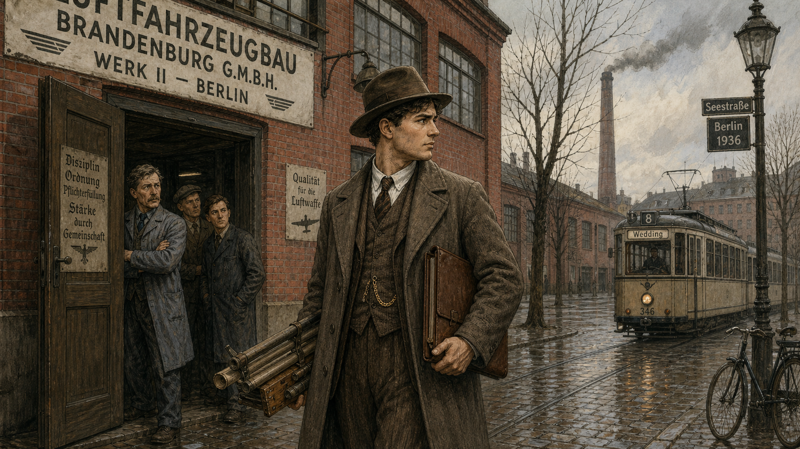
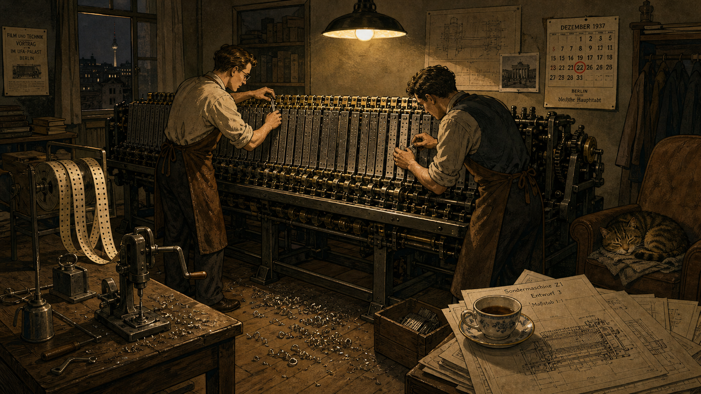
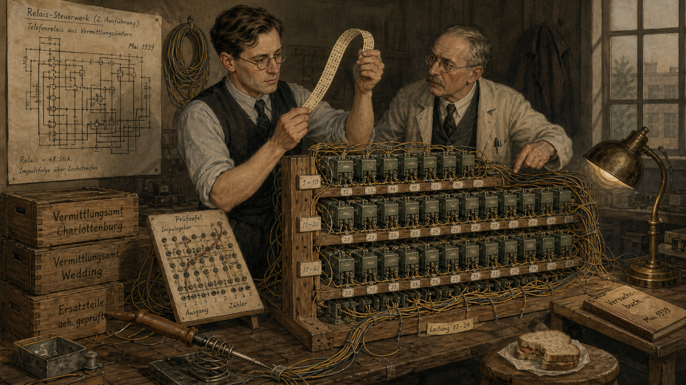
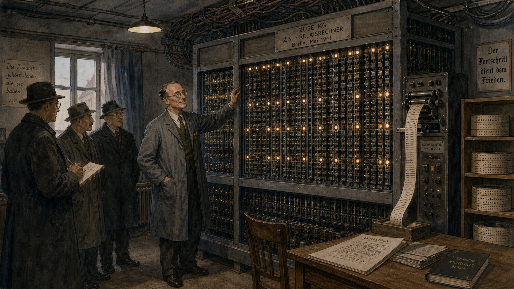
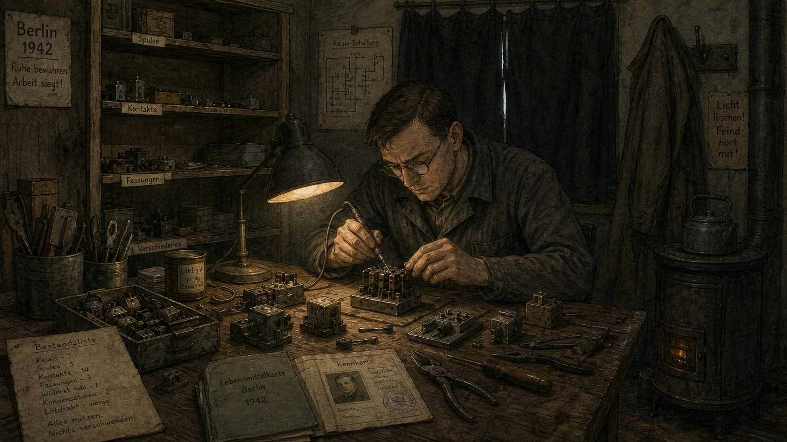
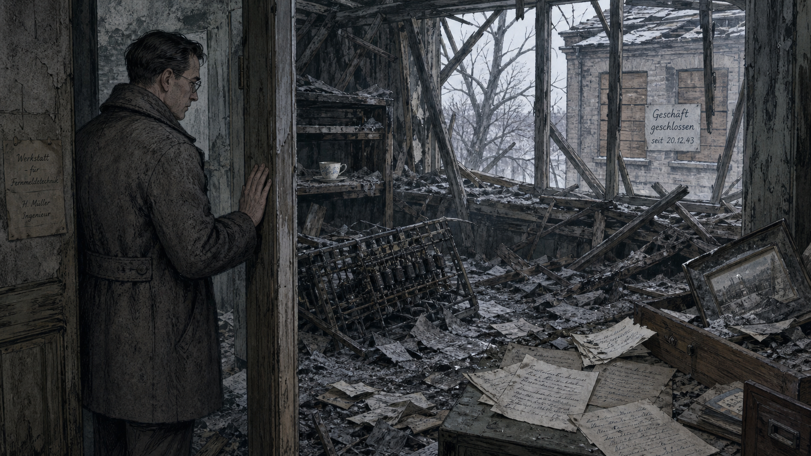
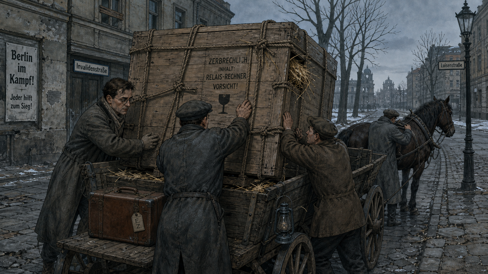
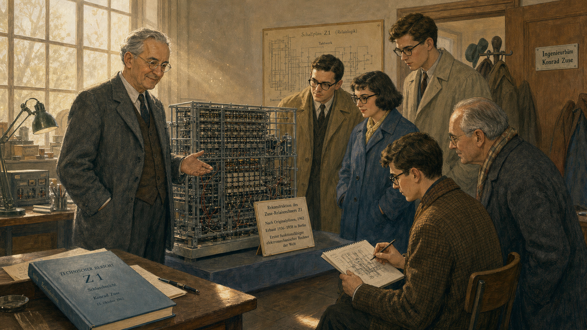

# The Machine in the Living Room: Konrad Zuse's Lonely Invention

<!--  -->

Cover Image Prompt

(This is the Cover Image. Do not include this label in the image.)
Please generate a wide-landscape 16:9 cover image for this story in a muted, early-modern
1930s-Germany illustrated style, like a restrained graphic-novel poster rather than a photo.
Show a young, intense civil engineer in his mid-twenties with neatly combed dark hair, round
wire-rimmed glasses, and a plain buttoned vest over a white shirt with rolled sleeves, standing
in a cramped apartment living room that has been converted into a workshop. He leans over a
waist-high machine built from rows of thin metal sliding plates and mechanical linkages, a
slide rule and drafting tools scattered on a nearby table, punched strips of discarded movie
film draped over the machine like ribbons. Tall apartment windows behind him show a Berlin
street in soft evening light. Render the title text "THE MACHINE IN THE LIVING ROOM" at the
top in a bold period-appropriate sans-serif typeface, like 1930s German industrial signage,
and beneath it in smaller type "The Lonely Invention of Konrad Zuse." Color palette: muted
slate blues, warm lamp-lit ochre, and brass tones against dim gray-green walls. Emotional
tone: quiet, focused determination — a solitary inventor absorbed in an idea nobody else
believes in yet. Generate the image immediately without asking clarifying questions.

Narrative Prompt

This story is set in Germany between 1927 and the mid-1960s, centered on Berlin in the 1930s
and 1940s. The central figure is Konrad Zuse, a civil engineer turned self-taught computer
builder, who designs and constructs the world's first working programmable, fully automatic
digital computer almost entirely on his own initiative, without university or government
backing, in his parents' apartment. The themes are solitary persistence, mechanical ingenuity
under material and political constraint, and the fragility of pioneering work — his machines
and records are destroyed not once but twice by wartime bombing, and his achievement goes
largely unrecognized outside Germany for decades. Render the story in a restrained,
early-modern (1900-1950) European illustrated style: muted color palettes (slate blue, ochre,
brass, gray-green), period clothing (vests, ties, simple dresses, wire-rimmed glasses), and
mechanical relay-and-drafting-table technology rather than anything anachronistically sleek.
Character consistency note: Zuse should be drawn consistently across all panels as a lean man
with neatly parted dark hair and round wire-rimmed glasses, aging visibly from his mid-20s in
early panels to his 30s by the final panels, always dressed in simple period business attire
(vest, shirt, occasionally a work apron when at the machine). Do not depict any Nazi symbols,
military insignia, flags, uniforms, or graphic violence in any panel — convey the wartime
setting and its dangers entirely through mood, architecture, damage, and setting (blackout
curtains, rubble, bare trees, closed shutters, scattered papers) rather than through explicit
political or violent imagery.

### Prologue – The Man Who Built a Computer With No One Watching

In 1937, if you had asked the engineering faculty of any German university who was building the
world's first automatic digital computer, not one of them could have told you it was happening
two floors up in a Berlin apartment building, in the cramped living room of a twenty-seven-year-old
civil engineer who had quit his job. Konrad Zuse had no laboratory, no funding, and no committee
looking over his shoulder — only a stack of borrowed sheet metal, a handful of patient friends,
and a conviction that the tedious arithmetic strangling his profession could be handed off to a
machine. What he built there, and rebuilt twice after it was destroyed, would turn out to be the
ancestor of the binary floating-point arithmetic every processor in this course depends on. Almost
no one believed it mattered at the time. It took the rest of the world nearly thirty years to
notice.

## Panel 1: The Tedium of the Slide Rule

<!--  -->

Image Prompt

(This is Panel 01. Do not include the panel number in the image.)
I am about to ask you to generate a series of images for a graphic novel. Please make the
images have a consistent style and consistent characters. Do not ask any clarifying questions.
Just generate the image immediately when asked.

Please generate a 16:9 image in a muted early-modern German illustrated style depicting panel 1
of 9. The scene shows a lean young civil engineer in his mid-20s, neatly parted dark hair, round
wire-rimmed glasses, white shirt, loosened tie, and rolled-up sleeves, seated at a crowded
drafting table inside a 1935 Berlin aircraft-engineering drafting office. He is surrounded by
stacks of paper covered in dense rows of handwritten numbers, several identical slide rules
lined up in front of him, and a large technical drawing of an aircraft wing structure pinned to
a board behind him. Other draftsmen in shirtsleeves work at similar tables in the background
under hanging pendant lamps. The color palette is muted olive green, brown, and dull yellow
lamplight against gray walls. The emotional tone is quiet exhaustion and mounting frustration
at repetitive, mechanical work. Include at least six specific visual details: a wall clock
reading late afternoon, an overflowing wastebasket of crumpled calculation sheets, ink-stained
fingers, a half-empty cup of cold coffee, a stress-calculation table taped above the desk, and
window light slanting low across the room. Generate the image immediately without asking
clarifying questions.

Konrad Zuse graduated as a civil engineer from the Technical College of Berlin-Charlottenburg in
1935 and took a position at an aircraft factory, where his job was to check the structural
strength of wing designs by hand. The work was the same each time — long chains of arithmetic,
repeated for every rivet and load path, checked and rechecked because a single slipped digit
could mean a wing that failed in flight. Zuse began to notice that the actual engineering
judgment took a few minutes; the arithmetic that followed took days. He started to wonder,
half seriously at first, whether a machine could be built to do the counting so that people
could do the thinking.

## Panel 2: Quitting the Job Nobody Quits

<!--  -->

Image Prompt

(This is Panel 02. Do not include the panel number in the image.)
Please generate a 16:9 image in the same muted early-modern German illustrated style depicting
panel 2 of 9. Make the characters and style consistent with the prior panel. Show the same
young engineer, now in an overcoat and hat, standing just outside the entrance of a large
industrial aircraft-factory building in Berlin in 1936, looking back over his shoulder at the
building's facade with an expression of resolve rather than regret, a slim leather portfolio of
drawings tucked under one arm. Two or three coworkers watch from a doorway with puzzled
expressions. A tram passes in the street. The color palette is dusty gray-blue sky, brick red
factory walls, and muted browns. The emotional tone is quiet resolve and mild social
disapproval from onlookers. Include at least six specific visual details: a factory smokestack
in the background, a hand-painted company sign above the door, wet cobblestones from recent
rain, the engineer's pocket watch chain visible on his vest, a stack of personal drafting tools
bundled under his other arm, and bare early-spring trees lining the street. Generate the image
immediately without asking clarifying questions.

In 1936, Zuse did something almost no engineer of his generation did: he quit a stable, respected
job to chase an idea that existed only in his head. He moved back into his parents' apartment on
Methfesselstraße in the Kreuzberg district of Berlin, converted the living room into a workshop,
and began building a calculating machine with money borrowed from family and the help of a small
circle of friends, including fellow engineer Helmut Schreyer. There was no university department
sponsoring him, no government contract, no company behind him — only sheet metal, hand tools, and
the stubborn belief that logic itself could be built out of moving parts.

## Panel 3: The Z1 Takes Shape

<!--  -->

Image Prompt

(This is Panel 03. Do not include the panel number in the image.)
Please generate a 16:9 image in the same muted early-modern German illustrated style depicting
panel 3 of 9. Make the characters and style consistent with prior panels. Show the same engineer
and one or two friends working together late at night in a converted apartment living room in
Berlin, 1937-1938, hand-fitting rows of thin notched metal plates into a waist-high mechanical
calculating machine that spans nearly the width of the room. Furniture has been pushed to the
walls to make space; strips of discarded movie film with holes punched in them hang from a
spool nearby, waiting to be used as a program tape. A single overhead lamp lights the scene.
The color palette is warm lamplight ochre against deep shadow, with brass and gunmetal tones
on the machine itself. The emotional tone is focused collaborative intensity, almost
reverent concentration. Include at least six specific visual details: metal shavings on the
floor, a hand-cranked drill on the table, rolled shirtsleeves and leather work aprons, a
teacup balanced on a stack of blueprints, a wall calendar, and a cat asleep on a nearby
armchair. Generate the image immediately without asking clarifying questions.

Working nights and weekends with borrowed tools and salvaged sheet metal, Zuse and his small
circle of helpers assembled the Z1: a mechanical calculator that stored numbers in binary and
read its instructions from a strip of discarded 35-millimeter movie film, punched with holes
like a player-piano roll. It was slow, prone to jamming, and unreliable by any industrial
standard. But it embodied an idea that mattered far more than its reliability: numbers could
be represented as binary floating point, and a machine could be told, step by step, what to do
next, rather than rewired by hand for every new problem.

## Panel 4: From Metal Plates to Telephone Relays

<!--  -->

Image Prompt

(This is Panel 04. Do not include the panel number in the image.)
Please generate a 16:9 image in the same muted early-modern German illustrated style depicting
panel 4 of 9. Make the characters and style consistent with prior panels. Show the same
engineer in 1939, now in a slightly larger workshop space, examining a new machine built from
neat rows of salvaged telephone relays mounted on wooden frames, wires bundled and labeled by
hand, a breadboard-like test panel propped on a table beside him. He holds a punched paper
tape up to the light, studying it closely. A second, older colleague looks on, pointing at
one of the relay banks. The color palette is muted gray-green relay housings against warm
brass wire and dim workshop light. The emotional tone is careful, methodical curiosity — the
quiet satisfaction of an idea proving itself more reliable the second time. Include at least
six specific visual details: coils of spare wire hanging on a wall hook, a hand-labeled
schematic diagram pinned up, a soldering iron resting on a metal stand, stacked wooden crates
of salvaged parts, a small brass desk lamp, and a half-eaten sandwich on a stool. Generate the
image immediately without asking clarifying questions.

Zuse's next machine, the Z2, replaced the failure-prone mechanical plates of the Z1 with
secondhand telephone relays, borrowed from the world of automatic telephone exchanges. Relays
clicked open and shut far more dependably than sliding metal, and the redesign sharpened an
idea that would define the rest of his career: separate the arithmetic hardware from the
program controlling it, so the same machine could be reprogrammed for a new calculation simply
by feeding it a new punched tape, instead of being rebuilt from scratch each time.

## Panel 5: The Z3 Comes Alive

<!--  -->

Image Prompt

(This is Panel 05. Do not include the panel number in the image.)
Please generate a 16:9 image in the same muted early-modern German illustrated style depicting
panel 5 of 9. Make the characters and style consistent with prior panels. Show the same
engineer, now slightly older, standing proudly beside a completed floor-to-ceiling relay
computer that fills most of a small Berlin workshop room in May 1941, its front panel a dense
grid of small switches and indicator lamps, punched celluloid film tape feeding through a
reader at one side. Two or three visitors in overcoats and hats observe respectfully at a
short distance, one holding a notebook. The color palette is cool gray-blue relay banks lit
warmly by a few glowing indicator lamps. The emotional tone is quiet triumph and cautious
pride, a private breakthrough witnessed by only a handful of people. Include at least six
specific visual details: a hand-painted nameplate on the machine's frame, a bank of small
round indicator lamps glowing amber, exposed wiring bundled along the ceiling, a wooden chair
for the operator, a stack of punched tape reels on a shelf, and a single small window with
its curtain half-drawn. Generate the image immediately without asking clarifying questions.

On 12 May 1941, in that same modest Berlin workshop, Zuse demonstrated the Z3 to a small
audience of engineers. It was a genuine milestone whose full significance no one in the room
grasped yet: a binary floating-point machine with automatic program control, built from twenty-
six hundred telephone relays, running programs fed to it on punched celluloid film. Decades
later, computer scientist Raúl Rojas would show that the Z3's design was, in principle, capable
of computing anything any modern computer can compute — a property called Turing-completeness.
In 1941, though, it was simply a working machine that did arithmetic no one else's machine
could do, built by an engineer still largely unknown outside his own small circle.

## Panel 6: Building in the Shadow of War

<!--  -->

Image Prompt

(This is Panel 06. Do not include the panel number in the image.)
Please generate a 16:9 image in the same muted early-modern German illustrated style depicting
panel 6 of 9. Make the characters and style consistent with prior panels. Show the same
engineer alone at a cluttered workbench in a small Berlin workshop in 1942, carefully
resoldering a salvaged relay by lamplight, surrounded by mismatched spare parts clearly
scavenged and reused, a ration book and identity papers visible on the corner of the desk, and
blackout curtains drawn tightly over the single window. The room feels sparse and
resourceful rather than dramatic. The color palette is dim, low-contrast browns and grays with
a single warm lamp as the only bright point. The emotional tone is quiet resourcefulness under
strain, isolation, and unglamorous persistence. Include at least six specific visual details: a
half-empty shelf where parts used to be, mismatched relay components clearly salvaged from
different sources, a thin coat hung on a hook, a small stove for heat, hand-written inventory
notes, and worn tools showing heavy use. Generate the image immediately without asking
clarifying questions.

The years that followed brought no laboratory, no faculty position, and little institutional
recognition — only a small, quietly arranged contract to apply his machines to aircraft wing
calculations, and the daily grind of building precision equipment during a period of severe
material shortages. Spare parts had to be scavenged and reused. Zuse worked largely alone or
with a handful of assistants, refining his ideas about programming even as the country around
him grew more isolated from the rest of the scientific world. It was during these constrained,
solitary years that he sketched out Plankalkül, a notation for describing computation itself —
among the earliest concepts anywhere for what we would now call a high-level programming
language, decades ahead of any machine that could run it.

## Panel 7: Ash and Silence

<!--  -->

Image Prompt

(This is Panel 07. Do not include the panel number in the image.)
Please generate a 16:9 image in the same muted early-modern German illustrated style depicting
panel 7 of 9. Make the characters and style consistent with prior panels. Show the same
engineer standing in a doorway in late December 1943, looking into a workshop room that has
been reduced to rubble, broken timbers, and scattered charred papers, gray ash dusting every
surface, a bare tree visible through a shattered window frame in the gray winter light outside.
He stands very still with one hand resting against the doorframe, his expression somber and
still. No other people are in the scene. Do not include any flames, smoke plumes, weapons,
aircraft, symbols, flags, or graphic depictions of destruction beyond structural rubble and
scattered debris. The color palette is desaturated ash gray, cold blue-white winter light, and
faded brown paper. The emotional tone is quiet devastation and numb loss, restrained rather
than dramatic. Include at least six specific visual details: a twisted metal relay frame
half-buried in debris, a single unbroken teacup sitting incongruously on a warped shelf, drifts
of gray ash on the floor, a bent picture frame, scattered loose papers with faded handwriting,
and boarded-over windows in the building next door bearing a hand-lettered closure notice.
Generate the image immediately without asking clarifying questions.

Late in 1943, an Allied bombing raid on Berlin tore through Zuse's workshop and destroyed the
Z3, along with most of his early technical drawings and records. Weeks later, a separate raid
destroyed his parents' apartment as well, taking the original Z1 with it. Years of painstaking,
self-funded work were reduced, almost overnight, to rubble and scattered paper. Zuse did not
have the luxury of grief for long. Wartime Berlin offered no safety net for a private inventor
whose life's work had just been erased twice over — only the same unglamorous choice he had
faced from the beginning: rebuild, or stop.

## Panel 8: Carrying the Machine Out of the City

<!--  -->

Image Prompt

(This is Panel 08. Do not include the panel number in the image.)
Please generate a 16:9 image in the same muted early-modern German illustrated style depicting
panel 8 of 9. Make the characters and style consistent with prior panels. Show the same
engineer, now a little more careworn, helping two other men load a large crated relay computer
onto the back of a horse-drawn cart on a quiet, empty gray Berlin street in February 1945, bare
trees lining the road, a few boarded windows visible on nearby buildings, no crowds or other
traffic. Straw packing material spills from one corner of the crate. The color palette is cold
gray-blue overcast light with muted brown wood tones. The emotional tone is tense urgency
tempered by quiet determination, the sense of protecting something fragile and important.
Include at least six specific visual details: rope lashings securing the crate, a hand-painted
fragile-contents marking on the wood, the cart driver adjusting the horse's harness, a lantern
hung on the cart's side, cracked pavement, and a single suitcase of personal belongings set
beside the crate. Generate the image immediately without asking clarifying questions.

By 1945, Zuse had already built a successor, the Z4, and this time he refused to leave it behind.
As Allied bombing intensified and the war neared its end, he had the partly finished machine
crated and moved out of Berlin by cart and truck, first to central Germany and eventually to a
small Alpine village, keeping it one step ahead of the destruction that had already claimed two
of its predecessors. The Z4 became the only one of Zuse's wartime machines to survive intact —
a single working link between everything he had built alone in that Berlin apartment and
everything computing would become after the war.

## Panel 9: A Quiet Vindication

<!--  -->

Image Prompt

(This is Panel 09. Do not include the panel number in the image.)
Please generate a 16:9 image in the same muted early-modern German illustrated style depicting
panel 9 of 9. Make the characters and style consistent with prior panels. Show the same
engineer, now visibly older with graying hair at his temples but still wearing round
wire-rimmed glasses, standing in a modest engineering workshop in the 1960s beside a
reconstructed relay computer displayed on a low platform, a small group of visiting students
and one older visitor examining it with clear interest and respect, one student sketching the
relay layout in a notebook. Sunlight streams through a large workshop window. The color
palette shifts slightly warmer and brighter than earlier panels, muted gold and soft blue,
signaling a change in mood. The emotional tone is quiet, well-earned recognition after decades
of obscurity. Include at least six specific visual details: a small descriptive placard beside
the machine, the visitors' overcoats hung near the door, a bound technical report on a nearby
table, late-1960s-style eyeglasses and clothing on the visitors, dust motes visible in the
sunlight, and a faint smile on the older engineer's face. Generate the image immediately
without asking clarifying questions.

For nearly two decades after the war, Zuse's achievement remained a footnote known mostly within
Germany, overshadowed internationally by British and American computing narratives that rarely
mentioned Berlin at all. Slowly, that changed. Historians retraced what he had actually built —
a working, automatic, binary floating-point computer, completed years before any comparable
machine elsewhere — and honors began to follow, including recognition from Germany's engineering
societies and, much later, the formal proof that the Z3 had been Turing-complete all along.
The idea he had chased alone in a Berlin living room, one that almost no institution had thought
worth funding, turned out to be foundational.

### Epilogue – What Made Zuse Different?

Konrad Zuse did not have Alan Turing's mathematical pedigree, John von Neumann's institutional
reach, or a government laboratory's budget. What he had was a precise, specific frustration with
repetitive work, the engineering discipline to formalize that frustration into binary logic, and
an almost stubborn refusal to let two rounds of destruction end the project. He built the
conceptual groundwork for binary floating-point computing not in response to a grand theoretical
question, but because doing the same arithmetic by hand, over and over, was a waste of a good
mind. That instinct — automate the repetitive part so the interesting part gets your full
attention — is exactly what motivates a benchmarking course like this one.

| Challenge | How Zuse Responded | Lesson for Today |
|---|---|---|
| No institutional support or funding for an unproven idea | Quit his job and self-funded construction with family and friends in a spare room | Small, self-directed projects can out-innovate well-funded ones if the idea is sound |
| Mechanical unreliability of the first machine (Z1) | Redesigned the arithmetic unit around relays for the Z2, iterating rather than abandoning the concept | Treat an unreliable prototype as a data point, not a verdict on the idea |
| Two of his machines destroyed by wartime bombing | Rebuilt from what survived and physically evacuated the next machine before it could be lost too | Protect and preserve your work; a good result you cannot reproduce or preserve is only half a result |
| Decades of obscurity outside Germany | Kept building and documenting (Plankalkül, the Z4, Zuse KG) regardless of recognition | Rigorous, well-documented work outlasts its initial reception — do the work right even if no one is watching yet |

### Call to Action

When you write the floating-point FFT kernels in this course and lean on the Cortex-M33's
hardware FPU without a second thought, you are standing on an idea Konrad Zuse worked out alone,
with borrowed tools, before anyone else saw the need for it. As you benchmark your own code in
the weeks ahead, take his example seriously in a very practical sense: build carefully, document
what you did, and protect your results — because the difference between a forgotten prototype
and a foundational contribution is often nothing more than whether the work survived to be
recognized.

---

*"You could say I was too lazy to calculate, so I invented the computer."*
—Konrad Zuse

*"The danger of computers becoming like humans is not as great as the danger of humans becoming like computers."*
—Konrad Zuse

---

## References

1. [Wikipedia: Konrad Zuse](https://en.wikipedia.org/wiki/Konrad_Zuse) - Biography of Zuse, covering his engineering career, the Z1 through Z4 machines, and Plankalkül.
2. [Wikipedia: Z3 (computer)](https://en.wikipedia.org/wiki/Z3_(computer)) - Technical details of the Z3, its 1941 completion, its destruction in a 1943 Berlin bombing raid, and the 1998 proof of its Turing-completeness.
3. [Wikipedia: Floating-point arithmetic](https://en.wikipedia.org/wiki/Floating-point_arithmetic) - Background on the binary floating-point representation Zuse pioneered in the Z1 and Z3, the direct conceptual ancestor of IEEE 754.
4. [Computer History Museum: Konrad Zuse](https://computerhistory.org/profile/konrad-zuse/) - Museum biography summarizing Zuse's career and the fate of his early machines.
5. [Encyclopaedia Britannica: Konrad Zuse](https://www.britannica.com/biography/Konrad-Zuse) - Overview of Zuse's life, his engineering background, and his contributions to early computing.
