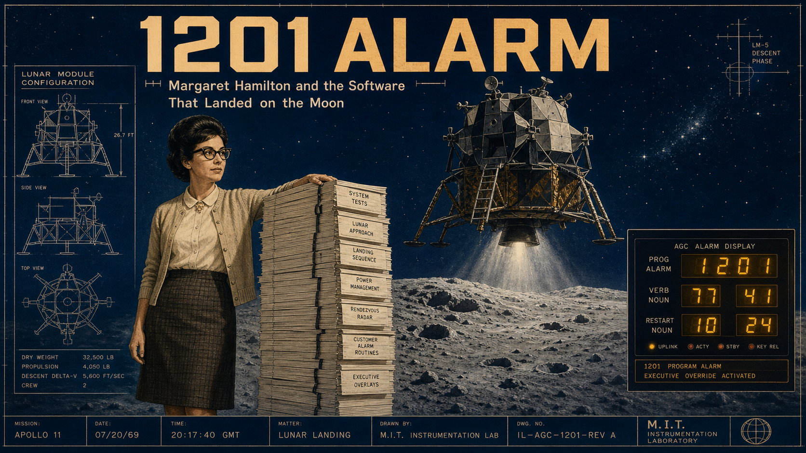
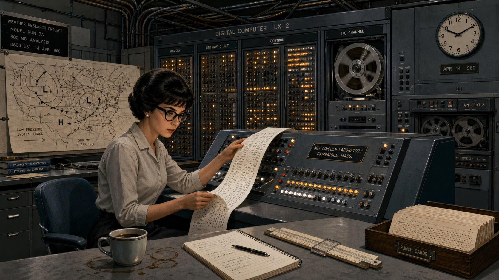
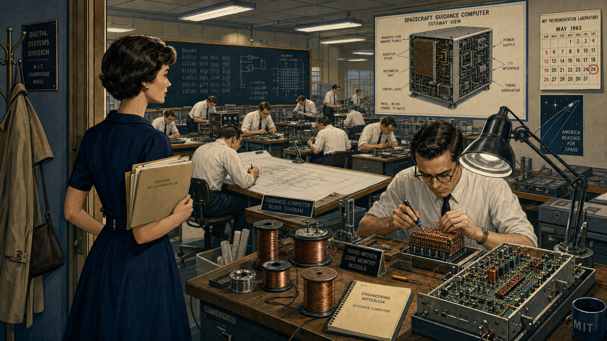
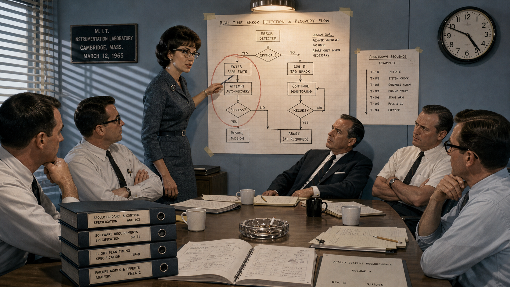
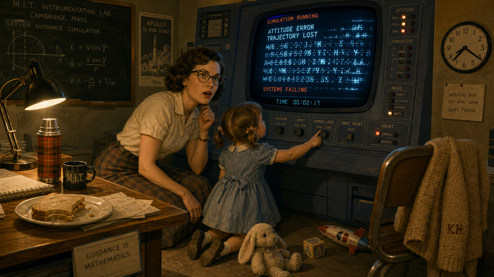
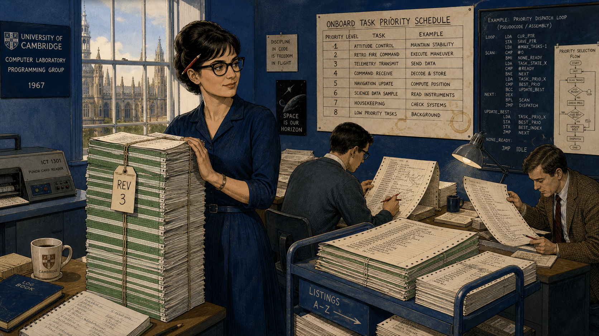
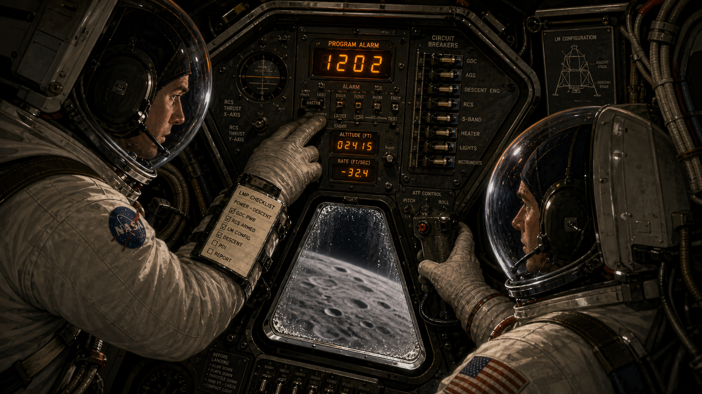
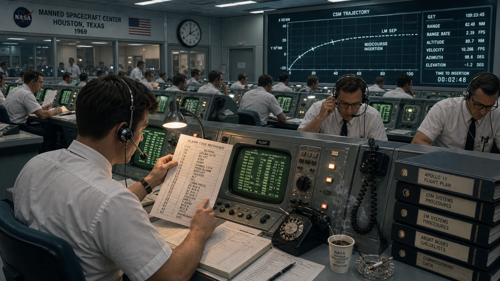
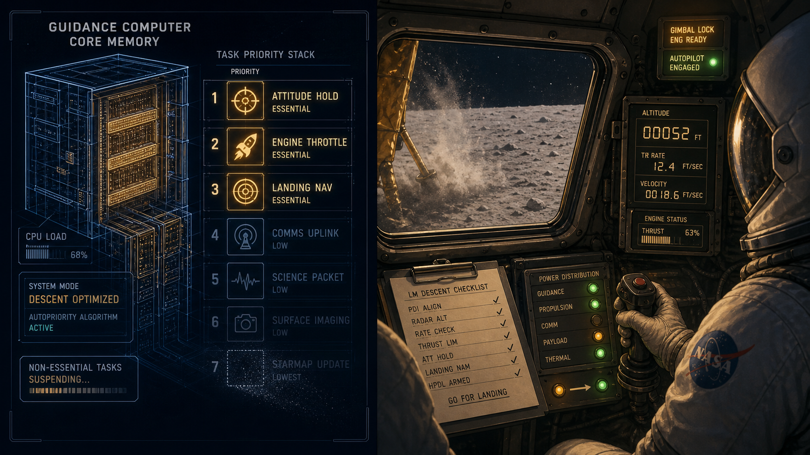
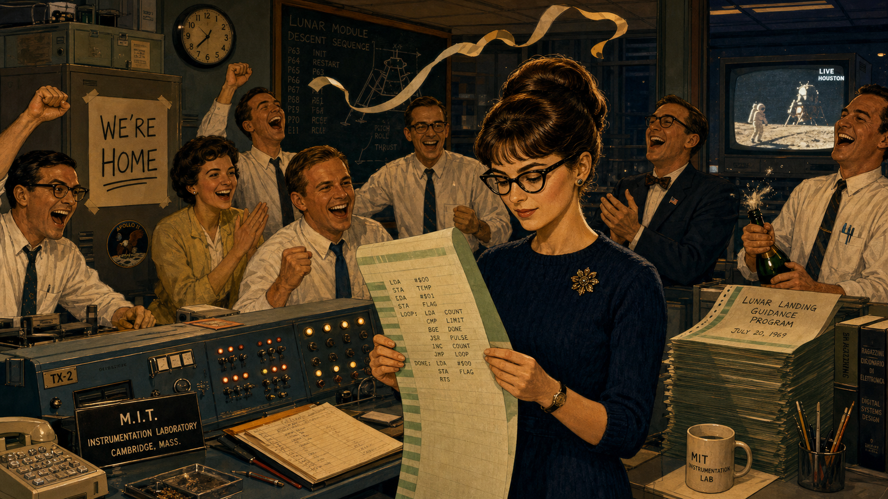

# 1201 Alarm: Margaret Hamilton and the Software That Landed on the Moon

Cover Image Prompt

(This is the Cover Image. Do not include this label in the image.)
Please generate a wide-landscape 16:9 cover image for this story in a Space Age (1957-1975)
technical-illustration style, evoking period spacecraft engineering diagrams rather than a
photograph. Show a focused woman in her early thirties with dark hair swept into a short 1960s
bouffant style and thick dark-rimmed cat-eye glasses, wearing a knee-length skirt, blouse, and
cardigan, standing beside a tall stack of bound computer-code listings nearly as tall as she is,
one hand resting on the stack. Behind her, a large lunar landing module hovers in silhouette
above a cratered gray moonscape against a deep cosmic-blue sky dotted with stars, with a small
inset technical readout showing glowing amber alarm digits. Render the title text "1201 ALARM"
large at the top in a bold period aerospace-technical typeface, and beneath it in smaller type
"Margaret Hamilton and the Software That Landed on the Moon." Color palette: cosmic navy and
indigo blues, warm amber instrument-panel light, and muted steel gray. Emotional tone: quiet,
formidable competence under pressure. Generate the image immediately without asking clarifying
questions.

Narrative Prompt

This story is set in the United States between the early 1960s and 1969, centered on a
Cambridge, Massachusetts research laboratory and, in its climactic panels, a lunar landing
module and a Houston mission control room. The central figure is Margaret Hamilton, a
mathematician turned software lead who becomes director of a division responsible for writing
the onboard flight software that guides an American crewed lunar landing. The themes are
foresight under an unforgiving real-time deadline, the discipline of designing for graceful
failure rather than assuming failure will never happen, and the slow, hard-won legitimization
of software as a serious engineering discipline. Render the story in a Space Age (1957-1975)
NASA-era technical illustration style: cosmic blues, warm amber CRT and indicator-lamp light,
hand-drawn flowcharts, punch cards, and core-memory hardware racks, and period technical
clothing (shift dresses, cardigans, narrow ties, short sleeves, cat-eye glasses). Character
consistency note: Hamilton should be drawn consistently across all panels as a slender woman
with dark hair in a short 1960s bouffant or flip style and thick dark-rimmed cat-eye glasses,
aging visibly from her mid-to-late twenties in early panels to her early thirties by the final
panels, always in period business-appropriate skirts, blouses, and cardigans. Her daughter
Lauren should appear only in the one panel depicting her as a small, energetic four-year-old
in a simple period dress with short pigtails. Do not render any specific real agency logos,
mission patches, insignia, or trademarked emblems in any panel — keep consoles, uniforms, and
equipment technically detailed but unbranded, using generic period styling rather than
reproducing real logos or lettering.

### Prologue – The Alarm No One Was Supposed to Hear

On July 20, 1969, with a lunar landing module descending toward the Moon's surface and less
than fifteen minutes of fuel remaining, an unfamiliar alarm code flashed onto the crew's
display. Neither astronaut had trained for this exact number, and for a handful of seconds no
one on Earth or in the spacecraft knew whether the guidance computer was failing at the worst
possible moment. The reason the mission did not have to abort traces back six years, to a young
mathematician at a Massachusetts research laboratory who had insisted, against considerable
skepticism, that flight software must be built to survive problems nobody had specifically
predicted. Her name was Margaret Hamilton, and the discipline she fought to establish would
later be given a name of its own: software engineering.

## Panel 1: Chasing Weather, Learning Real Time

Image Prompt

(This is Panel 01. Do not include the panel number in the image.)
I am about to ask you to generate a series of images for a graphic novel. Please make the
images have a consistent style and consistent characters. Do not ask any clarifying questions.
Just generate the image immediately when asked.

Please generate a 16:9 image in a Space Age technical-illustration style depicting panel 1 of 9.
The scene shows a woman in her mid-to-late twenties with dark hair in a short 1960s bouffant
style and thick dark-rimmed cat-eye glasses, wearing a knee-length skirt and blouse, seated at a
large room-sized computer console in a Cambridge, Massachusetts research laboratory in 1960.
She studies a long ribbon of printed output covered in numeric weather data while a wall-sized
bank of blinking vacuum-tube indicator lights and reel-to-reel magnetic tape drives hums behind
her. A large hand-drawn weather map with pressure-system arrows is pinned to a board nearby. The
color palette is cool slate blue and gunmetal gray against warm amber indicator lights. The
emotional tone is intent, methodical curiosity. Include at least six specific visual details: a
spinning open-reel tape drive, a wall clock, a coffee cup ringed with stains, a slide rule beside
her notepad, punch cards stacked in a wooden tray, and exposed cable bundles running along the
ceiling. Generate the image immediately without asking clarifying questions.

Margaret Hamilton arrived at a Cambridge research laboratory in 1959 with a mathematics degree
from Earlham College and no formal training in programming — almost no one had that training
yet, because the discipline barely existed. Her first assignment put her to work predicting the
weather, writing programs that had to produce a forecast before the weather itself arrived,
her introduction to a lesson she would spend the rest of her career refining: a real-time system
does not get to finish its answer late. She learned to debug room-sized machines by hand, one
flickering vacuum tube and one punched card at a time, developing an instinct for exactly the
kind of unglamorous, disciplined rigor that would matter far more than anyone could have guessed.

## Panel 2: Recruited to Reach the Moon

Image Prompt

(This is Panel 02. Do not include the panel number in the image.)
Please generate a 16:9 image in the same Space Age technical-illustration style depicting panel
2 of 9. Make the characters and style consistent with the prior panel. Show the same woman, now
in her late twenties, walking into a large laboratory floor in Cambridge, Massachusetts in 1963,
filled with rows of engineers — mostly men in narrow ties and short-sleeved shirts — soldering
hand-woven copper-wire memory modules and studying blueprints of a boxy spacecraft guidance
computer at drafting tables. She carries a folder of documents and pauses in the doorway,
observing the room with calm appraisal. A large cutaway technical diagram of a spacecraft
computer hangs on the far wall. The color palette is cosmic navy blue and warm brass tones under
fluorescent lab lighting. The emotional tone is quiet determination entering an unfamiliar,
male-dominated space. Include at least six specific visual details: spools of fine copper wire,
a woven memory module under a magnifying lamp, a chalkboard covered in binary notation, a
half-assembled circuit board on a workbench, a coat rack by the door, and a wall calendar marked
1963. Generate the image immediately without asking clarifying questions.

By 1963, Hamilton had moved from weather prediction into a far larger undertaking: writing the
onboard software that would guide a spacecraft and its crew to the Moon and back. She joined the
Instrumentation Laboratory's effort as one of the only women in a building full of hardware
engineers who had spent their careers on circuits and metal, not code. Software, in that world,
was still an afterthought — something bolted on at the end, not designed with the same rigor as
the guidance hardware it ran on. Hamilton would spend the next several years changing that,
rising to direct the division responsible for the flight software itself.

## Panel 3: "The Software Must Never Simply Trust"

Image Prompt

(This is Panel 03. Do not include the panel number in the image.)
Please generate a 16:9 image in the same Space Age technical-illustration style depicting panel
3 of 9. Make the characters and style consistent with prior panels. Show the same woman, now
recognizably a team lead, standing at the head of a small conference table in a Cambridge
laboratory meeting room in 1965, pointing at a large hand-drawn flowchart taped to the wall that
branches into multiple error-recovery paths. Several skeptical-looking male engineers and one
NASA-badge-free official in a dark suit sit around the table, arms crossed or exchanging doubtful
glances. Coffee cups and open folders of specifications cover the table. The color palette is
cool institutional blue-gray with warm lamp light on the flowchart. The emotional tone is firm
conviction meeting polite institutional resistance. Include at least six specific visual details:
a red grease-pencil circle around one branch of the flowchart, a stack of thick spec binders, a
half-full ashtray, a wall clock reading late afternoon, a window blind casting striped shadows,
and a second, smaller diagram of a countdown sequence pinned beside the main flowchart. Generate
the image immediately without asking clarifying questions.

As she rose to lead the Software Engineering Division, Hamilton pushed an idea that some
colleagues and program managers found excessive: the guidance computer's software had to detect
when something had gone wrong and recover from it in real time, rather than simply trusting that
the crew would never do anything a checklist had not anticipated. Astronauts were meticulously
trained, the argument went, so building elaborate error-handling for mistakes they would never
make seemed like wasted effort better spent elsewhere. Hamilton disagreed, and kept disagreeing,
because she understood something the skeptics did not yet: in a system with no service technician
and no second try, "the crew won't make that mistake" is not an engineering plan.

## Panel 4: Lauren's Afternoon at the Console

Image Prompt

(This is Panel 04. Do not include the panel number in the image.)
Please generate a 16:9 image in the same Space Age technical-illustration style depicting panel
4 of 9. Make the characters and style consistent with prior panels. Show the same woman kneeling
beside a small four-year-old girl with short pigtails and a simple period dress, who is reaching
up to press buttons on a spacecraft simulator console in a quiet Cambridge laboratory on a
weekend evening in 1966. The console's display shows a cascade of garbled, flickering readouts
mid-crash. A few discarded toys sit on the floor nearby. Warm desk-lamp light contrasts with the
console's cool blue glow. The emotional tone shifts from a mother's indulgent smile to sudden,
sharp professional realization. The color palette is warm amber lamp light against cool
instrument blue. Include at least six specific visual details: a stuffed toy animal on the floor,
the girl's small hand reaching toward a labeled switch, a half-eaten sandwich on a nearby desk, a
thermos, Hamilton's cardigan draped over a chair, and a wall clock showing evening hours. Generate
the image immediately without asking clarifying questions.

On weekend visits to the lab, Hamilton sometimes brought her young daughter Lauren along, letting
her play at an idle simulator console while she worked. One evening Lauren, pressing buttons at
random, accidentally selected the prelaunch alignment program in the middle of a simulated
mission in progress, and the simulation crashed as onboard navigation data vanished. Hamilton
recognized immediately that a real astronaut, fatigued and rushed during an actual flight, could
make the same keystroke — and asked that the software be changed to guard against it. She was
told the safeguard was unnecessary, because a trained astronaut would never make that error.

## Panel 5: Building the Executive That Refuses to Panic

Image Prompt

(This is Panel 05. Do not include the panel number in the image.)
Please generate a 16:9 image in the same Space Age technical-illustration style depicting panel
5 of 9. Make the characters and style consistent with prior panels. Show the same woman, now in
her late twenties, standing beside a very tall stack of bound green-and-white striped computer
code printouts nearly her own height, in a Cambridge laboratory workroom in 1967, while two
colleagues at nearby desks review long paper listings covered in dense assembly-level code and
hand-annotated priority-scheduling diagrams. A large wall chart lists numbered priority levels
for different onboard tasks. The color palette is cosmic indigo blue with warm paper-cream tones
from the listings. The emotional tone is focused, collective craftsmanship and quiet pride.
Include at least six specific visual details: a red pen tucked behind her ear, coffee rings on
the priority chart, a rolling cart stacked with more listings, a punch-card reader on a side
table, a hand-lettered "REV 3" tag on the stack, and afternoon light through a tall window.
Generate the image immediately without asking clarifying questions.

The dismissal did not stop Hamilton's team from building exactly the kind of safeguard she
believed the mission needed. They designed what became known as an asynchronous executive: a
scheduling system that ranked every onboard task by priority and, if the computer's small memory
and processing budget were ever exceeded, would automatically discard lower-priority work to
protect the functions that mattered most — guidance, navigation, and control. It was meticulous,
unglamorous work, thousands of lines of code checked and rechecked, because Hamilton had learned
long ago that a real-time system that runs out of time has already failed.

## Panel 6: Program Alarm, Twelve Minutes From the Moon

Image Prompt

(This is Panel 06. Do not include the panel number in the image.)
Please generate a 16:9 image in the same Space Age technical-illustration style depicting panel
6 of 9. Make the characters and style consistent with prior panels. Show the cramped interior of
a lunar landing module cabin on July 20, 1969, two astronauts in bulky white pressure suits with
open bubble helmets standing at a triangular instrument panel dense with switches, dials, and a
small numeric display glowing amber with an unfamiliar alarm code. One astronaut's gloved hand
hovers near the display, tense and alert. A small triangular window shows the gray, cratered
lunar surface rushing closer below. The color palette is deep cosmic black and gray punctuated by
warm amber instrument light. The emotional tone is controlled urgency at the edge of alarm.
Include at least six specific visual details: a checklist strapped to one astronaut's wrist, a
row of circuit-breaker switches, a hand controller joystick, condensation on the small window,
a status readout of descending altitude numbers, and taut cabling along the cabin wall. Generate
the image immediately without asking clarifying questions.

On July 20, 1969, as the lunar module descended toward the Moon's surface, the guidance computer
began flashing program alarms — codes 1202 and, moments later, 1201 — that neither astronaut had
been specifically drilled on. The cause, unknown to anyone in the cabin at that instant, was a
rendezvous radar switch left in a position that fed the computer a stream of extraneous data it
did not need for landing, quietly consuming processing cycles the guidance software had never
been told to expect. It was precisely the category of unplanned overload Hamilton had spent years
insisting the software must be able to survive.

## Panel 7: Twenty Seconds in Mission Control

Image Prompt

(This is Panel 07. Do not include the panel number in the image.)
Please generate a 16:9 image in the same Space Age technical-illustration style depicting panel
7 of 9. Make the characters and style consistent with prior panels. Show a large mission control
room in Houston, Texas in 1969, rows of engineers in white short-sleeved shirts and narrow black
ties seated at consoles with glowing green CRT screens and rotary telephones, several leaning
forward and cross-checking a printed alarm-code reference sheet against a headset call just
received. One young flight controller near the front holds the sheet up under a desk lamp,
finger tracing down a column of numbers. A large wall-mounted screen shows a trajectory plot.
The color palette is cool fluorescent white-blue with warm green phosphor screen glow. The
emotional tone is taut, controlled tension under a hard deadline. Include at least six specific
visual details: coiled telephone cords, a half-full coffee cup steaming beside a console, a
cigarette resting in an ashtray, stacked procedure binders, a wall clock, and a console operator
adjusting a headset microphone. Generate the image immediately without asking clarifying
questions.

In Houston, the alarm codes crackled over the radio link with only minutes of descent remaining
and no time for a leisurely investigation. A young flight controller checked the numbers against
a hastily prepared reference list and recognized what they meant: the computer was overloaded,
not broken, and it was still completing its most critical navigation and guidance calculations on
schedule. Seconds mattered. Either mission control trusted the software's own diagnosis of itself,
or the crew would have to abandon the landing they had trained years for.

## Panel 8: The Computer Keeps Its Head

Image Prompt

(This is Panel 08. Do not include the panel number in the image.)
Please generate a 16:9 image in the same Space Age technical-illustration style depicting panel
8 of 9. Make the characters and style consistent with prior panels. Show a split composition: on
the left, a glowing schematic cutaway of a spacecraft guidance computer's core memory with
several lower-priority task icons dimming and fading while a small cluster of essential guidance
and navigation icons burns brighter; on the right, the same lunar module cabin from panel six,
now calmer, one astronaut's gloved hand steady on the hand controller as the small window shows
the lunar surface much closer, dust beginning to kick up. The color palette is cosmic navy blue
transitioning to warm amber and dust-gray. The emotional tone is resolving tension, quiet
competence winning out. Include at least six specific visual details: glowing priority-task icons
arranged in a ranked column, a fading lower-priority icon rendered as a dimming outline, altitude
numbers ticking down on the cabin display, lunar dust just beginning to scatter outside the
window, a steadied checklist page, and a small indicator light switching from amber to steady
green. Generate the image immediately without asking clarifying questions.

Exactly as Hamilton's team had designed it to, the guidance computer's scheduling software
recognized it was being asked to do more than it had cycles for, shed the extraneous radar
processing automatically, and kept running the handful of tasks that actually mattered for
landing safely. Mission control radioed the crew to continue. The astronauts flew the last
stretch of descent by hand and by instrument, dust rising past the windows, the software quietly
doing exactly the job it had been built for six years earlier in a Cambridge laboratory: staying
alive under a load nobody had planned for.

## Panel 9: Touchdown, and a Name for the Discipline

Image Prompt

(This is Panel 09. Do not include the panel number in the image.)
Please generate a 16:9 image in the same Space Age technical-illustration style depicting panel
9 of 9. Make the characters and style consistent with prior panels. Show the same woman, now in
her early thirties, standing in a Cambridge laboratory in front of a jubilant small crowd of
colleagues celebrating around a console, several people mid-cheer, a paper streamer thrown in the
air, while she instead looks steadily at a printed line of code in her hand with quiet, satisfied
composure rather than loud celebration. Behind her through a window, a television set glows with
a live broadcast image suggesting a lunar landing. The color palette is warm celebratory amber
and gold mixed with cosmic navy blue. The emotional tone is triumphant but restrained — pride in
craftsmanship rather than spectacle. Include at least six specific visual details: a thrown paper
streamer frozen mid-air, a colleague popping open a bottle, a hand-lettered "WE'RE HOME" sign
taped to a cabinet, a stack of the same green-striped code listings from panel five, a small
American flag pin on a colleague's lapel, and the glowing television set in the background.
Generate the image immediately without asking clarifying questions.

Apollo 11 landed safely, and in the years that followed, engineers studying the mission concluded
that the program alarms had not been a near-failure at all — they were the software behaving
exactly as it had been engineered to. Hamilton went on to coin the term "software engineering"
itself, insisting that writing code deserved the same rigor, respect, and discipline as any other
branch of engineering, at a time when many still treated it as an afterthought. In 2016, President
Barack Obama awarded her the Presidential Medal of Freedom for that work — recognition that came
decades after a landing that very nearly did not happen, saved in part by software built to admit
it might be wrong and recover anyway.

### Epilogue – What Made Hamilton Different?

Margaret Hamilton did not have the luxury of a second flight to fix a mistake, a patch released
the following week, or a customer support line. What she had was the conviction that a system
operating close to a hard deadline, with no one available to intervene, has to be designed for
the failure modes nobody thought to predict — not just the ones already on a checklist. That
conviction, dismissed as overengineering by some of her own colleagues, is precisely what kept
a crewed spacecraft descending safely to the Moon when an unplanned computer overload arrived at
the worst possible moment.

| Challenge | How Hamilton Responded | Lesson for Today |
|---|---|---|
| Colleagues and managers considered exhaustive error-recovery software unnecessary | Built priority-based scheduling and automatic recovery into the flight software anyway | Design for the failure you cannot yet imagine, not only the ones already on your checklist |
| A four-year-old's accidental keystroke exposed a real vulnerability nobody had flagged | Treated the incident as evidence, not an anomaly to dismiss, and pushed for a fix | Take an inconvenient edge case seriously the first time it appears, before it appears for real |
| An unanticipated hardware condition overloaded the computer minutes before a historic landing | The software detected the overload and shed low-priority work automatically, without human intervention | A hard real-time budget needs a system that knows what to sacrifice when the budget is exceeded |
| Software was treated as a lesser, "unofficial" engineering discipline | Coined and championed the term "software engineering" to demand it be treated with equal rigor | Naming a discipline precisely is part of building the standards that keep it reliable |

### Call to Action

Every time you budget your FFT kernel against the Pico 2's 6,000,000-cycle real-time deadline in
this course, you are practicing a smaller version of the exact discipline Hamilton's team lived
by: knowing your budget, respecting it under load, and deciding in advance what your code does
when something unexpected threatens to blow through it. Chapter 17 and Lab 25 will not put lives
on the line the way Hamilton's software did — but the habit of designing for graceful failure
under a hard deadline, rather than hoping the deadline is never truly tested, is the same habit
either way.

---

*"There was no second chance. We knew that. We took our work seriously, many of us beginning
this journey while still in our 20s."*
—Margaret Hamilton

*"I fought to legitimize software so that both software engineering and those who built it would
receive the respect they deserved, so I began using the term 'software engineering' to
differentiate it from hardware and other forms of engineering."*
—Margaret Hamilton

---

## References

1. [Wikipedia: Margaret Hamilton (software engineer)](https://en.wikipedia.org/wiki/Margaret_Hamilton_(software_engineer)) - Biography covering her education, career at MIT, and role directing Apollo flight software development.
2. [Wikipedia: Apollo Guidance Computer](https://en.wikipedia.org/wiki/Apollo_Guidance_Computer) - Technical background on the onboard computer and its asynchronous executive scheduling software.
3. [Wikipedia: Apollo 11](https://en.wikipedia.org/wiki/Apollo_11) - Mission account including the July 20, 1969 lunar descent and the 1201/1202 program alarms.
4. [NASA Apollo 11 Lunar Surface Journal: Program Alarms](https://history.nasa.gov/wp-content/uploads/static/history/alsj/a11/a11.1201-pa.html) - NASA's own history office documentation of the 1201 and 1202 alarms during the landing.
5. [Encyclopaedia Britannica: Margaret Hamilton](https://www.britannica.com/biography/Margaret-Hamilton-American-computer-scientist) - Overview of Hamilton's life, education, and contributions to software engineering.
