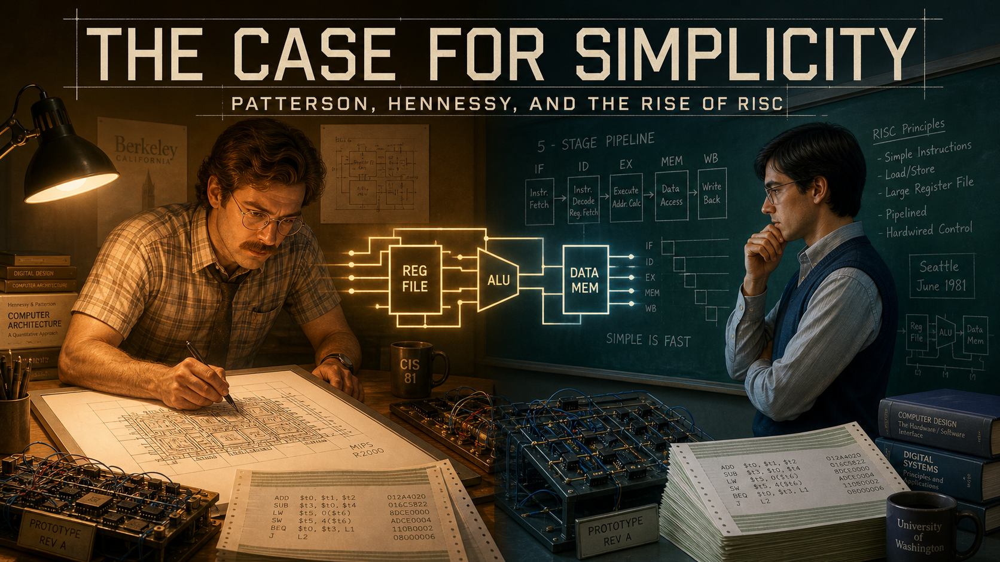
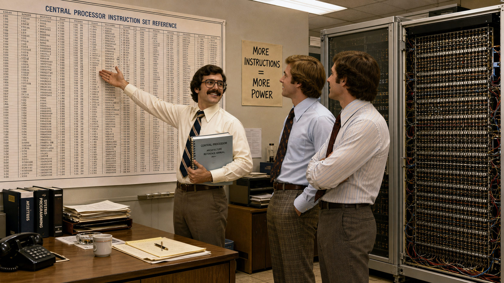
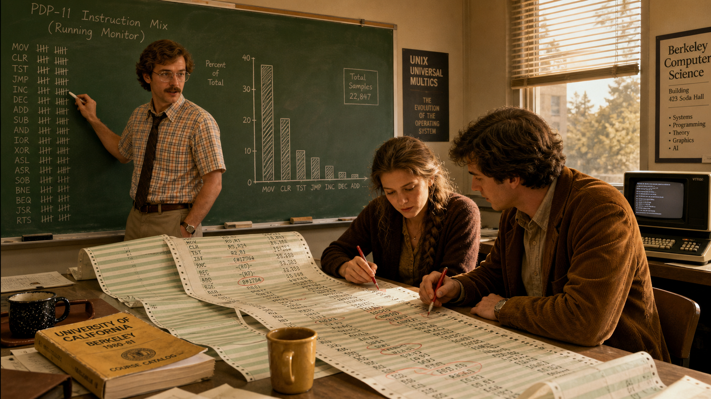
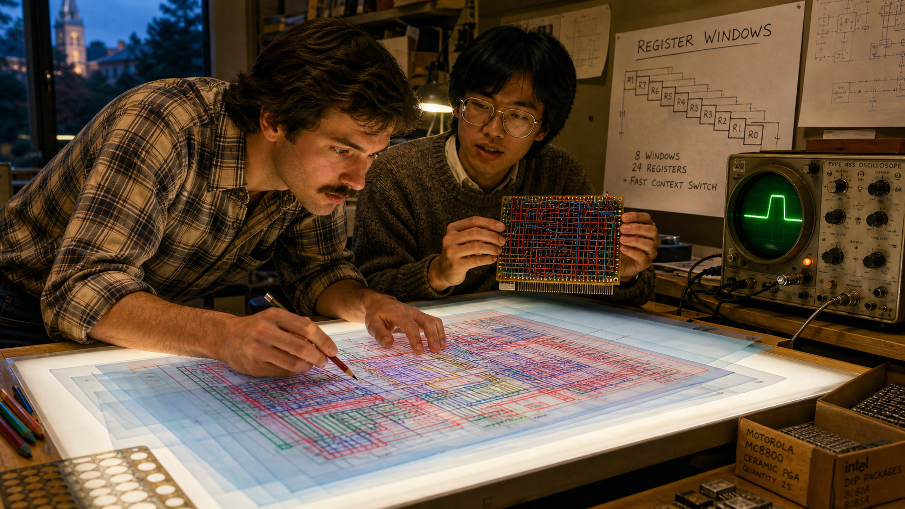
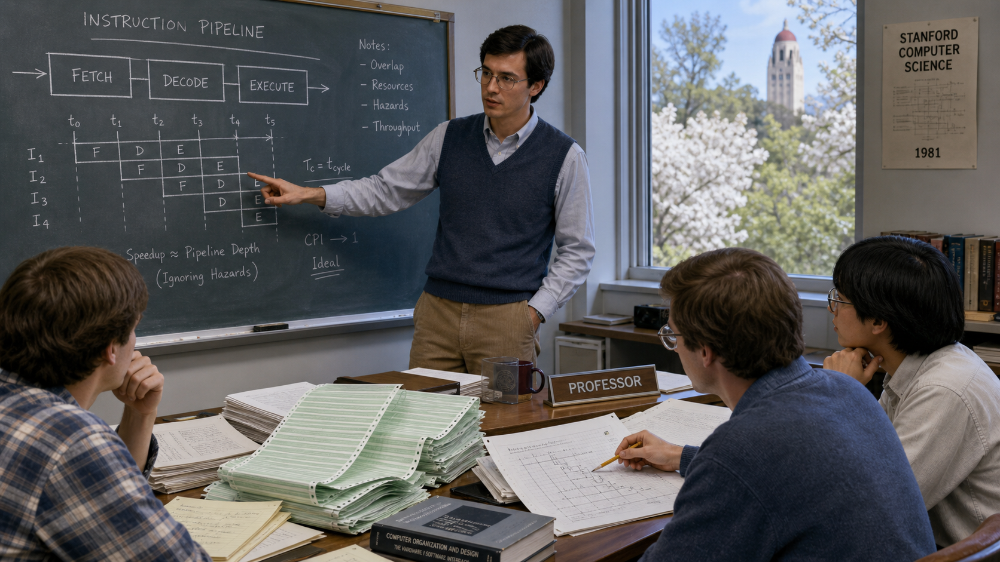
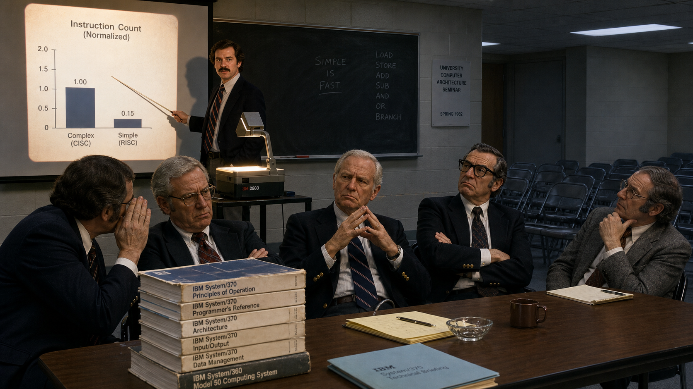
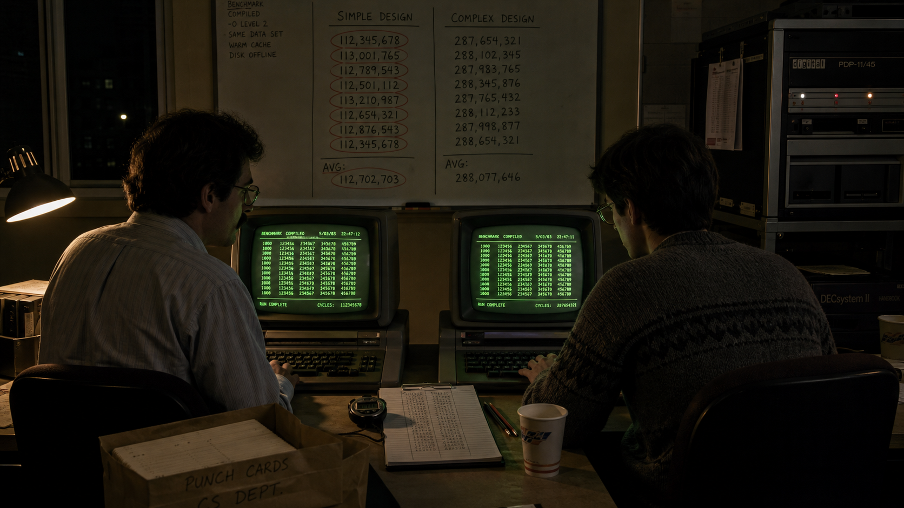
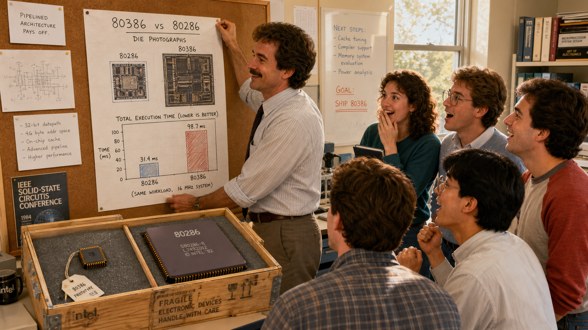
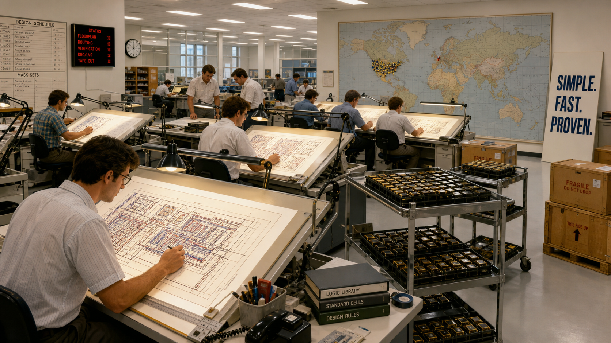
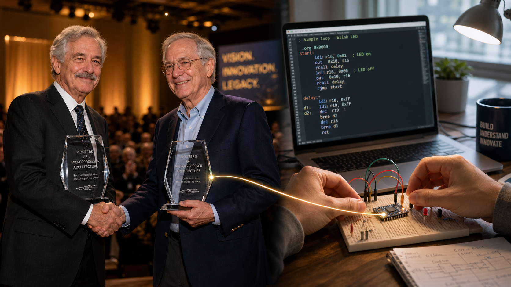

# The Case for Simplicity: Patterson, Hennessy, and the Rise of RISC

Cover Image Prompt

(This is the Cover Image. Do not include this label in the image.)
Generate a wide-landscape 16:9 cover image in a warm, contemporary
photorealistic-illustrated editorial style with early-1980s period
detail. The composition is a diptych split down the center. On the
left, under warm amber desk-lamp light, a trim man in his early
thirties with light-brown wavy hair, a full mustache, and wire-rim
glasses leans over a hand-drawn chip floorplan on a light table,
wearing a short-sleeved plaid shirt with a loosened narrow tie. On the
right, under cooler blue-green light, a lean clean-shaven man in his
late twenties with straight dark hair and rectangular wire-rim
glasses studies a wall chalkboard covered in pipeline-stage diagrams,
wearing a collared oxford shirt under a V-neck sweater vest. Between
the two halves, a single glowing simplified circuit diagram bridges
both scenes, as if the same idea is passing between two separate
rooms. Each side includes a wire-wrapped prototype circuit board and
stacks of green-and-white striped computer printout paper. Render the
title "THE CASE FOR SIMPLICITY" across the top third in bold, precise,
technical-drafting sans-serif lettering, and beneath it in smaller
matching lettering "Patterson, Hennessy, and the Rise of RISC." The
color palette is warm amber on the left blending into cool blue-green
on the right, with the neutral gray of chip silicon and printout paper
throughout. The emotional tone is quiet, parallel determination — two
people, in two cities, arriving at the same idea without knowing it.
Generate the image immediately without asking clarifying questions.

Narrative Prompt

This story follows David Patterson (b. 1947), a computer science
professor at the University of California, Berkeley, and John
Hennessy (b. 1952), a computer science professor at Stanford
University, in the United States. Between roughly 1980 and 1984, the
two men led separate, unconnected research groups six hundred miles
apart that independently concluded the computer industry's decades-long
trend toward ever more complex processor instructions was a mistake,
and each built a working prototype chip to prove a simpler alternative
could win on real, measured performance. The story spans a generic
industry engineering office in 1980, Cory Hall at UC Berkeley from
1980–1983, a computer science building at Stanford from 1981–1984, a
skeptical seminar room, a benchmarking terminal room, and finally a
present-day university lab bench. Panels 1 through 8 should use a
consistent early-1980s period illustrated style: warm institutional
fluorescent and desk-lamp lighting, wide-collar shirts, sweater vests,
horn-rim and wire-rim glasses, wood-paneled offices, green-and-white
striped fan-fold computer printout paper, wire-wrapped prototype
circuit boards, chip layouts on light tables, and green-phosphor CRT
terminals — no flat-panel displays, smartphones, or modern laptops
anywhere in this range. Panel 9 should bridge forward three decades to
a fully contemporary photorealistic style with natural daylight.
Character consistency note: Patterson should be drawn consistently as
a trim man with light-brown wavy hair, a full mustache, and wire-rim
glasses, in a short-sleeved plaid shirt with a loosened narrow tie,
aging with gray temples and more formal dress by panel 9. Hennessy
should be drawn consistently as a lean, clean-shaven man with straight
dark hair and rectangular wire-rim glasses, in a collared oxford shirt
under a V-neck sweater vest, aging with gray hair and a suit jacket by
panel 9. No real company names, product names, or trademarks should
appear as visible text or logos in any generated image; describe
machines and settings generically (a research chip, a complex
commercial processor, a computer manufacturer's engineering office)
rather than naming real brands.

### Prologue – Two Rooms, One Question

By 1980, the computer industry had spent two decades adding instructions to its processors, convinced that more capability meant more power, and nobody with a paycheck at stake had much reason to ask whether that trend still made sense. Six hundred miles apart, two university professors who had never worked together started asking it anyway. David Patterson, at Berkeley, was reading printouts of what compilers actually generated and noticing how much of the instruction set went untouched. John Hennessy, at Stanford, was reaching the same suspicion from his own direction, convinced that a simpler, faster pipeline would beat a longer list of clever instructions. Neither man set out to start a movement. Both were about to run the same experiment the rest of the industry had stopped bothering to run: build the thing, and measure it.

## Panel 1: An Industry Betting on Complexity

Image Prompt

(This is Panel 01. Do not include the panel number in the image.)
I am about to ask you to generate a series of images for a graphic
novel. Please make the images have a consistent style and consistent
characters. Do not ask any clarifying questions. Just generate the
image immediately when asked. Generate a 16:9 image in a warm,
contemporary photorealistic-illustrated editorial style with
early-1980s period detail, depicting panel 1 of 9. The scene is a
computer manufacturer's engineering office in 1980, generic and
unbranded. Three engineers in wide-collar shirts and ties stand proudly
before a floor-to-ceiling wall chart showing an instruction-set
reference sheet dense with hundreds of small entries in tiny columns.
One engineer gestures at the chart with visible pride, holding a thick
spiral-bound technical manual. A large open cabinet nearby reveals a
physical control-store memory array — rows of tiny ferrite cores wired
in a dense grid, far larger than the simple version glimpsed in the
background. A hand-lettered internal poster on the wall reads "MORE
INSTRUCTIONS = MORE POWER." Fluorescent office lighting, wood-veneer
furniture, and a floor of beige linoleum tile complete the setting.
The color palette is institutional beige, gray, and fluorescent white.
The emotional tone is confident, unquestioning pride in complexity.
Generate the image immediately without asking clarifying questions.

Through the 1970s, processor designers had kept adding instructions the way a shipbuilder adds decks — each new one justified as an improvement, none of them ever removed. A single flagship minicomputer's control store, the memory that defines what a chip's instructions actually do, had grown twenty-fold in less than a decade, from 256 words to more than five thousand. Manufacturers marketed instruction counts the way car makers marketed horsepower: bigger numbers meant a better machine, and few customers asked whether a program ever actually used most of what it was paying for. It was, in 1980, simply how real computers were built.

## Panel 2: A Question in Cory Hall

Image Prompt

(This is Panel 02. Do not include the panel number in the image.)
Generate a 16:9 image in a warm, contemporary photorealistic-illustrated
editorial style with early-1980s period detail, depicting panel 2 of 9.
Inside a university computer science building in Berkeley, California
in 1980, a trim man in his early thirties with light-brown wavy hair,
a full mustache, and wire-rim glasses, wearing a short-sleeved plaid
shirt and a loosened narrow tie, stands at a green chalkboard covered
in tally marks and a hand-drawn bar chart. Two graduate students, a
young woman with her hair in a loose braid holding a red pen and a
young man in a corduroy jacket, sit at a nearby desk buried under
unfolded green-and-white striped fan-fold computer printout, circling
specific instruction names in red ink. A small black-and-white
terminal glows in the corner. Coffee cups and a University of
California course catalog sit on the desk. Late-afternoon light comes
through a tall institutional window with venetian blinds. The color
palette is warm amber, chalk green, and printout white-and-green
stripe. The emotional tone is quiet, focused curiosity — the first
crack in an assumption. Generate the image immediately without asking
clarifying questions.

At Berkeley, David Patterson set his graduate students an unglamorous task: go through real compiled programs and count, honestly, which instructions a compiler actually chose to use. The results embarrassed the industry's marketing department. Study after study — some already sitting in the literature, others freshly run by Patterson's own group — showed a small fraction of any processor's instruction set handling the overwhelming majority of real work, while dozens of elaborate, expensively engineered instructions sat almost entirely idle. Patterson's question sharpened from a hunch into a hypothesis: if a compiler barely touches most of an instruction set, what exactly was all that complexity buying anyone?

## Panel 3: Wire and Silicon

Image Prompt

(This is Panel 03. Do not include the panel number in the image.)
Generate a 16:9 image in a warm, contemporary photorealistic-illustrated
editorial style with early-1980s period detail, depicting panel 3 of 9.
Make the characters and style consistent with the prior panels. In a
university VLSI design lab in Berkeley in 1981, the same mustached man
in a plaid shirt leans over a large backlit light table, studying a
hand-drawn chip floorplan on translucent mylar sheets in colored pencil
— red, blue, and green layers stacked to show circuit paths. Beside
him, a young graduate student in a knit sweater holds up a small
wire-wrapped prototype circuit board bristling with a dense grid of
color-coded wires. A pinned wall diagram labeled with hand lettering
reads "REGISTER WINDOWS" beside a simple stepped-block sketch. A
tabletop oscilloscope with a round green screen sits nearby, its trace
frozen mid-pulse. Cardboard boxes of chip packages sit under the table.
The color palette is warm amber desk light against deep blue mylar
layers. The emotional tone is intent, hands-on excitement — an idea
becoming a physical object. Generate the image immediately without
asking clarifying questions.

Patterson's answer was not an argument but a chip. His research group set out to design a processor with a deliberately small, fast, uniform instruction set — one built for how compilers actually work rather than for how assembly programmers liked to show off. To make up for what a shorter instruction list gave away, the team leaned on techniques a complex design had no room left to use: overlapping register windows that made function calls nearly free, and a pipeline simple enough to run at full speed with no wasted cycles decoding baroque instruction formats. By 1981, that design existed as real silicon layouts and wire-wrapped prototypes, not just a proposal on paper — a chip its own designers had started calling, half-defiantly, a reduced instruction set computer.

## Panel 4: Six Hundred Miles South, the Same Question

Image Prompt

(This is Panel 04. Do not include the panel number in the image.)
Generate a 16:9 image in a warm, contemporary photorealistic-illustrated
editorial style with early-1980s period detail, depicting panel 4 of 9.
Make the characters and style consistent with the prior panels. Inside
a separate university computer science building in Stanford,
California in 1981, a lean, clean-shaven man in his late twenties with
straight dark hair and rectangular wire-rim glasses, wearing a
collared oxford shirt under a V-neck sweater vest, stands at his own
chalkboard covered in a horizontal, multi-stage pipeline diagram with
overlapping boxes labeled by hand: FETCH, DECODE, EXECUTE. Three
graduate students sit around a cluttered table strewn with
green-and-white striped printout and a stack of course notes, one
pointing at a timing diagram with a mechanical pencil. A window behind
them shows spring foliage, distinctly different scenery from the
Berkeley panels. A small nameplate on the desk reads only "PROFESSOR"
with no visible surname. The color palette leans cooler than the
Berkeley panels — pale blue-gray daylight instead of warm amber. The
emotional tone is independent, methodical confidence, unaware of the
parallel effort underway elsewhere. Generate the image immediately
without asking clarifying questions.

Neither Patterson nor his Berkeley team had any contact with what was happening at Stanford, and that is the detail worth sitting with. John Hennessy had arrived at nearly the same conclusion from a different angle entirely: pipelining. A processor pipeline runs faster when every instruction takes a simple, predictable, uniform amount of work to decode and execute, and the complex instruction sets of the era were exactly the kind of irregular workload that broke a pipeline's rhythm. In 1981, Hennessy launched his own research effort at Stanford, built around a similarly small, compiler-friendly, pipelining-friendly instruction set. Two labs, no coordination between them, had independently bet on the same unfashionable idea within the same twelve months.

## Panel 5: "That's Not How Real Computers Are Built"

Image Prompt

(This is Panel 05. Do not include the panel number in the image.)
Generate a 16:9 image in a warm, contemporary photorealistic-illustrated
editorial style with early-1980s period detail, depicting panel 5 of 9.
Make the characters and style consistent with the prior panels. In a
university seminar room in 1982, the mustached man from earlier panels
stands at the front holding a pointer toward a projected transparency
on a wheeled overhead projector, showing a simple instruction-count bar
chart. In the foreground, five seated senior engineers and professors
in dark blazers and wide ties sit with arms crossed or hands steepled,
skeptical expressions on their faces; one leans toward a colleague to
murmur something behind a raised hand. A stack of thick, well-worn
architecture manuals sits on the table in front of them, visibly far
larger than the single thin folder in front of the presenter. Rows of
empty folding chairs recede into shadow at the back of the room. The
color palette is cool fluorescent gray with a single warm pool of
overhead-projector light on the presenter. The emotional tone is
tense, polite disbelief. Generate the image immediately without asking
clarifying questions.

Both teams ran into the same wall of doubt. To engineers who had spent careers making instruction sets more powerful, a processor with fewer, simpler instructions sounded like a step backward dressed up as a discovery — surely all that missing complexity would just reappear as slower software, or get shoved onto compiler writers who could never make up the difference. Reviewers rejected papers built on the idea. Colleagues pointed out, not unreasonably, that every successful commercial machine of the era was built the other way. Patterson and Hennessy each heard some version of the same sentence in their own seminar rooms that year: that is simply not how real computers are built. Neither team had an argument clever enough to answer that. What they had instead was a chip, and a plan to measure it.

## Panel 6: The Stopwatch Doesn't Lie

Image Prompt

(This is Panel 06. Do not include the panel number in the image.)
Generate a 16:9 image in a warm, contemporary photorealistic-illustrated
editorial style with early-1980s period detail, depicting panel 6 of 9.
Make the characters and style consistent with the prior panels. A
university computer terminal room at night in 1983, lit almost
entirely by the green-phosphor glow of several CRT terminal screens
displaying columns of scrolling numeric output. The mustached man and
a graduate student in a knit sweater sit side by side at two adjacent
terminals, each running an identical compiled benchmark program, a
stopwatch and a clipboard of hand-recorded cycle counts between them
on the desk. A whiteboard behind them lists two columns of results
side by side under the headers "SIMPLE DESIGN" and "COMPLEX DESIGN,"
with the simple column's numbers circled. Cold coffee cups, a bag of
punch cards, and a rolling cart holding a second, larger reference
minicomputer occupy the background shadows. The color palette is deep
near-black shadow cut by green-phosphor glow and warm desk-lamp
accents. The emotional tone is quiet, disciplined focus — the moment
of finding out, not yet the moment of celebrating. Generate the image
immediately without asking clarifying questions.

Rather than keep arguing philosophy, both teams did the thing this course itself insists on: they measured. Patterson's group and Hennessy's group each ran real, compiled workloads — not cherry-picked demonstrations — on their research chips and on established complex-instruction-set machines, counting actual instructions executed and actual clock cycles consumed rather than trusting a spec sheet. It was slow, unglamorous work, night after night in terminal rooms lit by nothing but green phosphor, recording numbers that could just as easily have proven the skeptics right. Neither team got to choose the outcome. The benchmark would say what it said.

## Panel 7: Simple Wins

Image Prompt

(This is Panel 07. Do not include the panel number in the image.)
Generate a 16:9 image in a warm, contemporary photorealistic-illustrated
editorial style with early-1980s period detail, depicting panel 7 of 9.
Make the characters and style consistent with the prior panels. A
university lab in 1984, daylight streaming through a window. The
mustached man pins a hand-drawn results chart to a corkboard: two
silicon die photographs side by side, the left one visibly smaller and
simpler than the right, with a bar graph beneath showing the smaller
chip's total execution time noticeably lower. A small crowd of four
graduate students, some the same ones from earlier panels, cluster
around with expressions shifting from doubt to surprised delight; one
raises both fists slightly in a contained, disbelieving cheer. On a
side table, an opened packing crate reveals a small finished
prototype chip mounted in a ceramic package, price tag string still
attached, resting beside a much larger, more complex chip package for
comparison. The color palette is bright, warm daylight gold with
crisp whites. The emotional tone is earned, data-driven triumph, not
showmanship. Generate the image immediately without asking clarifying
questions.

The results favored the simpler machines. Both research chips matched or beat established complex designs on real compiled workloads, using a small fraction of the transistors — silicon budget that had gone toward bloated instruction decoding could instead buy more registers, a faster pipeline, or both. One later analysis of the era's numbers found the pattern precisely: a complex design might execute roughly a quarter fewer instructions per program, but it needed five to six times more clock cycles to execute each one, leaving the simpler chips roughly four times faster overall. In 1984, both research groups presented finished, working silicon at the field's leading circuit conference — proof, not promise, that a few graduate students with a light table and a benchmark could out-design what industry's much larger teams had built.

## Panel 8: An Idea Loose in the World

Image Prompt

(This is Panel 08. Do not include the panel number in the image.)
Generate a 16:9 image in a warm, contemporary photorealistic-illustrated
editorial style with early-1980s period detail, depicting panel 8 of 9.
Make the characters and style consistent with the prior panels. A
mid-1980s semiconductor company engineering floor, generic and
unbranded, filled with several drafting tables where engineers in
short-sleeved shirts study chip floorplans clearly descended in style
from the light-table drawings of earlier panels. A large wall map of
the world has small pins clustered in two American regions and, faintly
visible, one pin near a small European city, hinting at a separate,
parallel effort happening an ocean away. A trade-show banner leaning
against one wall reads only "SIMPLE. FAST. PROVEN." in plain block
lettering. Rolling carts hold small finished chip packages ready for
shipping crates. Fluorescent light floods the open floor. The color
palette is bright industrial white and steel-gray with warm accent
lighting at each drafting table. The emotional tone is expansive,
energetic momentum — an idea outgrowing its original two labs.
Generate the image immediately without asking clarifying questions.

Through the mid-1980s, the reduced-instruction philosophy stopped being two universities' research result and became an industry direction. Companies licensed and commercialized the approach into new processor families built on the same core bet: fewer, simpler, faster instructions, more silicon spent on speed instead of decoding cleverness. Four thousand miles east, an entirely separate and even smaller team in Cambridge, England — working at a nearly bankrupt computer company that could not afford a licensed processor at any price — was arriving at a strikingly similar design from the opposite direction, driven not by benchmarking ambition but by having no budget for complexity at all. Two very different motives, on two continents, had converged on the same conclusion: simple, done well, beats complex.

## Panel 9: Two Professors, One Legacy

Image Prompt

(This is Panel 09. Do not include the panel number in the image.)
Generate a 16:9 image in a fully contemporary photorealistic
illustrated style with natural daylight, depicting panel 9 of 9. The
scene splits across a single frame: on the left, two men now in their
sixties and seventies stand together on a formal award-ceremony stage,
the same mustached man now gray-haired in a dark suit and the same
once-clean-shaven man now with gray hair and reading glasses in a
navy blazer, shaking hands and each holding an identical engraved
glass trophy, warm stage lighting and a blurred audience behind them.
On the right, in sharp focus, a present-day university student's hands
rest on a small breadboard holding a tiny thumbnail-sized
microcontroller board wired to a handful of components, a laptop
screen nearby showing a simple assembly-language code listing. A thin
glowing line visually connects the trophy on the left to the small
chip on the right, tracing an unbroken thread across the frame. The
color palette is warm gold stage light blending into cool, crisp
desk-lamp daylight on the right. The emotional tone is quiet, earned
legacy — an idea proven decades ago, still doing work today. Generate
the image immediately without asking clarifying questions.

Patterson and Hennessy went on to write "Computer Architecture: A Quantitative Approach" together, first published in 1990, turning their shared insistence on measurement over intuition into the textbook that trained the next several generations of chip designers. In 2018, the Association for Computing Machinery awarded them the 2017 Turing Award jointly, citing their "systematic, quantitative approach to the design and evaluation of computer architectures with enduring impact on the microprocessor industry." Today, more than ninety-nine percent of the billions of processor chips built each year trace their instruction-set philosophy back to what two independent research groups proved with a light table, a stopwatch, and a benchmark in the early 1980s. Every ARM Cortex-M core — including the one on the board this course's students hold in their own hands — inherits that same bet on simplicity, which is exactly why its instruction set fits inside a single course module instead of a career.

### Epilogue – What Made the RISC Approach Different?

What made Patterson and Hennessy's approach different was not that they had a better opinion about instruction sets — plenty of engineers had opinions. It was that they refused to let the argument stay an opinion. Each team built the chip, ran the real workload, and let the resulting number settle a question that decades of industry momentum had never bothered to ask honestly. That two independent groups, working from different motivations and never coordinating, arrived at the same measured answer made the result far harder to dismiss than either alone could have managed. Their insistence on quantitative proof over inherited assumption became, in time, its own field: computer architecture as a measured science rather than a craft of accumulated habit.

| Challenge | How Patterson and Hennessy Responded | Lesson for Today |
|---|---|---|
| An entire industry assumed more instructions meant more capability, with no one measuring whether that assumption still held | Counted what compilers actually used, replacing a marketing assumption with real data from real compiled programs | Question inherited wisdom with evidence, not with a better-sounding argument |
| Skeptics warned that simpler hardware would just shift cost and complexity onto compilers and software | Built working silicon and benchmarked it against established complex designs on identical, real workloads | A working prototype that has been measured beats a claim that has only been argued |
| Two labs pursued the same radical idea with no contact or coordination between them, risking wasted or contradictory effort | Let each project run independently to completion, and let the converging results reinforce each other | Independently reproduced results carry more weight than any single lab's claim |
| A promising research result needed to outlive its original two prototypes to matter | Co-authored a rigorous, quantitative textbook and kept publishing benchmarked evidence for decades afterward | An idea only becomes a lasting principle when its evidence keeps being made available to the next generation |

### Call to Action

When you write the hand-optimized ARM assembly in this course's later chapters, you are working inside an instruction set that exists, in its exact shape, because two professors in 1981 refused to accept "that's how it's done" as an answer and measured their way to a better one. Every benchmark you run in this course's labs — timing your own FFT honestly, refusing to let a convenient number substitute for a measured one — is the same discipline Patterson and Hennessy used to settle an argument the rest of the industry had stopped questioning. Simplicity did not win because it sounded elegant. It won because someone finally ran the stopwatch.

---

*"Compilers are often unable to utilize complex instructions, nor do they use the insidious tricks in which assembly language programmers delight."*
—David Patterson (with David Ditzel), "The Case for the Reduced Instruction Set Computer" (1980)

*"It was a remarkable moment when a few graduate students at Berkeley and Stanford could build microprocessors that were arguably superior to what industry could build."*
—John Hennessy and David Patterson, "A New Golden Age for Computer Architecture" (2019)

---

## References

1. [Wikipedia: Reduced instruction set computer](https://en.wikipedia.org/wiki/Reduced_instruction_set_computer) - Overview of the RISC design philosophy, its 1980s origins, and its industry-wide adoption
2. [Wikipedia: David Patterson (computer scientist)](https://en.wikipedia.org/wiki/David_Patterson_(computer_scientist)) - Biography covering the Berkeley RISC project and Patterson's career at UC Berkeley
3. [Wikipedia: John L. Hennessy](https://en.wikipedia.org/wiki/John_L._Hennessy) - Biography covering the Stanford MIPS project and Hennessy's career at Stanford University
4. [ACM A.M. Turing Award: David A. Patterson](https://amturing.acm.org/award_winners/patterson_2316693.cfm) - Official ACM citation for the 2017 Turing Award, shared with John Hennessy, for pioneering the RISC approach
5. [Encyclopaedia Britannica: RISC](https://www.britannica.com/technology/RISC) - Overview of reduced instruction set computing and its impact on processor design
