# Cooling the Fire: Seymour Cray's Obsession with Honest Speed

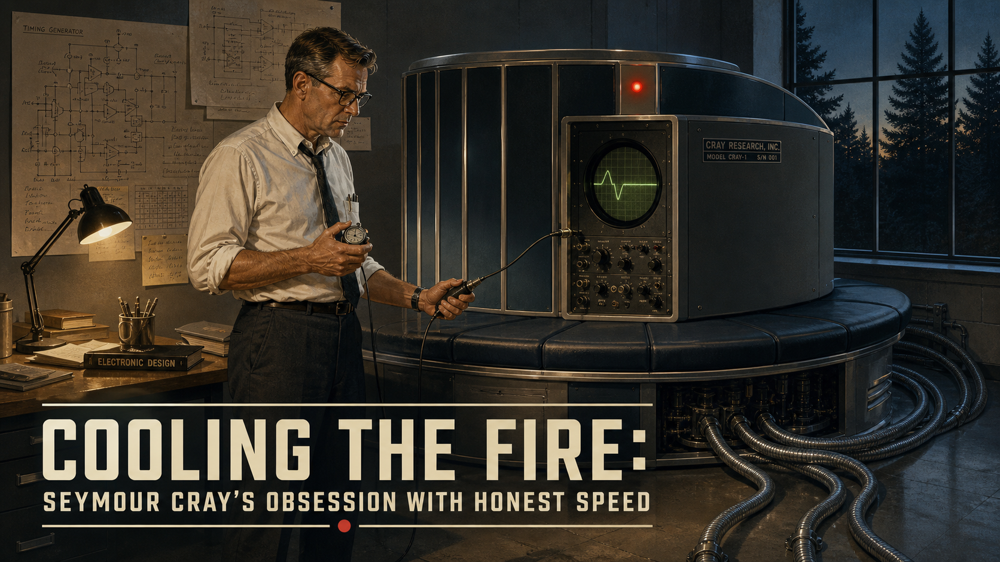

Cover Image Prompt

(This is the Cover Image. Do not include this label in the image.)
Please generate a wide-landscape 16:9 cover image in a Mid-Century Atomic
Age illustration style transitioning toward Space-Age NASA-adjacent design.
Depict a tall, lean American engineer in his late forties — sandy-brown
hair graying at the temples, horn-rimmed glasses, sleeves of a plain white
button-down shirt rolled to the elbow, narrow dark tie loosened — standing
alone in a dim computer room in front of a squat, C-shaped mainframe
cabinet ringed by a cushioned bench. He holds a handheld stopwatch in one
hand and an oscilloscope probe in the other, watching a trace on a round
green screen rather than looking at the machine itself. Thin coils of
tubing loop from the base of the cabinet across the concrete floor,
suggesting a liquid cooling system. The room is lit by warm incandescent
work-lamps against cool blue-gray shadows, with a wall of hand-drawn
circuit schematics pinned up behind him and a single tall window showing
dark pine trees outside, evening light. Render the title text "Cooling the
Fire: Seymour Cray's Obsession with Honest Speed" in a period-appropriate
bold sans-serif technical typeface, like 1960s engineering-manual
lettering, along the lower third of the image. Color palette: muted grays,
steel blues, and warm amber lamp light, with a single small red
indicator-light accent. Emotional tone: quiet, solitary concentration —
a craftsman checking his own work rather than celebrating it. Generate the
image immediately without asking clarifying questions.

Narrative Prompt

This story spans the career of an American electrical engineer, born 1925
in rural Wisconsin, from his World War II military service through his
death in 1996. The setting moves through the American Midwest — Minnesota
and Wisconsin — and later Colorado, spanning roughly 1943 to 1996. Render
every panel in a consistent Mid-Century (1950s-1970s) Atomic Age /
Bell-Labs-modernism illustration style — hand-drawn technical linework,
oscilloscopes, hand-lettered circuit schematics, reel-to-reel tape drives,
drafting tables — gradually shifting toward a Space-Age, NASA-adjacent
palette and lighting as the story moves into the 1970s and 1980s
supercomputer era. Central themes: obsessive engineering discipline,
radical simplicity, solitary focus, and above all a refusal to accept any
performance number that has not been personally measured and reproduced.
Character consistency: the central figure is tall and lean with sandy-
brown hair (graying and thinning across the decades), horn-rimmed glasses,
and a plain, unfashionable wardrobe — white or pale-blue button-down
shirts with rolled sleeves and a narrow dark tie in the earlier panels,
shifting to plaid or flannel shirts in the later, more rural panels. He
should look the same age-appropriate person in every panel: early
twenties in the wartime panel, thirties in the 1950s-60s panels, forties
to fifties in the 1970s-80s panels, and elderly but still lean and
alert in the final panels of the 1990s. Palette across the whole story:
muted institutional grays, steel blues, warm amber work-lighting, with
occasional cool green (oscilloscope traces) or blue-white (cooling liquid)
accent lighting. No modern technology, clothing, or architecture should
appear anywhere in the story.

### Prologue – The Number He Wouldn't Sign Off On

In 1964, a small computer laboratory tucked into the pine forests of Chippewa Falls, Wisconsin, shipped a machine that outran anything the far larger engineering divisions of the world's dominant computer company had ever built. Its designer had no marketing department, no advertising budget, and no real interest in either. What he did have was a private, almost monastic conviction: a machine's speed meant nothing until he had timed it himself, on real hardware, with instruments he trusted completely. That conviction — more than any single circuit he ever patented — was his true invention, and it is the same discipline this course asks of you every time you report a cycle count for your own FFT.

## Panel 1: A Technician Under Fire

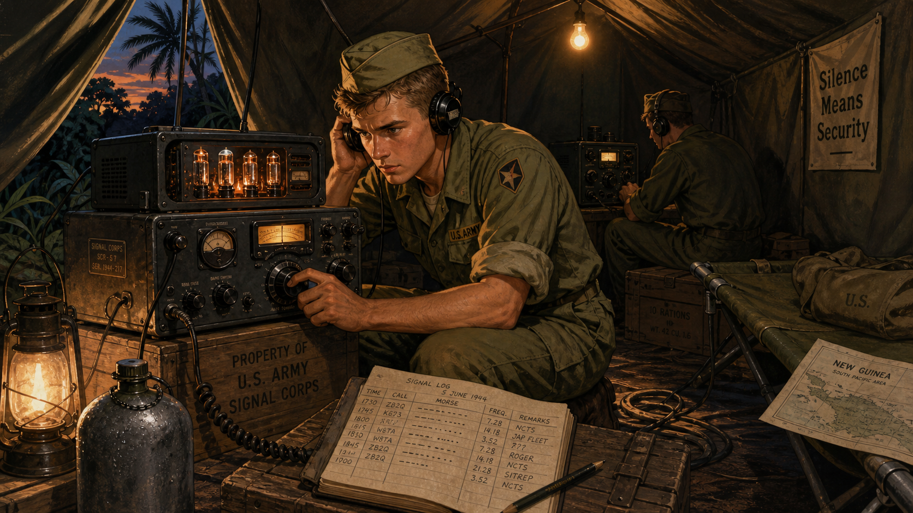

Image Prompt

(This is Panel 01. Do not include the panel number in the image.)
I am about to ask you to generate a series of images for a graphic novel.
Please make the images have a consistent style and consistent characters.
Do not ask any clarifying questions. Just generate the image immediately
when asked.

Please generate a 16:9 image in Mid-Century Atomic Age illustration style
depicting panel 1 of 12. The scene shows a lean American soldier in his
late teens, sandy-brown hair cropped short under a canvas field cap, U.S.
Army fatigues with sleeves rolled up, kneeling inside a canvas field tent
in the Pacific theater in 1944. He is adjusting the dial of a bulky
vacuum-tube radio receiver by hand, headphones pressed to one ear, a
grease-pencil notepad of Morse code and signal readings open on a wooden
crate beside him. A second soldier in the tent's shadowed background
monitors a second receiver. Outside the tent flap, tropical foliage and a
sliver of dusk sky are visible. Color palette: olive drab greens, dull
brass and copper tones, warm lantern light against deep shadow. Emotional
tone: alert, focused competence under quiet pressure. Include at least six
specific visual details: glowing vacuum tubes visible through receiver
vents, a coiled field-telephone wire on the ground, a canvas cot in the
corner, a hand-drawn signal log, condensation on a metal water canteen,
and a single bare bulb strung from the tent's ridgepole. Generate the
image immediately without asking clarifying questions.

Seymour Cray traded a Chippewa Falls, Wisconsin, high school classroom for a U.S. Army radio unit in 1943, at the age of eighteen. Across postings in the Pacific and European theaters, he spent long nights hunched over vacuum-tube receivers, learning by touch and static how a real signal pulled apart from noise under conditions no classroom could simulate. The Army also set him to work on cryptographic equipment, an early brush with the idea that a machine's job is to reveal a hidden truth buried inside electrical chaos. He came home in 1945 with steady hands, a technician's patience, and no illusions about what any piece of equipment could do until someone had actually tested it.

## Panel 2: A Bench of His Own

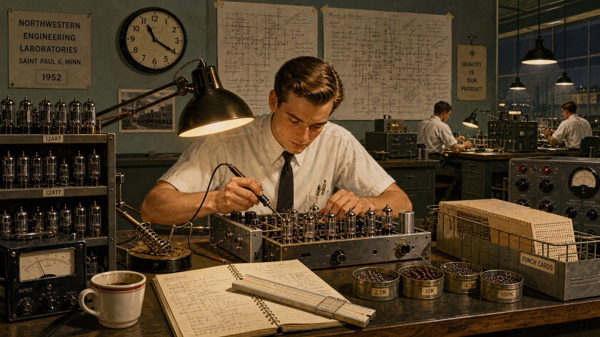

Image Prompt

(This is Panel 02. Do not include the panel number in the image.)
Please generate a 16:9 image in Mid-Century Atomic Age illustration style
depicting panel 2 of 12. Make the characters and style consistent with the
prior panel. The scene shows the same young man, now in his mid-twenties,
sandy-brown hair neatly combed, wearing a white short-sleeved button-down
shirt and narrow dark tie, alone at a cluttered engineering workbench in a
research laboratory in Saint Paul, Minnesota, in 1952. He leans over a
half-built vacuum-tube logic chassis with a soldering iron in hand, hand-
drawn circuit diagrams taped to the wall behind him covered in dense
pencil annotations. Other engineers work at distant benches in the
background, but he is visibly isolated by an empty workbench on either
side of him. Color palette: institutional gray-green walls, warm amber
desk-lamp light, brass and gunmetal equipment tones. Emotional tone:
absorbed solitary concentration. Include at least six specific visual
details: rows of glass vacuum tubes in open racks, a slide rule beside his
notebook, a wall clock reading late evening, a coffee cup gone cold, spare
resistors sorted into labeled tins, and a punch-card tray stacked nearby.
Generate the image immediately without asking clarifying questions.

At Engineering Research Associates in Saint Paul, Minnesota, the young engineer found a company built around one unglamorous mission: building cryptographic computing machines for the U.S. Navy correctly, the first time. Cray finished an electrical engineering degree and a master's in applied mathematics at the University of Minnesota, then walked into the company's drafting rooms in 1951 and asked for the hardest, least-supervised problems on the shelf. Colleagues remembered him disappearing for days at a stretch, filling notebooks with his own hand-drawn logic diagrams rather than trusting anyone else's math. By 1953 he had helped deliver one of the first commercially produced scientific computers in the country, and he had already decided that committees slowed machines down.

## Panel 3: Betting Against the Vacuum Tube

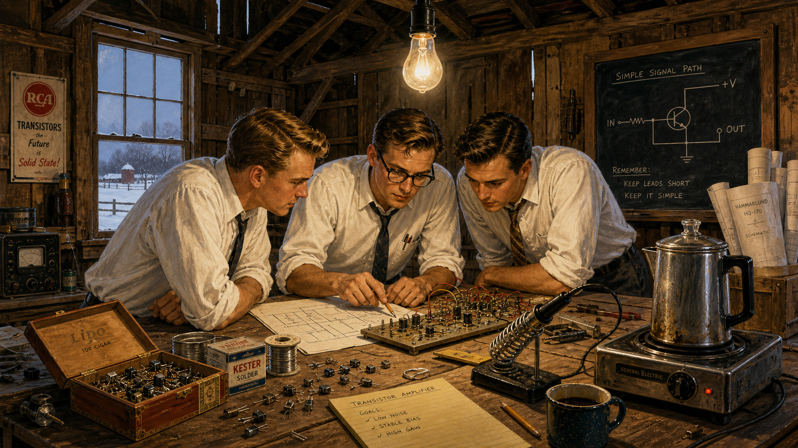

Image Prompt

(This is Panel 03. Do not include the panel number in the image.)
Please generate a 16:9 image in Mid-Century Atomic Age illustration style
depicting panel 3 of 12. Make the characters and style consistent with the
prior panels. The scene shows the same man, now in his early thirties,
horn-rimmed glasses added, white shirt sleeves rolled to the elbow, tie
loosened, standing in a converted barn workshop in rural Minnesota in
1957. He and two colleagues in similar shirts crowd around a workbench
scattered with small transistor components, comparing a hand-drawn
schematic against a partially wired circuit board under a bare hanging
bulb. A chalkboard on the exposed wooden wall reads a simple diagram of
circuit paths. Weathered barn siding and a single tall barn window showing
snow outside are visible. Color palette: raw wood browns, cool winter
light through the window, warm bulb light on the workbench. Emotional
tone: determined, scrappy ambition. Include at least six specific visual
details: loose transistors in a cigar box, a soldering iron resting on a
metal stand, drifted snow visible through the window, a coffee percolator
on a hot plate, rolled blueprints in a corner, and exposed barn rafters
overhead. Generate the image immediately without asking clarifying
questions.

Restless after his employer was absorbed into a larger corporation, Cray grew tired of watching engineering decisions get made in meetings instead of on lab benches. In 1957 he left with a handful of colleagues to help start a new company, betting that the fragile, power-hungry vacuum tube was already an obsolete idea. Working out of borrowed, unglamorous space, his small team wired early transistor circuits by hand, chasing one goal above all others: build the fastest scientific computer in the world, not the most profitable or the most feature-laden. Cray insisted on doing much of the physical layout himself, certain that no engineer who had never held the soldering iron could really judge whether a design was fast.

## Panel 4: An Answer Written in a Memo

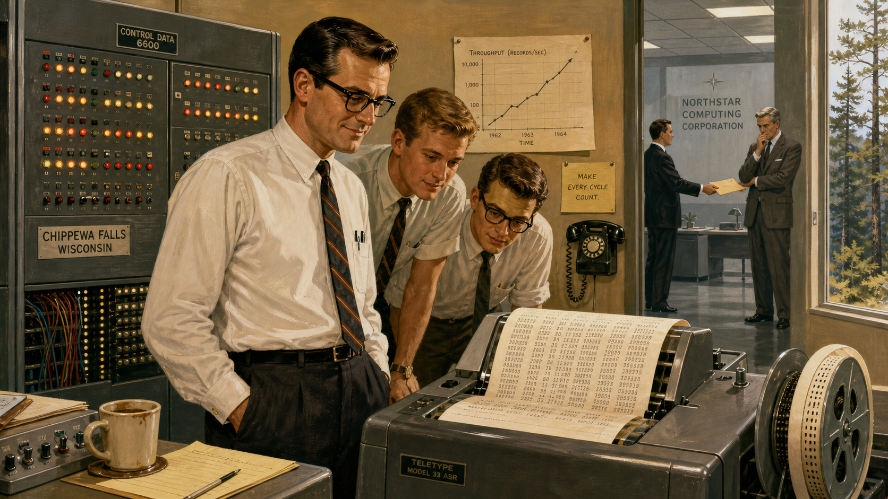

Image Prompt

(This is Panel 04. Do not include the panel number in the image.)
Please generate a 16:9 image in Mid-Century Atomic Age illustration style
depicting panel 4 of 12. Make the characters and style consistent with the
prior panels. The scene shows the same man, now in his late thirties, in
a spare computer room in Chippewa Falls, Wisconsin, in 1964, standing
beside a large freshly wired mainframe cabinet studded with indicator
lights. He watches a teletype printer chattering out a strip of paper
covered in numbers, a faint, satisfied half-smile on his face, while two
younger engineers in shirtsleeves lean in to read the printout over his
shoulder. In the far background, through an open doorway, a courier in a
suit is shown handing an unmarked envelope to a distant, distressed-
looking executive at a rival company's polished corporate office, rendered
smaller and grayer to suggest distance and contrast. Color palette: cool
fluorescent grays in the executive office contrasted with warm incandescent
tones in the lab. Emotional tone: quiet vindication rather than triumph.
Include at least six specific visual details: a spooling paper-tape
printer, rows of blinking indicator lights, a wall-mounted rotary phone,
a half-finished cup of coffee on a console, a hand-drawn performance graph
pinned to the wall, and a window showing pine trees outside the lab.
Generate the image immediately without asking clarifying questions.

By 1964, that small team's newest machine was running rings around computers built by companies with a hundred times the staff and budget. Word reached a rival company's front office that the fastest computer in the world had come out of a Wisconsin lab employing only a few dozen people, and an exasperated executive's internal memo eventually made its way back to Cray, asking how such a small group could out-engineer a research division many times its size. Cray's reported reply was characteristically short: the executive, he said, had already answered his own question. A small team doing verifiable, disciplined work had simply out-thought a much larger one that had never tested its own assumptions.

## Panel 5: Fewer Hands, Fewer Words

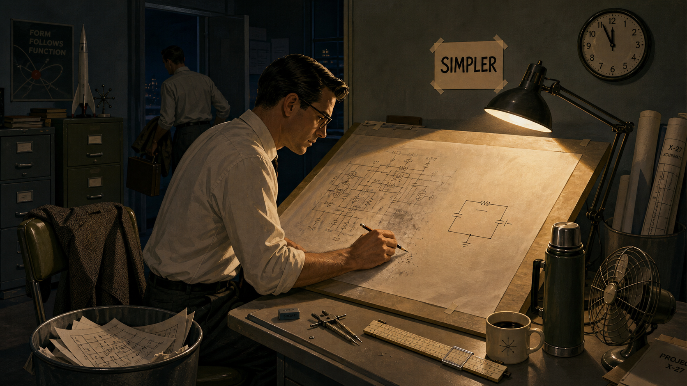

Image Prompt

(This is Panel 05. Do not include the panel number in the image.)
Please generate a 16:9 image in Mid-Century Atomic Age illustration style
depicting panel 5 of 12. Make the characters and style consistent with the
prior panels. The scene shows the same man in his late thirties standing
at a drafting table late at night in a small design office, alone except
for one colleague packing up to leave in the background. He is sketching
directly onto a large sheet of vellum with a mechanical pencil, a
half-erased circuit diagram beside a much simpler redrawn version. A small
hand-lettered sign taped above the table reads only "SIMPLER" in blocky
capital letters. A wall clock shows nearly midnight. Color palette: deep
navy shadow, a single warm cone of drafting-lamp light, muted olive and
gray office furnishings. Emotional tone: disciplined, unhurried
resolve. Include at least six specific visual details: a stack of
discarded circuit sketches in a wastebasket, a slide rule and compass on
the table, a coat draped over an empty chair, a rotary desk fan switched
off, a thermos of coffee, and rolled blueprints leaning in the corner.
Generate the image immediately without asking clarifying questions.

Cray ran his design group like a workshop, not a corporation. He kept engineering teams deliberately small, avoided multi-layered approval chains, and refused to let a feature onto a machine unless it earned its cost in measured performance. Where competitors added complexity to chase every possible customer, Cray stripped circuits down to the smallest number of components that could still do the job reliably. His famous, half-joking comparison of two strong oxen to a thousand chickens captured the whole philosophy: a few powerful, well-understood parts working in tight coordination beat a sprawling swarm of weaker ones every time.

## Panel 6: Measure It Yourself

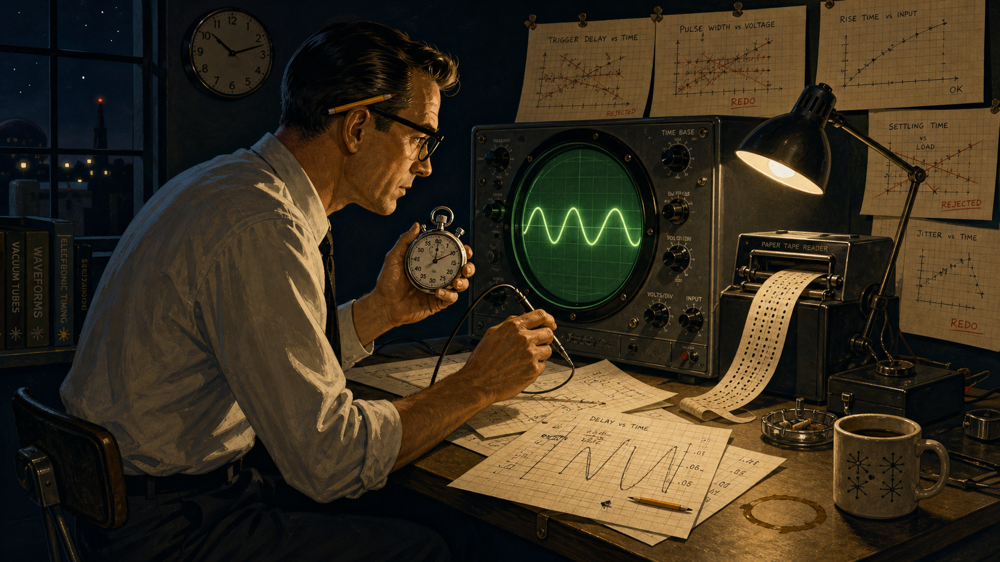

Image Prompt

(This is Panel 06. Do not include the panel number in the image.)
Please generate a 16:9 image in Mid-Century Atomic Age illustration style
depicting panel 6 of 12. Make the characters and style consistent with the
prior panels. The scene shows the same man, in his early forties, alone in
a dim lab at night, seated on a rolling stool in front of a round green
oscilloscope screen, a stopwatch held in one hand and a probe in the
other. Loose sheets of graph paper covered in hand-plotted timing curves
are spread across the desk and pinned to the wall behind him, several
crossed out and redone. A punched paper tape loops down from a reader
beside the scope. Color palette: dark navy background, glowing green
oscilloscope trace, warm amber desk light. Emotional tone: rigorous,
almost meditative scrutiny. Include at least six specific visual details:
a glowing green sine-wave trace on the scope, a mechanical stopwatch face
frozen mid-click, hand-plotted graph paper with crossed-out data points, a
punched paper tape reader, a pencil tucked behind his ear, and a coffee
ring stain on the desk. Generate the image immediately without asking
clarifying questions.

Sales brochures across the industry were full of theoretical peak speeds, numbers computed on paper rather than proven on real silicon, and Cray treated every one of them with open suspicion. Before he would let a performance claim leave the building, he wanted to see it happen: real code, real clock cycles, a stopwatch and an oscilloscope trace he had read with his own eyes. Engineers who worked for him recalled him rerunning other people's benchmark results from scratch, unwilling to repeat a number he had not personally reproduced. It was an unglamorous, time-consuming habit, and it was also the reason his machines' reputations for speed almost never turned out to be exaggerated.

## Panel 7: North to the Pines

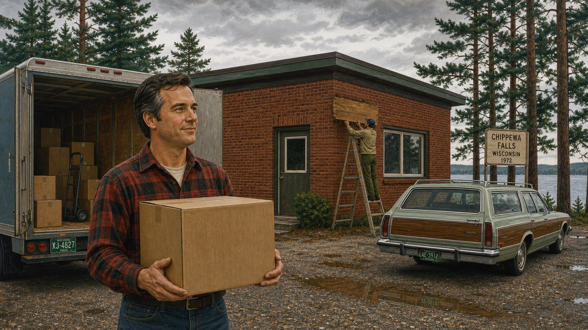

Image Prompt

(This is Panel 07. Do not include the panel number in the image.)
Please generate a 16:9 image in transitional Mid-Century to Space-Age
illustration style depicting panel 7 of 12. Make the characters and style
consistent with the prior panels. The scene shows the same man, now in his
mid-forties with the first traces of gray at his temples, wearing a plaid
flannel shirt instead of a dress shirt, standing outside a modest single-
story brick building surrounded by tall pine trees and a gravel parking
lot in Chippewa Falls, Wisconsin, in 1972. A moving truck's rear doors
stand open behind him, with a single unmarked cardboard box in his arms.
A hand-lettered wooden sign is being mounted beside the entrance by another
worker on a ladder, its text obscured from view. Color palette: deep pine
greens, overcast sky grays, warm brick red. Emotional tone: quiet resolve
and relief. Include at least six specific visual details: stacked
cardboard moving boxes, a gravel lot with puddles, tall pines framing the
building, a station wagon parked nearby, a ladder against the building
wall, and distant lake water visible past the trees. Generate the image
immediately without asking clarifying questions.

In 1972, tired of the bureaucracy that had grown up around him at his old company, Cray walked away from a comfortable, senior position to start over on his own terms. He chose to build his new company not in a city but in Chippewa Falls, Wisconsin, the small logging town near where he had grown up, surrounded by lakes and pine forest rather than corporate campuses. The physical distance was the point: fewer visitors, fewer meetings, fewer people who could pressure him to ship a number he had not verified himself. Within a few years, the quiet Wisconsin buildings he set up there would produce the machine that redefined what the word "supercomputer" meant.

## Panel 8: The Bench Around the Machine

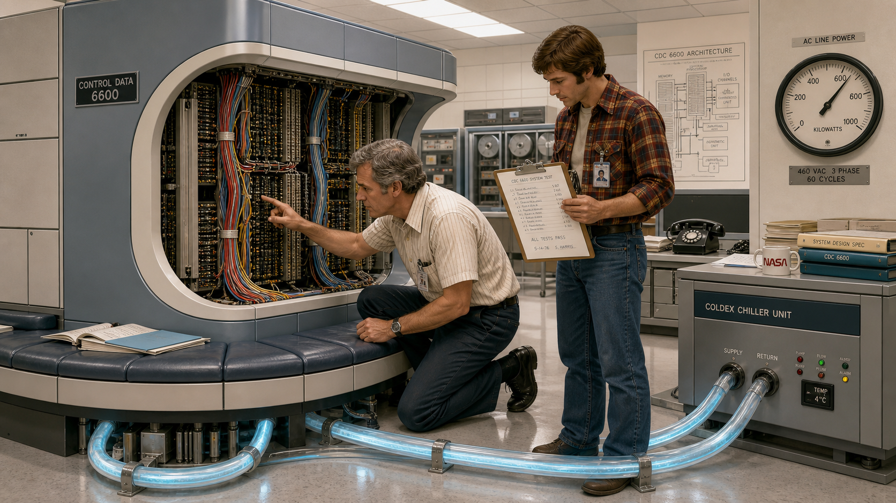

Image Prompt

(This is Panel 08. Do not include the panel number in the image.)
Please generate a 16:9 image in Space-Age, NASA-adjacent illustration
style depicting panel 8 of 12. Make the characters and style consistent
with the prior panels. The scene shows the same man, now approaching fifty
with visibly graying hair, kneeling beside a large C-shaped mainframe
cabinet in a bright engineering lab in 1976, tracing a bundle of colored
wires with one finger while a younger engineer in a flannel shirt checks a
clipboard beside him. The cabinet's iconic curved silhouette is wrapped by
a low cushioned bench at its base, and clear tubing carrying pale blue
coolant loops from the cabinet's underside across the floor to a chiller
unit. Overhead fluorescent panels reflect off polished floor tile. Color
palette: cool institutional whites and grays, pale blue coolant glow, warm
skin tones and flannel plaid for contrast. Emotional tone: focused pride
in a finished, elegant design. Include at least six specific visual
details: the distinctive curved cabinet silhouette, exposed wire bundles
color-coded by function, the cushioned bench seating built into the base,
looping coolant tubing, a wall-mounted power gauge, and a clipboard of
handwritten test results. Generate the image immediately without asking
clarifying questions.

The machine Cray delivered in 1976 looked as unconventional as the man who designed it: a squat, C-shaped tower ringed by a cushioned bench where engineers could sit while they worked, its internal wiring intentionally kept short enough that an electrical signal could cross the whole machine within a single clock cycle. Cooling the densely packed circuit boards took a network of chilled coolant lines running through the machine's core, engineered with the same obsessive attention as the logic itself. Every design choice, from the curve of the cabinet to the length of a single wire, served one measurable goal: a verified, sustained computation speed that no one else in the world could yet match. The bench was not an afterthought of furniture design — it was a byproduct of physics taken seriously.

## Panel 9: Prove It, Then Publish It

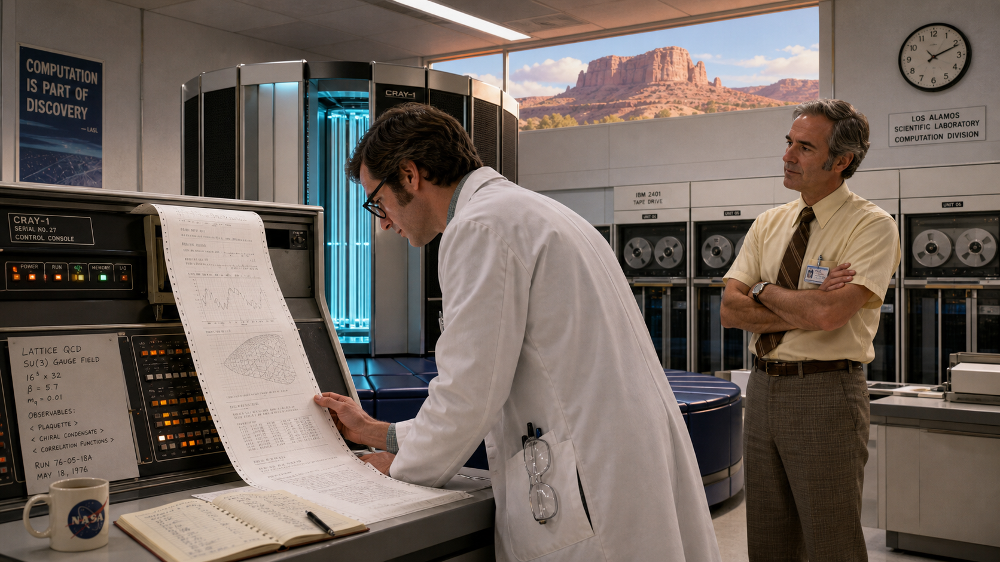

Image Prompt

(This is Panel 09. Do not include the panel number in the image.)
Please generate a 16:9 image in Space-Age, NASA-adjacent illustration
style depicting panel 9 of 12. Make the characters and style consistent
with the prior panels. The scene shows a bright, high-ceilinged national
research laboratory computer room in the American Southwest in 1976, with
sandstone-colored mesas faintly visible through a high window. A scientist
in a white lab coat reviews a long printout of real physics simulation
results at a console beside the C-shaped cabinet from the previous panel,
while the same graying engineer stands slightly apart, arms crossed,
watching the scientist's own reaction rather than presenting the machine
himself. Color palette: warm desert light through the window, cool
interior fluorescent tones, pale blue coolant glow from the cabinet.
Emotional tone: expectant, quietly confident. Include at least six
specific visual details: a long fan-fold printout draped across the
console, the mesa landscape framed in the high window, a wall clock, a
row of labeled tape reels, safety glasses hanging from the scientist's
coat pocket, and a hand-written logbook open on the console. Generate the
image immediately without asking clarifying questions.

When that machine shipped to a national research laboratory in the American Southwest, Cray refused to let its reputation rest on advertised numbers alone. He insisted the laboratory's own scientists run their own real scientific codes on it and publish what they actually measured, not what a data sheet had promised. That habit of demanding independent, reproducible proof — rather than trusting a vendor's claim — set the tone for how the entire industry would eventually judge supercomputers. For most of a decade afterward, this was simply the machine people meant when they said the word "fastest."

## Panel 10: Colder Still

Image Prompt

(This is Panel 10. Do not include the panel number in the image.)
Please generate a 16:9 image in Space-Age illustration style depicting
panel 10 of 12. Make the characters and style consistent with the prior
panels. The scene shows the same man, now in his late fifties with mostly
gray hair, in a laboratory in the mid-1980s, standing beside a transparent
rectangular tank filled with clear, faintly glowing cooling liquid in
which densely packed circuit boards are fully submerged, small bubbles
rising past the boards. He watches through safety goggles pushed up on his
forehead while a colleague adjusts a valve on tubing connected to the
tank. The room resembles a chemistry laboratory as much as a computer
room, with glass beakers of the same clear liquid on a nearby shelf for
testing. Color palette: cool blue-white glow from the tank, dark
surrounding lab shadows, glinting steel fittings. Emotional tone:
inventive, slightly eerie fascination. Include at least six specific
visual details: rising bubbles inside the tank, submerged circuit boards
visible through the liquid, a valve and tubing assembly, safety goggles,
glass beakers on a shelf, and a hand-written temperature log clipboard.
Generate the image immediately without asking clarifying questions.

By the mid-1980s, Cray's newest design faced a problem that speed itself had created: circuits packed dense enough to run faster also produced more heat than air or coolant lines could easily carry away. His answer was almost startling in its directness — immerse the circuit boards themselves in a clear, inert cooling liquid, submerging the machine's beating heart in a tank instead of building elaborate ductwork around it. It looked more like a chemistry laboratory than a computer room, and it worked exactly as measured. Once again, Cray had refused to accept a physical limit as fixed, choosing to redesign the machine's enclosure itself rather than compromise the logic inside it.

## Panel 11: Elves in the Tunnel

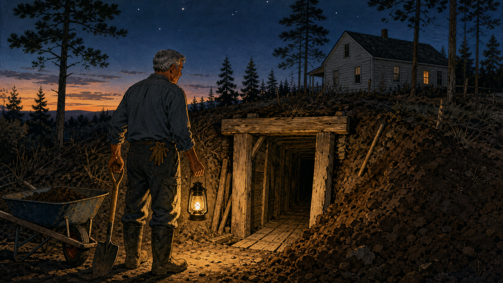

Image Prompt

(This is Panel 11. Do not include the panel number in the image.)
Please generate a 16:9 image in Mid-Century illustration style depicting
panel 11 of 12. Make the characters and style consistent with the prior
panels. The scene shows the same man, now in his sixties with fully gray
hair, alone in work clothes and rubber boots, standing at the entrance of
a narrow hand-dug tunnel beneath his rural property at dusk in the late
1980s, a shovel in one hand and a lantern in the other. The tunnel entrance
is shored up with rough-cut wooden beams, cedar boards lining the visible
floor just inside, with excavated earth piled beside the opening. Tall
pine trees and a modest wood-frame house are visible in the background
under a darkening sky. Color palette: earthy browns, deep dusk blues,
warm lantern glow. Emotional tone: solitary, contemplative, quietly
whimsical. Include at least six specific visual details: rough wooden
tunnel shoring, a pile of freshly dug earth, a lantern casting long
shadows, work gloves tucked into a back pocket, a wheelbarrow nearby, and
the first stars visible in the dusk sky. Generate the image immediately
without asking clarifying questions.

Away from the lab, Cray kept a private, almost eccentric habit: digging a tunnel by hand beneath his own property, board by board, over years of weekends. When a hard design problem stalled him at his desk, he would walk outside and dig for an hour, later joking that unseen "elves" solved his problems while he worked underground. Whether or not anyone believed the joke, the habit itself was real, and it revealed something true about the man: problems that resisted committees and deadlines sometimes only yielded to solitary, physical, unhurried attention. It was the same patience that had once kept a young radio operator steady through a long, static-filled night.

## Panel 12: The Standard He Left Behind

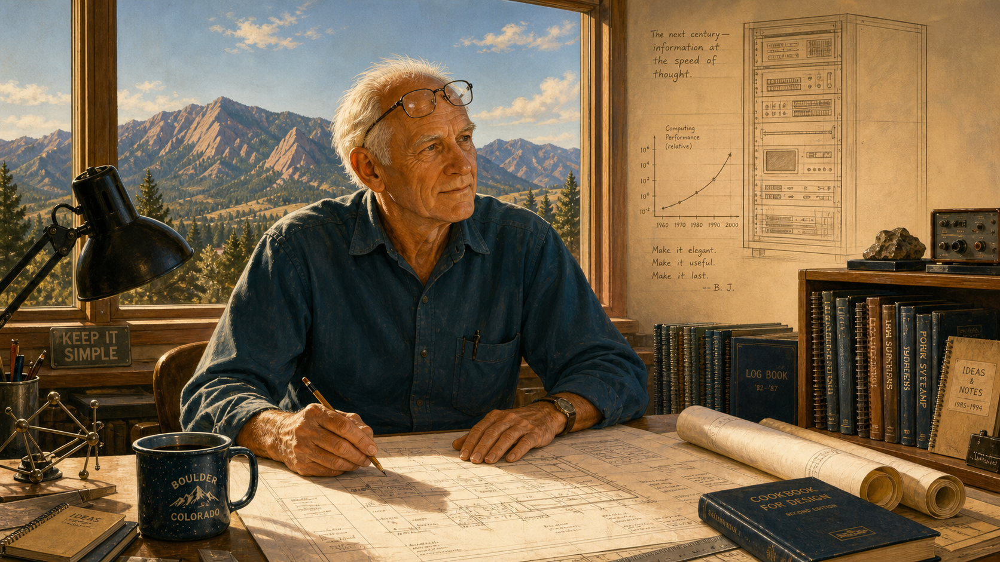

Image Prompt

(This is Panel 12. Do not include the panel number in the image.)
Please generate a 16:9 image in Space-Age illustration style depicting
panel 12 of 12. Make the characters and style consistent with the prior
panels. The scene shows the same man, now elderly with thinning white
hair but still lean and alert, seated at a drafting table in a modest
Colorado workshop in the mid-1990s, blueprints spread before him and
mountains visible through a large window behind him. Overlaid faintly in
the upper corner of the image, rendered like a ghosted architectural
sketch rather than a solid object, is a simple line-drawn rack of modern
computing equipment with a small printed graph, suggesting a legacy
passing forward in time without depicting any specific real product.
Color palette: warm late-afternoon light, cool mountain blue-grays in the
window, soft sepia tones for the ghosted overlay. Emotional tone:
reflective, quietly proud, forward-looking. Include at least six specific
visual details: hand-drawn blueprints on the table, reading glasses pushed
up on his forehead, a distant mountain range through the window, a mug of
coffee, a bookshelf of technical notebooks, and the faint ghosted overlay
sketch in the corner. Generate the image immediately without asking
clarifying questions.

Cray kept designing new, faster machines into his seventies, chasing the same standard he had set decades earlier: nothing counted as fast until someone had measured it honestly and could measure it again. He died in October 1996 from injuries sustained in a car accident, but the culture he had insisted on — verify it yourself, publish only what you can reproduce — outlived him. Within a few years, the industry formalized exactly that standard into public benchmark suites and ranked lists that any laboratory in the world could run and check, turning Cray's private obsession into a shared professional discipline.

### Epilogue – What Made Cray Different?

Seymour Cray never had access to a standardized benchmark suite — the LINPACK benchmark did not yet exist, and the TOP500 list that now ranks the world's fastest computers was still decades away. What he had instead was a personal, almost stubborn refusal to let any performance number pass through his hands unverified. That refusal, repeated across four decades and half a dozen record-setting machines, did more to define "honest engineering" in computing than any single circuit design he ever patented. The instruments have changed since his era; the underlying discipline has not.

| Challenge | How Cray Responded | Lesson for Today |
|---|---|---|
| A rival with vastly more engineers and budget claimed the performance lead | Kept his own teams tiny and focused, betting that depth of understanding beats headcount | A small team that verifies its own numbers can out-engineer a large one that doesn't |
| No independent benchmark existed to prove a machine's real speed | Timed his own code on real hardware before ever quoting a performance figure | An unreproduced number is a hope, not a measurement |
| Corporate layers and committees slowed down design and verification | Left to build in a small, remote town where he controlled the pace of his own testing | Protect the conditions that let you check your own work, not just the work itself |
| Physical limits like heat and wire length threatened to cap speed gains | Redesigned the machine's physical form — its shape, its cooling — rather than accept the ceiling | When a limit blocks you, question the enclosure around the problem, not only the algorithm inside it |

### Call to Action

When you sit down in Chapters 17-18 and 25-26 to report your own FFT's cycle count on real Cortex-M hardware, you are practicing exactly the discipline Cray built his career on: refusing to let an unverified number stand in for a measured one. Time it yourself. Reproduce it yourself. Only then, trust it.

---

*"If you were plowing a field, which would you rather use? Two strong oxen or 1024 chickens?"*
—Seymour Cray

*"It seems like Mr. Watson has answered his own question."*
—Seymour Cray

---

## References

1. [Wikipedia: Seymour Cray](https://en.wikipedia.org/wiki/Seymour_Cray) - Biography covering his education, wartime service, career at Engineering Research Associates, Control Data Corporation, and Cray Research, and his death in 1996.
2. [Wikipedia: Cray-1](https://en.wikipedia.org/wiki/Cray-1) - Technical and historical overview of the 1976 supercomputer, its distinctive C-shaped cabinet, and its cooling system.
3. [Wikipedia: CDC 6600](https://en.wikipedia.org/wiki/CDC_6600) - History of the 1964 machine widely regarded as the first true supercomputer, including the IBM reaction it provoked.
4. [Computer History Museum: CDC 6600's Five Year Reign](https://www.computerhistory.org/revolution/supercomputers/10/33) - Museum exhibit on the CDC 6600 and Thomas Watson Jr.'s internal memo prompted by its performance.
5. [Encyclopaedia Britannica: Seymour R. Cray](https://www.britannica.com/biography/Seymour-R-Cray) - Overview of Cray's life, engineering career, and supercomputer designs.
