# Sophie Wilson, Steve Furber, and the Chip Built on Almost Nothing

<!-- 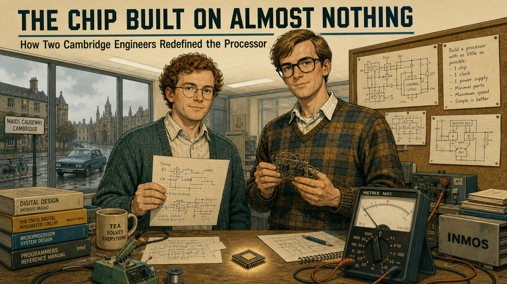 -->

Cover Image Prompt

(This is the Cover Image. Do not include this label in the image.)
Please generate a wide-landscape 16:9 cover image for this story in a contemporary graphic-novel
illustration style with warm 1980s British period detail, like a restrained editorial illustration
rather than a photo. Show two engineers standing side by side at a cluttered desk in a modest,
fluorescent-lit engineering office. On the left, a compact engineer with short curly
reddish-brown hair, round wire-rimmed glasses, and a plain collared shirt under a hand-knitted
cardigan holds a sheet of graph paper covered in small hand-drawn diagrams. On the right, a tall,
lean engineer with light brown side-parted hair, dark plastic-framed glasses, and a checked
jumper over a collared shirt holds a small circuit board wired by hand. Between them, on the
desk, sits a bare, palm-sized processor chip catching the light, beside a multimeter whose needle
rests at zero. Behind them, a large window shows a gray Cambridge street under overcast daylight,
and a corkboard on the wall holds pinned circuit diagrams and a handwritten instruction list.
Render the title text "THE CHIP BUILT ON ALMOST NOTHING" at the top in a bold, understated
1980s British technical-manual typeface, and beneath it in smaller type "How Two Cambridge
Engineers Redefined the Processor." Color palette: muted teal, mustard yellow, and warm beige
under cool fluorescent light. Emotional tone: quiet, confident ingenuity — two people who know
they have found something better with far less. Generate the image immediately without asking
clarifying questions.

Narrative Prompt

This story is set in Cambridge, England, between 1981 and 1990, with a brief coda extending to
the present day. The central figures are two engineers at a small British computer company: an
instruction-set designer already known within the company for writing an acclaimed programming
language for its earlier machines, and a hardware engineer known for methodical, disciplined
circuit design. Working with almost no budget compared to major American chip manufacturers,
they design a 32-bit processor from first principles rather than license an existing one. The
themes are resourcefulness under constraint, disciplined simplicity as an engineering virtue,
and how a solution born from a tight budget can become a design classic decades later. Render
the story in a contemporary graphic-novel illustration style with 1980s British period detail:
fluorescent-lit open-plan offices, wire-wrapped prototype circuit boards, hand-drawn diagrams on
graph paper, chunky beige computer terminals, dot-matrix printouts, and understated period
clothing (cardigans, collared shirts, corduroy trousers) rather than anything glossy or
Silicon-Valley-glamorous. Character consistency note: the instruction-set designer should be
drawn consistently across all panels with short curly reddish-brown hair, round wire-rimmed
glasses, and a plain collared shirt under a hand-knitted cardigan or pullover — described here by
role and physical appearance rather than by gendered pronouns, since gendered phrasing for this
period is deliberately avoided in the narrative text as well. The hardware engineer should be
drawn consistently as tall and lean, with light brown side-parted hair, dark plastic-framed
glasses, and a checked or plain jumper over a collared shirt, often shown holding a soldering
iron, pencil, or oscilloscope probe. Keep the overall palette warm but unglamorous — muted teals,
mustard yellows, and beige office tones under fluorescent light — reflecting a small,
resource-constrained team rather than a corporate showcase.

### Prologue – The Budget That Wasn't There

In 1985, a British computer company too small to afford a chip from Intel or Motorola did
something almost nobody expected: it built a better processor than either of them, with a design
team of two people and a budget an American semiconductor firm would have laughed at. The chip
that came out of that unlikely arrangement did not just work — it worked while consuming almost
no power at all, an accident of frugality that would define it for the next forty years. This is
the story of Sophie Wilson and Steve Furber, and of how the tightest constraint imaginable
produced the instruction set architecture running inside the very microcontroller on your bench
in this course.

## Panel 1: A Small Company Wins a Big Contract

<!-- 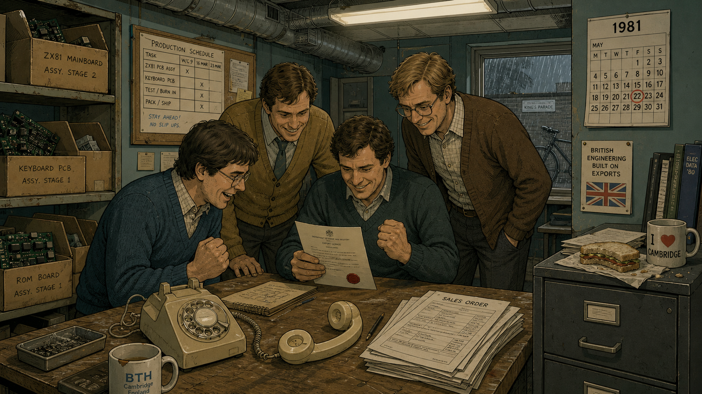 -->

Image Prompt

(This is Panel 01. Do not include the panel number in the image.)
I am about to ask you to generate a series of images for a graphic novel. Please make the images
have a consistent style and consistent characters. Do not ask any clarifying questions. Just
generate the image immediately when asked.

Please generate a 16:9 image in a contemporary graphic-novel style with 1980s British period
detail depicting panel 1 of 12. The scene shows a small, cluttered engineering office in
Cambridge, England, in 1981, where three or four modestly dressed engineers in cardigans and
collared shirts crowd around a desk, celebrating quietly around a corded telephone left off the
hook and an official-looking letter with a red wax-style seal. Cardboard boxes of half-assembled
circuit boards line one wall, and a hand-lettered production schedule is taped to a corkboard.
Rain streaks a small window behind them, and a bicycle is visible parked just outside. The color
palette is muted teal, mustard yellow, and warm beige under flat fluorescent light. The emotional
tone is restrained, hard-won excitement — a small team that has just won something far bigger
than it expected. Include at least six specific visual details: a rotary telephone off the hook,
a stack of order forms on the desk, a tea mug with a chip in the rim, a wall calendar showing
1981, exposed ceiling ductwork, and a half-eaten sandwich forgotten on a filing cabinet. Generate
the image immediately without asking clarifying questions.

In 1981, a small computer company based in Cambridge won the contract of a lifetime: building the
machine at the center of a national push to bring computing into British classrooms and living
rooms. Acorn Computers had out-designed better-funded rivals with a fast, expandable machine
built on a shoestring, and the win transformed a scrappy startup into a household name almost
overnight. Orders poured in faster than the company's small engineering staff could keep pace
with. A hit product brought reputation and cash flow, but not the kind of research budget that
let Intel or Motorola staff entire floors of chip designers.

## Panel 2: The Programmer Who Knew What Software Needed

<!-- 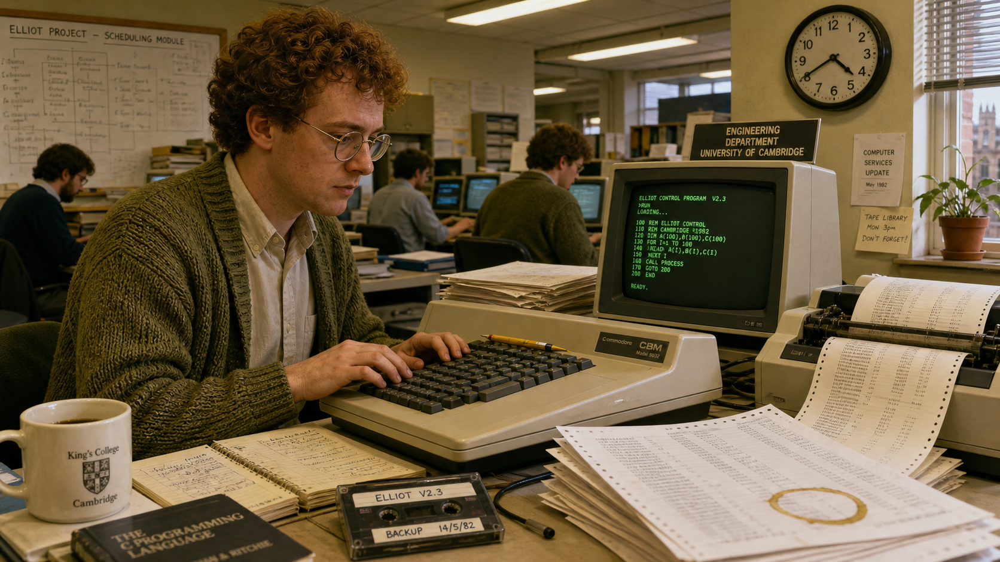 -->

Image Prompt

(This is Panel 02. Do not include the panel number in the image.)
Please generate a 16:9 image in the same contemporary graphic-novel style with 1980s British
period detail depicting panel 2 of 12. Make the characters and style consistent with the prior
panel. Show a compact engineer with short curly reddish-brown hair and round wire-rimmed
glasses, wearing a plain collared shirt under a hand-knitted cardigan, seated at a cluttered desk
in the same Cambridge office in 1982, typing on a chunky beige computer terminal surrounded by
tall stacks of fan-fold printer paper covered in dense program listings. A small television-style
monitor beside the terminal displays blocky green text. Colleagues work at similar desks in the
soft-focus background. The color palette is warm beige and olive green under fluorescent light.
The emotional tone is quiet, absorbed concentration. Include at least six specific visual
details: a mechanical pencil balanced on the keyboard, a dot-matrix printer mid-print, a
hand-labeled cassette tape on the desk, a coffee ring stain on a printout, a small potted plant
on the windowsill, and a wall clock reading late afternoon. Generate the image immediately
without asking clarifying questions.

Inside the company's engineering offices, Wilson had already earned a reputation for a different
kind of craftsmanship: writing the fast, tightly coded BASIC interpreter that shipped inside the
company's classroom computer and became the standard dialect of BASIC for a generation of British
schoolchildren. Years of watching real programs run — instruction by instruction, line by line —
had built an instinct for exactly which operations a processor needed to execute well and which
ones merely added silicon and complexity for no real benefit. That hands-on intimacy with actual
running code, rather than any formal chip-design pedigree, would turn out to be the rarest kind
of expertise a processor designer could bring to the table.

## Panel 3: Pricing Out the Alternatives

<!-- 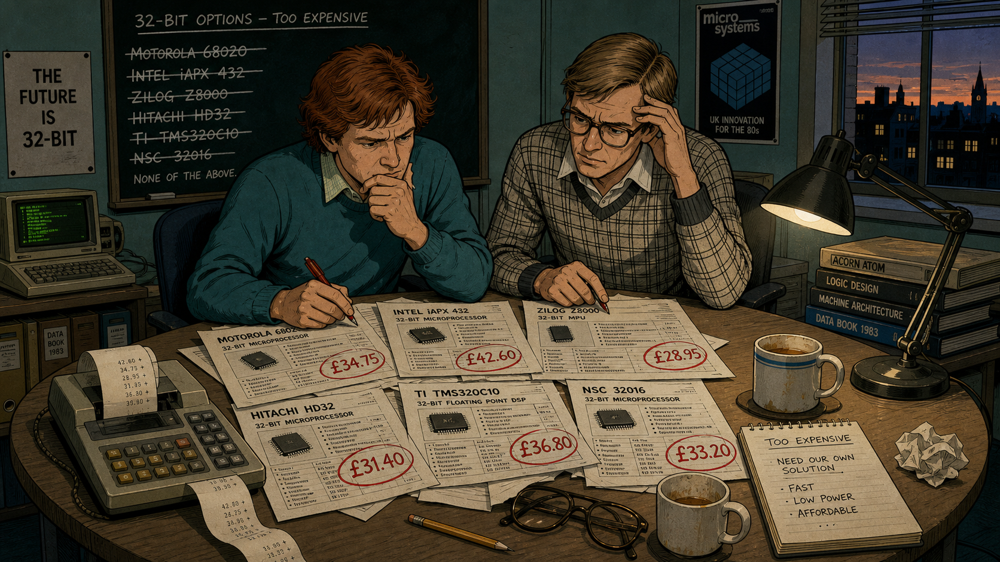 -->

Image Prompt

(This is Panel 03. Do not include the panel number in the image.)
Please generate a 16:9 image in the same contemporary graphic-novel style with 1980s British
period detail depicting panel 3 of 12. Make the characters and style consistent with prior
panels. Show a small conference table in 1983 covered with spec sheets and price lists for
several different 32-bit processor chips, each sheet stamped with a large price figure circled
in red pen. The same reddish-haired engineer from prior panels sits with a second engineer — tall
and lean, with light brown side-parted hair and dark plastic-framed glasses, wearing a checked
jumper over a collared shirt — both leaning over the table with frustrated, thoughtful
expressions. A chalkboard behind them lists chip names crossed out one by one. The color palette
is muted teal and mustard under flat office light. The emotional tone is mounting frustration
giving way to determination. Include at least six specific visual details: a calculator with a
paper tape trailing off the table, a half-drunk cup of tea gone cold, a rejected spec sheet
crumpled on the floor, a desk lamp casting a warm pool of light, reading glasses folded on the
table, and a window showing dusk outside. Generate the image immediately without asking
clarifying questions.

By 1983, the company's engineers knew their next generation of machines needed a genuine 32-bit
processor, something with real headroom beyond the 8-bit chips inside their existing computers.
The obvious move was to license a chip from an established manufacturer, but the price tags did
not fit a company of Acorn's size, and the chips they could actually afford ran into their own
limitations — bugs, missing features, or performance that fell short of what their own small
8-bit machines already delivered task for task. Licensing a solution built for someone else's
budget and someone else's priorities was starting to look like the more expensive path in the
long run.

## Panel 4: Two Engineers, No Committee

<!-- 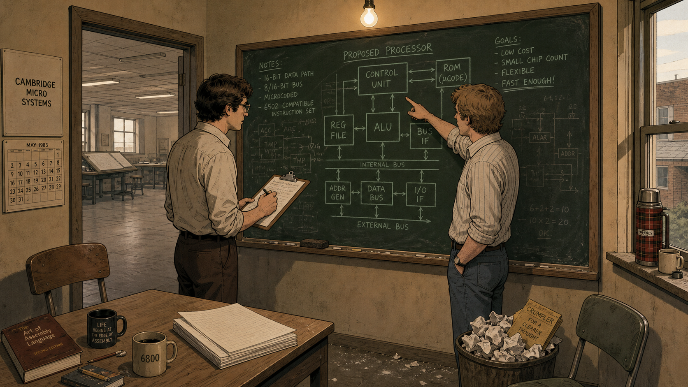 -->

Image Prompt

(This is Panel 04. Do not include the panel number in the image.)
Please generate a 16:9 image in the same contemporary graphic-novel style with 1980s British
period detail depicting panel 4 of 12. Make the characters and style consistent with prior
panels. Show the same two engineers alone in a small side office in 1983, standing at a
freestanding chalkboard covered in rough block-diagram sketches of a processor, one of them
mid-gesture pointing at the board while the other takes notes on a clipboard. The room is
small and sparsely furnished, with only two mismatched chairs, a single desk, and a wastebasket
overflowing with crumpled paper. Through the open door, a much larger, mostly empty drafting
room is visible, hinting at how small their own effort is by comparison. The color palette is
muted teal chalk lines against a dark green chalkboard, warm beige walls. The emotional tone is
quiet, resolute audacity — two people committing to something far bigger than their numbers
suggest they should attempt. Include at least six specific visual details: chalk dust on the
floor, a half-erased diagram still visible under new sketches, a thermos of tea on the windowsill,
a single overhead bulb, rolled-up shirtsleeves, and a small stack of blank graph-paper pads ready
on the desk. Generate the image immediately without asking clarifying questions.

Faced with a shopping list of imperfect, overpriced options, Wilson and hardware engineer Steve
Furber reached a conclusion that startled colleagues used to buying chips rather than building
them: design one from scratch. There was no dedicated chip-design department to assign to the
project and no reserve of layout engineers waiting in the wings — just the two of them, working
alongside their existing responsibilities, with a budget a major semiconductor company would have
treated as a rounding error. On paper, it was an almost reckless proposition. It was also, as it
turned out, exactly small enough to actually finish.

## Panel 5: Borrowing an Idea From California

<!--  -->

Image Prompt

(This is Panel 05. Do not include the panel number in the image.)
Please generate a 16:9 image in the same contemporary graphic-novel style with 1980s British
period detail depicting panel 5 of 12. Make the characters and style consistent with prior
panels. Show the same two engineers seated at a small table in 1984, surrounded by loose,
photocopied academic papers with dense technical diagrams, some pages held down with a tea mug
and a stapler. One engineer underlines a passage with a ballpoint pen while the other reads over
a shoulder, both leaning in with focused curiosity. A world map with the United States circled in
one corner hangs on the wall behind them. The color palette is warm mustard and muted teal under
soft desk-lamp light. The emotional tone is intellectual excitement, the spark of finding a
philosophy that matches their constraints. Include at least six specific visual details: a
photocopier warming in the background, dog-eared paper corners, a highlighted diagram of a simple
instruction pipeline, a half-eaten biscuit on a saucer, reading glasses pushed up on a forehead,
and a small transistor radio playing quietly on a shelf. Generate the image immediately without
asking clarifying questions.

Wilson and Furber turned to published research coming out of American university laboratories,
where academic teams were making a heretical argument: processors crammed with elaborate,
specialized instructions were often slower in practice than simpler chips that did fewer things,
each in a single fast clock cycle. The philosophy became known as a reduced instruction set — do
less, but do it fast and do it correctly. Acorn's engineers had neither the staff nor the
fabrication budget to build anything else, so what had begun in California as an academic
argument about efficiency became, in Cambridge, a practical survival strategy.

## Panel 6: Wilson's Ruthless Instruction Set

<!-- 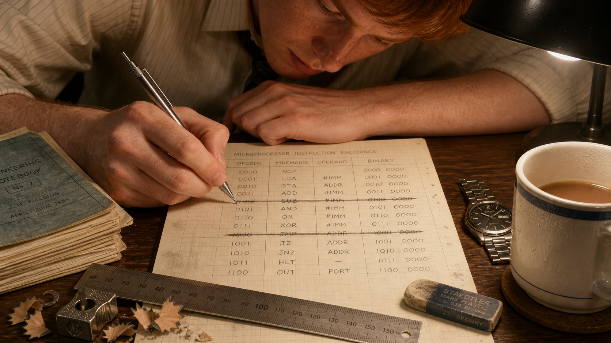 -->

Image Prompt

(This is Panel 06. Do not include the panel number in the image.)
Please generate a 16:9 image in the same contemporary graphic-novel style with 1980s British
period detail depicting panel 6 of 12. Make the characters and style consistent with prior
panels. Show a close, intimate view of the reddish-haired engineer's hands and desk in 1984, bent
over a grid-ruled graph-paper notebook, hand-drawing a table of binary instruction encodings in
neat rows, several entries crossed out firmly with a ruled line. A small stack of similarly
covered notebook pages sits beside the current one, and a mechanical pencil rests mid-stroke. The
engineer's face is visible in soft focus in the upper part of the frame, expression calm and
focused. The color palette is warm graph-paper cream and soft pencil gray under a single desk
lamp. The emotional tone is meticulous, disciplined concentration. Include at least six specific
visual details: a pencil sharpener and shavings on the desk, a ruler laid across the page, an
eraser worn down at one corner, a cold cup of tea, faint fingerprints smudging the margins, and a
small wristwatch resting beside the notebook. Generate the image immediately without asking
clarifying questions.

Wilson took the lead on designing the processor's instruction set, working through candidate
operations by hand on graph paper and asking one relentless question of each: does this earn its
own complexity? Instructions that saved a programmer a little typing but cost the hardware
disproportionate complexity were cut without sentiment. What remained was a small, orthogonal set
of operations, easy to decode, easy to pipeline, and — critically for a team of two — small
enough that its correctness could actually be checked by the people who had designed it.

## Panel 7: Furber Builds the Hardware

<!-- 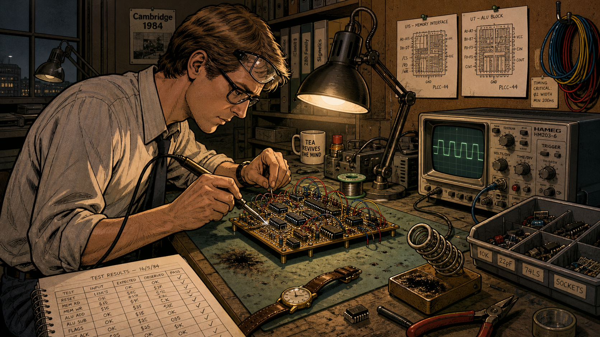 -->

Image Prompt

(This is Panel 07. Do not include the panel number in the image.)
Please generate a 16:9 image in the same contemporary graphic-novel style with 1980s British
period detail depicting panel 7 of 12. Make the characters and style consistent with prior
panels. Show the tall, lean engineer with light brown side-parted hair and dark plastic-framed
glasses working alone at a workbench in 1984, soldering iron in hand, hunched over a
wire-wrapped prototype circuit board dense with small chips and colored jumper wires. An
oscilloscope beside him displays a glowing waveform, and hand-drawn chip floorplan sketches are
pinned to a corkboard above the bench. The color palette is warm amber solder-lamp light against
muted gray-green bench surfaces. The emotional tone is patient, methodical intensity. Include at
least six specific visual details: coils of colored wire hanging from a hook, a bin of spare
components, a wristwatch removed and set on the bench, a heat-damaged patch on the work mat, a
handwritten test-results log, and safety glasses pushed up on the engineer's forehead. Generate
the image immediately without asking clarifying questions.

While Wilson refined the instruction set on paper, Furber turned it into circuits — laying out
the chip's logic, building and testing wire-wrapped prototype boards that modeled the design
before committing it to expensive silicon, and pushing hard on two goals most commercial chip
designers of the era treated as being in tension: raw speed and minimal power draw. Furber's
insistence on a lean, efficient design was not born of any grand vision about future markets. It
came from a far more immediate constraint: the finished chip had to run cool enough to sit in a
cheap plastic package with no fan, because a fan and a ceramic package both cost money Acorn
simply did not have.

## Panel 8: First Silicon, and a Puzzling Multimeter

<!-- 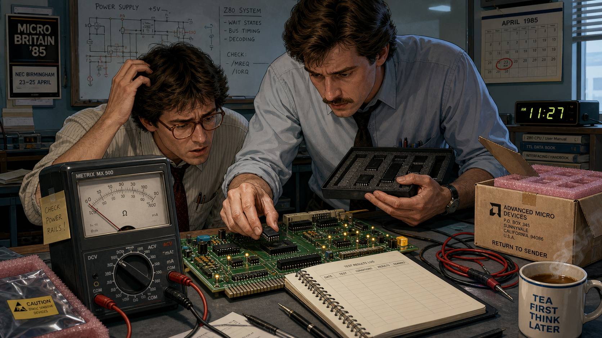 -->

Image Prompt

(This is Panel 08. Do not include the panel number in the image.)
Please generate a 16:9 image in the same contemporary graphic-novel style with 1980s British
period detail depicting panel 8 of 12. Make the characters and style consistent with prior
panels. Show the same two engineers gathered around a workbench in April 1985, the taller
engineer holding a small foam-lined tray of freshly fabricated chips while carefully seating one
into a test socket on a prototype board. A multimeter connected in series with the power leads
sits prominently in the foreground, its needle resting unmistakably at zero. Both engineers lean
in with puzzled, intent expressions, one scratching their head. The color palette is cool
fluorescent white light against warm circuit-board green and amber indicator lamps. The emotional
tone shifts from puzzlement toward dawning realization. Include at least six specific visual
details: a small cardboard shipping box marked with a fabrication plant's return address, static-
dissipating foam packaging, a logbook open to a blank results page, a desk clock reading late
morning, spare test leads coiled nearby, and a steaming mug of tea forgotten at the edge of the
bench. Generate the image immediately without asking clarifying questions.

On 26 April 1985, the first prototype chips came back from the fabrication plant, and Furber
plugged one into a test board expecting the long, frustrating debugging process that first
silicon almost always demands. Instead, the processor ran correctly, essentially the first time
— a result rare enough for a team many times Acorn's size, let alone a team of two. Stranger
still, the multimeter wired in series with the power supply read close to zero: it looked,
impossibly, as though the chip were running on no power at all. The pair eventually traced the
anomaly to a fault in the test board's power connection — the design was so frugal that the chip
kept running on tiny leakage currents in its own logic circuits, sipping power that most
processors of the era would simply have wasted.

## Panel 9: The Chip Goes to Market

<!-- 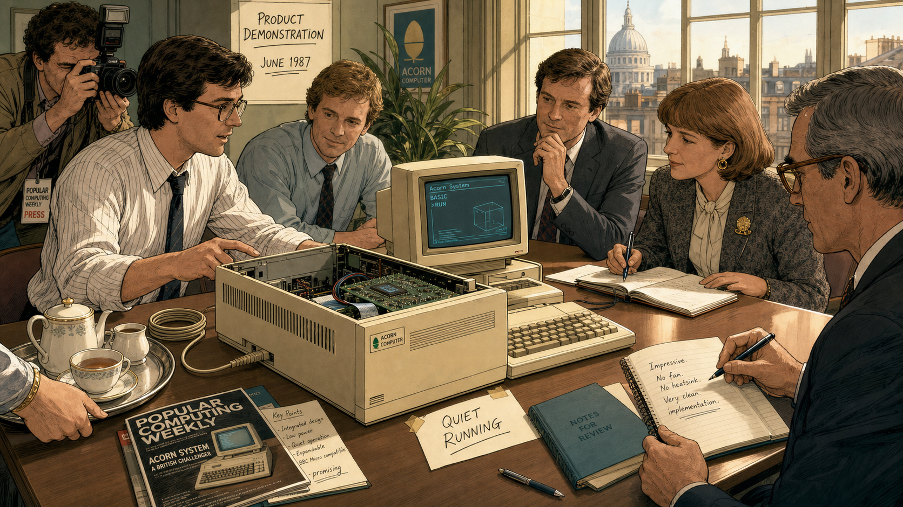 -->

Image Prompt

(This is Panel 09. Do not include the panel number in the image.)
Please generate a 16:9 image in the same contemporary graphic-novel style with 1980s British
period detail depicting panel 9 of 12. Make the characters and style consistent with prior
panels. Show a modest product demonstration in June 1987: a finished beige desktop computer
sitting on a table with its case open, a small unheated processor chip visible inside without any
cooling fan or metal heat sink, while the two engineers and two or three visiting reviewers in
period business attire watch a demonstration on the attached monitor. A trade-press photographer
adjusts a camera to one side. The color palette warms slightly toward soft gold and cream, still
grounded in muted teal accents. The emotional tone is quiet, confident pride. Include at least
six specific visual details: a coiled power cable notably thinner than expected, a reviewer's
open notebook mid-sentence, a cup of tea offered on a tray, a hand-lettered "quiet running" note
taped near the case, dust-free ventilation slots on the computer's casing, and afternoon light
through tall office windows. Generate the image immediately without asking clarifying questions.

In June 1987, the second-generation version of the processor shipped inside Acorn's newest
computer line, and reviewers noticed something unusual before they had even opened a technical
manual: the machine ran fast, ran quiet, and ran cool, with none of the heat sinks and cooling
fans that competing 32-bit machines needed to survive their own power consumption. What Acorn's
engineers had designed out of budget necessity now read, to the outside world, like foresight.
The chip that nobody in the industry had thought worth building outperformed far costlier
alternatives on the measure that mattered most in daily use: useful work delivered per watt, per
dollar, per square millimeter of silicon.

## Panel 10: Spinning Out, Licensing In

<!-- 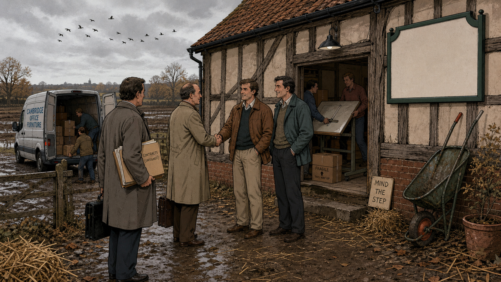 -->

Image Prompt

(This is Panel 10. Do not include the panel number in the image.)
Please generate a 16:9 image in the same contemporary graphic-novel style with 1980s British
period detail depicting panel 10 of 12. Make the characters and style consistent with prior
panels. Show the two engineers in 1990 standing just outside a converted barn-style building on
the outskirts of Cambridge, its old timber frame visible alongside a freshly painted sign board
left deliberately blank, moving boxes and a drafting table being carried in by a small group of
new colleagues. Two visiting business partners in overcoats, carrying briefcases, shake hands
with the engineers near the entrance. Muddy farmland is visible in the background beyond a low
fence. The color palette is autumnal — muted rust, straw yellow, and gray sky. The emotional tone
is understated optimism about an unconventional new beginning. Include at least six specific
visual details: a wheelbarrow leaning against the barn wall, a hand-lettered "mind the step"
sign, a delivery van with its back doors open, scattered straw on the ground, a folder of
unsigned contracts under one visitor's arm, and a flock of birds crossing the overcast sky.
Generate the image immediately without asking clarifying questions.

By 1990, it was clear the processor had outgrown its role as just another component inside
Acorn's own computers. The company made a decision nearly as unconventional as the chip itself:
rather than keep manufacturing processors in-house, Acorn spun the design off into an independent
company, jointly backed by an American computer maker and a semiconductor manufacturing partner,
whose only product would be the architecture itself, licensed to anyone who wanted to build it
into their own silicon. The new company set up modestly, in a converted barn on the outskirts of
Cambridge, with a small staff and an unglamorous office to match the culture that had produced
the chip in the first place. It was a strange business model for 1990. It turned out to be
exactly the right one for what was coming next.

## Panel 11: The Right Chip for a Market That Didn't Exist Yet

<!-- 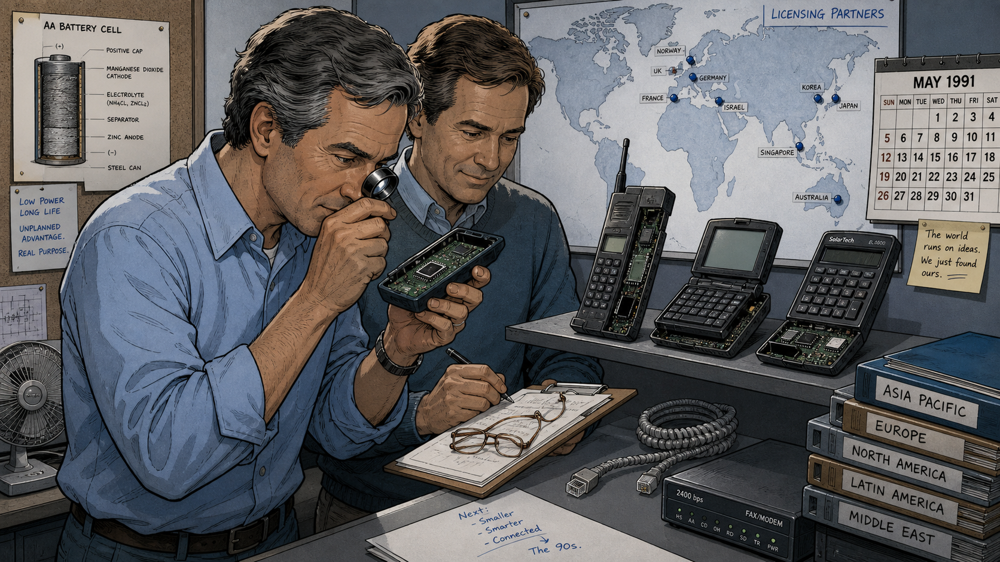 -->

Image Prompt

(This is Panel 11. Do not include the panel number in the image.)
Please generate a 16:9 image in the same contemporary graphic-novel style with a slightly more
polished early-1990s sensibility depicting panel 11 of 12. Make the characters and style
consistent with prior panels, both engineers now visibly a little older. Show them in a modest
office reviewing a shelf lined with an assortment of small battery-powered electronic devices —
an early mobile handset, a handheld personal organizer, a pocket calculator-like device — each
with its casing partly open to reveal a small processor chip inside. One engineer holds a
magnifying loupe up to one of the open devices while the other makes notes on a clipboard. A
world map on the wall now has several small pins marking overseas licensing partners. The color
palette shifts to cooler grays and soft blues, hinting at the approaching digital decade. The
emotional tone is thoughtful satisfaction, watching an unplanned advantage find its true purpose.
Include at least six specific visual details: a battery-cell diagram pinned to the corkboard, a
stack of licensing folders labeled by region, a coiled telephone modem cable, a small desktop fan
now unused in the corner, reading glasses folded on the clipboard, and a calendar showing the
early 1990s. Generate the image immediately without asking clarifying questions.

Through the 1990s, a new category of device began to matter more than anyone at Acorn had planned
for: battery-powered, pocket-sized, and utterly intolerant of a processor that ran hot or drained
a battery in an afternoon. Mobile phones, handheld organizers, and embedded controllers needed
exactly what the Cambridge team had built years earlier for entirely different reasons — a fast,
simple, astonishingly power-frugal processor design. The low-power discipline Acorn's engineers
had accepted as a cost-cutting necessity, not a strategic bet on the future, turned out to be the
single most valuable property their design possessed. Licensing income and design wins multiplied
across an industry that had barely existed when the instruction set was first sketched out on
graph paper.

## Panel 12: Still Running, Decades Later

<!-- 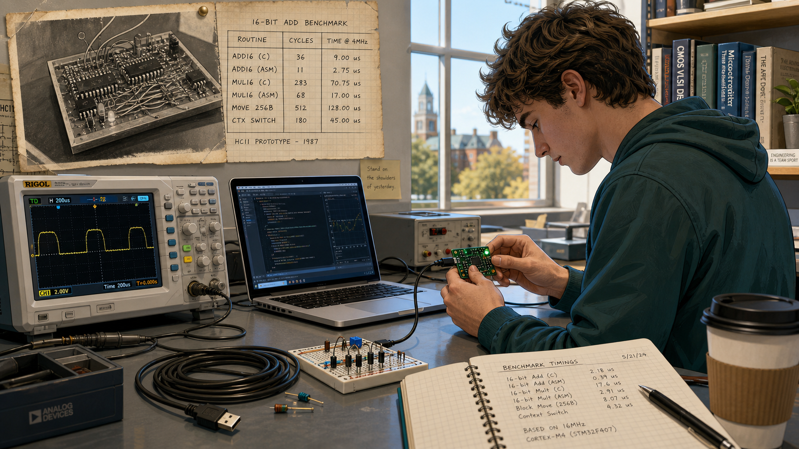 -->

Image Prompt

(This is Panel 12. Do not include the panel number in the image.)
Please generate a 16:9 image in a contemporary graphic-novel style, slightly brighter and more
present-day in feel while echoing the same visual language, depicting panel 12 of 12. Show a
present-day university lab bench where a college-age student in casual contemporary clothing
examines a small green circuit board connected by a short cable to a laptop, an oscilloscope
displaying a clean waveform beside it. Faintly overlaid in the upper corner of the frame, rendered
like a ghosted archival photograph pinned to the wall behind the student, is the same wire-wrapped
1980s prototype board and graph-paper instruction table from earlier panels, visually linking past
to present. Warm daylight comes through a large modern window. The color palette blends the
story's earlier muted teals and mustards with brighter, cleaner present-day tones. The emotional
tone is quiet continuity and inspiration — a direct thread from one era's constraint to another
era's classroom. Include at least six specific visual details: a coiled USB cable, a small
breadboard with a handful of components, a notebook open to handwritten benchmark timings, a
coffee cup with a university logo turned away from view, a bookshelf with technical manuals in
the background, and the archival photograph's worn, slightly yellowed edges. Generate the image
immediately without asking clarifying questions.

Decades later, processors descended from that Cambridge design ship inside the overwhelming
majority of the world's electronic devices by volume — phones, cameras, appliances, and the
microcontroller on the small circuit board in front of a student in this very course, running an
evolved descendant of the instruction set Wilson worked out by hand and the low-power circuit
discipline Furber built into the silicon. Two engineers with almost no budget had not set out to
define how nearly every processor on Earth would someday be designed. They had only refused to
accept that doing more had to cost more.

### Epilogue – What Made Wilson and Furber's Approach Different?

Wilson and Furber did not have a semiconductor giant's research budget, headcount, or
fabrication expertise — what they had was a precise understanding of the constraint they were
working under and the discipline not to fight it. Rather than trying to out-feature Intel or
Motorola on a fraction of the budget, they built something categorically simpler and asked
whether simplicity itself might be the advantage. It was a bet that only worked because Wilson
understood real software deeply enough to know what could be cut, and because Furber cared enough
about power and cost to treat a plastic package's thermal limit as a design requirement rather
than an afterthought. Today, she is remembered as one of computing's most consequential
instruction-set designers, and Furber as one of its most influential systems architects —
precisely because their constraint-driven choices turned out to matter far beyond the budget that
forced them.

| Challenge | How They Responded | Lesson for Today |
|---|---|---|
| Could not afford to license an existing 32-bit processor from an established manufacturer | Designed an entirely new processor and instruction set with a two-person core team | A tight budget can force a better design than an unlimited one, if you let the constraint guide the architecture |
| A tiny team could never realistically debug a large, feature-heavy processor by hand | Deliberately minimized the instruction set so its correctness could actually be verified | Simplicity is a verification strategy, not just an aesthetic preference — a smaller design is one you can actually trust |
| First silicon almost always comes back with bugs, even from large, experienced teams | Careful, disciplined design work paid off when the first chips worked essentially on the first try | Rigor invested before fabrication — or before a benchmark run — is far cheaper than debugging after the fact |
| The chip's power efficiency was a cost-driven side effect, not a recognized selling point at launch | Kept measuring, documenting, and reporting the chip's actual power and performance characteristics as products shipped | Measure and record every property of a working system, not just the one you were targeting — you may not yet know which number will matter most |

### Call to Action

Every board in this course's kit carries a processor core that is a direct descendant of the
instruction set Wilson sketched out on graph paper and the power-conscious circuit discipline
Furber built into that first prototype in 1985. When you write and benchmark hand-optimized
assembly on your Cortex-M33 core in the weeks ahead, you are not just learning an instruction set
— you are working inside the design lineage this story just told. Measure your own code's speed
and power as carefully as Wilson and Furber measured theirs, and you honor the same discipline
that turned a budget constraint into the most widely manufactured processor architecture in
history.

---

*"The processor was actually running on leakage from the logic circuits."*
—Sophie Wilson

*"We designed the ARM for an Acorn desktop product, where power isn't of primary importance. But
it had to be cheap. Cheap meant it had to go in a plastic package, plastic packages have a fairly
high thermal resistance, so we had to bring it in under 1W."*
—Steve Furber

---

## References

1. [Wikipedia: ARM architecture family](https://en.wikipedia.org/wiki/ARM_architecture_family) - Technical and historical overview of the ARM instruction set architecture, from the 1985 ARM1 prototype through today's Cortex cores.
2. [Wikipedia: Sophie Wilson](https://en.wikipedia.org/wiki/Sophie_Wilson) - Biography covering Wilson's design of BBC BASIC and the ARM instruction set.
3. [Wikipedia: Steve Furber](https://en.wikipedia.org/wiki/Steve_Furber) - Biography covering Furber's hardware design work on the BBC Microcomputer and the ARM processor.
4. [Computer History Museum: 2012 Fellow Award Honorees](https://computerhistory.org/press-releases/2012-fellows/) - Museum announcement inducting Wilson and Furber as Fellows for their work as chief architects of the ARM processor.
5. [Encyclopaedia Britannica: RISC](https://www.britannica.com/technology/RISC) - Overview of reduced instruction set computing, the design philosophy underlying the processor Wilson and Furber built.
