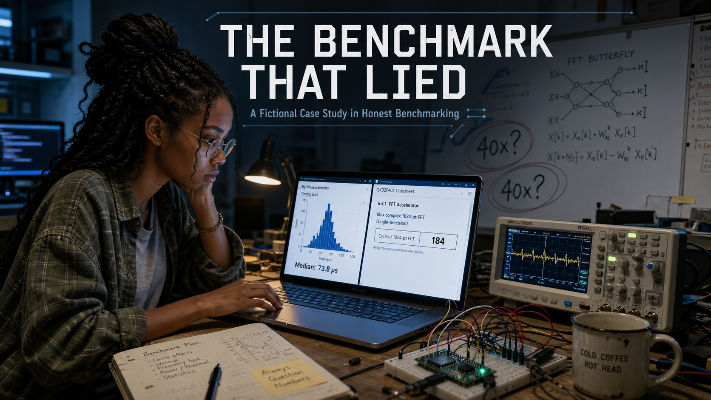
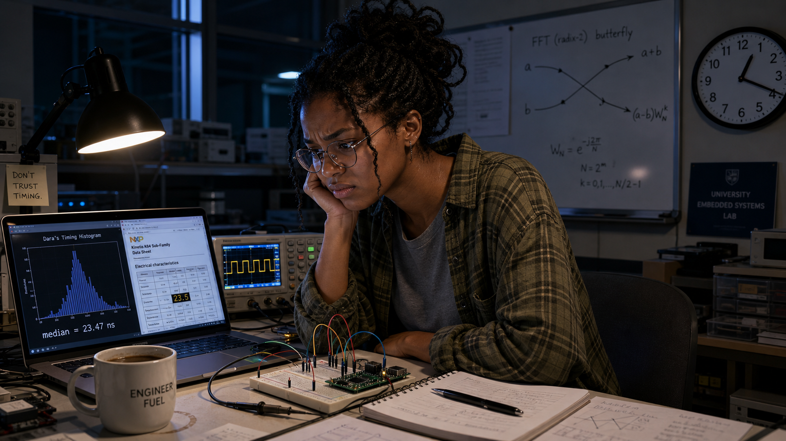
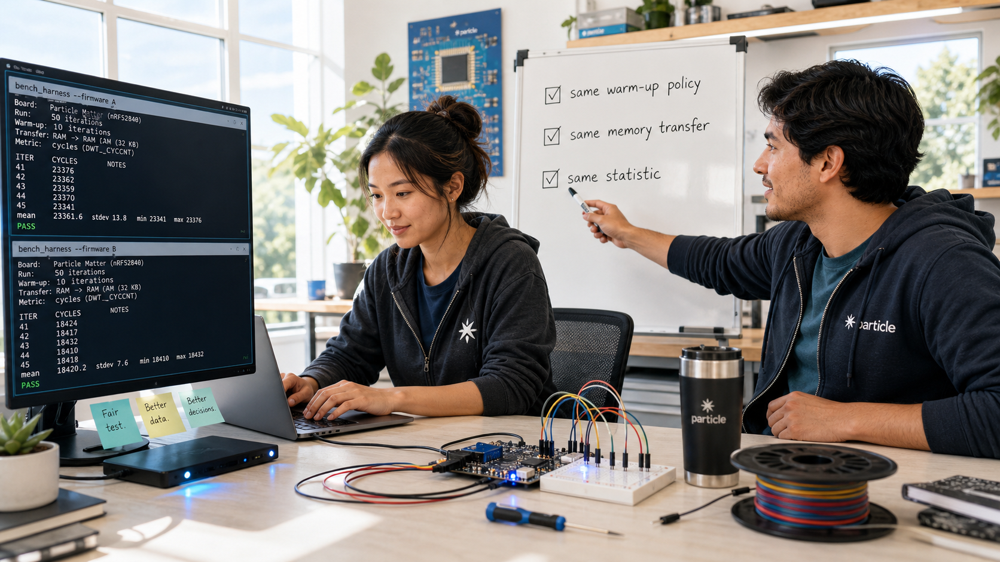
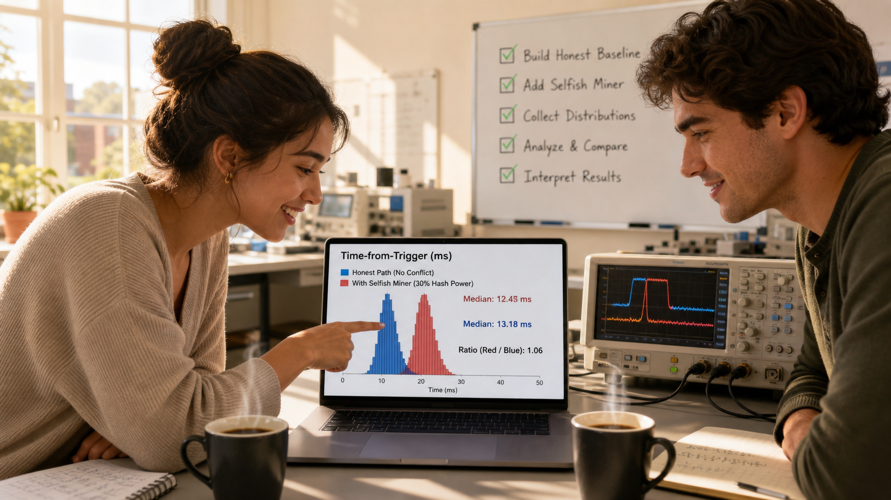

# The Benchmark That Lied

<!--  -->

Cover Image Prompt

(This is the Cover Image. Do not include this label in the image.)
Please generate a wide-landscape 16:9 cover image in a contemporary photorealistic
style, like a still from a present-day university engineering documentary. A young
woman in her early twenties sits at a cluttered lab bench late at night: deep brown
skin, black hair in long twists gathered into a loose bun with a few strands escaping,
thin wire-rimmed glasses, wearing an oversized olive-green flannel shirt over a faded
gray t-shirt. She stares intently at a laptop screen split between two windows — on the
left, a jagged histogram of her own timing measurements with a median value labeled; on
the right, a clean datasheet page showing a single suspiciously small number in bold.
Beside the laptop sits a small oscilloscope displaying a waveform, a breadboard wired to
a small green microcontroller board, and a chipped mug of cold coffee. A whiteboard
looms in the soft-focus background, covered in a hand-drawn FFT butterfly diagram and
the number "40x?" circled twice with a question mark. The title text "THE BENCHMARK
THAT LIED" appears across the top third of the image in a clean, modern technical
sans-serif typeface, like lettering stenciled on lab equipment, with the smaller
subtitle "A Fictional Case Study in Honest Benchmarking" beneath it. Color palette: cool
blue-white monitor glow dominating the frame, cut by one warm pool of desk-lamp light
around her hands. Emotional tone: focused unease, the quiet start of a mystery.
Generate the image immediately without asking clarifying questions.

Narrative Prompt

This is a fictional case study set in a present-day university embedded-systems lab —
not a real person's biography, and not a real company or product. It follows two
invented characters: Dara Osei, a junior in electrical and computer engineering, and
Mateo Reyes, a graduate teaching assistant. Dara has deep brown skin and long black
twists usually gathered into a loose bun with a few loose strands, thin wire-rimmed
glasses, and wears an oversized olive-green flannel shirt over a faded gray t-shirt,
with a small silver ring on one thumb; her expression shifts across the story from
proud, to unsettled, to sharply focused, to quietly triumphant. Mateo is in his late
twenties, Latino, with short black hair, light stubble, thin tortoiseshell glasses, and
wears a gray cardigan over a blue checked flannel with sleeves rolled to the forearm; he
carries a dented steel travel mug and has a calm, patient bearing. The setting
throughout is the embedded-systems teaching lab of an unnamed university: workbenches
with oscilloscopes, breadboards, small microcontroller boards, and laptops running
terminal windows full of timing data, plus a whiteboard that accumulates diagrams and
numbers across the story. The central theme is the gap between a number and the truth
it claims to measure — a benchmark that quietly measures the wrong thing rather than an
outright lie. Style guide: contemporary photorealistic style throughout, consistent
character likenesses and wardrobe in every panel, a visual shift from cool late-night
blue tones in the early panels to warmer, brighter daylight tones as the mystery
resolves. Do not depict any real company logos, real product branding, or real
trademarked hardware markings anywhere — describe boards, instruments, and software as
generic lab equipment.

### Prologue – A Number Too Good to Argue With

Dara Osei had done everything right. She had written her own 512-point FFT by hand,
tested it against a known signal until the output matched to the last bit, and measured
its running time the honest way — hundreds of runs, full statistics, nothing hidden.
She was proud of that number. Then she opened the datasheet for a commercial DSP
library her professor had mentioned in passing, found its headline benchmark for the
exact same transform, and felt her pride curdle into confusion: the vendor's number was
forty times faster than hers, and nothing in her understanding of the algorithm could
explain a gap that large. This is a fictional story — no real student, mentor, or
company — but the trap it dramatizes is exactly the one this course spends two chapters
warning students about.

## Panel 1: A Number That Doesn't Add Up

<!--  -->

Image Prompt

(This is Panel 01. Do not include the panel number in the image.)
I am about to ask you to generate a series of images for a graphic novel. Please make
the images have a consistent style and consistent characters. Do not ask any
clarifying questions. Just generate the image immediately when asked.

Please generate a 16:9 image in contemporary photorealistic style depicting panel 1 of
7. Dara Osei — brown-skinned young woman, black twists in a loose bun, wire-rimmed
glasses, oversized olive-green flannel over a gray t-shirt — sits alone at a cluttered
workbench in a university embedded-systems lab, late at night. Show these specific
visual details: a laptop screen split between her own timing histogram (median value
labeled in a monospace font) and a vendor datasheet PDF showing one bold, small number;
a small oscilloscope beside the laptop displaying a clean square-wave trace; a
breadboard wired to a small green microcontroller board with a few jumper wires; a
half-full mug of coffee with a faint ring stain on the desk; a wall clock reading well
past midnight; and a whiteboard in the background with a rough FFT butterfly diagram
sketched in marker. Color palette: cool blue-white monitor glow with one warm desk-lamp
pool of light on her hands. Emotional tone: pride draining into confusion. Generate the
image immediately without asking clarifying questions.

Dara leaned back from the screen and read the number again, certain she had misread it
the first time. Her own hand-written FFT, measured honestly over hundreds of runs,
landed at just over two milliseconds per transform on her board's ARM Cortex-M33 core.
The vendor's datasheet claimed fifty-two microseconds for the identical 512-point
transform on the same class of processor — a gap of roughly forty times. She knew her
algorithm wasn't perfect, but nothing in the operation count on her whiteboard could
explain losing forty-to-one to anyone, let alone to a library she suspected wasn't even
hand-tuned in assembly.

## Panel 2: Checking Her Own Work Twice

<!--  -->

Image Prompt

(This is Panel 02. Do not include the panel number in the image.)
Please generate a 16:9 image in contemporary photorealistic style depicting panel 2 of
7. Keep Dara Osei's likeness and wardrobe consistent with panel 1. The same lab, now
even later — she stands at the whiteboard, marker in hand, having filled it with more
detail: a butterfly-operation diagram with multiply and add counts written beside each
stage, a column of instruction-cycle estimates, and a circled question "where do 40x go?"
On the desk behind her, show a printed strip of five stacked terminal outputs from
repeated benchmark runs, all showing nearly identical median values; a second, empty
coffee mug beside the first; a granola bar wrapper; and her laptop now showing a
histogram with a tight, narrow, repeatable peak. Color palette: cool blue-white
lighting, slightly desaturated to suggest exhaustion. Emotional tone: stubborn
self-doubt hardening into quiet confidence. Generate the image immediately without
asking clarifying questions.

Her first instinct was to assume she had made a mistake somewhere, so she went looking
for one. She re-derived the operation count on the whiteboard, recounted every multiply
and add in her butterfly stages, and reran her benchmark harness five more times from a
clean build. Every run landed in the same narrow band around two milliseconds, the
histogram's peak barely shifting. Whatever was producing that forty-times gap, it
wasn't a bug in her code and it wasn't noise in her measurement — her number was real,
and it was reproducible.

## Panel 3: A Different Question

<!--  -->

Image Prompt

(This is Panel 03. Do not include the panel number in the image.)
Please generate a 16:9 image in contemporary photorealistic style depicting panel 3 of
7. Introduce Mateo Reyes — Latino man in his late twenties, short black hair, light
stubble, thin tortoiseshell glasses, gray cardigan over a blue checked flannel with
sleeves rolled up, carrying a dented steel travel mug — leaning against the doorway of
the same lab in the gray light of early morning. Dara, likeness consistent with prior
panels but now visibly tired, turns her chair toward him, gesturing at her screen. Show
these specific visual details: sunrise light beginning to angle through a tall lab
window behind Mateo; his travel mug with a small dent and a chip in its enamel; a
lanyard with a generic laminated badge around his neck; Dara's whiteboard full of
crossed-out calculations visible past her shoulder; a half-eaten granola bar on the
desk; and a second empty chair nearby that he has not yet sat in. Color palette:
transition from cool interior blue to warm dawn amber spilling in from the window.
Emotional tone: a mentor's calm curiosity meeting a student's frustration. Generate the
image immediately without asking clarifying questions.

Mateo Reyes found her there at seven in the morning, still staring at the same two
numbers. He listened to her explain the gap, then asked a question that wasn't the one
she expected: not "what's wrong with your code," but "what exactly does their number
include?" Dara opened her mouth to say the obvious — a 512-point FFT, same board, same
transform — and stopped, because she realized she had no idea what conditions had
actually produced fifty-two microseconds. She had been trying to explain her own result
when the real mystery was sitting inside someone else's.

## Panel 4: The Buried Appendix

<!--  -->

Image Prompt

(This is Panel 04. Do not include the panel number in the image.)
Please generate a 16:9 image in contemporary photorealistic style depicting panel 4 of
7. Keep Dara's likeness and wardrobe consistent with prior panels, now in full daylight,
seated close to her laptop with a highlighter in hand. The screen shows a dense
technical-reference-manual PDF page titled with a methodology appendix, with several
lines highlighted in bright yellow. Show these specific visual details: a highlighted
phrase about discarding an initial block of warm-up iterations before recording results;
a highlighted phrase about data already resident in fast on-chip memory before timing
begins; a highlighted phrase describing the reported value as the fastest of many runs
rather than a typical one; her notebook open beside the laptop with a growing bullet
list written in pen; a second laptop window in the background showing a code-hosting
site with the vendor's library source browsed open; and her expression sharpening into
focus, one eyebrow raised. Color palette: warm daylight through the lab window,
brighter and more saturated than earlier panels. Emotional tone: the click of a puzzle
piece falling into place. Generate the image immediately without asking clarifying
questions.

The vendor's technical reference manual buried its benchmarking methodology in an
appendix most readers would never open, but Dara read every line. The published number
came from the fastest of a thousand runs, not a typical one. The first two hundred
iterations had been discarded as warm-up before any timing began. And the test data was
already sitting in the chip's fastest on-chip memory before the clock started — none of
the time to move real samples into place had ever been counted. Her benchmark included
all of that cost, honestly, and theirs had quietly excluded every bit of it.

## Panel 5: Rebuilding the Comparison

<!--  -->

Image Prompt

(This is Panel 05. Do not include the panel number in the image.)
Please generate a 16:9 image in contemporary photorealistic style depicting panel 5 of
7. Keep both Dara and Mateo's likenesses and wardrobe consistent with prior panels. They
work side by side at the workbench, Mateo now seated in the second chair, his travel mug
set down beside a small microcontroller board wired into a breadboard with two separate
firmware images loaded onto it. Show these specific visual details: a terminal window
split to show two benchmark harnesses running back to back on the same board; a
whiteboard behind them now listing a short checklist in Mateo's handwriting — "same
warm-up policy," "same memory transfer," "same statistic" — each with a checkmark being
added; a spool of jumper wire and a small screwdriver on the bench; Dara typing while
Mateo points at one checklist line; and morning light now fully filling the room. Color
palette: bright, clear daylight with cool desk equipment accents. Emotional tone:
collaborative momentum, the satisfaction of designing a fair test. Generate the image
immediately without asking clarifying questions.

Together they rebuilt the comparison from the ground up. Dara pulled the vendor's
library source, compiled it for her own board, and wired it into the exact same
measurement harness she used for her own code — same warm-up policy applied to both
implementations, same requirement that each run move its input samples from external
memory before timing began, same reporting of the full distribution instead of a single
best-case run. If the vendor's library really was faster, she wanted a number that
proved it fairly, not one that assumed it.

## Panel 6: The Gap That Remains

<!--  -->

Image Prompt

(This is Panel 06. Do not include the panel number in the image.)
Please generate a 16:9 image in contemporary photorealistic style depicting panel 6 of
7. Keep Dara and Mateo's likenesses consistent with prior panels. Both lean toward the
laptop screen, which now shows two overlapping histograms in different colors, both
narrow and repeatable, with median values labeled and a much smaller ratio written
beside them than in earlier panels. Show these specific visual details: the
oscilloscope now displaying two overlaid timing pulses of noticeably different but
comparable width; Dara's hand pointing at the smaller, honest gap on screen; Mateo's
half-smile of confirmation; the whiteboard checklist from the previous panel now fully
checked off; a fresh cup of coffee, still steaming, replacing the earlier cold mugs; and
warm midday light flooding the lab. Color palette: bright warm daylight, clean and
optimistic compared to the cool tones of the opening panels. Emotional tone: relief and
earned satisfaction. Generate the image immediately without asking clarifying
questions.

Under matched conditions, the forty-times gap collapsed. The vendor's library, timed
honestly, came in at roughly three times faster than Dara's hand-written code — not
forty. That remaining gap made sense: the library used precomputed lookup tables and a
hand-tuned inner loop that her own code didn't have yet, real engineering advantages she
could explain, measure, and even learn from. The mystery hadn't been her competence. It
had been a number that never told her what it left out.

## Panel 7: Two Numbers, One Honest Report

<!--  -->

Image Prompt

(This is Panel 07. Do not include the panel number in the image.)
Please generate a 16:9 image in contemporary photorealistic style depicting panel 7 of
7, the final panel of the story. Keep Dara and Mateo's likenesses and wardrobe
consistent with all prior panels. Dara stands at the front of a small classroom or lab
meeting area, presenting a printed lab report page to a few seated classmates, with
Mateo watching from the side with arms loosely crossed and an approving expression. Show
these specific visual details: a projected slide or large monitor behind her showing a
simple two-row table comparing her FFT and the vendor library under matched conditions,
with a small asterisk linking to a footnote listing excluded costs; a printed copy of
the report in her hand with a highlighted footnote visible; a few classmates taking
notes; her whiteboard from earlier panels now wiped clean except for one written phrase,
"a number is not a measurement until you know what it left out"; and bright, warm,
even classroom lighting. Color palette: warm neutral daylight tones, confident and
settled compared to the cool blues of the opening panel. Emotional tone: quiet
professional pride. Generate the image immediately without asking clarifying questions.

In her lab report, Dara didn't just report her own number and move on. She put both
results side by side — the vendor's headline figure and the honestly matched comparison
she and Mateo had rebuilt — with a footnote spelling out exactly what the original
number had excluded: warm-up discards, pre-loaded memory, and a best-of-a-thousand
selection. It wasn't a takedown of the vendor's library, which really was faster and
fairly earned that edge. It was a demonstration that a number without its conditions
attached isn't a measurement at all — it's a claim waiting to be checked.

### Epilogue – What This Story Teaches About Benchmarks

Dara's forty-times mystery dissolves the moment someone asks what a number actually
measures instead of what it claims to measure. The lesson isn't that vendors lie
outright — most benchmarking dishonesty is quieter than that, a test condition left
unstated rather than a number invented from nothing. What saved Dara wasn't superior
intuition; it was refusing to accept a suspicious result without first interrogating
its methodology, on both sides of the comparison. That habit — treating every benchmark
as a claim with conditions attached, never a fact on its own — is the exact discipline
this course tries to build before anyone hand-optimizes a single line of assembly.

| Challenge | How the Student Responded | Lesson for Today |
|---|---|---|
| Her honest FFT looked forty times slower than a vendor's published number | Re-verified her own measurement was correct and reproducible before assuming she had failed | A reproducible number is not automatically a fair one to compare against — rule out your own error first, then question the comparison itself |
| The vendor's headline figure came from data already sitting in fast on-chip memory | Rebuilt the vendor's library on her own board and fed it data the same way her own code received it | Excluding memory transfer time can make two very different approaches look artificially equal — or artificially unequal |
| The published number was the single fastest of a thousand runs, not a typical one | Reported the full distribution and median for both implementations, side by side | Best-of-N flatters any benchmark equally; only shared, honest statistics make a comparison mean anything |
| The vendor's methodology discarded early "warm-up" runs without saying how many | Applied one clearly stated warm-up policy evenly to both implementations before measuring either | An unstated warm-up policy is still an exclusion — name it, or the comparison isn't reproducible by anyone else |

### Call to Action

This exact trap is the subject of Chapters 17 and 18 of this course, "Measuring Time"
and "Benchmarking Methodology," and it resurfaces directly in Chapter 26 when you pit
your own hand-optimized FFT variants against each other. Before you publish a single
timing number about your own Cortex-M33 assembly, ask Dara's question first: what does
this number include, what does it exclude, and would the comparison still hold up if
someone else ran it under your exact stated conditions?

---

*"A number that won't tell you what it left out isn't a measurement — it's a marketing claim."*
—Dara Osei, fictional

*"Don't ask why your code is slow. Ask what their number forgot to count."*
—Mateo Reyes, fictional

---

## References

Since this is a fictional case study, these references point to real writing about the
phenomenon it dramatizes — misleading or incomplete benchmark methodology, and the
practices that make performance comparisons honest and reproducible.

1. [Wikipedia: Benchmark (computing)](https://en.wikipedia.org/wiki/Benchmark_(computing)) - Overview of what benchmarks measure and why comparability between them is hard to get right
2. [Wikipedia: LINPACK benchmarks](https://en.wikipedia.org/wiki/LINPACK_benchmarks) - The benchmark behind the TOP500 supercomputer ranking, a long-running case study in standardizing what a fair performance comparison must include
3. [Gernot Heiser: A List of Systems Benchmarking Crimes](https://gernot-heiser.org/benchmarking-crimes.html) - A widely cited catalog of the ways systems researchers unintentionally produce misleading benchmark results
4. [Mytkowicz, Diwan, Hauswirth, and Sweeney: "Producing Wrong Data Without Doing Anything Obviously Wrong!" (ASPLOS 2009)](https://users.cs.northwestern.edu/~robby/courses/322-2013-spring/mytkowicz-wrong-data.pdf) - A landmark paper showing how small, innocuous changes in experimental setup can silently bias performance measurements
5. [Brendan Gregg: "Evaluating the Evaluation: A Benchmarking Checklist"](https://www.brendangregg.com/blog/2018-06-30/benchmarking-checklist.html) - A practical checklist for auditing what a benchmark actually tested before trusting its conclusion
