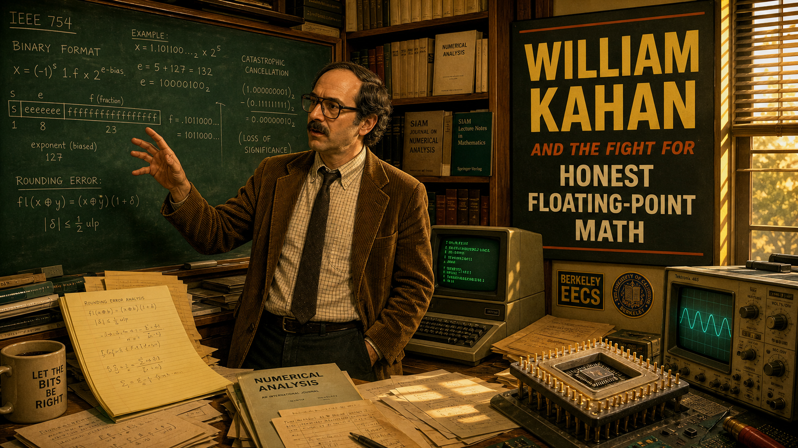
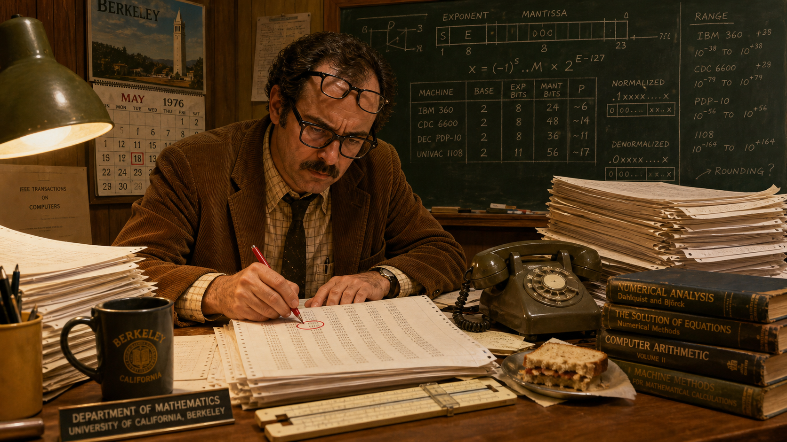
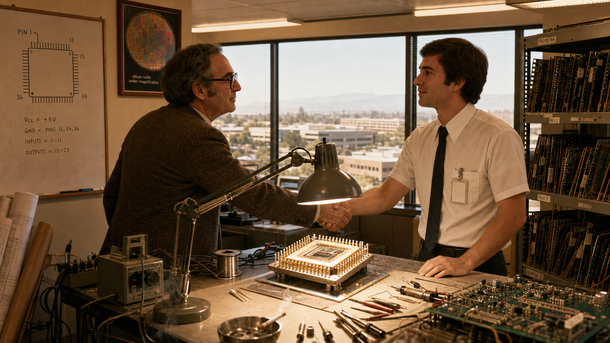
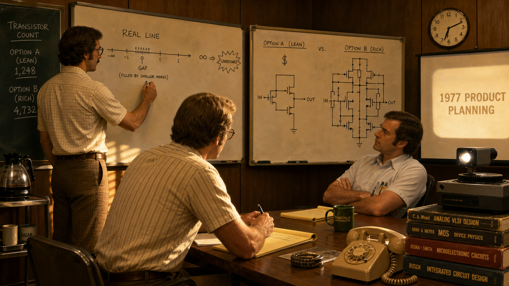
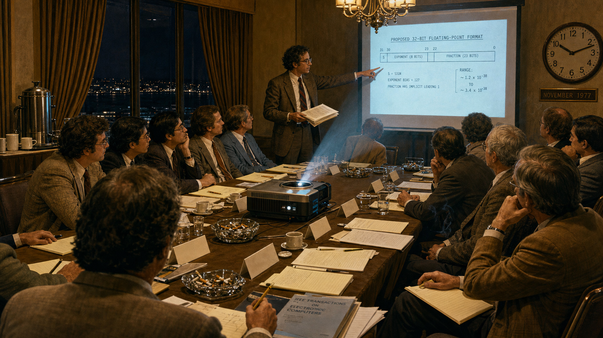
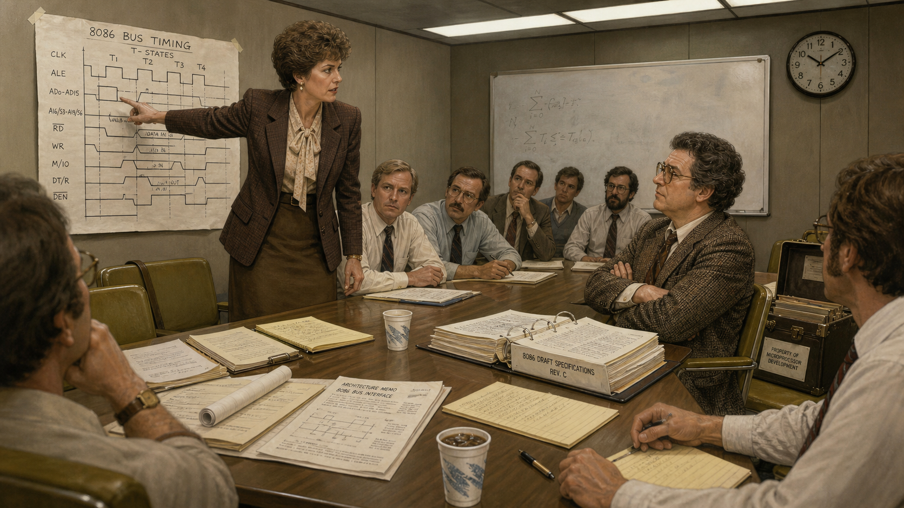
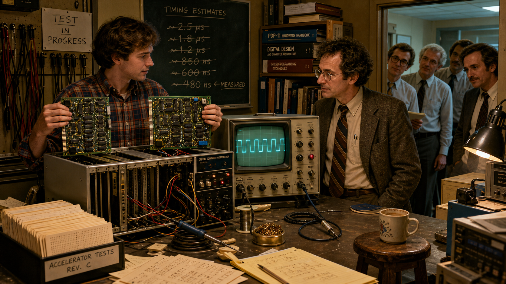
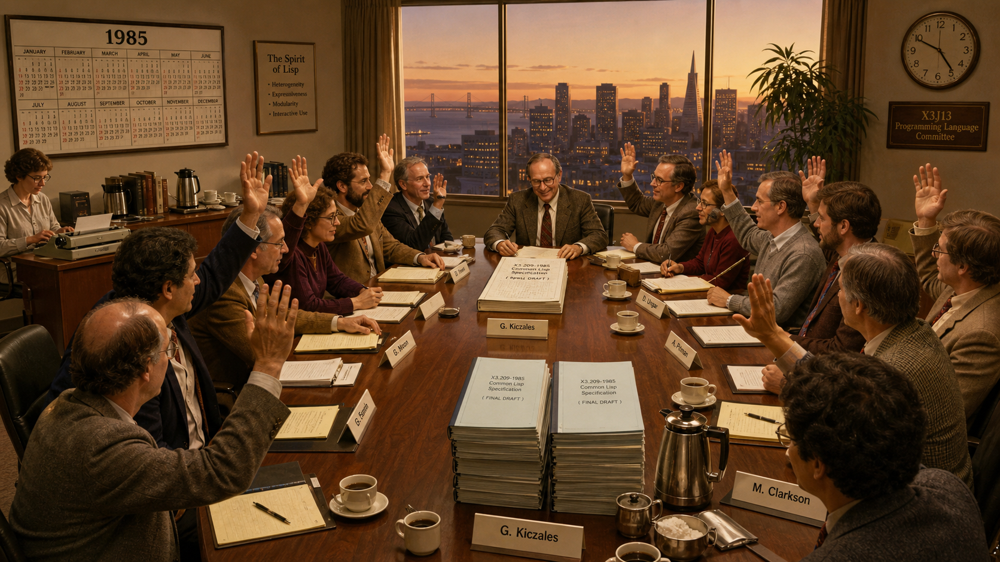
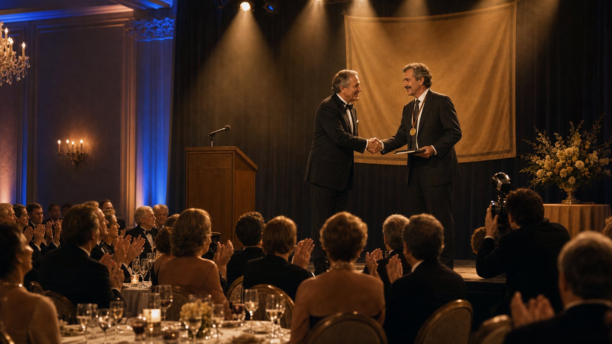

# William Kahan and the Fight for Honest Floating-Point Math

Cover Image Prompt

(This is the Cover Image. Do not include this label in the image.)
Please generate a wide-landscape 16:9 cover image in a warm, lightly stylized illustrated-realism
style evoking early-1980s Silicon Valley and Berkeley academia. Show a bespectacled man in his
mid-40s — medium build, receding dark hair, thick black square-framed glasses, a trimmed
mustache, wearing a rumpled corduroy sport coat over a checked short-sleeve shirt with a narrow
tie — standing at a chalkboard covered in dense binary exponent-and-mantissa notation, one hand
raised mid-argument, in a cramped university office. Behind him, a wall of bookshelves stuffed
with numerical-analysis journals and a green-phosphor terminal glowing faintly on a cluttered
desk. On a side table, a partially disassembled ceramic chip package with visible pins sits next
to a bulky oscilloscope with a faint waveform on its screen. Late-afternoon light slants through
venetian blinds, casting long shadows across stacks of paper covered in rounding-error
calculations. Render the title text "WILLIAM KAHAN AND THE FIGHT FOR HONEST FLOATING-POINT MATH"
in a bold, period-appropriate sans-serif typeface, integrated into the composition like signage
or a title card rather than simply overlaid. Color palette: mustard yellow, olive green, burnt
orange, and warm browns with cool teal CRT-glow accents. Emotional tone: quiet, stubborn
determination — a single figure standing firm amid clutter and complexity. Generate the image
immediately without asking clarifying questions.

Narrative Prompt

This story is set in the United States between 1976 and 1989, primarily in Silicon Valley
engineering offices and University of California, Berkeley academic buildings, rendered in a
warm, lightly stylized illustrated-realism style reminiscent of contemporary graphic-novel
biographies, with period-accurate technology and clothing throughout. The central figure,
mathematician William Kahan, must be drawn with consistent physical features across every panel:
a medium build, receding dark hair graying slightly by the story's later panels, thick black
square-framed glasses, a trimmed mustache, and era-appropriate professional dress — corduroy
jackets, short-sleeve button shirts, and narrow ties in the working panels, moving to a formal
suit only in the final ceremony panel. The story's theme is quiet, stubborn intellectual
integrity: one mathematician's refusal to let commercial convenience or manufacturing cost water
down a rigorous engineering standard, even when nearly every company in the room had a financial
reason to prefer a cheaper answer. Color palette throughout: mustard yellow, olive green, warm
browns, and burnt orange, punctuated by cool teal and amber glows from CRT terminals and
oscilloscopes. Do not render any real corporate logos, trademarks, or brand wordmarks on
equipment, packaging, badges, or signage — depict period-accurate but generic hardware and
nameplates instead.

### Prologue – The Machine That Couldn't Agree With Itself

In the 1960s and 1970s, a number typed into one computer and the same number typed into another
rarely meant quite the same thing. Every manufacturer rounded, truncated, and handled overflow by
its own private rules, so a single calculation could return a subtly different answer depending on
which brand of machine carried it out. Engineers didn't call these inconsistencies bugs; they
called them features, quirks their customers had learned to route around with defensive tricks
wedged into otherwise ordinary code. One Berkeley mathematician had spent years cataloguing
exactly how badly these "features" could corrupt a trustworthy result — and he was about to get a
phone call that would let him do something about it for the entire industry at once.

## Panel 1: Anarchy on Every Machine

Image Prompt

(This is Panel 01. Do not include the panel number in the image.)
I am about to ask you to generate a series of images for a graphic novel. Please make the images
have a consistent style and consistent characters. Do not ask any clarifying questions. Just
generate the image immediately when asked.

Please generate a 16:9 image in warm illustrated-realism period style depicting panel 1 of 8. The
scene shows a bespectacled man in his mid-40s — medium build, receding dark hair, thick black
square-framed glasses, trimmed mustache, wearing a rumpled corduroy jacket over a checked shirt
and narrow tie — seated at a cluttered university office desk in Berkeley, California, in 1976,
surrounded by tall stacks of continuous-feed printer paper covered in columns of numbers. He is
circling a discrepancy between two printouts with a red pen, brow furrowed in concentration. A
chalkboard behind him is covered with exponent-and-mantissa diagrams comparing several machines'
arithmetic. A rotary telephone sits within reach on the desk. Fluorescent overhead light mixes
with warm desk-lamp light; the color palette is mustard yellow, olive green, and warm brown, with
worn wood-paneled walls. The emotional tone is intense, solitary focus, like a detective examining
evidence. Additional details: a slide rule resting on the desk, a coffee mug, dog-eared
numerical-analysis textbooks stacked on the floor, a wall calendar showing 1976, a second pair of
reading glasses pushed up on his forehead, and a forgotten half-eaten sandwich beside the papers.
Generate the image immediately without asking clarifying questions.

By the mid-1970s, William Kahan had built a career at the University of California, Berkeley
studying a problem most programmers didn't know existed. Feed identical arithmetic to machines
from three different manufacturers and you could get three different answers, each rounded by its
own undocumented internal logic. Kahan had already sharpened the floating-point routines inside a
popular line of scientific calculators, so he understood better than almost anyone how expensive
it was to write numerical software that behaved the same way twice. What he lacked, in 1976, was a
lever large enough to fix the whole industry at once.

## Panel 2: A Call from the Valley

Image Prompt

(This is Panel 02. Do not include the panel number in the image.)
Please generate a 16:9 image in warm illustrated-realism period style depicting panel 2 of 8. Make
the characters and style consistent with the prior panel. The scene shows the same bespectacled
mathematician, now standing inside a Silicon Valley semiconductor company's engineering office in
1976, shaking hands with a younger clean-shaven engineer in a short-sleeve white dress shirt and
thin dark tie. Between them, on a workbench, sits an open ceramic chip package under a bright
inspection lamp, its rows of pins gleaming, surrounded by wire-wrap tools and a partially
assembled circuit board. Floor-to-ceiling windows behind them show a low-rise office park under a
hazy California sky. The color palette is warm browns and burnt orange with cool fluorescent
overhead light reflecting off the ceramic chip package. The emotional tone is cautious mutual
respect between two very different professional cultures meeting for the first time. Additional
details: an unmarked badge clipped to the engineer's shirt pocket, a whiteboard sketch of a chip
pinout diagram, a rack of prototype circuit boards along one wall, an ashtray with a smoldering
cigarette on the workbench, a framed poster of a silicon wafer under magnification, and blueprints
rolled into a drafting tube leaning in the corner. Generate the image immediately without asking
clarifying questions.

In 1976, Intel's floating-point project manager, John Palmer, remembered a talk Kahan had once
given at Stanford about exactly this problem, and he came calling. Palmer's team was designing a
math coprocessor chip to accompany the company's new microprocessor line, and he wanted its
arithmetic to be more than merely functional — he wanted it provably, defensibly correct. Kahan
signed on as a paid consultant, suddenly free to shape a real, mass-market chip instead of only
diagnosing other people's mistakes after the fact. Intel, he would later recall, did not just want
good arithmetic; it wanted the best arithmetic anyone had ever put in front of an ordinary
programmer.

## Panel 3: Best, Not Cheapest

Image Prompt

(This is Panel 03. Do not include the panel number in the image.)
Please generate a 16:9 image in warm illustrated-realism period style depicting panel 3 of 8. Make
the characters and style consistent with the prior panels. The scene shows the same mathematician
standing at a whiteboard inside a semiconductor company's conference room in 1977, sketching a
number line with a small, carefully labeled gap near zero filled by smaller marks, next to a
symbol for infinity and a jagged starburst icon representing an undefined result. Two engineers in
short-sleeve shirts sit at the conference table, one skeptical with arms crossed, one leaning
forward taking notes on a legal pad. A second whiteboard nearby shows two competing circuit
diagrams, one labeled with a large dollar sign and fewer transistor symbols, the other more
elaborate. Late-afternoon light comes through venetian blinds; the color palette is mustard
yellow, olive, and burnt orange. The emotional tone is a respectful but pointed technical
disagreement. Additional details: a transistor-count tally written in chalk in the corner, a
half-full coffee pot on a side cart, a rotary desk phone, stacked reference manuals with worn
spines, a slide projector aimed at a screen, and a wall clock reading past six in the evening.
Generate the image immediately without asking clarifying questions.

Kahan could have suggested the cheap route: copy an existing minicomputer's arithmetic and move
on. Instead he pushed for something far more demanding — exact rules for rounding, dedicated
representations for infinity and for results that were simply undefined, and a scheme called
gradual underflow that kept very small numbers from collapsing straight to zero. Every one of
those features cost transistors on a chip that, at the time, had precious few to spare. Kahan
argued the cost was worth it precisely because most of the programmers who would ever touch this
arithmetic had never taken a numerical analysis class in their lives, and the hardware owed them
correctness they hadn't been trained to verify themselves.

## Panel 4: The Committee Convenes

Image Prompt

(This is Panel 04. Do not include the panel number in the image.)
Please generate a 16:9 image in warm illustrated-realism period style depicting panel 4 of 8. Make
the characters and style consistent with the prior panels. The scene shows a crowded hotel
conference room near a coastal city in November 1977, a dozen engineers and academics of varied
ages seated around a long table strewn with legal pads, mechanical pencils, and a slide projector
casting a diagram of a proposed number format onto a screen. The bespectacled mathematician stands
at the front gesturing at the projected diagram, a thick typed draft document held in his other
hand. Evening darkness shows through tall windows behind heavy curtains; overhead hotel chandelier
lighting mixes with the projector's cool beam. The color palette is warm brown and olive with a
cool blue-white projector glow cutting across the room. The emotional tone is charged, attentive
concentration, a room full of rivals listening carefully to the same proposal. Additional details:
name placards on the table with no legible company names, a coffee urn on a side table, overflowing
ashtrays, a large wall clock reading past ten at night, scattered technical journals, and a
hotel-branded notepad with no visible logo beside each seat. Generate the image immediately
without asking clarifying questions.

That November, an industry-wide committee convened by the IEEE met in a hotel near San Francisco
to see whether floating-point arithmetic across the whole microprocessor business could be brought
under one set of rules. Kahan arrived with a formal draft he had prepared with a Berkeley graduate
student and a visiting colleague, encoding everything he had argued for at the chip company into
the language of a real standard. Representatives from more than a dozen companies filled the room,
many of them sent because a rival's chip might otherwise gain an edge nobody else could match.
Kahan later admitted, only half joking, that competitive fear had done as much to fill that room as
any shared love of correct arithmetic.

## Panel 5: The Holdouts

Image Prompt

(This is Panel 05. Do not include the panel number in the image.)
Please generate a 16:9 image in warm illustrated-realism period style depicting panel 5 of 8. Make
the characters and style consistent with the prior panels. The scene shows a tense committee
meeting around 1980 in a fluorescent-lit corporate conference room, a sharply dressed woman in her
40s with short styled hair, wearing a tailored blazer, standing and pointing firmly at a
handwritten circuit-timing chart taped to the wall, arguing with visible conviction. Across the
table, the bespectacled mathematician sits with arms folded, listening intently but unmoved, a
thick binder of draft specifications open in front of him. Several other engineers around the
table watch the exchange, some nodding with the woman, others with the mathematician. Fluorescent
tube lighting gives the room a cool, clinical cast against the mustard-and-olive color palette of
the furniture. The emotional tone is a firm, unresolved standoff between two camps who each
believe they are right. Additional details: a mechanical timing diagram with hand-drawn pulse
waveforms, scattered technical memos on the table, a half-erased whiteboard equation in the
background, a wall-mounted analog clock, foam cups of cold coffee, and a briefcase propped open on
an empty chair. Generate the image immediately without asking clarifying questions.

Not everyone wanted to sign on. A rival computer maker had already built an enormous customer base
around its own arithmetic, and its lead numerics expert argued hard that Kahan's more demanding
design simply could not be built fast enough to compete. A hardware engineer at an early meeting
stated flatly that the rigorous proposal could never run at the speed of the machines already
shipping. For months, the disagreement over one feature in particular — how tiny, near-zero
numbers should behave — threatened to fracture the entire effort into competing, incompatible
standards.

## Panel 6: Proof on a Circuit Board

Image Prompt

(This is Panel 06. Do not include the panel number in the image.)
Please generate a 16:9 image in warm illustrated-realism period style depicting panel 6 of 8. Make
the characters and style consistent with the prior panels. The scene shows a university
electronics lab around 1981, a young graduate student in jeans and a flannel shirt holding up two
green circuit accelerator boards dense with chips and wiring, plugged into an open minicomputer
chassis on a workbench. The bespectacled mathematician stands beside him, arms uncrossed now,
watching an oscilloscope screen that displays a clean, stable waveform. A small audience of
committee members in shirts and ties leans in from the doorway to look. Workbench clutter includes
soldering irons, spools of wire, and stacks of punch cards. The color palette shifts slightly
cooler here, teal oscilloscope glow mixing with warm incandescent workbench lighting against the
mustard-and-olive room. The emotional tone is vindication and quiet triumph after a long technical
argument. Additional details: a wall-mounted board of hand-labeled test cables, a rack of
reference manuals, a hand-lettered sign reading "TEST IN PROGRESS," a coiled oscilloscope probe,
a half-finished cup of coffee balanced on a stool, and a chalkboard in the background covered with
crossed-out timing estimates. Generate the image immediately without asking clarifying questions.

The stalemate broke on hardware, not rhetoric. A Berkeley graduate student built Kahan's proposed
arithmetic onto a pair of accelerator boards and wired them into an ordinary minicomputer, and once
committee members watched it run at full speed, nobody could keep arguing it was infeasible. A
year later, in Boston, a respected outside error-analyst whom the skeptics themselves had
commissioned to evaluate the disputed feature delivered his verdict in person: on balance, it was
the right thing to do. The two strongest technical objections to Kahan's design had just been
answered by an independent expert and a working circuit board, not by Kahan's own say-so.

## Panel 7: Ratification

Image Prompt

(This is Panel 07. Do not include the panel number in the image.)
Please generate a 16:9 image in warm illustrated-realism period style depicting panel 7 of 8. Make
the characters and style consistent with the prior panels. The scene shows a formal committee vote
in 1985, a long conference table ringed by more than a dozen engineers and academics of mixed ages
and genders, hands raised in approval, the bespectacled mathematician at the head of the table
setting down his pen on a thick, finished specification document with visible relief on his face.
A large wall calendar clearly shows the year 1985. Behind the group, a floor-to-ceiling window
reveals a Bay Area skyline at dusk. The color palette warms slightly with golden late-afternoon
light mixing with the room's mustard and olive tones. The emotional tone is quiet, hard-won
satisfaction rather than celebration — the end of a long grind. Additional details: stacks of
duplicated final draft documents ready for distribution, a secretary at a side table typing on an
electric typewriter, a coffee service with real cups instead of foam, name placards now neatly
aligned, a wall clock reading late afternoon, and a single potted plant near the window. Generate
the image immediately without asking clarifying questions.

By the time the standard was formally ratified in 1985, it hardly needed the vote — chip makers
across the industry had already been quietly building to Kahan's specification for a year, having
concluded it was the sound design regardless of what any committee decided. The finished document
defined, bit for bit, how a computer's hardware should represent numbers, round results, and
signal errors, from the cheapest microprocessor to the largest mainframe. What began as one
professor's argument with a single chip company had become an agreement that nearly the entire
computing industry chose to honor voluntarily before it was even official.

## Panel 8: The Turing Award and the Standard That Outlived the Room

Image Prompt

(This is Panel 08. Do not include the panel number in the image.)
Please generate a 16:9 image in warm illustrated-realism period style depicting panel 8 of 8. Make
the characters and style consistent with the prior panels, though the mathematician now appears
slightly older, in his mid-50s, with a touch of gray in his mustache and hair. The scene shows a
formal awards ceremony ballroom in 1989, the mathematician on a small stage wearing a dark suit and
tie, accepting a plain gold medallion and a bound certificate from a smiling presenter in formal
attire, mid-handshake. Rows of seated attendees in evening dress fill the ballroom below, applauding.
Warm stage lighting bathes the scene in golden tones, contrasted with the cooler blue of the
ballroom's ambient lighting. The color palette shifts to a more formal warm gold and deep navy,
still consistent with the story's overall mustard-and-olive warmth. The emotional tone is
dignified, understated pride after a long and difficult campaign. Additional details: a discreet
podium microphone, a formal banner with no legible text hanging behind the stage, a bouquet of
flowers on a side table, a photographer crouched near the stage with an old flash camera, round
banquet tables set with white linens in the foreground, and soft spotlight beams visible in light
haze above the stage. Generate the image immediately without asking clarifying questions.

In 1989, the Association for Computing Machinery gave William Kahan its Turing Award, computing's
highest honor, for his fundamental contributions to numerical analysis. The citation praised
something rarer than a clever idea: his insistence on seeing a solution all the way through to
adoption, not just publishing it and moving on. Decades later, every hardware floating-point unit
built into a modern ARM Cortex-M33 microcontroller — including the one soldered onto a five-dollar
Raspberry Pi Pico 2 board — still rounds, still handles infinity, and still signals undefined
results exactly the way that hotel-room committee specified in 1985. A standard fought for in
conference rooms full of skeptical engineers now runs invisibly inside pocket change.

### Epilogue – What Made Kahan Different?

Kahan's fight was never really about floating point alone; it was about refusing to let "cheaper"
or "faster to ship" quietly redefine "correct." He backed his arguments with cataloged evidence, he
built rigorous alternatives instead of just criticizing weak ones, and when rhetoric stalled, he let
working hardware and independent experts settle the argument instead of his own authority. That
combination — patient measurement, principled design, and a willingness to prove it rather than
just assert it — is exactly the discipline this course asks students to bring to every benchmark
they run.

| Challenge | How Kahan Responded | Lesson for Today |
|---|---|---|
| Inconsistent, undocumented floating-point behavior was silently corrupting scientific results across the industry. | Spent years precisely cataloguing the anomalies before proposing any fix. | You cannot correct what you have not first measured precisely. |
| A chip company wanted arithmetic that was merely "good enough" to ship faster and cheaper. | Argued for — and won — a mathematically complete design, even though it cost scarce transistors. | A correctness guarantee that looks like overhead today can become tomorrow's foundation. |
| Rival engineers insisted the rigorous design could never run at competitive speed. | Backed the claim with a working accelerator board and an independent expert's report, not more argument. | An empirical demonstration settles a hardware dispute that rhetoric alone cannot. |
| Nearly every company in the room had a financial incentive to prefer a simpler, incompatible format. | Kept building consensus and real adoption until the standard became a de facto reality before its formal vote. | Good engineering earns adoption first; the paperwork follows the practice. |

### Call to Action

When you write assembly that moves a value into a Cortex-M33 floating-point register, or trace
through why a `VADD.F32` instruction rounds the way it does, you are relying on a specification one
mathematician refused to let the industry cut corners on. Chapters 20 through 22 and Labs 28
through 31 put you directly inside the standard William Kahan spent a decade defending — treat
every rounding rule you learn there as the residue of a fight someone else already won on your
behalf.

---

*"Reliable portable numerical software was becoming more expensive to develop than anyone but
AT&T and the Pentagon could afford."*
—William Kahan

*"A lot of code involving a little floating-point will be written by many people who have never
attended my (nor anyone else's) numerical analysis classes. We had to enhance the likelihood that
their programs would get correct results."*
—William Kahan

---

## References

1. [Wikipedia: William Kahan](https://en.wikipedia.org/wiki/William_Kahan) - Biography of the mathematician who led the IEEE 754 effort
2. [Wikipedia: IEEE 754](https://en.wikipedia.org/wiki/IEEE_754) - The floating-point arithmetic standard Kahan's committee produced
3. [Wikipedia: Floating-point arithmetic](https://en.wikipedia.org/wiki/Floating-point_arithmetic) - Background on the representation this story's standard governs
4. [ACM: William Kahan - A.M. Turing Award Laureate](https://amturing.acm.org/award_winners/kahan_1023746.cfm) - Official Turing Award citation for his contributions to numerical analysis
5. [Encyclopaedia Britannica: William Kahan](https://www.britannica.com/biography/William-Kahan) - Overview of his life and contributions
